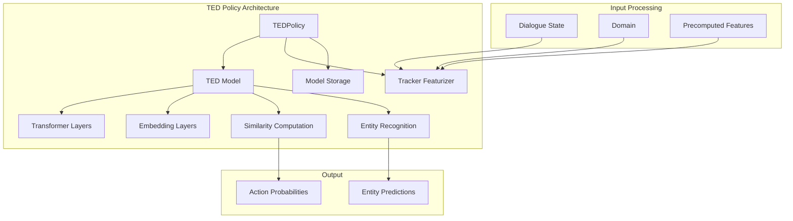
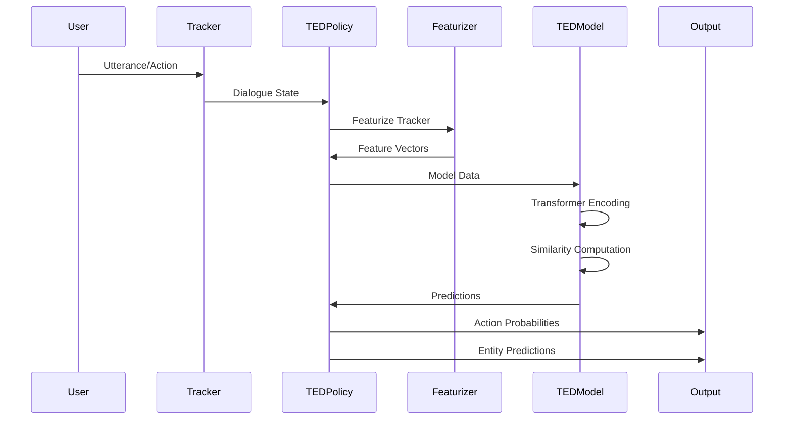
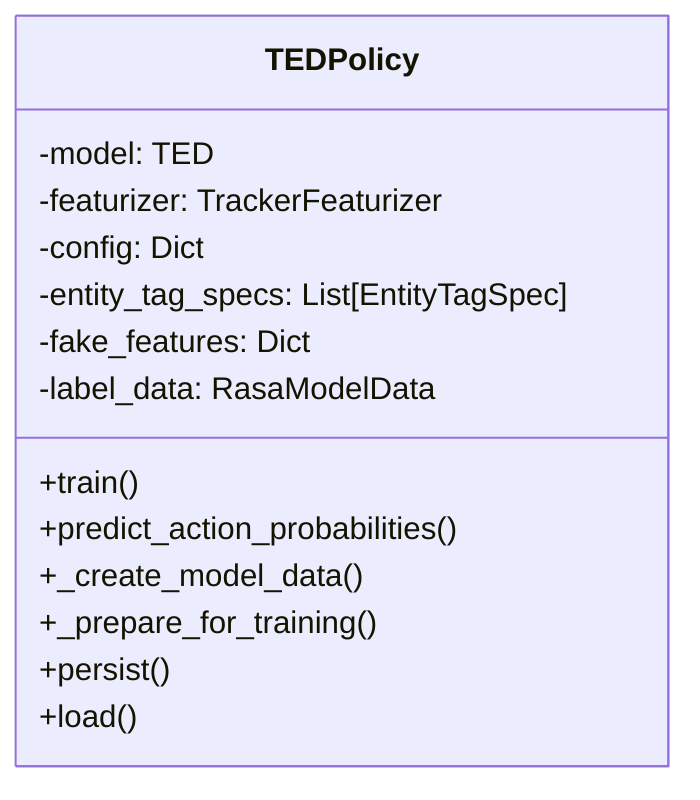
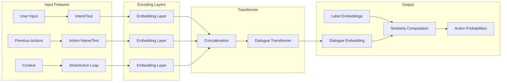
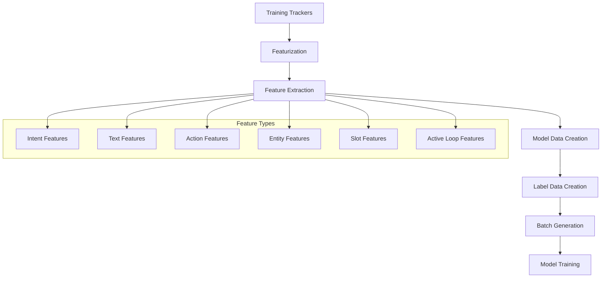
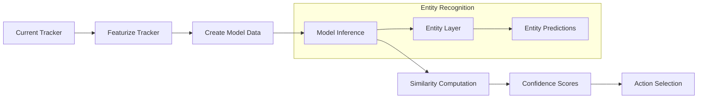
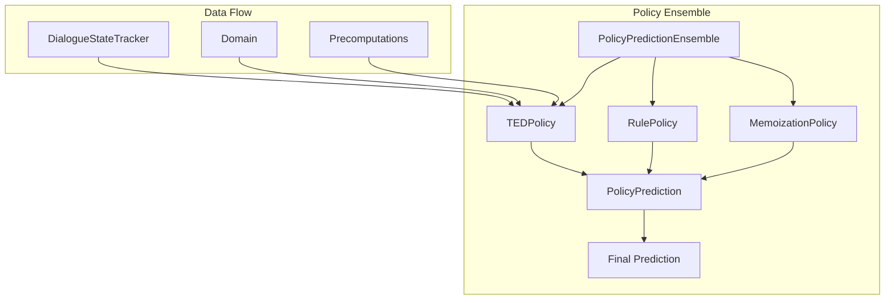
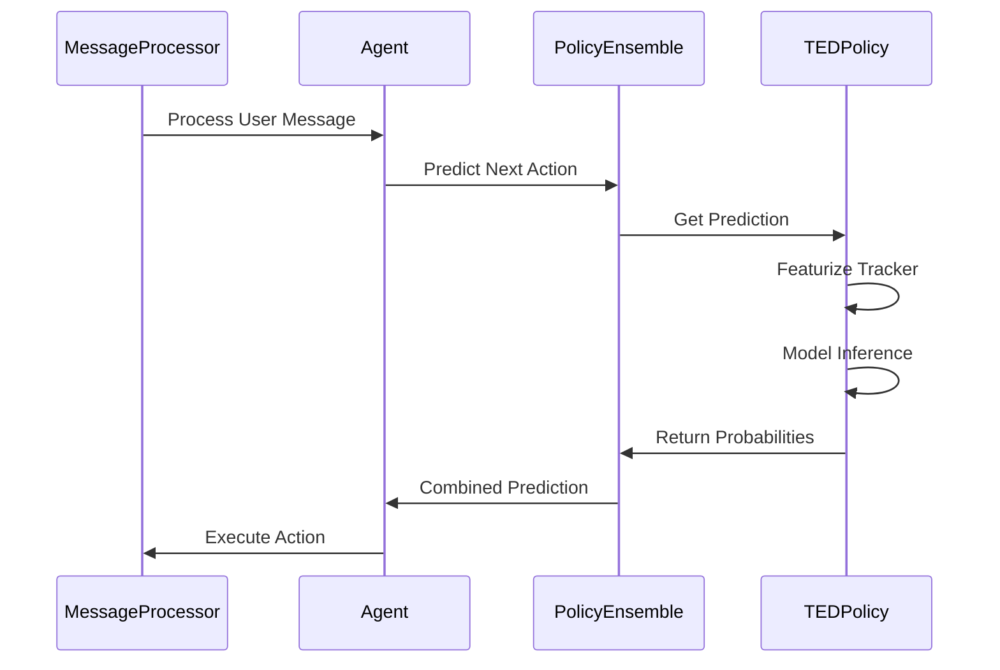
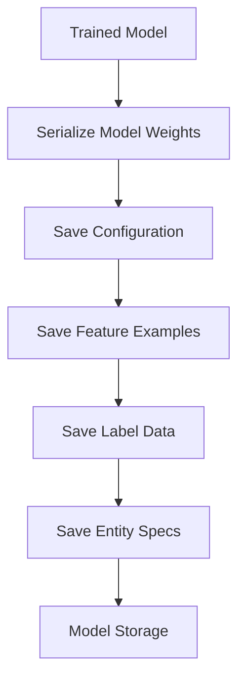
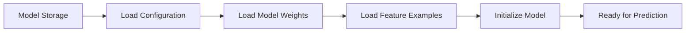

# TED Policy Module Documentation

## Overview

The TED (Transformer Embedding Dialogue) Policy is a sophisticated machine learning-based dialogue policy in Rasa that uses transformer architectures to predict the next best action in conversational AI systems. It represents a significant advancement in dialogue management by leveraging transformer embeddings and similarity-based learning approaches.

## Purpose and Core Functionality

The TED Policy serves as the primary neural dialogue policy in Rasa, designed to:

- Predict the next best action based on the current dialogue context
- Handle both intent-based and end-to-end (text-based) predictions
- Perform entity recognition within the same model architecture
- Learn from dialogue patterns using transformer-based embeddings
- Support both training from scratch and fine-tuning of pre-trained models

## Architecture Overview

### Core Components



### Model Architecture Flow



## Detailed Component Architecture

### TEDPolicy Class

The main policy class that orchestrates the entire prediction pipeline:



### TED Model Architecture

The neural network model implementing the transformer-based approach:



## Data Flow and Processing

### Training Data Flow



### Prediction Data Flow



## Key Features and Capabilities

### 1. Dual Input Support
- **Intent-based**: Uses NLU intent classification results
- **End-to-end**: Directly processes user text without intent classification
- **Hybrid approach**: Combines both methods with confidence-based selection

### 2. Entity Recognition
- Integrated entity extraction within the same model
- Supports BILOU tagging scheme
- Context-aware entity prediction using dialogue history

### 3. Transformer Architecture
- Multi-head attention mechanisms
- Configurable transformer layers and sizes
- Support for relative position embeddings

### 4. Similarity-based Learning
- StarSpace-inspired similarity computation
- Configurable similarity metrics (cosine, inner product)
- Margin-based and cross-entropy loss functions

## Configuration and Parameters

### Architecture Parameters
```yaml
# Transformer Configuration
transformer_size:
  text: 128
  action_text: 128
  dialogue: 128
num_transformer_layers:
  dialogue: 1
num_heads: 4

# Embedding Configuration
encoding_dimension: 50
embedding_dimension: 20

# Feature Processing
hidden_layers_sizes:
  text: []
  action_text: []
dense_dimension:
  text: 128
  intent: 20
```

### Training Parameters
```yaml
# Training Configuration
batch_sizes: [64, 256]
batch_strategy: "balanced"
epochs: 1
learning_rate: 0.001

# Loss Configuration
loss_type: "cross_entropy"
similarity_type: "auto"
num_neg: 20
max_pos_sim: 0.8
max_neg_sim: -0.2
```

### Entity Recognition
```yaml
# Entity Configuration
entity_recognition: true
bilou_flag: true
split_entities_by_comma: true
```

## Integration with Rasa Core

### Policy Ensemble Integration



### Message Processing Pipeline



## Model Persistence and Loading

### Persistence Process


### Loading Process


## Advanced Features

### 1. Confidence Calibration
- Configurable confidence computation methods
- Support for confidence renormalization
- Threshold-based end-to-end prediction selection

### 2. Attention Mechanisms
- Diagnostic attention weight extraction
- Configurable attention dropout
- Support for relative position attention

### 3. Regularization Techniques
- Dropout at multiple levels (input, attention, dialogue)
- Connection density control
- Regularization constants for loss functions

### 4. Evaluation and Monitoring
- Built-in validation during training
- TensorBoard integration
- Model checkpointing support

## Dependencies and Interactions

### Core Dependencies
- **Policy Framework**: Inherits from base Policy class ([policy.md](policy.md))
- **Featurizers**: Uses TrackerFeaturizer for feature extraction ([tracker_featurizers.md](tracker_featurizers.md))
- **Model Storage**: Integrates with Rasa's model persistence system ([model_storage.md](model_storage.md))
- **TensorFlow**: Built on TensorFlow for neural network operations

### Related Components
- **MessageProcessor**: Processes incoming messages ([message_processor.md](message_processor.md))
- **DialogueStateTracker**: Maintains conversation state ([dialogue_state_tracker.md](dialogue_state_tracker.md))
- **Domain**: Defines assistant capabilities ([domain.md](domain.md))
- **PolicyEnsemble**: Combines multiple policy predictions ([policy_ensemble.md](policy_ensemble.md))

## Performance Considerations

### Memory Management
- Efficient batch processing
- Configurable batch sizes
- Memory-efficient feature handling

### Computational Optimization
- GPU support with configurable device placement
- Efficient tensor operations
- Optimized similarity computations

### Scalability
- Support for large action spaces
- Configurable ranking length
- Efficient label embedding management

## Error Handling and Robustness

### Training Robustness
- Graceful handling of empty training data
- Validation of configuration parameters
- Automatic parameter updates for compatibility

### Prediction Robustness
- Fallback mechanisms for model failures
- Handling of missing features
- Confidence-based decision making

## Future Enhancements and Extensibility

### Architecture Flexibility
- Modular layer design for easy extension
- Configurable model components
- Support for custom similarity functions

### Training Improvements
- Advanced loss functions
- Multi-task learning capabilities
- Transfer learning support

### Integration Enhancements
- Better integration with NLU components
- Enhanced end-to-end capabilities
- Improved entity recognition accuracy

## Conclusion

The TED Policy represents a state-of-the-art approach to dialogue management in Rasa, combining the power of transformer architectures with practical conversational AI requirements. Its flexible design, comprehensive feature set, and robust implementation make it suitable for a wide range of conversational AI applications, from simple task-oriented bots to complex, multi-domain assistants.

The policy's ability to handle both intent-based and end-to-end predictions, combined with integrated entity recognition and sophisticated similarity-based learning, positions it as a cornerstone of modern conversational AI systems built with Rasa.