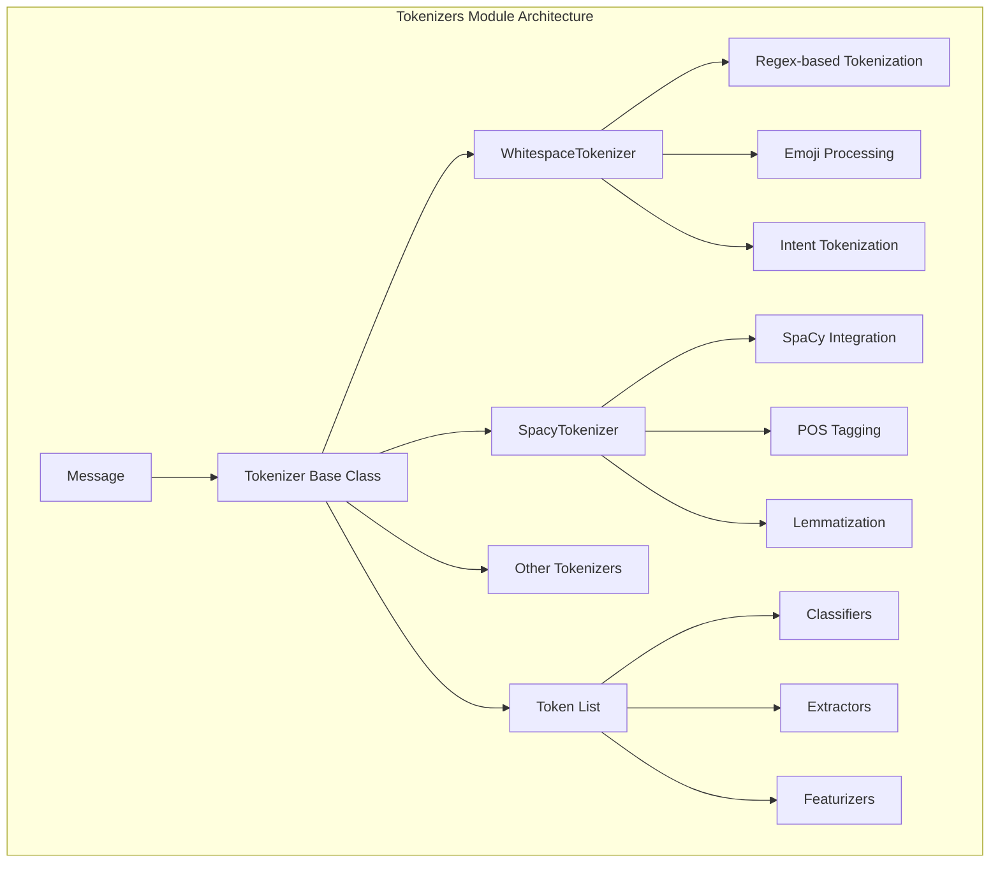
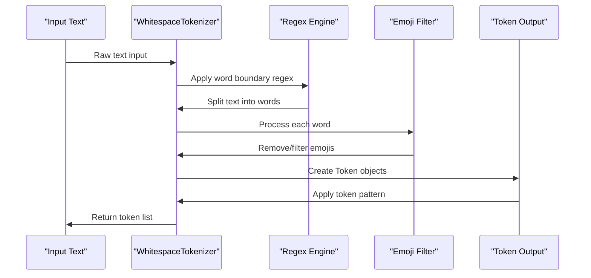
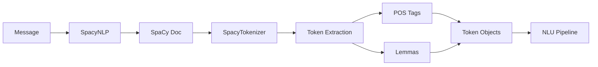
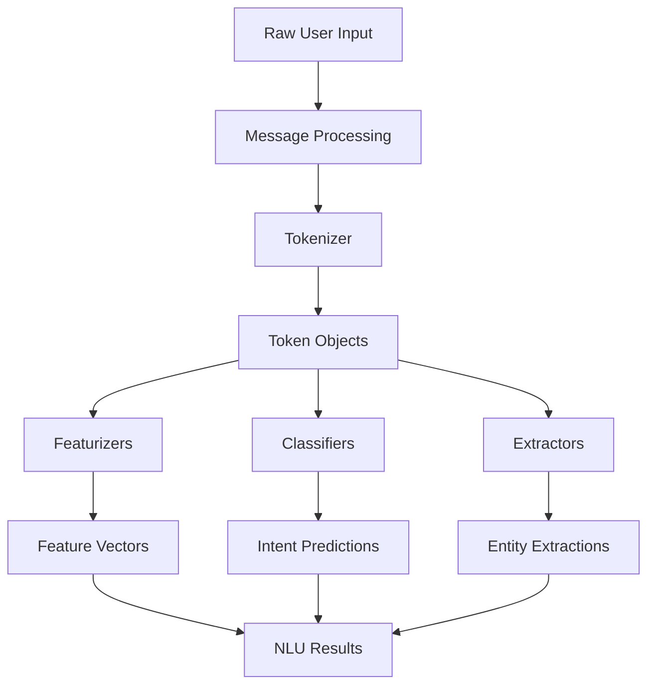
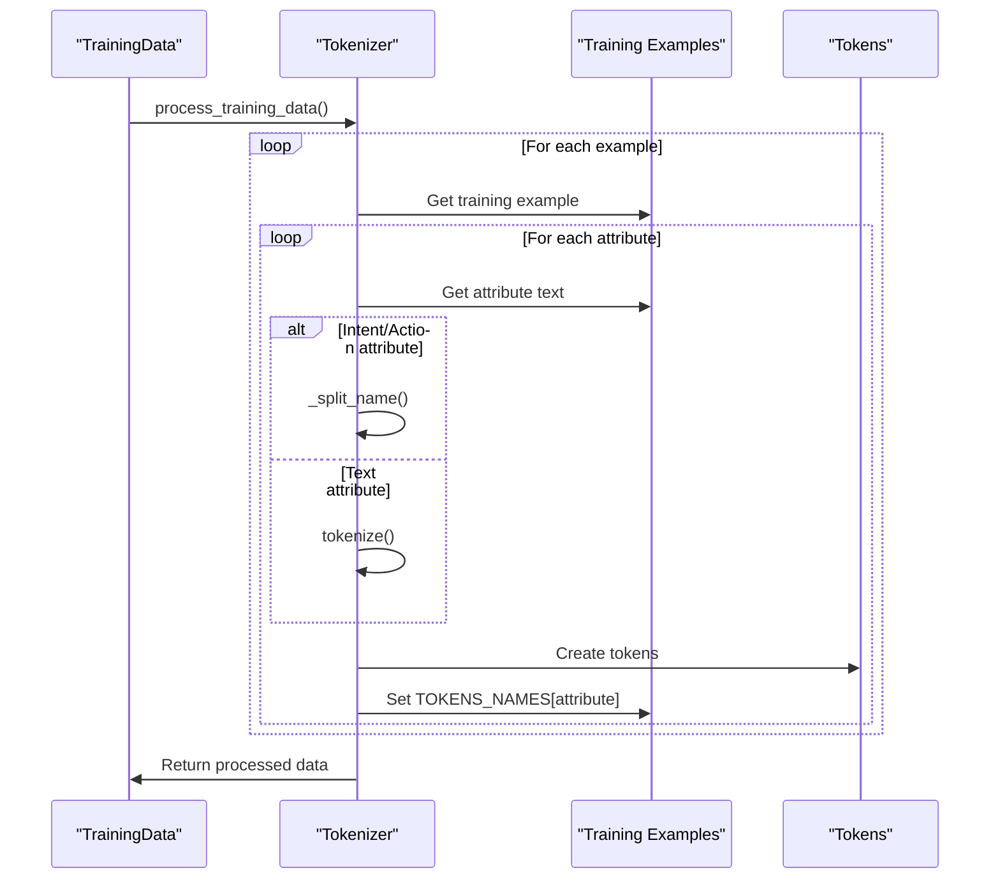

# Tokenizers Module Documentation

## Introduction

The tokenizers module is a fundamental component of Rasa's NLU (Natural Language Understanding) processing pipeline. It provides the essential functionality of breaking down text into smaller units called tokens, which serve as the basic building blocks for subsequent NLP tasks such as intent classification, entity extraction, and featurization. The module implements multiple tokenization strategies to handle different languages, text formats, and integration requirements.

## Architecture Overview

The tokenizers module follows a plugin-based architecture with a common base class that defines the interface for all tokenization implementations. This design allows for flexible tokenization strategies while maintaining consistency across the system.



## Core Components

### Tokenizer Base Class

The `Tokenizer` class serves as the abstract base for all tokenization implementations. It provides common functionality including:

- **Configuration Management**: Handles tokenizer-specific configuration options
- **Intent Tokenization**: Special handling for intent names and action names
- **Token Pattern Application**: Optional regex-based token splitting
- **Message Processing**: Integration with Rasa's message processing pipeline
- **Training Data Processing**: Tokenization of training examples

### Token Class

The `Token` class represents individual tokens with:

- **Text Content**: The actual token text
- **Position Information**: Start and end indices within the original text
- **Additional Data**: Optional metadata like POS tags, lemmas, or custom properties
- **Comparison Operations**: Support for sorting and equality checks

## Tokenizer Implementations

### WhitespaceTokenizer

The `WhitespaceTokenizer` is Rasa's default tokenizer that uses regular expressions to split text based on whitespace and punctuation rules.

**Key Features:**
- Regex-based word boundary detection
- Emoji recognition and optional removal
- Special handling for URLs, email addresses, and numbers
- Support for multiple languages (with limitations for Chinese, Japanese, Thai)
- Configurable intent tokenization

**Configuration Options:**
```yaml
intent_tokenization_flag: false  # Split intents on separator
intent_split_symbol: "_"         # Intent separator symbol
token_pattern: null              # Optional regex for token splitting
prefix_separator_symbol: null    # Split prefix from main text
```

**Tokenization Process:**


### SpacyTokenizer

The `SpacyTokenizer` integrates with the SpaCy NLP library to provide linguistically-aware tokenization.

**Key Features:**
- Full SpaCy tokenization capabilities
- Part-of-speech (POS) tagging integration
- Lemmatization support
- Dependency on SpaCyNLP component
- Language-specific tokenization rules

**Dependencies:**
- Requires `SpacyNLP` component in the pipeline
- Depends on SpaCy library installation
- Uses SpaCy's document processing pipeline

**Integration Flow:**


## Data Flow and Integration

### Pipeline Integration

Tokenizers integrate with the NLU processing pipeline as the first step after text preprocessing:



### Message Processing Flow

The tokenizer processes messages through the following stages:

1. **Text Extraction**: Retrieve text from message attributes (text, intent, etc.)
2. **Attribute-specific Processing**: Apply different tokenization rules for different attributes
3. **Token Creation**: Convert processed text into Token objects
4. **Pattern Application**: Apply optional token patterns for further splitting
5. **Message Update**: Store tokens in the message for downstream components

### Training Data Processing

During training, tokenizers process all training examples:



## Configuration and Usage

### Pipeline Configuration

Tokenizers are configured as part of the NLU pipeline in the `config.yml` file:

```yaml
pipeline:
  - name: "WhitespaceTokenizer"
    intent_tokenization_flag: true
    intent_split_symbol: "_"
  
  # OR
  
  - name: "SpacyNLP"
    model: "en_core_web_sm"
  - name: "SpacyTokenizer"
```

### Component Registration

Both tokenizers are registered with the Rasa engine using the `@DefaultV1Recipe.register` decorator:

- **Component Type**: `MESSAGE_TOKENIZER`
- **Trainable**: `False` (tokenizers don't require training)
- **Registration**: Automatic through decorator pattern

## Dependencies and Relationships

### Internal Dependencies

The tokenizers module depends on several Rasa components:

- **[engine_graph](engine_graph.md)**: Graph component framework
- **[shared_nlu](shared_nlu.md)**: Message and training data structures
- **[nlu_processing](nlu_processing.md)**: Integration with NLU pipeline

### External Dependencies

- **WhitespaceTokenizer**: `regex` library for Unicode support
- **SpacyTokenizer**: `spacy` library for NLP capabilities

### Downstream Dependencies

Tokenizers are required by:

- **[featurizers](featurizers.md)**: Convert tokens to features
- **[classifiers](classifiers.md)**: Use tokens for intent classification
- **[extractors](extractors.md)**: Use tokens for entity extraction

## Language Support and Limitations

### WhitespaceTokenizer Limitations

The WhitespaceTokenizer has known limitations for certain languages:

- **Chinese (zh)**: No word boundaries in continuous text
- **Japanese (ja)**: Complex writing system requires morphological analysis
- **Thai (th)**: No spaces between words

For these languages, consider using:
- Language-specific tokenizers
- SpaCy tokenizer with appropriate language models
- External tokenization services

### SpaCyTokenizer Language Support

Language support depends on available SpaCy models:

- **Core Languages**: English, German, Spanish, French, Portuguese
- **Additional Languages**: Available through community models
- **Model Requirements**: Must install appropriate language model

## Performance Considerations

### Processing Speed

- **WhitespaceTokenizer**: Fast, regex-based processing
- **SpacyTokenizer**: Slower due to full NLP pipeline processing
- **Batch Processing**: Both support efficient batch processing

### Memory Usage

- **WhitespaceTokenizer**: Minimal memory overhead
- **SpacyTokenizer**: Higher memory usage due to SpaCy models
- **Caching**: SpaCy documents are cached for reuse

## Error Handling and Edge Cases

### Text Edge Cases

- **Empty Text**: Returns empty token list
- **Emoji-only Text**: WhitespaceTokenizer removes all content, falls back to original text
- **Special Characters**: Handled through regex patterns
- **Unicode Text**: Full Unicode support through regex library

### Configuration Validation

- **Invalid Patterns**: Regex compilation errors are caught and reported
- **Missing Dependencies**: Component validation ensures required packages are installed
- **Language Mismatch**: Warnings for unsupported language combinations

## Extension and Customization

### Creating Custom Tokenizers

To create a custom tokenizer:

1. Inherit from `Tokenizer` base class
2. Implement `tokenize()` method
3. Register with `@DefaultV1Recipe.register`
4. Handle configuration through `get_default_config()`

### Integration Points

Custom tokenizers can extend functionality through:

- **Additional Data**: Store custom information in Token.data
- **Preprocessing**: Add text preprocessing before tokenization
- **Post-processing**: Modify tokens after creation
- **External Services**: Integrate with external tokenization APIs

## Testing and Validation

### Unit Testing

Tokenizers are tested for:

- **Basic Functionality**: Standard text tokenization
- **Edge Cases**: Empty text, special characters, Unicode
- **Configuration**: Different configuration options
- **Integration**: Pipeline compatibility

### Performance Testing

- **Benchmarking**: Processing speed for different text lengths
- **Memory Profiling**: Memory usage under various conditions
- **Scalability**: Performance with large datasets

## Best Practices

### Configuration Recommendations

1. **Use WhitespaceTokenizer** for most use cases
2. **Use SpacyTokenizer** when linguistic features are needed
3. **Enable intent_tokenization** for hierarchical intents
4. **Test with your specific language** and text types

### Performance Optimization

1. **Batch process messages** when possible
2. **Cache SpaCy documents** for reuse
3. **Use appropriate token patterns** for domain-specific text
4. **Monitor processing times** for large-scale deployments

### Troubleshooting

Common issues and solutions:

- **Poor tokenization quality**: Adjust token_pattern or switch tokenizer
- **Performance issues**: Consider batch processing or caching
- **Language-specific problems**: Use language-appropriate tokenizer
- **Integration failures**: Check component dependencies and order