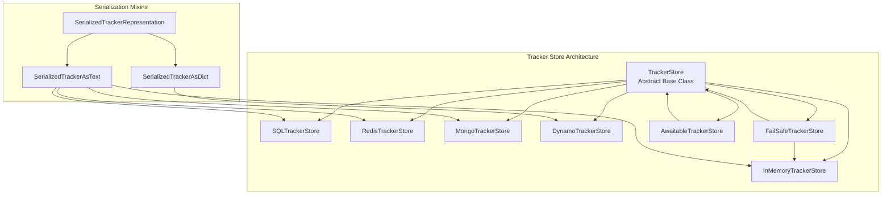
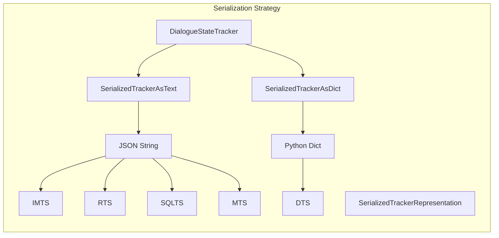
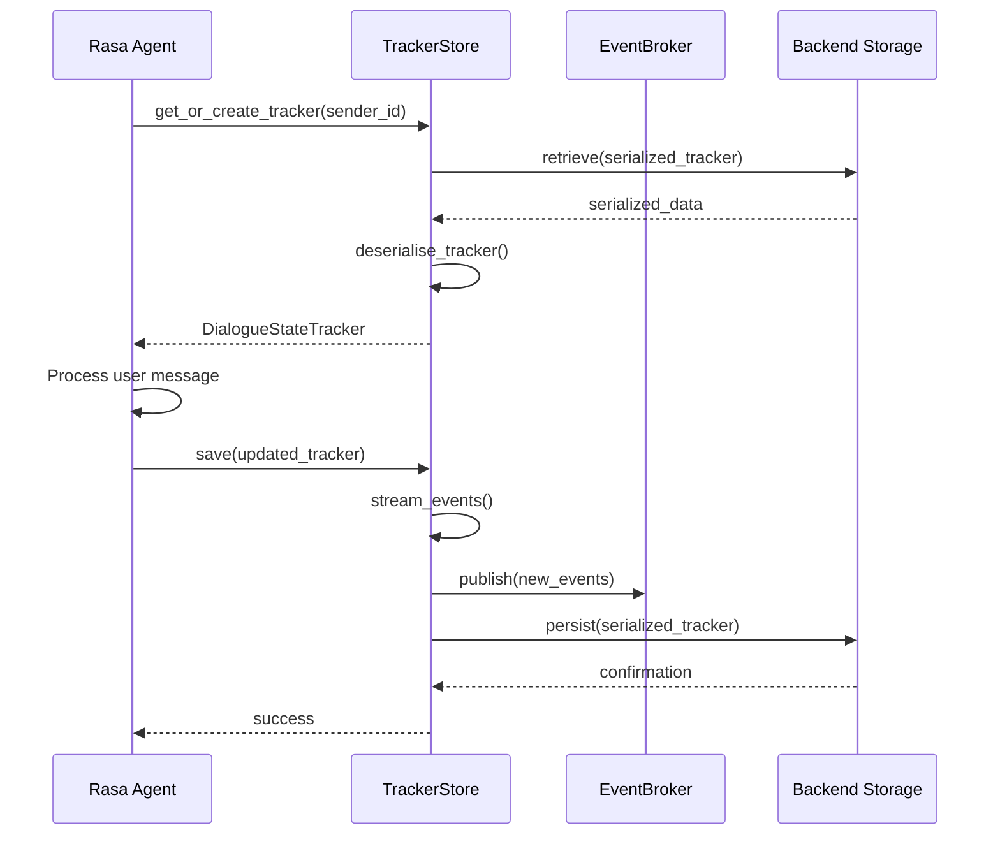
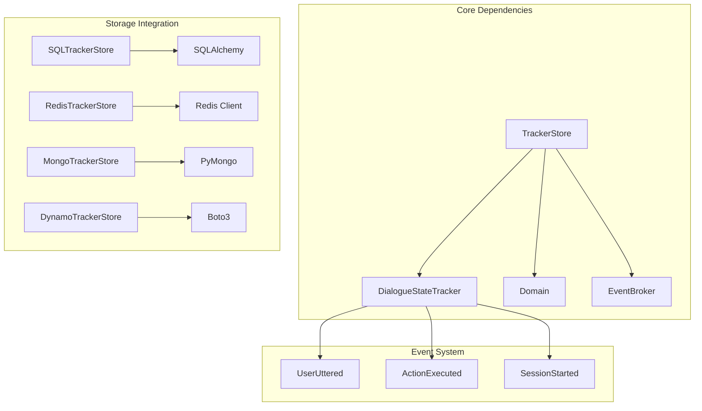
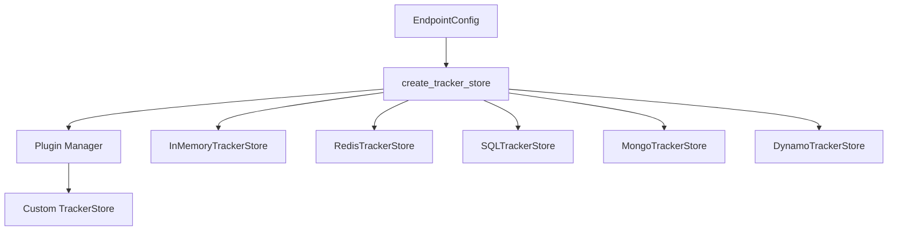
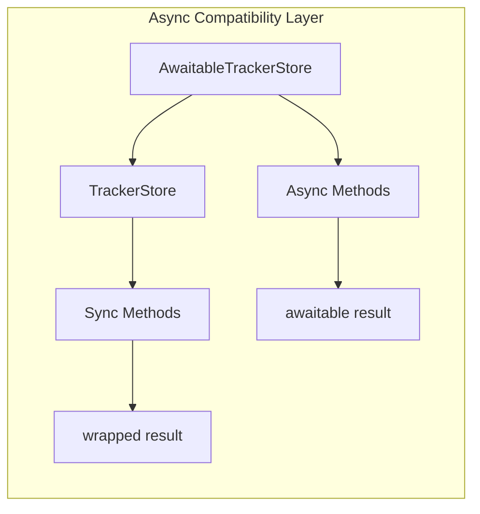
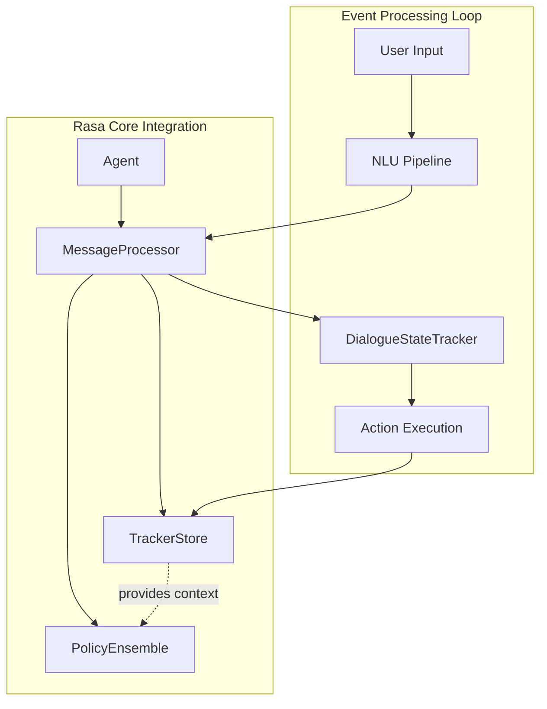

# Tracker Store Module Documentation

## Introduction

The tracker_store module provides persistent storage solutions for conversation history in Rasa applications. It implements a flexible architecture that supports multiple storage backends including in-memory, SQL databases, Redis, MongoDB, and DynamoDB. The module ensures conversation state persistence across sessions and enables scalable deployment configurations for production environments.

## Architecture Overview

The tracker store architecture follows a strategy pattern with a common interface and multiple backend implementations. This design allows seamless switching between storage solutions while maintaining consistent behavior across the system.



## Core Components

### TrackerStore (Abstract Base Class)

The `TrackerStore` class defines the common interface for all tracker store implementations. It provides core functionality for tracker management, event streaming, and serialization coordination.

**Key Responsibilities:**
- Tracker lifecycle management (create, retrieve, save)
- Event streaming to message brokers
- Domain management
- Serialization coordination
- Async operation support

**Core Methods:**
- `get_or_create_tracker()`: Retrieves existing or creates new tracker
- `save()`: Persists tracker state
- `retrieve()`: Fetches tracker by sender ID
- `stream_events()`: Publishes events to event broker

### Storage Backend Implementations

#### InMemoryTrackerStore
- **Purpose**: Development and testing scenarios
- **Storage**: Python dictionary in RAM
- **Characteristics**: Fast access, no persistence across restarts
- **Use Case**: Single-instance deployments, development environments

#### SQLTrackerStore
- **Purpose**: Production deployments requiring ACID compliance
- **Storage**: SQL databases (PostgreSQL, MySQL, SQLite, Oracle)
- **Characteristics**: Transactional integrity, schema validation, connection pooling
- **Use Case**: Enterprise deployments, complex querying needs

#### RedisTrackerStore
- **Purpose**: High-performance, distributed deployments
- **Storage**: Redis in-memory data store
- **Characteristics**: Sub-millisecond latency, TTL support, clustering
- **Use Case**: High-throughput applications, session caching

#### MongoTrackerStore
- **Purpose**: Document-oriented storage with flexible schema
- **Storage**: MongoDB collections
- **Characteristics**: JSON document storage, horizontal scaling
- **Use Case**: Applications requiring flexible event structures

#### DynamoTrackerStore
- **Purpose**: AWS cloud-native deployments
- **Storage**: Amazon DynamoDB tables
- **Characteristics**: Serverless, automatic scaling, pay-per-use
- **Use Case**: AWS-based serverless architectures

### FailSafeTrackerStore

Provides fault tolerance by wrapping primary tracker stores with automatic fallback to in-memory storage during failures.

**Key Features:**
- Automatic error detection and handling
- Seamless fallback to InMemoryTrackerStore
- Configurable error callbacks
- Zero-downtime operation during storage outages

### Serialization Framework



## Data Flow Architecture



## Component Interactions



## Configuration and Factory Pattern

The module implements a factory pattern for tracker store creation based on endpoint configuration:



## Async Operation Support

The module provides comprehensive async support through the `AwaitableTrackerStore` wrapper, ensuring all tracker store implementations can operate asynchronously:



## Error Handling and Resilience

### Connection Management
- Automatic retry logic for database connections
- Graceful degradation during storage outages
- Connection pooling for SQL databases
- SSL/TLS support for secure connections

### Data Integrity
- Transactional operations for SQL backends
- Event ordering preservation
- Session boundary management
- Serialization validation

### Monitoring and Observability
- Comprehensive logging for debugging
- Performance metrics collection
- Health check endpoints
- Error reporting integration

## Integration with Rasa Core

The tracker store integrates seamlessly with the broader Rasa architecture:



## Performance Considerations

### Storage Backend Selection
- **In-Memory**: O(1) access time, limited by RAM
- **Redis**: Sub-millisecond latency, network overhead
- **SQL**: Query optimization, indexing strategies
- **MongoDB**: Document retrieval, aggregation pipelines
- **DynamoDB**: Consistent performance, provisioned throughput

### Optimization Strategies
- Event history limiting (`max_event_history`)
- Connection pooling for database backends
- Index optimization for query performance
- Batch operations where supported
- Caching strategies for frequently accessed trackers

## Security Features

### Data Protection
- Encryption at rest (backend-dependent)
- SSL/TLS for network communication
- Authentication and authorization integration
- Sensitive data redaction in logs

### Access Control
- Database-level security policies
- Network isolation capabilities
- Role-based access control
- Audit trail support

## Deployment Patterns

### Development Environment
```yaml
tracker_store:
  type: in_memory
  max_event_history: 100
```

### Production Environment
```yaml
tracker_store:
  type: redis
  url: redis://localhost:6379
  db: 0
  password: ${REDIS_PASSWORD}
  record_exp: 86400
```

### Enterprise Environment
```yaml
tracker_store:
  type: sql
  dialect: postgresql
  host: postgres.example.com
  port: 5432
  db: rasa_conversations
  username: ${DB_USER}
  password: ${DB_PASSWORD}
  pool_size: 50
  max_overflow: 100
```

## Migration and Maintenance

### Data Migration
- Cross-backend migration utilities
- Schema evolution support
- Backup and restore procedures
- Version compatibility management

### Operational Maintenance
- Database optimization routines
- Index rebuilding strategies
- Storage cleanup policies
- Performance monitoring

## References

- [Dialogue State Tracker Documentation](shared_core.md#dialogue-state-tracker)
- [Event System Documentation](shared_core.md#events)
- [Domain Configuration](shared_core.md#domain)
- [Message Processing Pipeline](core_dialogue.md#message-processing)
- [Action Execution Framework](core_dialogue.md#action-framework)