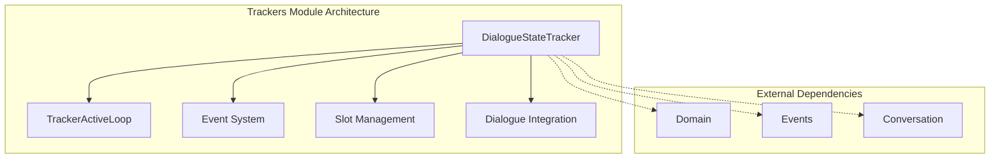
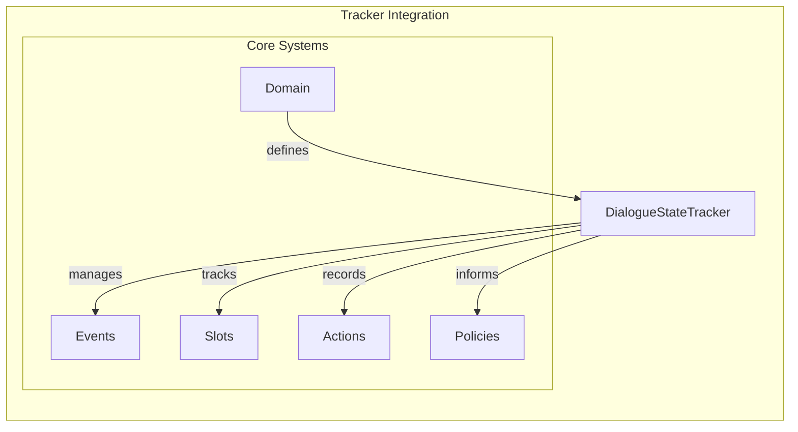
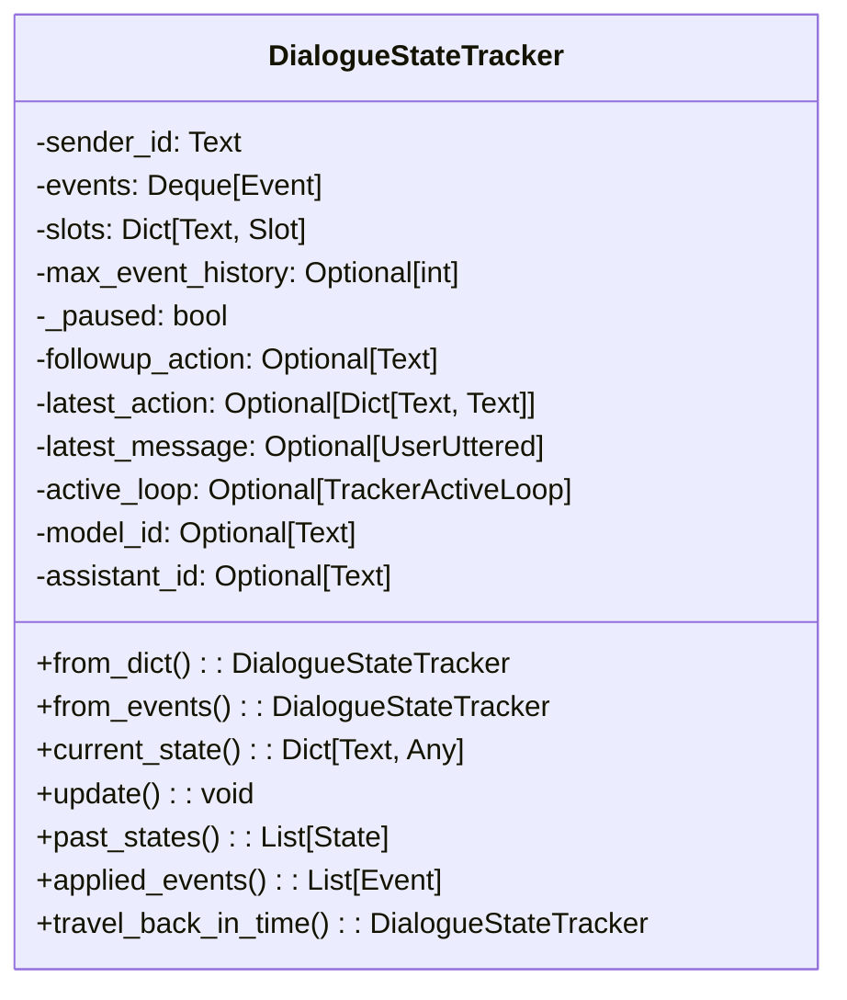
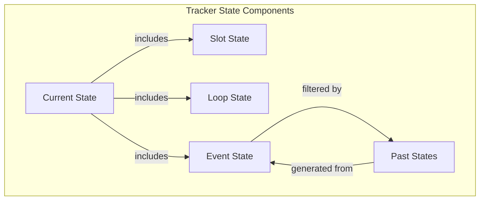
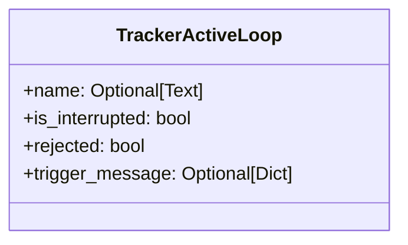
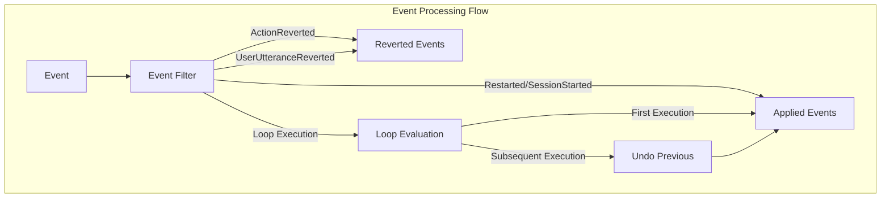
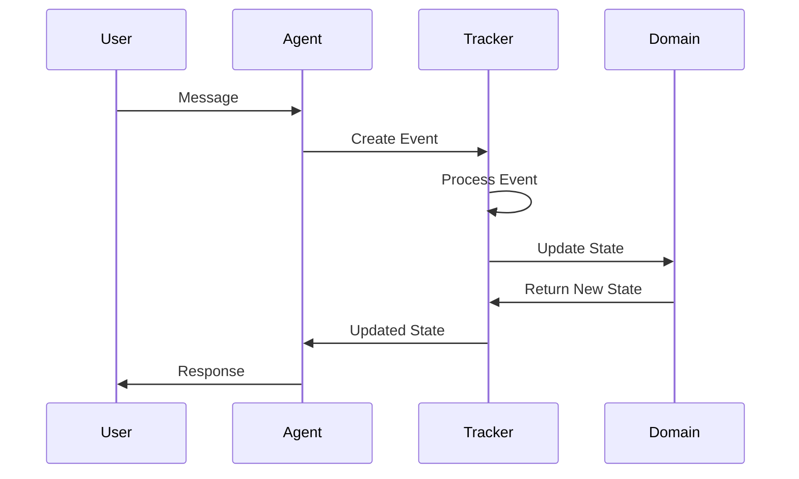
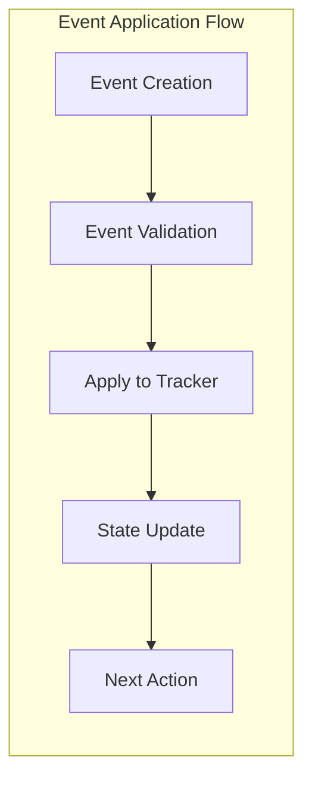
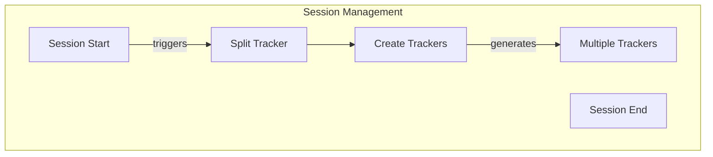
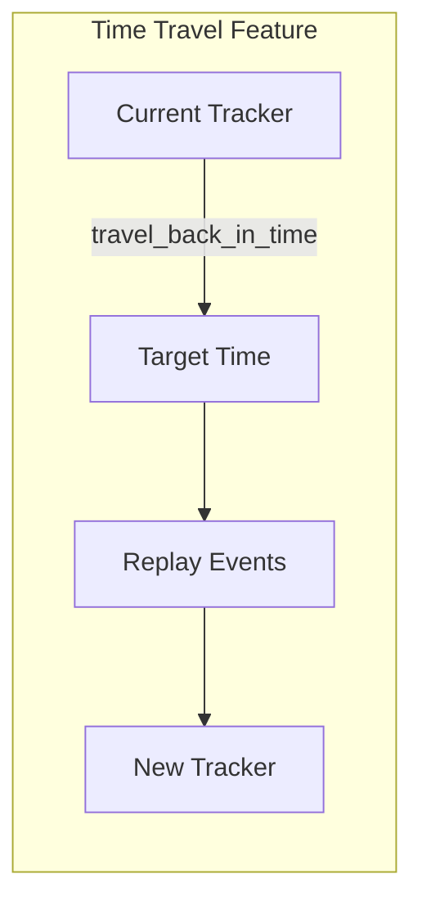

# Trackers Module Documentation

## Introduction

The trackers module is a core component of Rasa's conversation management system, responsible for maintaining the state of conversations between users and the assistant. It provides the `DialogueStateTracker` class, which serves as the central mechanism for tracking dialogue history, slot values, active loops, and conversation context throughout the interaction lifecycle.

This module is essential for Rasa's ability to maintain context-aware conversations, enable slot filling, handle forms, and support complex dialogue flows. The tracker acts as the single source of truth for the current state of any conversation, making it indispensable for both training and inference phases of the Rasa assistant.

## Architecture Overview

### Core Components

The trackers module centers around the `DialogueStateTracker` class, which maintains conversation state through a sophisticated event-driven architecture. The tracker processes events sequentially, updating its internal state to reflect the current context of the conversation.



### Component Relationships

The tracker integrates with multiple Rasa subsystems to provide comprehensive conversation state management:



## Detailed Component Analysis

### DialogueStateTracker

The `DialogueStateTracker` is the primary class responsible for maintaining conversation state. It provides a comprehensive interface for tracking all aspects of a dialogue session.

#### Key Responsibilities

1. **Event Management**: Processes and stores conversation events in chronological order
2. **State Maintenance**: Tracks current conversation state including slots, active loops, and latest actions
3. **History Management**: Provides access to conversation history with various filtering options
4. **Slot Tracking**: Manages slot values and their updates throughout the conversation
5. **Loop Management**: Handles active loops (forms) and their lifecycle

#### Core Attributes



#### State Management

The tracker maintains several types of state information:



### TrackerActiveLoop

The `TrackerActiveLoop` dataclass manages the state of active loops (primarily forms) within conversations.



### Event Processing System

The tracker processes events through a sophisticated filtering mechanism to maintain accurate conversation state.

#### Event Filtering Logic



## Data Flow Architecture

### Conversation State Updates

The tracker processes events to maintain conversation state through a well-defined update mechanism:



### Event Application Process



## Integration with Other Modules

### Core Dialogue Integration

The trackers module integrates closely with the [core dialogue system](core_dialogue.md) to provide conversation state management:

- **Agent Integration**: The [Agent](core_dialogue.md#agent) uses trackers to maintain conversation state across interactions
- **Message Processing**: The [MessageProcessor](core_dialogue.md#message-processor) updates trackers based on user inputs and system responses
- **Policy Framework**: Policies access tracker state to make informed predictions about next actions

### Event System Integration

Trackers work with the [events module](shared_core.md#events) to process and store conversation events:

- **Event Processing**: All conversation events flow through the tracker for state updates
- **Event Filtering**: The tracker filters events to maintain accurate state representation
- **Event History**: Complete event history is maintained for debugging and analysis

### Slot Management Integration

The tracker integrates with the [slots module](shared_core.md#slots) to manage conversation context:

- **Slot Value Tracking**: Current slot values are maintained and updated
- **Slot Validation**: Slot values are validated against domain constraints
- **Slot Persistence**: Slot state persists throughout the conversation

### Domain Integration

Trackers work with the [domain module](shared_core.md#domain) to ensure state consistency:

- **State Validation**: Tracker state is validated against domain constraints
- **Slot Definitions**: Slot configurations are obtained from the domain
- **Action Validation**: Actions are validated against domain definitions

## Advanced Features

### Conversation Session Management

The tracker supports conversation session management to handle long-running conversations:



### Time Travel Functionality

The tracker provides time travel capabilities for debugging and analysis:



### Event Verbosity Control

The tracker supports different levels of event detail for various use cases:

- **NONE**: No events included
- **APPLIED**: Only events that contribute to tracker state
- **AFTER_RESTART**: Events after the most recent restart
- **ALL**: Every logged event

## Usage Patterns

### Basic Tracker Usage

```python
# Create a tracker from events
tracker = DialogueStateTracker.from_events(
    sender_id="user_123",
    evts=[UserUttered("hello"), ActionExecuted("utter_greet")],
    slots=domain.slots
)

# Update tracker with new event
tracker.update(ActionExecuted("utter_help"))

# Get current state
current_state = tracker.current_state()
```

### Advanced State Analysis

```python
# Get past states for policy training
past_states = tracker.past_states(domain)

# Filter events by verbosity
applied_events = tracker.applied_events()

# Travel back in time for debugging
historical_tracker = tracker.travel_back_in_time(timestamp)
```

## Performance Considerations

### Event History Management

The tracker supports configurable event history limits to manage memory usage:

- **max_event_history**: Limits the number of events stored in memory
- **Event Deque**: Uses efficient deque data structure for event storage
- **Automatic Pruning**: Old events are automatically removed when limit is reached

### State Computation Optimization

The tracker optimizes state computation through:

- **Lazy Evaluation**: States are computed on-demand
- **Caching**: Frequently accessed states are cached when possible
- **Incremental Updates**: State updates are performed incrementally

## Error Handling and Validation

### Event Validation

The tracker validates all events before processing:

- **Type Validation**: Ensures events are proper Event subclasses
- **State Consistency**: Validates that events maintain consistent state
- **Domain Compliance**: Checks events against domain constraints

### Error Recovery

The tracker provides robust error handling:

- **Graceful Degradation**: Continues operation even with invalid events
- **State Reconstruction**: Can reconstruct state from partial information
- **Logging**: Comprehensive logging for debugging and monitoring

## Testing and Debugging

### Tracker Inspection

The tracker provides multiple methods for inspection and debugging:

- **current_state()**: Get complete current state representation
- **as_dialogue()**: Export tracker as dialogue for persistence
- **fingerprint()**: Generate unique identifier for state comparison

### State Validation

Trackers can be validated for consistency:

- **State Reconstruction**: Verify state can be reconstructed from events
- **Event Consistency**: Check that events produce expected state changes
- **Domain Compliance**: Validate state against domain constraints

## Future Enhancements

### Potential Improvements

1. **Enhanced Caching**: More sophisticated caching for complex state computations
2. **Distributed Tracking**: Support for distributed conversation tracking
3. **Event Streaming**: Real-time event streaming for monitoring and analysis
4. **State Compression**: Advanced compression techniques for large conversation histories

### Scalability Considerations

1. **Horizontal Scaling**: Support for horizontal scaling of tracker storage
2. **Memory Optimization**: Further optimization for memory-constrained environments
3. **Performance Monitoring**: Enhanced performance monitoring and metrics
4. **Backup and Recovery**: Improved backup and recovery mechanisms

## Conclusion

The trackers module is a fundamental component of Rasa's conversation management system, providing robust and flexible conversation state tracking capabilities. Its event-driven architecture, comprehensive state management features, and seamless integration with other Rasa modules make it essential for building sophisticated conversational AI applications. The module's design supports both simple and complex conversation flows while maintaining performance and reliability at scale.