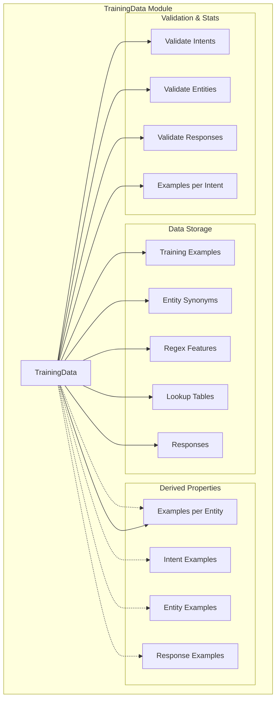
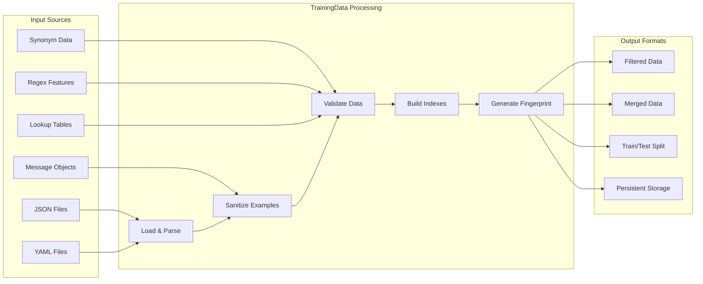
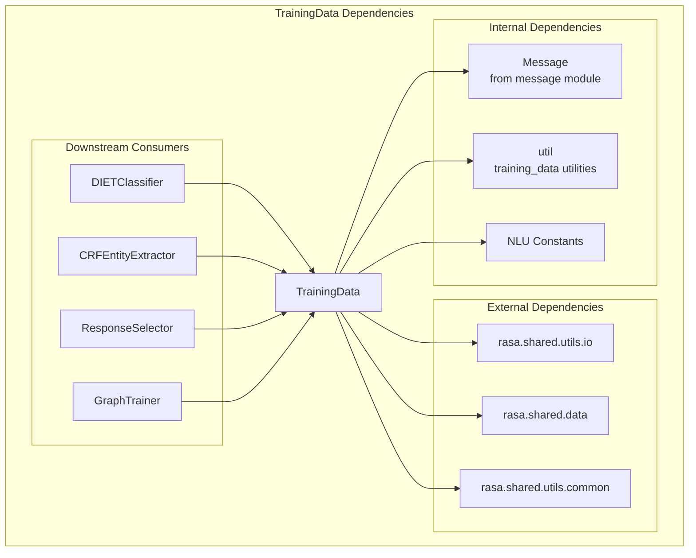
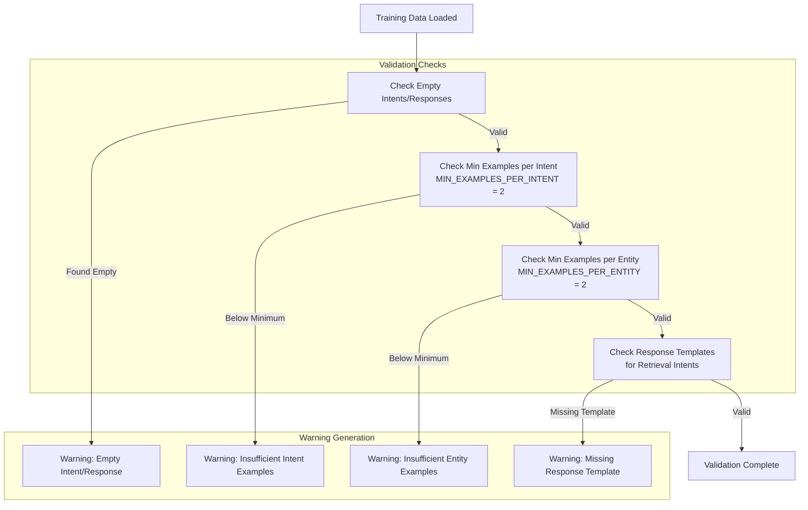
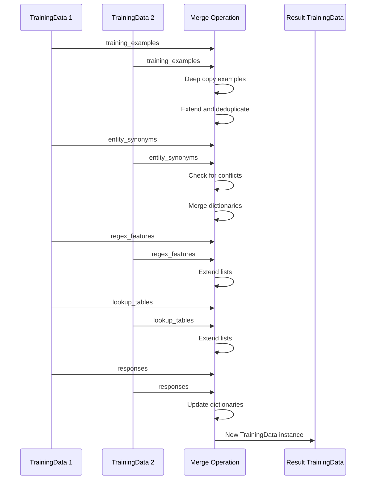
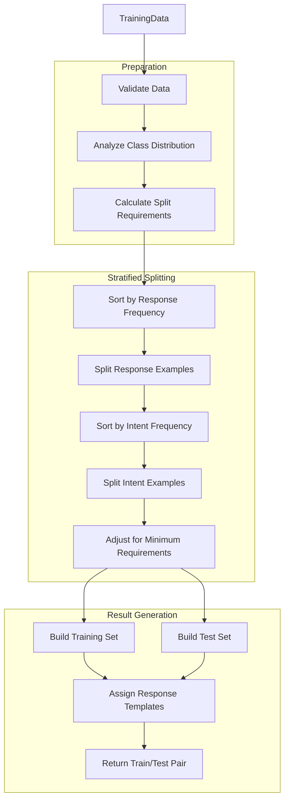
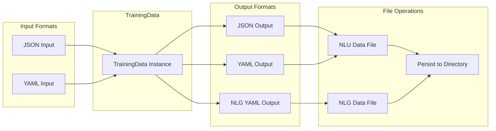
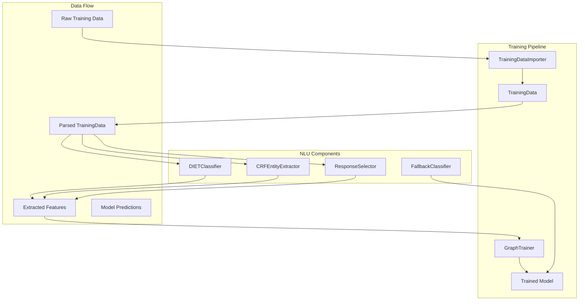

# Training Data Module Documentation

## Overview

The `training_data` module is a core component of Rasa's NLU (Natural Language Understanding) system that manages and processes training data for conversational AI models. It serves as the central repository for intent classification, entity recognition, and response selection training examples, providing the foundation for training NLU models and ensuring data quality and consistency.

## Purpose and Core Functionality

The TrainingData class is the primary component that:
- **Stores and manages NLU training examples** including intents, entities, and responses
- **Provides data validation** to ensure training data meets minimum requirements
- **Enables data manipulation** through filtering, merging, and splitting operations
- **Supports multiple data formats** including JSON and YAML for persistence
- **Maintains data integrity** through fingerprinting and deduplication
- **Facilitates model training** by providing structured access to training examples

## Architecture

### Component Structure



### Data Flow Architecture



## Key Components and Relationships

### TrainingData Class

The `TrainingData` class is the central component that orchestrates all training data operations. It maintains several key data structures:

- **training_examples**: Core list of `Message` objects containing annotated training data
- **entity_synonyms**: Dictionary mapping entity variations to canonical forms
- **regex_features**: List of regular expression patterns for entity extraction
- **lookup_tables**: External reference data for entity recognition
- **responses**: Template responses for retrieval intents

### Integration with Message Component

The TrainingData module works closely with the [message](message.md) module, which provides the `Message` class that represents individual training examples. Each Message contains:
- Text content
- Intent annotations
- Entity annotations
- Metadata and features

### Dependencies and Interactions



## Core Functionality

### Data Validation

The module implements comprehensive validation to ensure training data quality:



### Data Manipulation Operations

#### Merging Training Data



#### Train/Test Split

The module implements stratified splitting to maintain class distribution:



### Data Persistence

The module supports multiple formats for data persistence:



## Integration with Rasa System

### Training Pipeline Integration



### Graph Component Integration

The TrainingData module integrates with Rasa's [engine_graph](engine_graph.md) system through specialized providers:

- **NLUTrainingDataProvider**: Supplies training data to NLU components in the training graph
- **DomainProvider**: Provides domain information that may reference training data
- **StoryGraphProvider**: Supplies conversation training data that may include NLU examples

## Key Features and Capabilities

### 1. Data Quality Assurance
- **Minimum example requirements**: Enforces minimum number of examples per intent/entity
- **Duplicate detection**: Automatically removes duplicate training examples
- **Validation warnings**: Provides detailed warnings for potential data quality issues
- **Fingerprinting**: Generates unique fingerprints for data versioning and caching

### 2. Flexible Data Operations
- **Merging**: Combines multiple training datasets while handling conflicts
- **Filtering**: Applies custom conditions to select subsets of training data
- **Splitting**: Performs stratified train/test splits maintaining class distribution
- **Transformation**: Converts between different data formats (JSON, YAML)

### 3. Rich Metadata Support
- **Entity synonyms**: Maps entity variations to canonical forms
- **Regex features**: Supports pattern-based entity extraction
- **Lookup tables**: Integrates external reference data
- **Response templates**: Manages response variations for retrieval intents

### 4. Performance Optimization
- **Lazy properties**: Computes derived properties on-demand using `@lazy_property`
- **Efficient indexing**: Builds indexes for quick access to examples by type
- **Memory management**: Uses deep copying to prevent unintended modifications
- **Caching**: Implements fingerprint-based caching for expensive operations

## Usage Patterns

### Basic Usage

```python
from rasa.shared.nlu.training_data.training_data import TrainingData
from rasa.shared.nlu.training_data.message import Message

# Create training data from examples
examples = [
    Message.build(text="Hello", intent="greet"),
    Message.build(text="Goodbye", intent="goodbye")
]
training_data = TrainingData(training_examples=examples)

# Validate the data
training_data.validate()

# Get statistics
training_data.print_stats()
```

### Advanced Usage

```python
# Merge multiple datasets
training_data1 = TrainingData.load_from_file("data1.yml")
training_data2 = TrainingData.load_from_file("data2.yml")
merged_data = training_data1.merge(training_data2)

# Split into train/test
train_data, test_data = merged_data.train_test_split(train_frac=0.8)

# Filter specific intents
greet_data = merged_data.filter_training_examples(
    lambda ex: ex.get("intent") == "greet"
)

# Persist to files
merged_data.persist("output_dir", "training_data.yml")
```

## Error Handling and Edge Cases

The module handles various edge cases:

- **Empty data**: Gracefully handles empty training datasets
- **Missing files**: Handles missing lookup table files
- **Encoding issues**: Manages Unicode decoding errors in file operations
- **Insufficient data**: Warns when data doesn't meet minimum requirements
- **Conflicting synonyms**: Detects and reports synonym conflicts during merging

## Performance Considerations

- **Memory usage**: Large datasets are processed efficiently using generators and lazy evaluation
- **Fingerprinting**: Uses efficient hashing algorithms for data versioning
- **Sorting**: Implements optimized sorting for regex features and entities
- **Deduplication**: Uses OrderedDict for efficient duplicate removal while preserving order

## Future Enhancements

Potential areas for improvement include:
- **Incremental updates**: Support for incremental data updates without full reloading
- **Advanced filtering**: More sophisticated filtering capabilities with query languages
- **Data augmentation**: Built-in data augmentation techniques for improving model performance
- **Version control**: Enhanced versioning and diff capabilities for training data changes
- **Distributed processing**: Support for distributed processing of large datasets

## Related Documentation

- [Message Module](message.md) - Individual training example representation
- [Features Module](features.md) - Feature extraction and representation
- [NLU Processing](nlu_processing.md) - NLU component integration
- [Engine Graph](engine_graph.md) - Training pipeline integration
- [Data Importers](data_importers.md) - Training data loading and import