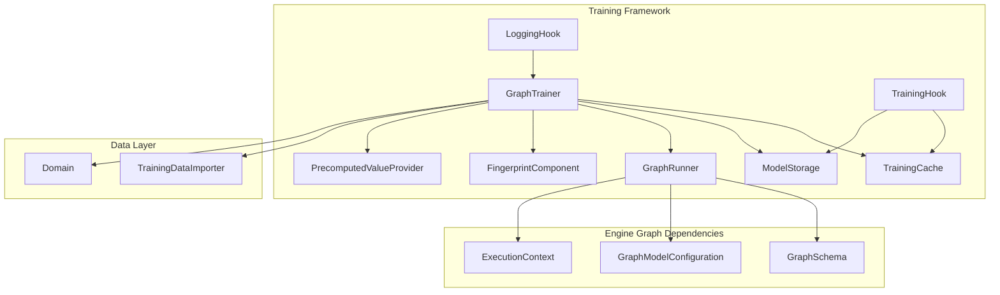
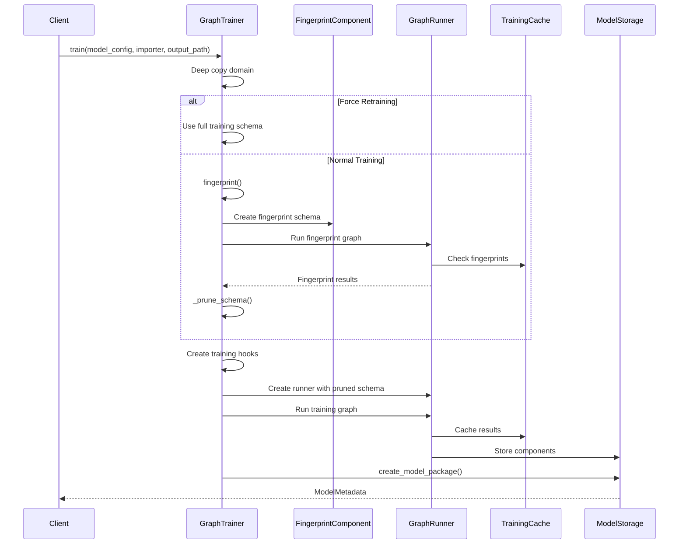
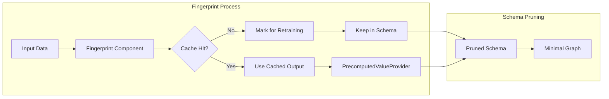
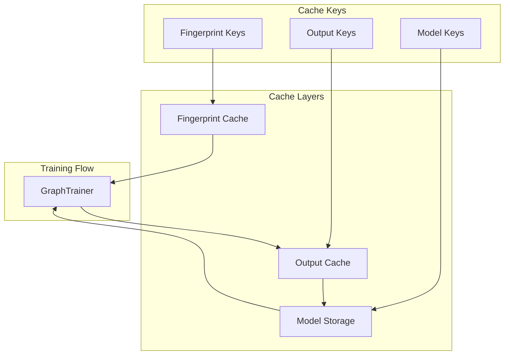
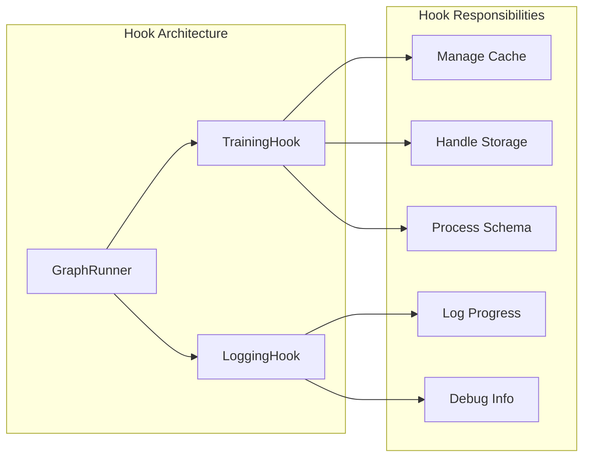
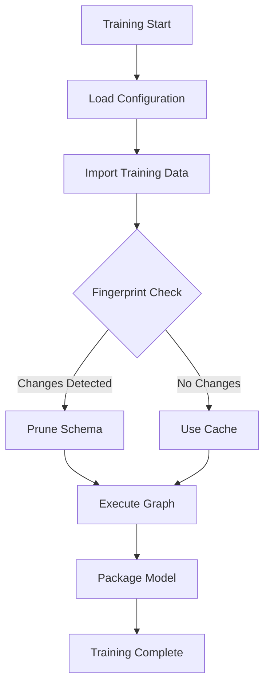
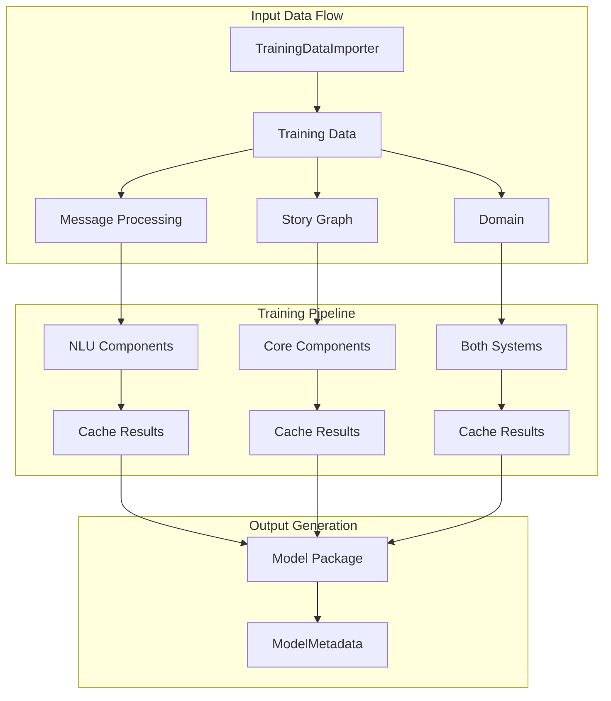
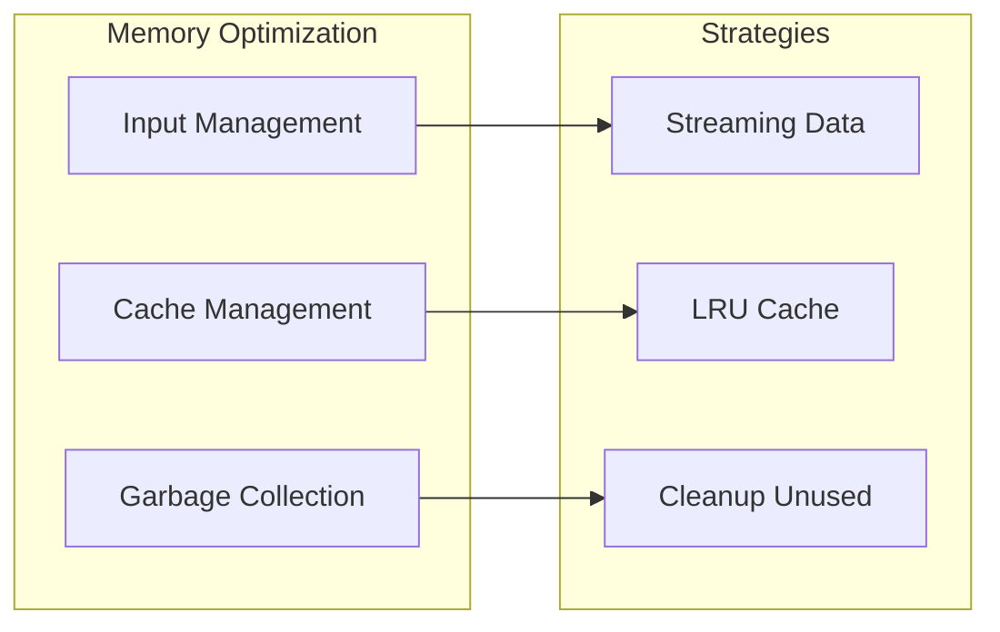

# Training Framework Module

## Introduction

The Training Framework module is the core training orchestration system in Rasa's engine architecture. It provides intelligent model training capabilities through a graph-based execution system that optimizes training performance using fingerprinting and caching mechanisms. The framework enables efficient retraining by identifying which components need to be retrained based on changes in data or configuration.

## Architecture Overview

The Training Framework serves as the central training coordinator in the Rasa engine graph system, working closely with the [engine_graph](engine_graph.md) module to execute training workflows efficiently.



## Core Components

### GraphTrainer

The `GraphTrainer` class is the central orchestrator for model training in Rasa. It coordinates the entire training pipeline from data ingestion to model packaging, utilizing intelligent caching and fingerprinting to optimize performance.

**Key Responsibilities:**
- Orchestrate the complete training pipeline
- Implement fingerprint-based change detection
- Manage training cache for performance optimization
- Coordinate graph execution through GraphRunner
- Package trained models for deployment

**Training Workflow:**



## Training Optimization Strategy

### Fingerprinting System

The framework implements a sophisticated fingerprinting mechanism to determine which components need retraining:



### Cache Management

The training framework leverages multiple caching strategies:

1. **Fingerprint Cache**: Stores component fingerprints to detect changes
2. **Output Cache**: Caches component outputs for reuse
3. **Model Storage**: Persistent storage for trained components



## Component Interactions

### Training Hook System

The framework implements a hook system to monitor and manage training execution:



### Graph Execution Flow

The training process follows a structured graph execution pattern:



## Integration with Engine Graph

The Training Framework is deeply integrated with the [engine_graph](engine_graph.md) system:

### Graph Schema Management
- **GraphSchema**: Defines the training pipeline structure
- **GraphModelConfiguration**: Contains training and prediction schemas
- **ExecutionContext**: Provides runtime context for graph execution

### Component Lifecycle
- **GraphComponent**: Base class for all trainable components
- **GraphNode**: Individual nodes in the training graph
- **GraphRunner**: Executes the training graph

## Data Flow Architecture



## Performance Optimization

### Intelligent Retraining

The framework minimizes unnecessary retraining through:

1. **Change Detection**: Fingerprinting identifies exactly what changed
2. **Dependency Analysis**: Only retrain affected components
3. **Cache Reuse**: Maximize use of previously computed results
4. **Graph Pruning**: Remove unnecessary nodes from execution

### Memory Management



## Error Handling and Recovery

The training framework implements robust error handling:

- **Validation**: Pre-training validation of schemas and data
- **Graceful Degradation**: Continue training even if some components fail
- **Recovery**: Rollback mechanisms for failed training runs
- **Logging**: Comprehensive logging for debugging and monitoring

## Dependencies

The Training Framework relies on several key modules:

- **[engine_graph](engine_graph.md)**: Core graph execution engine
- **[shared_core](shared_core.md)**: Core domain and event structures
- **[data_importers](data_importers.md)**: Training data ingestion
- **[storage_persistence](storage_persistence.md)**: Model and tracker storage

## Usage Patterns

### Basic Training
```python
trainer = GraphTrainer(model_storage, cache, graph_runner_class)
metadata = trainer.train(
    model_configuration=config,
    importer=training_data_importer,
    output_filename=output_path
)
```

### Fine-tuning
```python
metadata = trainer.train(
    model_configuration=config,
    importer=training_data_importer,
    output_filename=output_path,
    is_finetuning=True
)
```

### Force Retraining
```python
metadata = trainer.train(
    model_configuration=config,
    importer=training_data_importer,
    output_filename=output_path,
    force_retraining=True
)
```

## Best Practices

1. **Cache Management**: Regular cache cleanup to prevent storage bloat
2. **Fingerprinting**: Ensure component fingerprints are deterministic
3. **Schema Design**: Optimize graph schemas for parallel execution
4. **Error Handling**: Implement proper error handling in custom components
5. **Monitoring**: Use logging hooks for training monitoring and debugging

## Future Enhancements

The Training Framework is designed to support:

- **Distributed Training**: Multi-node training capabilities
- **Incremental Learning**: Online learning and model updates
- **Advanced Caching**: Machine learning-based cache prediction
- **Performance Analytics**: Detailed training performance metrics