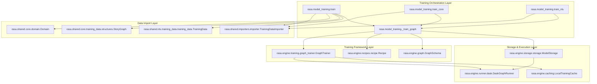
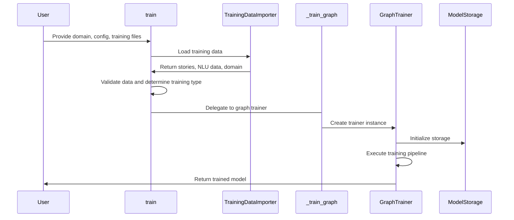
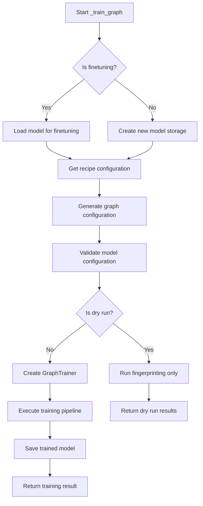
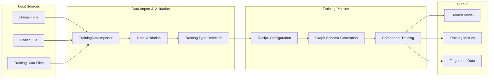
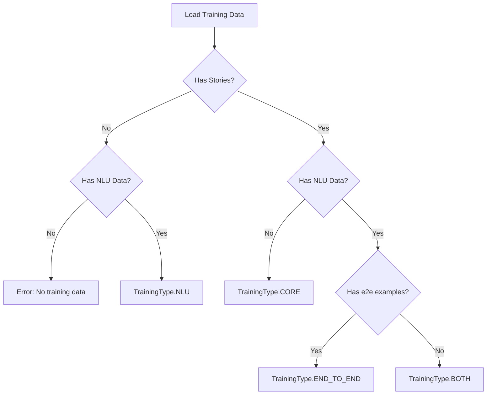
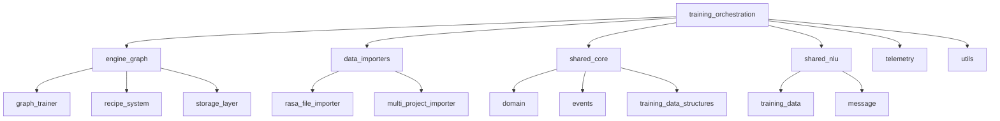
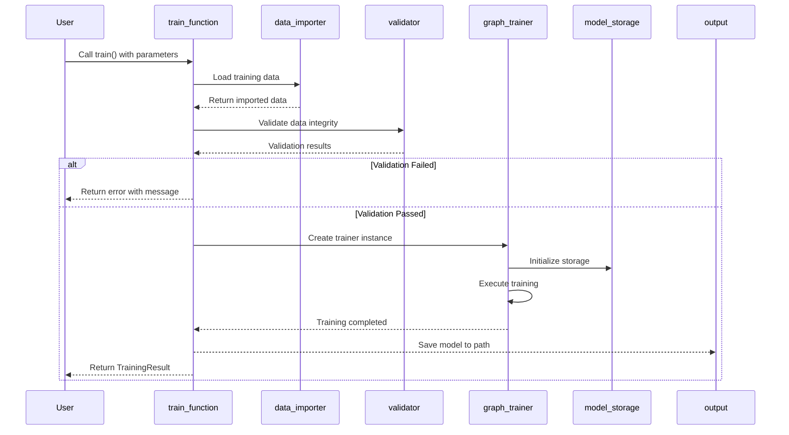
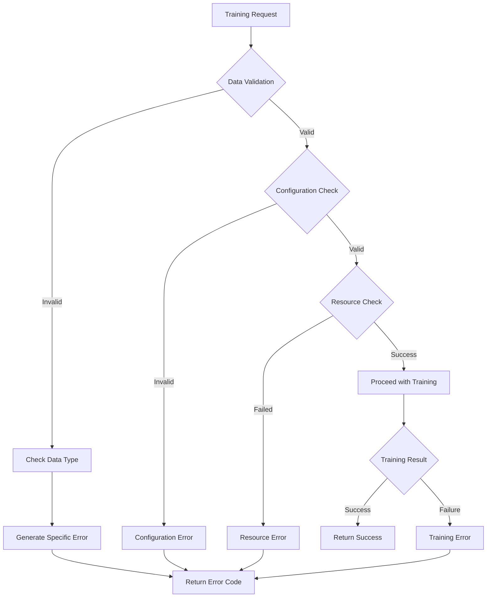
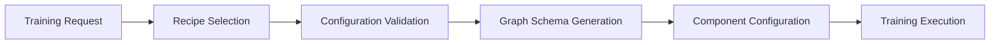

# Training Orchestration Module

## Introduction

The training_orchestration module serves as the central coordination hub for training Rasa models. It provides high-level training functions that orchestrate the entire model training pipeline, handling both NLU (Natural Language Understanding) and Core (dialogue management) components. The module abstracts the complexity of the underlying training framework while providing flexible training options including full training, incremental training, and dry-run capabilities.

## Architecture Overview

The training orchestration module implements a layered architecture that coordinates between data importers, training frameworks, and model storage systems:

## Core Components

### Main Training Functions

#### `train()` - Unified Training Function
The primary entry point for training complete Rasa models that combines both NLU and Core training:

**Key Responsibilities:**
- Data validation and training type determination (BOTH, NLU, CORE, END_TO_END)
- Unresolved slot detection and validation
- Telemetry tracking for model training
- Delegation to the graph-based training framework

#### `train_core()` - Core-Specific Training
Specialized function for training dialogue management models:

- Validates Core-specific requirements (domain, stories)
- Ensures no e2e stories are present when training Core only
- Delegates to `_train_graph()` with `TrainingType.CORE`

#### `train_nlu()` - NLU-Specific Training
Dedicated function for training Natural Language Understanding models:

- Validates NLU data presence and format
- Supports optional domain integration
- Delegates to `_train_graph()` with `TrainingType.NLU`

### Graph-Based Training Engine

#### `_train_graph()` - Core Training Orchestrator
The central function that coordinates the graph-based training process:

**Key Features:**
- Recipe-based configuration management
- Model fingerprinting for incremental training
- Support for finetuning existing models
- Integration with Dask-based parallel execution
- Comprehensive validation and error handling

## Data Flow Architecture

### Training Data Flow

### Training Type Determination Logic

The module automatically determines the appropriate training type based on data availability:

## Integration Points

### Dependencies on Other Modules

The training orchestration module integrates with several key Rasa modules:

#### [engine_graph](engine_graph.md) Integration
- **GraphTrainer**: Executes the training pipeline using graph-based execution
- **Recipe System**: Provides configuration management and graph schema generation
- **ModelStorage**: Handles model persistence and finetuning capabilities
- **GraphRunner**: Enables parallel execution of training components

#### [data_importers](data_importers.md) Integration
- **TrainingDataImporter**: Loads and validates training data from various sources
- **Multi-project support**: Handles complex project structures and data aggregation

#### [shared_core](shared_core.md) Integration
- **Domain**: Validates domain configuration and slot definitions
- **StoryGraph**: Processes dialogue training data and detects unresolved slots
- **TrainingType**: Determines appropriate training strategy based on data composition

#### [shared_nlu](shared_nlu.md) Integration
- **TrainingData**: Processes NLU training examples and validates data format
- **Message**: Handles individual training examples and features

### External Dependencies

## Key Features and Capabilities

### 1. Flexible Training Modes
- **Full Training**: Complete model training from scratch
- **Incremental Training**: Finetuning existing models with new data
- **Dry Run**: Validation and fingerprinting without actual training
- **Forced Training**: Override fingerprint checks and force retraining

### 2. Intelligent Data Validation
- **Slot Validation**: Detects unresolved slots in stories
- **Data Type Detection**: Automatically determines training requirements
- **Format Validation**: Ensures data compatibility with training pipeline

### 3. Advanced Training Features
- **End-to-End Training**: Supports combined NLU and Core training with e2e examples
- **Recipe-Based Configuration**: Flexible configuration management through recipes
- **Parallel Execution**: Dask-based parallel training for improved performance
- **Model Fingerprinting**: Efficient change detection for incremental training

### 4. Error Handling and Validation
- **Comprehensive Validation**: Multi-layer validation of inputs and configurations
- **Graceful Degradation**: Handles missing data and configuration issues
- **User-Friendly Messages**: Clear error messages and warnings

## Training Process Flow

### Complete Training Pipeline

### Error Handling Flow

## Configuration and Customization

### Training Parameters
The module supports extensive customization through training parameters:

- **Model Naming**: Custom model names with automatic timestamping
- **Output Paths**: Configurable model storage locations
- **Additional Arguments**: Component-specific training parameters
- **Finetuning Options**: Epoch fractions and model selection

### Recipe Integration
Training orchestration leverages the recipe system for flexible configuration:

## Performance Considerations

### Optimization Strategies
1. **Fingerprinting**: Avoids unnecessary retraining of unchanged components
2. **Caching**: Local training cache for intermediate results
3. **Parallel Execution**: Dask-based distributed training
4. **Incremental Training**: Efficient finetuning capabilities

### Resource Management
- Temporary directory management for intermediate files
- Memory-efficient data processing
- Configurable parallel execution parameters
- Model storage optimization

## Monitoring and Telemetry

The module integrates with Rasa's telemetry system to track:
- Training duration and success rates
- Model performance metrics
- Component usage statistics
- Error patterns and frequencies

## Best Practices

### Training Workflow
1. **Data Preparation**: Ensure clean, validated training data
2. **Configuration Review**: Verify recipe and component configurations
3. **Dry Run Execution**: Use dry-run mode for validation before full training
4. **Incremental Training**: Leverage finetuning for model updates
5. **Monitoring**: Track training progress and resource usage

### Error Prevention
- Validate domain-slot consistency before training
- Use appropriate training types for data composition
- Monitor resource availability and constraints
- Implement proper error handling in calling code

This comprehensive orchestration system provides a robust foundation for training Rasa models while maintaining flexibility and extensibility for diverse use cases and deployment scenarios.