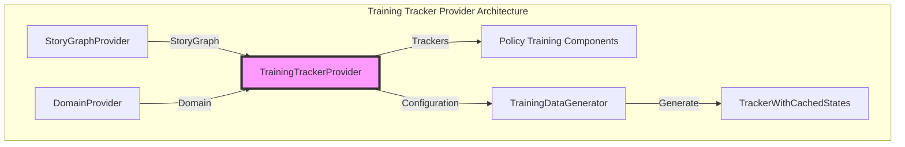
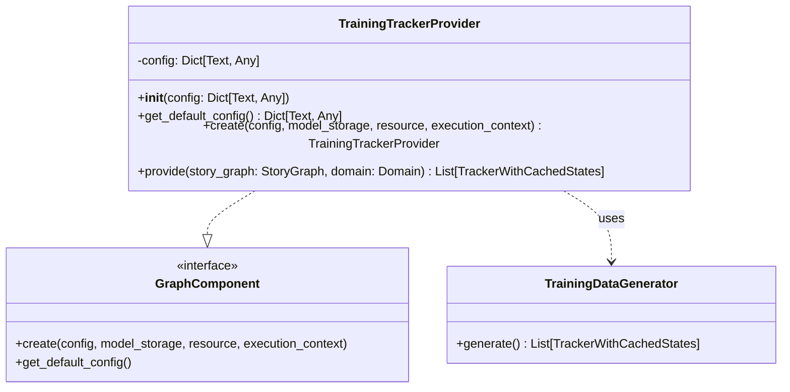
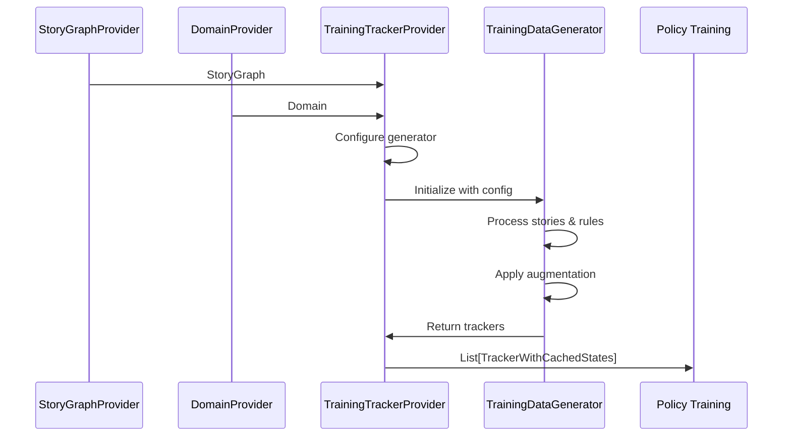
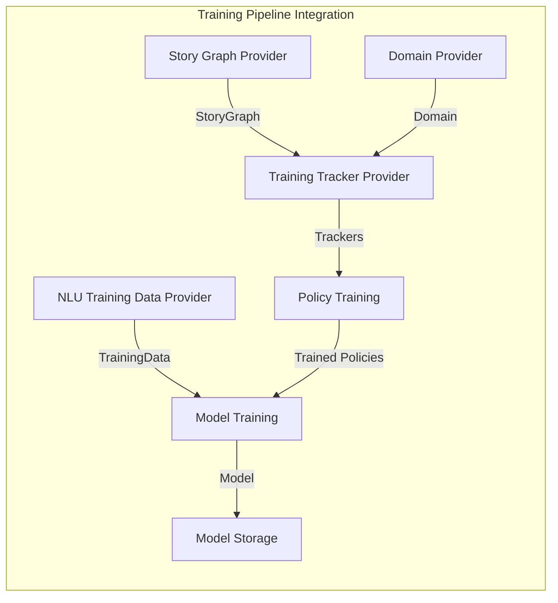
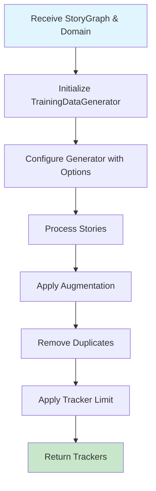

# Training Tracker Provider Module

## Introduction

The Training Tracker Provider module is a critical component in Rasa's training pipeline that generates training trackers from story graphs and domain configurations. It serves as a bridge between the declarative training data (stories and rules) and the actual training process for dialogue policies, converting abstract conversation flows into concrete tracker instances that policies can learn from.

## Architecture Overview

The Training Tracker Provider operates within Rasa's graph-based execution framework, acting as a GraphComponent that transforms training data into a format suitable for policy training.



## Core Components

### TrainingTrackerProvider

The `TrainingTrackerProvider` is the main component that implements the `GraphComponent` interface. It provides training trackers to policies based on training stories by leveraging the `TrainingDataGenerator` to convert story graphs into tracker instances.

**Key Responsibilities:**
- Convert story graphs into training trackers
- Apply data augmentation and deduplication strategies
- Configure tracker generation parameters
- Provide standardized interface for policy training



## Data Flow

The training tracker generation process follows a specific data flow pattern:



## Configuration Options

The TrainingTrackerProvider supports several configuration options that control how training trackers are generated:

| Configuration Key | Type | Default | Description |
|------------------|------|---------|-------------|
| `remove_duplicates` | bool | true | Remove duplicate training examples |
| `unique_last_num_states` | int? | null | Consider only last N states for uniqueness |
| `augmentation_factor` | int | 50 | Factor for data augmentation |
| `tracker_limit` | int? | null | Maximum number of trackers to generate |
| `use_story_concatenation` | bool | true | Enable story concatenation for augmentation |
| `debug_plots` | bool | false | Generate debug visualization plots |

## Integration with Training Pipeline

The TrainingTrackerProvider integrates with the broader training pipeline as part of Rasa's graph-based execution system:



## Dependencies

The TrainingTrackerProvider depends on several key components:

### Direct Dependencies
- **[Story Graph Provider](story_graph_provider.md)**: Provides the story graph containing training stories and rules
- **[Domain Provider](domain_provider.md)**: Supplies the domain configuration defining intents, entities, actions, and slots
- **TrainingDataGenerator**: Internal utility for converting stories to trackers

### Indirect Dependencies
- **[Shared Core](shared_core.md)**: Uses `StoryGraph`, `Domain`, and `TrackerWithCachedStates` from the shared core module
- **[Engine Graph](engine_graph.md)**: Implements the `GraphComponent` interface and operates within the graph execution framework

## Usage Patterns

### Basic Usage
The TrainingTrackerProvider is typically used within the graph execution framework:

```python
# The provider is automatically instantiated by the graph framework
provider = TrainingTrackerProvider.create(
    config={"augmentation_factor": 20},
    model_storage=model_storage,
    resource=resource,
    execution_context=execution_context
)

trackers = provider.provide(story_graph, domain)
```

### Configuration Examples

**Minimal Configuration:**
```python
config = {
    "remove_duplicates": True,
    "augmentation_factor": 20
}
```

**Advanced Configuration:**
```python
config = {
    "remove_duplicates": True,
    "unique_last_num_states": 5,
    "augmentation_factor": 100,
    "tracker_limit": 10000,
    "use_story_concatenation": True,
    "debug_plots": True
}
```

## Process Flow

The tracker generation process involves several stages:



## Error Handling

The TrainingTrackerProvider relies on the underlying `TrainingDataGenerator` for error handling. Common issues that may arise include:

- **Invalid Story Format**: Stories that don't conform to the expected format
- **Domain Mismatch**: Stories referencing intents, entities, or actions not defined in the domain
- **Resource Constraints**: Memory issues when generating large numbers of trackers with high augmentation factors

## Performance Considerations

Several factors affect the performance of the TrainingTrackerProvider:

1. **Augmentation Factor**: Higher values increase training data diversity but also computation time
2. **Tracker Limit**: Can be used to cap memory usage for large datasets
3. **Duplicate Removal**: Adds processing overhead but reduces training time for policies
4. **Story Concatenation**: Enables more complex augmentation but increases generation time

## Extension Points

While the TrainingTrackerProvider itself is not typically extended, the underlying `TrainingDataGenerator` can be enhanced to support:

- Custom augmentation strategies
- New tracker generation algorithms
- Specialized deduplication methods
- Advanced filtering mechanisms

## Related Documentation

- [Story Graph Provider](story_graph_provider.md) - Provides the story graph input
- [Domain Provider](domain_provider.md) - Provides the domain configuration
- [Policy Framework](policy_framework.md) - Consumers of the generated trackers
- [Engine Graph](engine_graph.md) - Graph execution framework
- [Shared Core](shared_core.md) - Core data structures used by this module