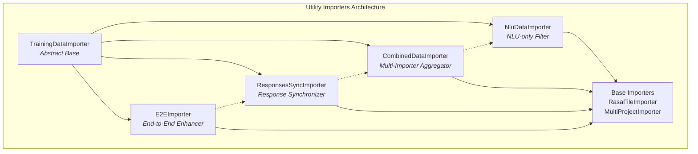
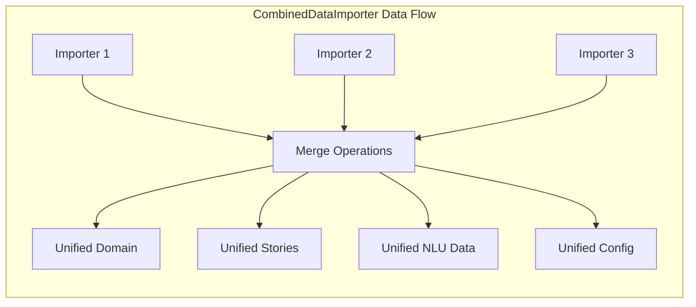
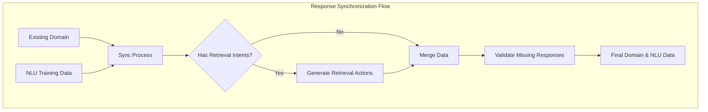
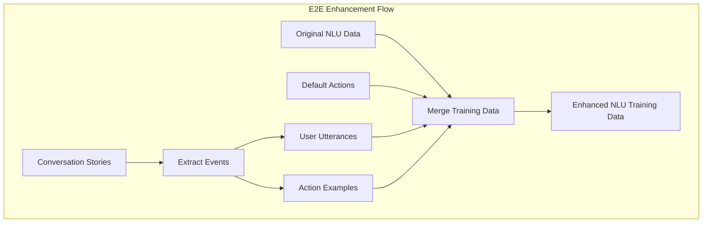
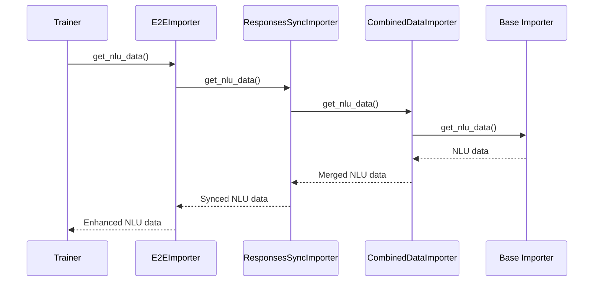
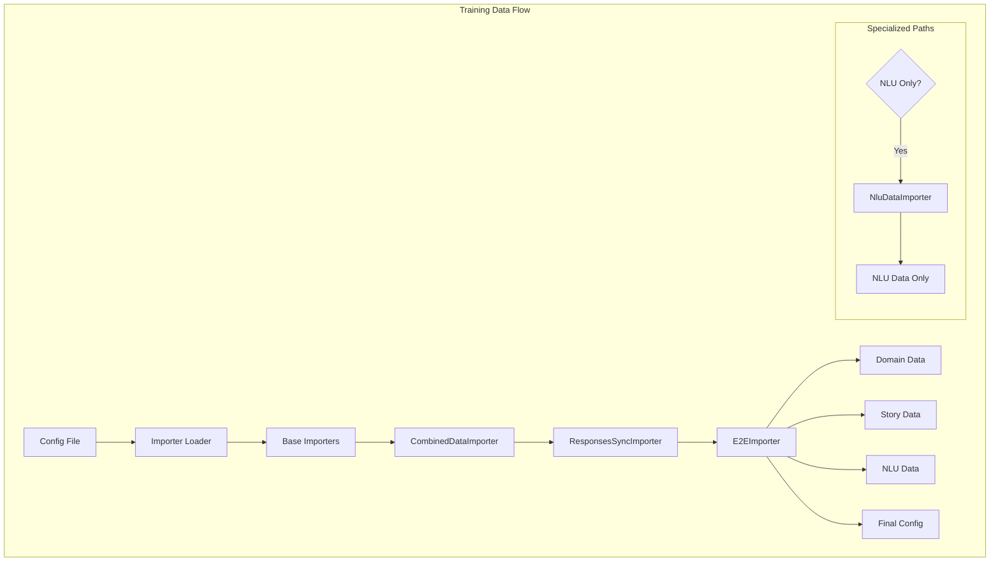

# Utility Importers Module

The utility_importers module provides specialized data importers that enhance and filter training data for specific training scenarios in Rasa. These importers act as decorators around base importers to provide targeted functionality for NLU-only training, multi-importer combinations, response synchronization, and end-to-end training data enhancement.

## Overview

The utility_importers module contains four main components that wrap and enhance base training data importers:

- **NluDataImporter**: Filters training data for NLU-only training scenarios
- **CombinedDataImporter**: Aggregates multiple importers into a unified interface
- **ResponsesSyncImporter**: Synchronizes responses between domain and NLU training data
- **E2EImporter**: Enhances training data with end-to-end examples from stories

## Architecture



## Core Components

### NluDataImporter

The `NluDataImporter` is a specialized importer that filters training data for NLU-only training scenarios. It wraps an existing importer and returns empty domain and story data while preserving NLU data and configuration.

**Key Features:**
- Returns empty domain (`Domain.empty()`)
- Returns empty story graphs (`StoryGraph([])`)
- Preserves original NLU training data
- Maintains configuration settings
- Used when training NLU models independently

**Usage Pattern:**
```python
# Created when loading NLU-only importer from config
importer = TrainingDataImporter.load_nlu_importer_from_config(config_path)
# Internally wraps the base importer with NluDataImporter
```

### CombinedDataImporter

The `CombinedDataImporter` aggregates multiple training data importers into a single unified interface. It merges data from all wrapped importers using reduction operations.

**Key Features:**
- Combines multiple importers into one
- Merges domains using `Domain.merge()`
- Aggregates stories using `StoryGraph.merge()`
- Combines NLU data using `TrainingData.merge()`
- Merges configuration dictionaries

**Data Aggregation Process:**


### ResponsesSyncImporter

The `ResponsesSyncImporter` synchronizes responses between the domain configuration and NLU training data. It ensures consistency for retrieval intents and automatically generates corresponding actions.

**Key Features:**
- Syncs responses between domain and NLU data
- Automatically creates retrieval actions (`utter_` prefix)
- Updates retrieval intent properties
- Validates missing responses
- Handles response templates

**Synchronization Process:**


### E2EImporter

The `E2EImporter` enhances NLU training data with examples extracted from conversation stories. It adds user utterances and action examples from stories to the NLU training dataset.

**Key Features:**
- Extracts user utterances from stories
- Extracts action examples from stories
- Adds default action examples
- Enhances training data diversity
- Supports end-to-end training

**Enhancement Process:**


## Component Interactions



## Data Flow Architecture



## Integration with Training Pipeline

The utility importers integrate with Rasa's training pipeline through the [data_importers](data_importers.md) module. They are automatically applied based on training requirements:

1. **Standard Training**: `E2EImporter(ResponsesSyncImporter(CombinedDataImporter(importers)))`
2. **NLU-only Training**: `NluDataImporter(base_importer)`
3. **Core-only Training**: Direct base importer usage

## Dependencies

The utility_importers module depends on several core Rasa components:

- **[shared_core](shared_core.md)**: Domain, StoryGraph, and event handling
- **[shared_nlu](shared_nlu.md)**: TrainingData and Message structures
- **[data_importers](data_importers.md)**: Base importer implementations

## Usage Examples

### Automatic Configuration
```python
# Standard training (automatically applies utility importers)
importer = TrainingDataImporter.load_from_config(config_path)

# NLU-only training (automatically applies NluDataImporter)
nlu_importer = TrainingDataImporter.load_nlu_importer_from_config(config_path)
```

### Manual Configuration
```python
# Create combined importer manually
importers = [RasaFileImporter(...), MultiProjectImporter(...)]
combined = CombinedDataImporter(importers)
synced = ResponsesSyncImporter(combined)
enhanced = E2EImporter(synced)
```

## Key Design Patterns

1. **Decorator Pattern**: Each utility importer wraps another importer
2. **Chain of Responsibility**: Importers pass requests through the chain
3. **Caching**: Uses `@cached_method` for expensive operations
4. **Immutable Operations**: All merge operations create new objects

## Error Handling

- **Missing Importers**: Logs warnings and continues with available importers
- **Invalid Configuration**: Raises appropriate exceptions with descriptive messages
- **Merge Conflicts**: Domain merge conflicts are handled by the Domain class
- **Validation**: Missing responses are detected and warned about

## Performance Considerations

- **Caching**: Expensive operations are cached using `@cached_method`
- **Lazy Loading**: Data is loaded only when requested
- **Memory Efficiency**: Large datasets are processed incrementally where possible
- **Fingerprinting**: Uses random fingerprints to prevent caching issues

This module provides essential functionality for flexible training data management in Rasa, enabling sophisticated training scenarios while maintaining data consistency and completeness.