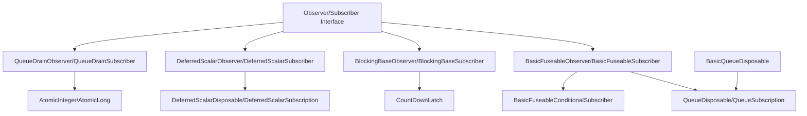
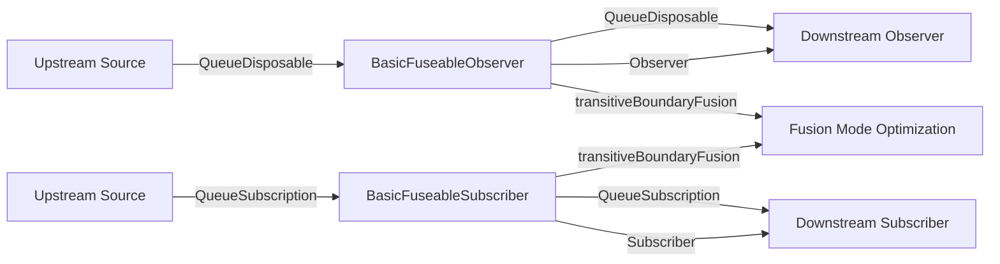
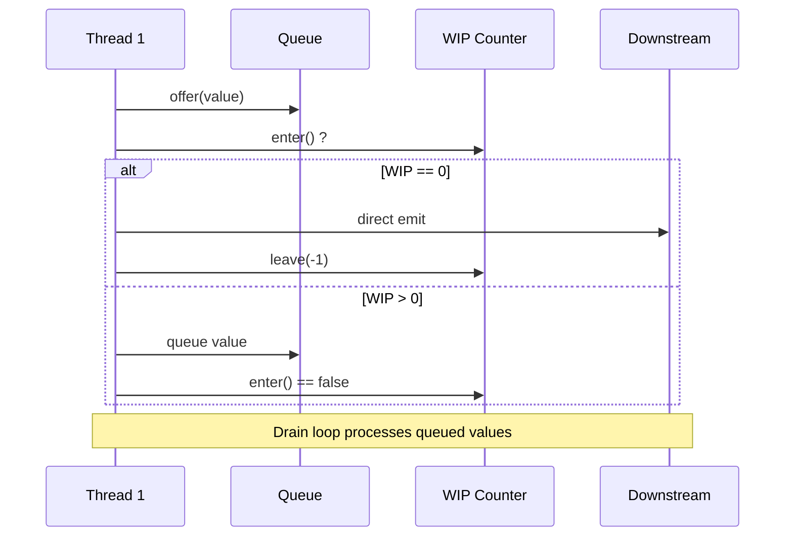
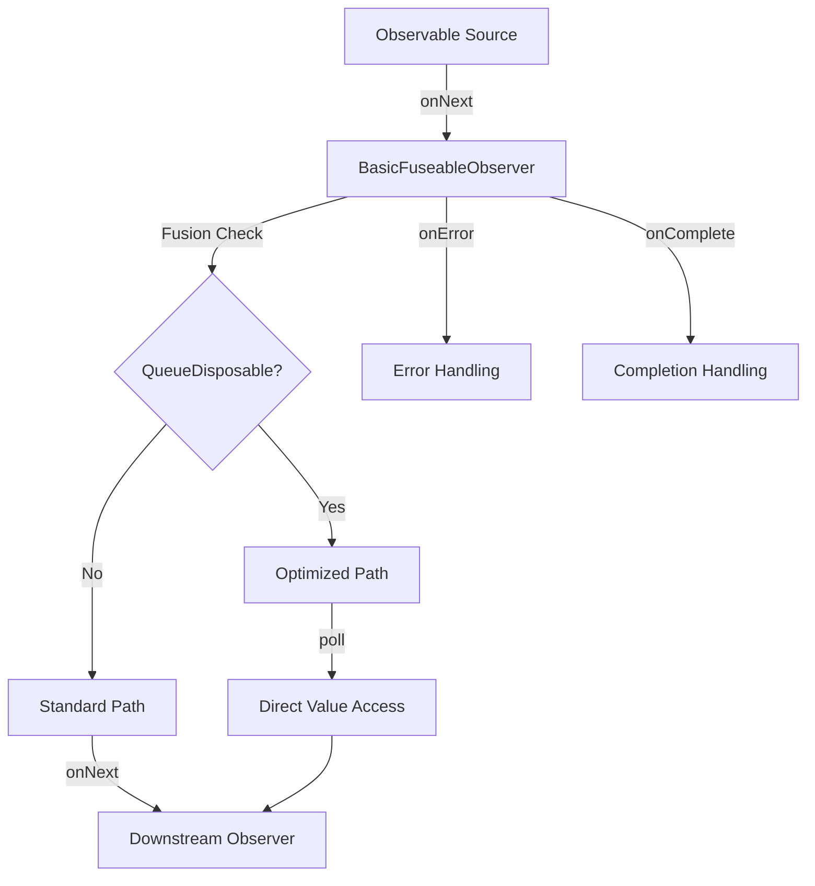
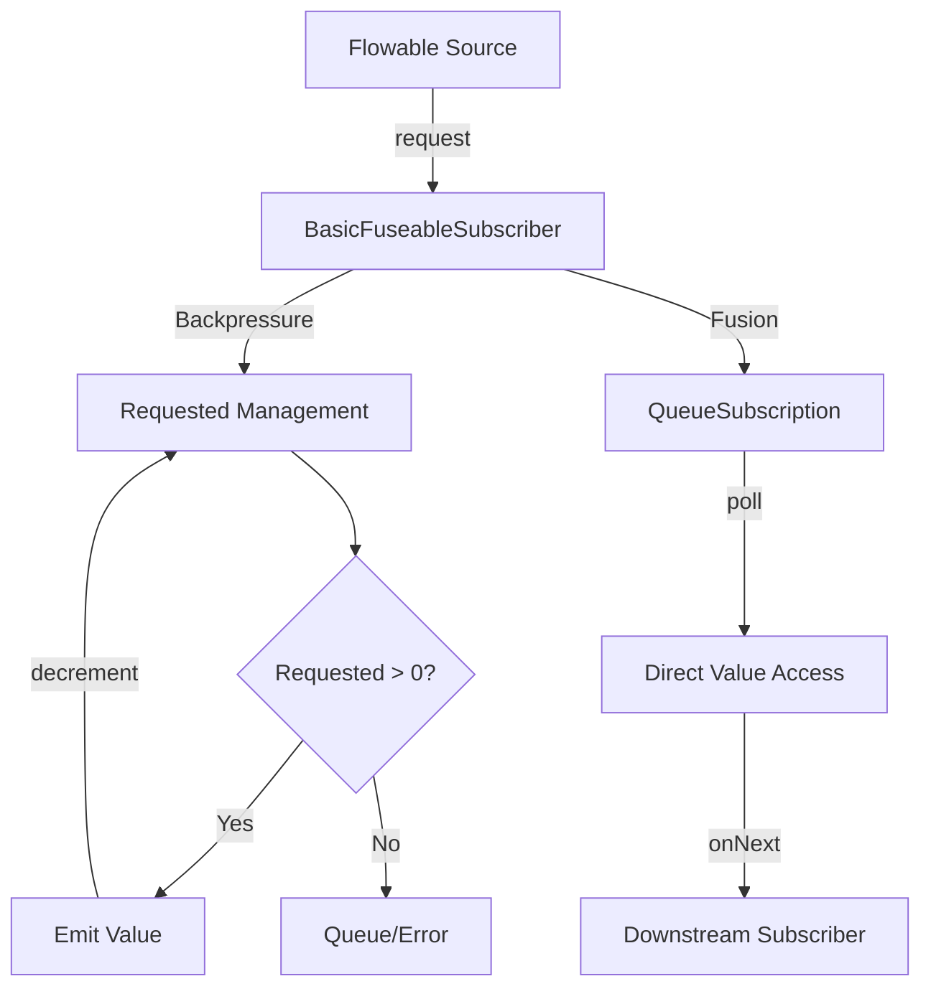
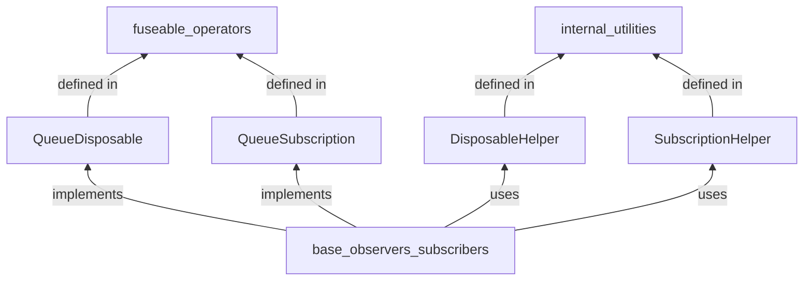

# Base Observers and Subscribers Module

## Introduction

The `base_observers_subscribers` module provides the foundational infrastructure for reactive stream processing in RxJava3. This module contains abstract base classes and core implementations that serve as building blocks for observers and subscribers throughout the reactive streams ecosystem. These components handle the fundamental aspects of reactive stream processing, including fusion capabilities, queue management, blocking operations, and scalar value handling.

## Module Overview

The module is organized into two main categories:
- **Observers**: Components for handling Observable streams (push-based)
- **Subscribers**: Components for handling Flowable streams (backpressure-aware)

## Core Components

### Observer Components

#### BasicFuseableObserver<T, R>
A foundational base class for fuseable intermediate observers that bridges upstream and downstream processing. This component provides:

- **Fusion Support**: Implements both `Observer<T>` and `QueueDisposable<R>` interfaces
- **Protocol Management**: Handles subscription validation and lifecycle management
- **Error Handling**: Provides standardized error propagation with done-state checking
- **Queue Integration**: Manages upstream queue disposable references for fusion optimization

**Key Features:**
- Transitive boundary fusion for optimizing stream processing
- Protected lifecycle hooks (`beforeDownstream()`, `afterDownstream()`)
- Thread-safe state management with done flag
- Automatic resource cleanup on errors

#### BasicQueueDisposable<T>
An abstract implementation that provides default behavior for queue operations that should not be called directly in reactive streams context.

**Purpose:**
- Prevents misuse of queue operations like `offer()`
- Serves as a foundation for queue-based disposable implementations
- Maintains contract integrity for reactive stream processing

#### BlockingBaseObserver<T>
Provides blocking synchronization capabilities for observer operations using `CountDownLatch` mechanism.

**Capabilities:**
- Thread-safe blocking operations with `blockingGet()`
- Automatic resource management with cancellation support
- Exception handling and propagation
- Integration with RxJava's blocking helper utilities

#### DeferredScalarObserver<T, R>
Specialized observer for handling scalar (0 or 1) value emissions with deferred completion.

**Characteristics:**
- Extends `DeferredScalarDisposable<R>` for scalar value management
- Supports fusion capabilities for optimized single-value processing
- Automatic upstream disposal on completion or error
- Value caching for deferred emission

#### QueueDrainObserver<T, U, V>
Abstract base for observers requiring queue-drain behavior with atomic state management.

**Features:**
- Atomic integer-based work-in-progress (WIP) coordination
- Fast-path and ordered emission strategies
- Queue-based backpressure handling
- Padding classes for false-sharing prevention

### Subscriber Components

#### BasicFuseableSubscriber<T, R>
The Flowable equivalent of `BasicFuseableObserver`, providing fusion capabilities for backpressure-aware streams.

**Key Aspects:**
- Implements both `FlowableSubscriber<T>` and `QueueSubscription<R>`
- Reactive Streams compliance with subscription management
- Transitive fusion support for Flowable operators
- Backpressure-aware resource management

#### BasicFuseableConditionalSubscriber<T, R>
Conditional variant of `BasicFuseableSubscriber` for selective processing scenarios.

**Specializations:**
- Implements `ConditionalSubscriber<T>` interface
- Supports conditional emission logic
- Maintains fusion capabilities with conditional processing
- Optimized for filter-like operations

#### BlockingBaseSubscriber<T>
Flowable equivalent of `BlockingBaseObserver` with Reactive Streams compliance.

**Functionality:**
- CountDownLatch-based synchronization
- Subscription management with automatic request handling
- Blocking value retrieval with exception propagation
- Cancellation support with proper cleanup

#### DeferredScalarSubscriber<T, R>
Flowable version of `DeferredScalarObserver` for scalar value processing in backpressure contexts.

**Features:**
- Extends `DeferredScalarSubscription<R>`
- Unbounded input with scalar output
- Has-value tracking for completion logic
- Automatic upstream cancellation

#### QueueDrainSubscriber<T, U, V>
Flowable equivalent of `QueueDrainObserver` with backpressure support.

**Advanced Capabilities:**
- Atomic long-based requested count management
- Missing backpressure exception handling
- Max-loop drain operations for high-throughput scenarios
- Padding classes for CPU cache optimization

## Architecture

### Component Hierarchy



### Fusion Architecture



### Queue Drain Pattern



## Data Flow

### Observer Stream Processing



### Subscriber Stream Processing



## Integration Points

### Dependency Relationships

The base_observers_subscribers module integrates with several other RxJava3 modules:

- **[core_reactive_types](core_reactive_types.md)**: Provides the fundamental `Observer`, `FlowableSubscriber`, and transformer interfaces that these components implement
- **[disposables_and_subscriptions](disposables_and_subscriptions.md)**: Utilizes disposable and subscription helpers for resource management
- **[internal_utilities](internal_utilities.md)**: Leverages utility classes like `DisposableHelper`, `SubscriptionHelper`, and `QueueDrainHelper`
- **[fuseable_operators](fuseable_operators.md)**: Implements `QueueDisposable` and `QueueSubscription` interfaces for fusion optimization
- **[base_subscriptions](base_subscriptions.md)**: Extends subscription classes like `DeferredScalarSubscription`

### Fusion Integration



## Performance Considerations

### Memory Optimization
- **Padding Classes**: Strategic field padding prevents false sharing in multi-threaded scenarios
- **Atomic Operations**: Efficient atomic counters for coordination without blocking
- **Queue Reuse**: Fusion capabilities enable direct queue access, reducing allocation overhead

### Throughput Optimization
- **Fast-Path Emission**: Direct value emission when possible, bypassing queue operations
- **Batch Processing**: Queue drain patterns enable efficient batch value processing
- **Conditional Processing**: Conditional subscribers reduce unnecessary data transfer

### Thread Safety
- **State Management**: Volatile fields and atomic operations ensure thread-safe state transitions
- **Resource Cleanup**: Systematic disposal patterns prevent resource leaks
- **Error Propagation**: Consistent error handling across all components

## Usage Patterns

### Basic Implementation Pattern

```java
public class CustomObserver<T> extends BasicFuseableObserver<T, T> {
    public CustomObserver(Observer<? super T> downstream) {
        super(downstream);
    }
    
    @Override
    public void onNext(T value) {
        if (done) {
            return;
        }
        // Custom processing logic
        downstream.onNext(transformedValue);
    }
}
```

### Queue Drain Implementation

```java
public class QueueBasedObserver<T> extends QueueDrainObserver<T, T, T> {
    public QueueBasedObserver(Observer<? super T> downstream, SimplePlainQueue<T> queue) {
        super(downstream, queue);
    }
    
    @Override
    public void onNext(T value) {
        fastPathEmit(value, false, this);
    }
}
```

## Error Handling

### Standardized Error Propagation
All components follow consistent error handling patterns:

1. **Done State Checking**: Prevents multiple error emissions
2. **Fatal Exception Handling**: Uses `Exceptions.throwIfFatal()` for critical errors
3. **Resource Cleanup**: Automatic upstream disposal on errors
4. **Plugin Integration**: Errors reported through `RxJavaPlugins.onError()`

### Error Recovery
- **Fail Method**: Standardized error handling with upstream cancellation
- **Exception Wrapping**: Proper exception transformation for blocking operations
- **State Consistency**: Maintains consistent state during error conditions

## Best Practices

### When to Use Each Component

- **BasicFuseableObserver/Subscriber**: For operators requiring fusion optimization
- **BlockingBaseObserver/Subscriber**: For synchronous/blocking operations
- **DeferredScalarObserver/Subscriber**: For single-value or empty result scenarios
- **QueueDrainObserver/Subscriber**: For complex queue-based processing with coordination

### Performance Guidelines

1. **Fusion Utilization**: Enable fusion when upstream supports it for better performance
2. **Queue Selection**: Choose appropriate queue implementations based on usage patterns
3. **Padding Awareness**: Understand padding overhead in high-frequency scenarios
4. **Atomic Operation Costs**: Balance coordination needs with atomic operation overhead

### Thread Safety Considerations

1. **State Volatility**: Ensure proper volatile semantics for shared state
2. **Ordering Guarantees**: Understand happens-before relationships in queue operations
3. **Resource Lifecycle**: Manage disposal carefully to prevent leaks
4. **Error Propagation**: Maintain error handling consistency across threads

## Conclusion

The base_observers_subscribers module provides the essential building blocks for RxJava3's reactive stream processing infrastructure. Through careful design patterns like fusion support, queue drain coordination, and standardized error handling, these components enable efficient and reliable stream processing across the entire RxJava3 ecosystem. Understanding these foundational components is crucial for implementing custom operators and optimizing reactive applications.