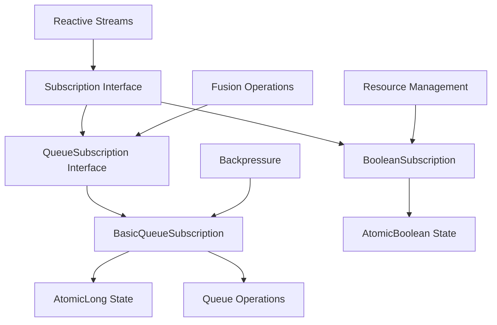
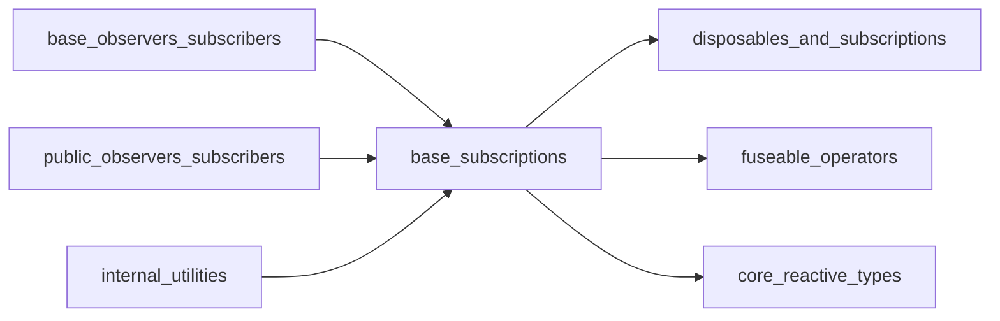
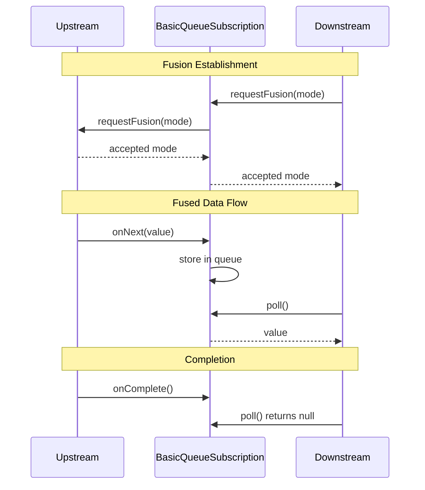
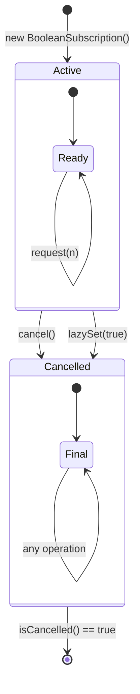

# Base Subscriptions Module

## Overview

The `base_subscriptions` module provides foundational subscription implementations for RxJava's reactive streams. This module contains core subscription classes that serve as building blocks for more complex subscription mechanisms throughout the RxJava framework.

## Purpose

The base_subscriptions module serves as the foundation for:
- **Subscription Management**: Providing basic subscription implementations that handle resource lifecycle and cancellation
- **Queue-based Operations**: Supporting fusion operations for optimized data processing
- **Atomic State Management**: Ensuring thread-safe subscription state management
- **Resource Cleanup**: Enabling proper cleanup and disposal of resources

## Architecture

## Core Components

### BasicQueueSubscription
- **Purpose**: Abstract base class for queue-based subscriptions that support fusion operations
- **Key Features**:
  - Extends `AtomicLong` for thread-safe state management
  - Implements `QueueSubscription` interface for fusion support
  - Provides atomic operations for work-in-progress accounting
  - Prevents direct element offering through unsupported operation exceptions

### BooleanSubscription
- **Purpose**: Simple subscription implementation for cancellation tracking
- **Key Features**:
  - Extends `AtomicBoolean` for thread-safe cancellation state
  - Ignores request operations (no backpressure handling)
  - Provides cancellation status checking via `isCancelled()`
  - Lightweight implementation for simple subscription scenarios

## Module Relationships

## Key Design Patterns

### 1. Atomic State Management
Both core components utilize atomic classes (`AtomicLong`, `AtomicBoolean`) to ensure thread-safe operations without explicit synchronization.

### 2. Interface Segregation
The module provides specialized implementations for different subscription needs:
- `BooleanSubscription` for simple cancellation tracking
- `BasicQueueSubscription` for complex queue-based operations

### 3. Template Method Pattern
`BasicQueueSubscription` serves as an abstract base class, allowing subclasses to implement specific queue behaviors while providing common atomic state management.

## Technical Implementation Details

### Fusion Mechanics

### Atomic State Operations

The `BasicQueueSubscription` extends `AtomicLong` to provide:
- **Work-in-progress tracking**: Atomic increment/decrement for concurrent operations
- **Request accounting**: Thread-safe request(n) handling for backpressure
- **State flags**: Bit manipulation for fusion mode and completion status

### BooleanSubscription State Machine

## Usage Scenarios

### BooleanSubscription
- **Event Sources**: When cancellation tracking is needed without backpressure
- **Resource Management**: Simple subscription scenarios requiring cancellation status
- **Testing**: Mock subscriptions for unit testing

### BasicQueueSubscription
- **Fusion Operations**: When queue-based optimizations are required
- **Custom Operators**: Building specialized operators with queue support
- **Backpressure Handling**: Scenarios requiring atomic request accounting

## Integration with Other Modules

The base_subscriptions module integrates with:

### [disposables_and_subscriptions](disposables_and_subscriptions.md)
- **Resource Management**: Provides foundational subscription mechanisms that complement disposable patterns
- **Lifecycle Integration**: Works with `SerialDisposable` and `ReferenceDisposable` for atomic resource management
- **State Coordination**: BooleanSubscription's cancellation state integrates with disposable lifecycle

### [fuseable_operators](fuseable_operators.md)
- **Queue Fusion**: BasicQueueSubscription implements QueueSubscription interface for fusion support
- **Performance Optimization**: Enables SYNC and ASYNC fusion modes for reduced overhead
- **Operator Integration**: Works with AbstractEmptyQueueFuseable for specialized fusion scenarios

### [base_observers_subscribers](base_observers_subscribers.md)
- **Observer Pattern**: Supports queue-based observers like BasicFuseableObserver
- **Subscription Management**: Provides subscription foundation for QueueDrainObserver and QueueDrainSubscriber
- **Resource Cleanup**: Integrates with disposable patterns in base observer implementations

### [core_reactive_types](core_reactive_types.md)
- **Reactive Streams**: Underlies reactive stream implementations across all reactive types
- **Transformer Support**: Works with ObservableTransformer, FlowableTransformer, and other core transformers
- **Scheduler Integration**: Coordinates with Scheduler.DisposeTask for proper resource cleanup

## Thread Safety

All components in this module are designed to be thread-safe:
- Atomic operations for state changes
- No explicit synchronization required
- Safe publication guarantees through atomic field updaters

## Performance Considerations

- **BooleanSubscription**: Minimal overhead, suitable for high-frequency operations
- **BasicQueueSubscription**: Additional memory overhead from AtomicLong, but enables advanced fusion optimizations
- Both implementations avoid locks, relying on atomic operations for scalability