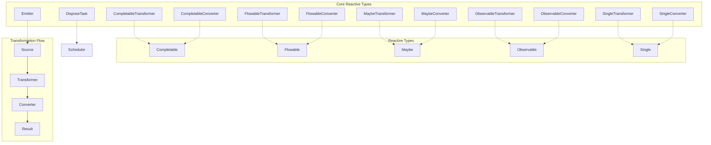
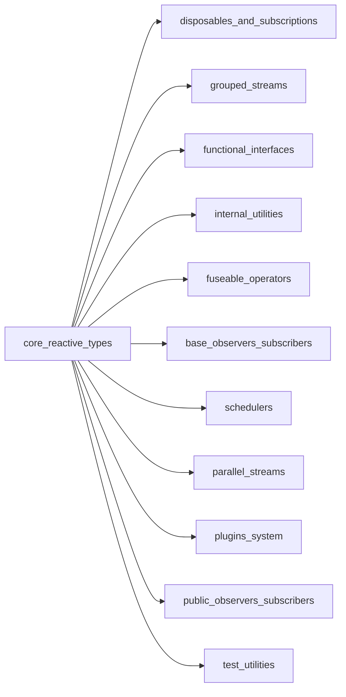

# Core Reactive Types Module

## Overview

The `core_reactive_types` module forms the foundational layer of RxJava3, providing the essential interfaces and abstractions that define reactive programming constructs. This module establishes the core contracts for reactive streams, transformation operations, and scheduling mechanisms that enable fluent, composable asynchronous programming.

## Purpose

The primary purpose of this module is to:
- Define the fundamental reactive types (`Observable`, `Flowable`, `Single`, `Maybe`, `Completable`)
- Provide transformation interfaces for converting between reactive types
- Establish the emitter pattern for producing reactive streams
- Define scheduling abstractions for controlling execution context
- Enable fluent composition and transformation of reactive operations

## Architecture



## Core Components

### Transformation Interfaces

The module provides two main categories of transformation interfaces for each reactive type:

#### 1. Transformer Interfaces
- **Purpose**: Transform one reactive type into another reactive type
- **Pattern**: `ReactiveType` → `Transformer` → `ReactiveSource`
- **Usage**: Used with the `compose()` operator for fluent transformation chains

#### 2. Converter Interfaces  
- **Purpose**: Convert reactive types into arbitrary values or types
- **Pattern**: `ReactiveType` → `Converter` → `Any Type R`
- **Usage**: Used with the `to()` operator for terminal conversions

### Supported Reactive Types

| Type | Transformer | Converter | Description |
|------|-------------|-----------|-------------|
| `Completable` | `CompletableTransformer` | `CompletableConverter` | Represents a deferred computation without any value but only indication for completion or exception |
| `Flowable` | `FlowableTransformer` | `FlowableConverter` | Emits 0 to N items, supports backpressure, follows Reactive Streams specification |
| `Maybe` | `MaybeTransformer` | `MaybeConverter` | Emits either a single value, no value, or an error signal |
| `Observable` | `ObservableTransformer` | `ObservableConverter` | Emits 0 to N items without backpressure support |
| `Single` | `SingleTransformer` | `SingleConverter` | Emits exactly one item or an error signal |

### Emitter Interface

The `Emitter` interface provides the foundation for creating custom reactive sources:
- **onNext(T value)**: Emits a normal value
- **onError(Throwable error)**: Signals an error condition
- **onComplete()**: Signals successful completion

### Scheduler Integration

The module includes `DisposeTask` which integrates with the scheduling system to provide proper resource management and disposal of scheduled tasks.

## Module Relationships



## Key Features

### 1. Type Safety
All transformation interfaces are strongly typed with generic parameters, ensuring compile-time type safety across reactive operations.

### 2. Functional Interface Design
All transformer and converter interfaces are marked with `@FunctionalInterface`, enabling lambda expression usage for concise, functional programming patterns.

### 3. Fluent API Integration
The interfaces are designed to work seamlessly with RxJava's fluent API, allowing for readable and maintainable reactive chains.

### 4. Null Safety
All interfaces use `@NonNull` annotations to enforce null safety contracts throughout the reactive pipeline.

## Usage Patterns

### Basic Transformation
```java
// Using a transformer to modify a Flowable
Flowable<Integer> transformed = originalFlowable
    .compose(upstream -> upstream.map(x -> x * 2).filter(x -> x > 10));
```

### Type Conversion
```java
// Using a converter to extract a value
String result = observable
    .to(upstream -> upstream.map(Object::toString).blockingFirst());
```

### Custom Emitter
```java
// Creating a custom source using Emitter
Observable.create(emitter -> {
    try {
        emitter.onNext("value1");
        emitter.onNext("value2");
        emitter.onComplete();
    } catch (Exception e) {
        emitter.onError(e);
    }
});
```

## Related Documentation

For detailed information about specific sub-modules, refer to:
- [disposables_and_subscriptions](disposables_and_subscriptions.md) - Resource management and lifecycle control
- [grouped_streams](grouped_streams.md) - Grouped reactive stream implementations
- [functional_interfaces](functional_interfaces.md) - Functional programming utilities
- [internal_utilities](internal_utilities.md) - Internal helper classes and utilities including Functions, ObjectHelper, BackpressureHelper, and other utility classes
- [fuseable_operators](fuseable_operators.md) - Fused operator implementations
- [base_observers_subscribers](base_observers_subscribers.md) - Base observer and subscriber implementations including fuseable observers, queue-based disposables, and drain helpers
- [schedulers](schedulers.md) - Scheduling and execution context management including Schedulers utility class and SchedulerPoolFactory
- [parallel_streams](parallel_streams.md) - Parallel processing capabilities
- [plugins_system](plugins_system.md) - Plugin architecture and hooks
- [public_observers_subscribers](public_observers_subscribers.md) - Public observer and subscriber APIs including DefaultObserver, DisposableObserver, ResourceObserver, and their subscriber counterparts
- [test_utilities](test_utilities.md) - Testing support and utilities

## Thread Safety

All interfaces in this module are designed to be thread-safe when implemented correctly. The contracts specify that implementations should handle concurrent access appropriately, though the specific threading behavior depends on the implementing class.

## Performance Considerations

- Transformer and converter interfaces are designed to be lightweight and avoid unnecessary object creation
- The functional interface design enables efficient lambda compilation and inlining
- Emitter implementations should minimize blocking operations to maintain reactive flow

## Migration Notes

When migrating from RxJava 2.x:
- All transformation interfaces maintain backward compatibility
- The `@NonNull` annotations provide enhanced null safety
- New converter interfaces provide additional flexibility for type conversions