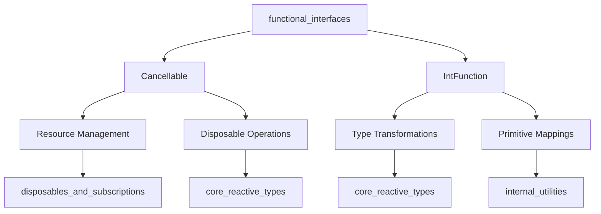
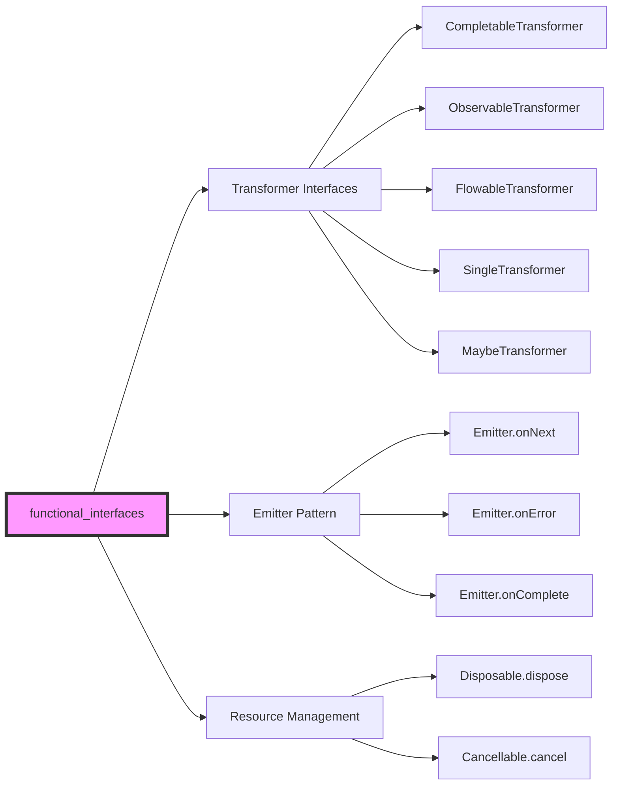

# Functional Interfaces Module

## Overview

The `functional_interfaces` module provides the foundational functional programming abstractions for RxJava3. It defines core functional interfaces that enable reactive programming patterns, resource management, and type-safe transformations within the reactive streams ecosystem.

## Purpose

This module serves as the building block for:
- **Resource Management**: Providing cancellable operations through the `Cancellable` interface
- **Type-Safe Transformations**: Enabling primitive-to-object mappings via the `IntFunction` interface
- **Functional Programming**: Supporting lambda expressions and method references throughout the RxJava framework

## Architecture



## Core Components

### Cancellable Interface
The `Cancellable` interface provides a standardized way to handle resource cleanup and operation cancellation. It's designed to throw checked exceptions, allowing implementations to signal various error conditions during cancellation.

**Key Features:**
- Single abstract method `cancel()` that can throw any `Throwable`
- Functional interface annotation for lambda support
- Used throughout the framework for resource management

### IntFunction Interface
The `IntFunction<T>` interface enables type-safe transformations from primitive integers to objects of type `T`. This is particularly useful in reactive streams where primitive values need to be converted to complex types.

**Key Features:**
- Generic interface with type parameter `T`
- Single abstract method `apply(int i)` that returns type `T`
- Can throw any `Throwable` for error handling
- Null-safe with `@NonNull` annotation support

## Module Relationships

The functional_interfaces module integrates with several other modules in the RxJava ecosystem:

- **[disposables_and_subscriptions](disposables_and_subscriptions.md)**: Uses `Cancellable` for resource cleanup patterns
- **[core_reactive_types](core_reactive_types.md)**: Leverages both interfaces for stream transformations and lifecycle management
- **[internal_utilities](internal_utilities.md)**: Employs `IntFunction` for internal data structure operations

## Usage Patterns

### Resource Management Pattern
```java
// Cancellable used for cleanup operations
Cancellable resourceCleanup = () -> {
    // Cleanup logic that can throw exceptions
    closeResources();
    cleanupConnections();
};

// Integration with try-with-resources pattern
try {
    // Use resources
} finally {
    try {
        resourceCleanup.cancel();
    } catch (Throwable e) {
        // Handle cleanup errors
        logger.error("Cleanup failed", e);
    }
}
```

### Type Transformation Pattern
```java
// IntFunction used for primitive-to-object mapping
IntFunction<String> intToString = i -> "Number: " + i;
IntFunction<DataBuffer> bufferFactory = capacity -> new DataBuffer(capacity);

// Usage in reactive streams
IntFunction<List<String>> createFixedList = size -> new ArrayList<>(size);
IntFunction<String[]> createArray = size -> new String[size];

// Chaining transformations
IntFunction<String> complexTransform = i -> {
    if (i < 0) throw new IllegalArgumentException("Negative value: " + i);
    return String.format("Value: %04d", i);
};
```

### Integration with Reactive Streams
```java
// Cancellable in reactive context
Observable.create(emitter -> {
    Cancellable cancellable = () -> cleanupResources();
    
    emitter.setCancellable(cancellable);
    
    // Emit values
    emitter.onNext("value");
    emitter.onComplete();
});

// IntFunction for buffer allocation
Flowable.create(emitter -> {
    IntFunction<byte[]> bufferFactory = size -> new byte[size];
    byte[] buffer = bufferFactory.apply(1024);
    
    // Use buffer for data processing
    // ...
}, BackpressureStrategy.BUFFER);
```

## Architecture Context

The functional_interfaces module serves as the foundation for RxJava's functional programming model. It provides the basic building blocks that enable higher-level abstractions in other modules.



## Relationship with Transformer Interfaces

The functional interfaces in this module provide the foundation for the transformer interfaces in [core_reactive_types](core_reactive_types.md):

- **CompletableTransformer**: Uses functional composition patterns similar to `Cancellable`
- **ObservableTransformer**: Leverages type transformation concepts from `IntFunction`
- **FlowableTransformer**: Applies functional programming principles for backpressure-aware streams
- **SingleTransformer**: Uses functional composition for single-value transformations
- **MaybeTransformer**: Applies optional transformation patterns

These transformer interfaces extend the basic functional concepts to provide stream-level transformations, demonstrating how the simple interfaces in this module enable complex reactive operations.

## Design Principles

1. **Functional Programming**: Both interfaces are functional interfaces, enabling lambda expressions
2. **Exception Safety**: Methods can throw `Throwable`, providing comprehensive error handling
3. **Type Safety**: Generic types and null-safety annotations ensure compile-time safety
4. **Simplicity**: Minimal interface design with single responsibility principle

## Integration Points

The functional interfaces in this module are extensively used across the RxJava framework:

### Cancellable Integration
- **Resource Management**: Used by [disposables_and_subscriptions](disposables_and_subscriptions.md) for cleanup operations
- **Stream Lifecycle**: Integrated with [core_reactive_types](core_reactive_types.md) for managing stream cancellation
- **Error Handling**: Provides flexible error propagation mechanisms during cancellation

### IntFunction Integration
- **Type Transformations**: Used by [internal_utilities](internal_utilities.md) for converting primitive indices to data structures
- **Stream Operations**: Enables efficient primitive-to-object mapping in reactive streams
- **Performance Optimization**: Avoids boxing overhead by working directly with primitive integers

### Relationship with Other Functional Interfaces
The module works closely with [internal_utilities](internal_utilities.md) which provides:
- **Functions Utility Class**: Comprehensive functional interface implementations and utilities
- **Object Transformation**: Helper methods for functional programming patterns
- **Type-Safe Operations**: Null-safe and exception-safe functional operations

### Emitter Pattern Integration
The `Cancellable` interface complements the `Emitter` interface from [core_reactive_types](core_reactive_types.md):
- **Signal Control**: Provides cancellation capability alongside onNext/onError/onComplete signals
- **Resource Cleanup**: Ensures proper cleanup when emission is cancelled
- **Exception Handling**: Allows cancellation to throw exceptions for error propagation

## Performance Considerations

### Memory Efficiency
- **IntFunction**: Avoids autoboxing overhead by working directly with primitive `int` values
- **Cancellable**: Minimal interface footprint with no additional memory allocation requirements
- **Lambda Optimization**: Functional interfaces enable JVM lambda optimizations and inlining

### Exception Handling Performance
- **Throwable Declaration**: Allows implementations to throw checked exceptions without wrapper overhead
- **Error Propagation**: Direct exception throwing avoids intermediate exception wrapping
- **Stack Trace Management**: Minimal stack trace overhead due to simple interface design

### Best Practices

#### Cancellable Implementation
```java
// Good: Simple, focused implementation
Cancellable resourceCleanup = () -> {
    if (resource != null) {
        resource.close();
    }
};

// Avoid: Complex logic in cancel method
Cancellable complexCleanup = () -> {
    // Don't: Complex conditional logic
    // Don't: Multiple resource cleanup without proper ordering
    // Don't: Network operations or blocking calls
};
```

#### IntFunction Implementation
```java
// Good: Pure function without side effects
IntFunction<String> formatter = i -> String.format("%04d", i);

// Good: Pre-computed values for performance
IntFunction<String> cachedFormatter = new IntFunction<String>() {
    private final String[] cache = new String[1000];
    
    @Override
    public String apply(int i) {
        if (i >= 0 && i < cache.length) {
            String result = cache[i];
            if (result == null) {
                result = String.format("%04d", i);
                cache[i] = result;
            }
            return result;
        }
        return String.format("%04d", i);
    }
};
```

## Future Considerations

The module's design allows for:
- **Extension**: Additional primitive function interfaces (LongFunction, DoubleFunction, etc.)
- **Modern Java Integration**: Compatibility with records, sealed classes, and pattern matching
- **Performance Optimization**: JVM optimizations for functional interfaces and lambda expressions
- **Reactive Streams Evolution**: Adaptation to future reactive programming paradigms