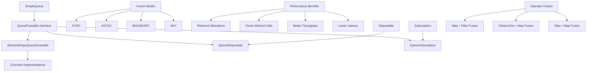
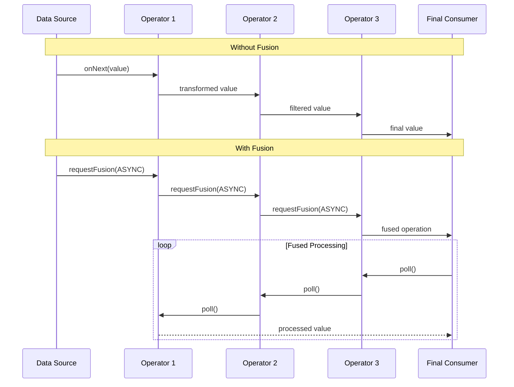
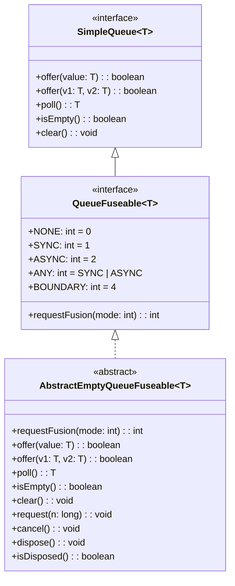

# Fuseable Operators Module

## Overview

The `fuseable_operators` module is a critical component of the RxJava3 reactive streams library that provides advanced performance optimization capabilities through operator fusion. This module enables the merging of multiple reactive operators into single, more efficient operations, reducing overhead and improving throughput in reactive data processing pipelines.

## Purpose

The primary purpose of this module is to:
- Enable operator fusion for performance optimization
- Provide queue-based fusion mechanisms for different reactive types
- Reduce memory allocation and method call overhead
- Support both synchronous and asynchronous fusion modes
- Maintain thread safety and proper resource management during fusion

## Architecture



## Core Components

### QueueFuseable Interface
The central interface that defines the contract for fuseable operations. It extends `SimpleQueue` and provides fusion mode constants and the `requestFusion()` method for establishing fusion between operators.

**Key Features:**
- Defines fusion mode constants (NONE, SYNC, ASYNC, ANY, BOUNDARY)
- Provides the `requestFusion(int mode)` method for requesting fusion
- Extends `SimpleQueue` for queue-based operations

### AbstractEmptyQueueFuseable
An abstract base class that implements both `QueueSubscription` and `QueueDisposable` interfaces for empty, async-only fuseable instances. This class provides default implementations for methods that should not be called in certain fusion contexts.

**Key Characteristics:**
- Always returns empty (null) from `poll()`
- Always returns true from `isEmpty()`
- Throws `UnsupportedOperationException` for `offer()` methods
- Supports only ASYNC fusion mode
- Provides no-op implementations for resource management methods

## Fusion Modes

The module supports several fusion modes, each optimized for different scenarios:

### SYNC (Synchronous Fusion)
- All upstream values are available or generated synchronously
- `poll()` returning null indicates stream termination
- No onXXX method calls from upstream
- Must be called from within a serializing drain-loop

### ASYNC (Asynchronous Fusion)
- Values become available to `poll()` eventually
- Upstream signals onError() and onComplete() normally
- onNext may contain null values as indicators
- Must be called from within a serializing drain-loop

### BOUNDARY
- Indicates `poll()` will be called behind an asynchronous boundary
- May change computation locations in fused operator chains
- Used to prevent unexpected thread shifts in fused operations

### ANY
- Requests either SYNC or ASYNC mode
- Allows upstream to choose the most appropriate mode

## Integration with Other Modules

The fuseable_operators module integrates closely with several other RxJava3 modules:

- **[core_reactive_types.md](core_reactive_types.md)**: Provides fusion capabilities for Observable, Flowable, Single, Maybe, and Completable types
- **[base_observers_subscribers.md](base_observers_subscribers.md)**: Works with fuseable observers and subscribers for optimized data processing
- **[base_subscriptions.md](base_subscriptions.md)**: Integrates with queue-based subscriptions for resource management

## Performance Benefits

Operator fusion provides several performance advantages:

1. **Reduced Memory Allocations**: Eliminates intermediate objects between fused operators
2. **Fewer Method Calls**: Merges multiple operator steps into single operations
3. **Better Cache Locality**: Improves CPU cache utilization
4. **Lower Latency**: Reduces processing overhead in reactive chains
5. **Higher Throughput**: Enables more efficient data processing pipelines

## Usage Patterns

The fuseable operators are typically used internally by RxJava3 to optimize reactive chains. The fusion process is transparent to end users but provides significant performance benefits in high-throughput scenarios.

### Fusion Data Flow



## Implementation Details

### QueueFuseable Interface Contract

The `QueueFuseable` interface serves as the foundation for all fuseable operations. It extends `SimpleQueue` and adds fusion-specific capabilities:



### AbstractEmptyQueueFuseable Behavior

This abstract class provides a complete implementation for empty, async-only fuseable instances:

- **Fusion Mode**: Only accepts ASYNC mode, returns ASYNC when requested
- **Queue Operations**: All offer operations throw `UnsupportedOperationException`
- **Polling**: Always returns null, indicating empty queue
- **Resource Management**: Provides no-op implementations for disposal and cancellation
- **Subscription**: Ignores request calls since no items are available

## Best Practices

### For Library Developers

1. **Fusion Request Timing**: Call `requestFusion()` before `onSubscribe()` returns
2. **Mode Validation**: Always validate the requested fusion mode before accepting
3. **Exception Handling**: Be prepared to catch exceptions from `poll()` calls
4. **Serial Execution**: Ensure `poll()` is called from within a serializing drain-loop
5. **Resource Cleanup**: Properly implement disposal and cancellation mechanisms

### For Performance Optimization

1. **Choose Appropriate Mode**: Select SYNC for synchronous sources, ASYNC for asynchronous
2. **Boundary Considerations**: Use BOUNDARY flag when crossing asynchronous boundaries
3. **Operator Selection**: Fuse compatible operators (map, filter, take) for best results
4. **Monitoring**: Profile fusion effectiveness in production environments

## Common Fusion Patterns

### Synchronous Fusion
Ideal for operators that process data synchronously:
```
source.map(x -> x * 2).filter(x -> x > 10)
```

### Asynchronous Fusion
Used with asynchronous operators like `observeOn`:
```
source.map(x -> process(x)).observeOn(scheduler)
```

### Conditional Fusion
Some operators may conditionally support fusion based on their internal state or the nature of their transformation.

All fuseable operations are designed to be thread-safe when used within the proper reactive streams protocols. The fusion mechanism maintains the serial execution guarantees required by the reactive streams specification.

## Error Handling

The module provides robust error handling during fusion:
- **Exception Propagation**: Exceptions during `poll()` are properly caught and propagated through the reactive chain
- **Resource Cleanup**: Fusion maintains proper resource cleanup even in error conditions
- **Safe Cancellation**: Fusion can be safely cancelled or disposed at any point
- **Error Mode Handling**: Different fusion modes handle errors appropriately based on their synchronous or asynchronous nature

### Error Scenarios

1. **Poll Exceptions**: When fused functions throw exceptions during `poll()`
2. **Fusion Rejection**: When upstream operators reject fusion requests
3. **Resource Leaks**: Prevented through proper disposal mechanisms
4. **Boundary Errors**: Special handling for errors across asynchronous boundaries

## Future Considerations

The fuseable operators module continues to evolve with:

### Enhanced Fusion Algorithms
- Improved detection of fusion opportunities
- Better optimization for complex operator chains
- Platform-specific optimizations for different JVM implementations

### Extended Support
- Support for new reactive types and operators
- Enhanced debugging and monitoring capabilities
- Better tooling for fusion analysis and profiling

### Performance Improvements
- Reduced overhead in fusion establishment
- Better memory locality optimizations
- Enhanced support for parallel stream processing

### Developer Experience
- Improved documentation and examples
- Better error messages for fusion failures
- Enhanced debugging support for fused operations

## Conclusion

The fuseable_operators module represents a sophisticated optimization layer within RxJava3 that significantly enhances performance through operator fusion. By understanding its architecture, fusion modes, and best practices, developers can leverage these optimizations to build more efficient reactive applications while maintaining the robustness and safety guarantees of the reactive streams specification.