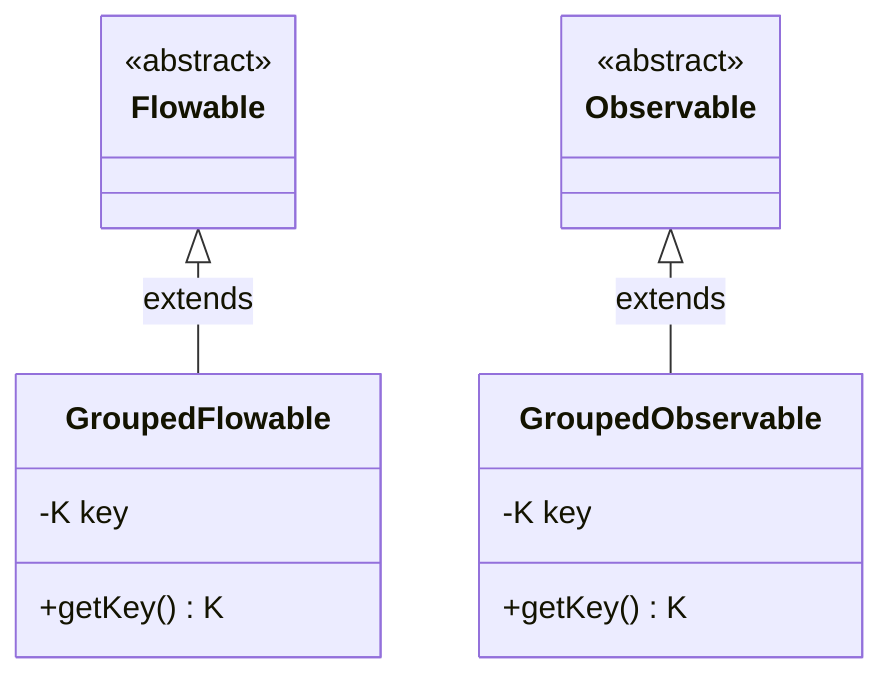
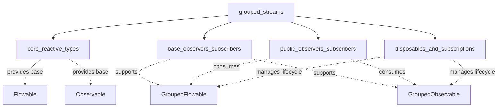

# Grouped Streams Module Documentation

## Overview

The `grouped_streams` module provides specialized stream types for grouping operations in RxJava3. It contains two core components that extend the base reactive types to support key-based grouping functionality: `GroupedFlowable` and `GroupedObservable`. These classes enable the organization of data streams into logical groups based on a key, which is essential for many data processing and analysis operations.

## Architecture

The module follows a simple but effective architecture where grouped streams extend their respective base reactive types while adding key-based identification:



## Core Components

### GroupedFlowable<K, T>
- **Location**: `src.main.java.io.reactivex.rxjava3.flowables.GroupedFlowable.GroupedFlowable`
- **Purpose**: A Flowable that has been grouped by key, extending the backpressure-aware Flowable type
- **Key Features**:
  - Maintains a key of type `K` that identifies the group
  - Caches items until subscribed to (important memory consideration)
  - Supports all standard Flowable operations
  - Used primarily with the `groupBy` operator on Flowable streams

### GroupedObservable<K, T>
- **Location**: `src.main.java.io.reactivex.rxjava3.observables.GroupedObservable.GroupedObservable`
- **Purpose**: An Observable that has been grouped by key, extending the Observable type
- **Key Features**:
  - Maintains a key of type `K` that identifies the group
  - Caches items until subscribed to (important memory consideration)
  - Supports all standard Observable operations
  - Used primarily with the `groupBy` operator on Observable streams

## Module Relationships

The grouped_streams module integrates with several other modules in the RxJava3 ecosystem:



## Usage Patterns

### GroupedFlowable Usage
GroupedFlowables are typically created using the `groupBy` operator on a Flowable:

```java
Flowable<Item> source = getItemStream();
source.groupBy(item -> item.getCategory())
    .flatMap(groupedFlowable -> 
        groupedFlowable
            .map(item -> processItem(item))
            .take(10) // Important: avoid memory leaks
    )
    .subscribe(result -> System.out.println(result));
```

### GroupedObservable Usage
GroupedObservables are typically created using the `groupBy` operator on an Observable:

```java
Observable<Event> source = getEventStream();
source.groupBy(event -> event.getType())
    .flatMap(groupedObservable -> 
        groupedObservable
            .map(event -> processEvent(event))
            .take(5) // Important: avoid memory leaks
    )
    .subscribe(result -> System.out.println(result));
```

## Memory Management Considerations

Both GroupedFlowable and GroupedObservable cache items until they are subscribed to. This behavior can lead to memory leaks if groups are created but never consumed. To prevent this:

1. **Always consume or explicitly discard unwanted groups** using operators like `take(0)`
2. **Use filtering operators** to limit the number of groups created
3. **Apply time-based operators** like `timeout` or `take` to prevent indefinite caching
4. **Monitor memory usage** in applications with high group creation rates

## Integration with Other Modules

### Core Reactive Types
The grouped streams extend the fundamental reactive types provided by the [core_reactive_types](core_reactive_types.md) module, inheriting all their capabilities while adding grouping functionality.

### Observer Pattern
Grouped streams work seamlessly with observers from both [base_observers_subscribers](base_observers_subscribers.md) and [public_observers_subscribers](public_observers_subscribers.md) modules, allowing for flexible subscription patterns.

### Disposal Management
Integration with the [disposables_and_subscriptions](disposables_and_subscriptions.md) module ensures proper cleanup and lifecycle management of grouped streams.

## Best Practices

1. **Key Selection**: Choose grouping keys that provide meaningful logical separation of data
2. **Group Consumption**: Always have a strategy for consuming all groups to prevent memory leaks
3. **Backpressure**: When using GroupedFlowable, consider backpressure strategies for high-volume streams
4. **Error Handling**: Implement proper error handling at both the group and item levels
5. **Resource Management**: Use resource-aware observers when dealing with grouped streams that manage external resources

## Common Use Cases

- **Data Categorization**: Grouping log entries by severity level
- **User Segmentation**: Grouping user events by user ID or demographic
- **Time-based Grouping**: Grouping events by time windows
- **Content Classification**: Grouping content items by category or tag
- **Geographic Grouping**: Grouping location-based data by region or zone

## Performance Considerations

- Group creation has overhead; avoid creating excessive numbers of groups
- Consider using `groupBy` with a maximum group limit to prevent unbounded growth
- Use `publish()` or `share()` operators to multicast grouped streams when multiple subscribers are expected
- Profile memory usage when dealing with high-frequency grouping operations