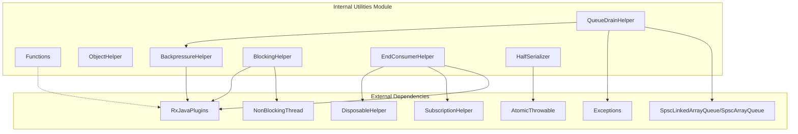
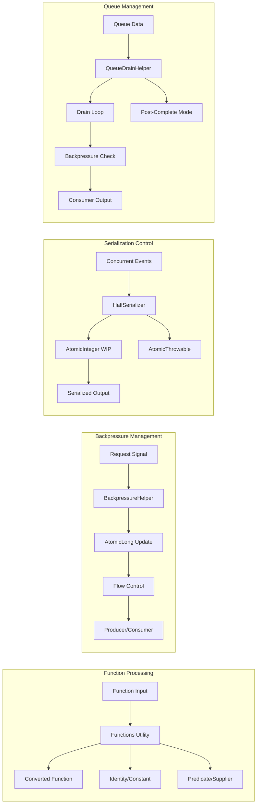
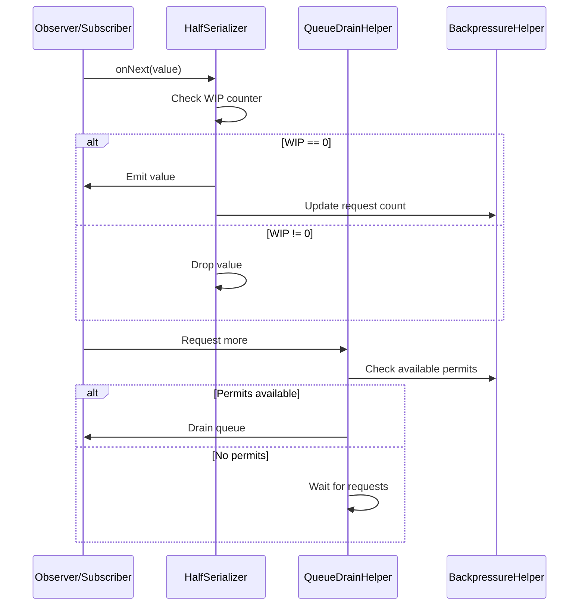
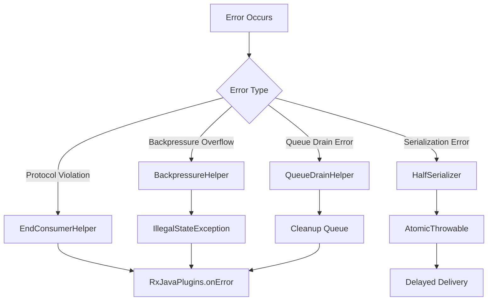

# Internal Utilities Module Documentation

## Introduction

The `internal_utilities` module provides essential utility functions and helper classes that form the backbone of RxJava's internal operations. This module contains low-level utilities for function manipulation, object validation, backpressure management, blocking operations, serialization, and queue draining. These utilities are used throughout the RxJava library to ensure consistent behavior, thread safety, and proper resource management across all reactive streams operations.

## Module Architecture

The internal_utilities module is organized into several key utility categories:

### Core Utility Classes

```mermaid
classDiagram
    class Functions {
        +toFunction(BiFunction) Function
        +identity() Function
        +emptyConsumer() Consumer
        +alwaysTrue() Predicate
        +alwaysFalse() Predicate
        +nullSupplier() Supplier
        +futureAction(Future) Action
        +justCallable(T) Callable
        +castFunction(Class) Function
    }
    
    class ObjectHelper {
        +equalsPredicate() BiPredicate
        +verifyPositive(int, String) int
        +verifyPositive(long, String) long
    }
    
    class BackpressureHelper {
        +addCap(long, long) long
        +multiplyCap(long, long) long
        +add(AtomicLong, long) long
        +produced(AtomicLong, long) long
        +addCancel(AtomicLong, long) long
        +producedCancel(AtomicLong, long) long
    }
    
    class BlockingHelper {
        +awaitForComplete(CountDownLatch, Disposable)
        +verifyNonBlocking()
    }
    
    class EndConsumerHelper {
        +validate(Disposable, Disposable, Class) boolean
        +setOnce(AtomicReference, Disposable, Class) boolean
        +validate(Subscription, Subscription, Class) boolean
        +setOnce(AtomicReference, Subscription, Class) boolean
        +reportDoubleSubscription(Class)
    }
    
    class HalfSerializer {
        +onNext(Subscriber, T, AtomicInteger, AtomicThrowable) boolean
        +onError(Subscriber, Throwable, AtomicInteger, AtomicThrowable)
        +onComplete(Subscriber, AtomicInteger, AtomicThrowable)
        +onNext(Observer, T, AtomicInteger, AtomicThrowable)
        +onError(Observer, Throwable, AtomicInteger, AtomicThrowable)
        +onComplete(Observer, AtomicInteger, AtomicThrowable)
    }
    
    class QueueDrainHelper {
        +drainMaxLoop(SimplePlainQueue, Subscriber, boolean, Disposable, QueueDrain)
        +drainLoop(SimplePlainQueue, Observer, boolean, Disposable, ObservableQueueDrain)
        +createQueue(int) SimpleQueue
        +request(Subscription, int)
        +postCompleteRequest(long, Subscriber, Queue, AtomicLong, BooleanSupplier) boolean
        +postComplete(Subscriber, Queue, AtomicLong, BooleanSupplier)
    }
    
    Functions --> ObjectHelper : uses
    BackpressureHelper --> RxJavaPlugins : reports errors
    BlockingHelper --> RxJavaPlugins : verifies settings
    BlockingHelper --> NonBlockingThread : checks thread type
    EndConsumerHelper --> DisposableHelper : uses constants
    EndConsumerHelper --> SubscriptionHelper : uses constants
    EndConsumerHelper --> RxJavaPlugins : reports violations
    HalfSerializer --> AtomicThrowable : manages errors
    QueueDrainHelper --> BackpressureHelper : uses cap operations
    QueueDrainHelper --> Exceptions : handles fatal errors
```



## Component Dependencies



## Data Flow Architecture



## Detailed Component Analysis

### Functions Class

The `Functions` class provides a comprehensive set of utility methods for creating and transforming functional interfaces used throughout RxJava. It serves as a factory for common function patterns and adapters.

**Key Responsibilities:**
- Convert multi-parameter functions to single-parameter functions
- Provide identity functions and constant suppliers
- Create empty consumers and predicates
- Handle type casting and object comparison
- Support notification wrapping and timestamp operations

**Thread Safety:** All provided functions are immutable and thread-safe.

### ObjectHelper Class

The `ObjectHelper` class provides utility methods for object validation and comparison, serving as a backport of Java 7's `Objects` utility class functionality.

**Key Responsibilities:**
- Validate positive integer and long values
- Provide equals predicate using `Objects.equals()`
- Ensure parameter validation with descriptive error messages

### BackpressureHelper Class

The `BackpressureHelper` class manages backpressure operations in reactive streams, handling request aggregation and flow control mechanisms.

**Key Responsibilities:**
- Atomic addition and multiplication with overflow protection
- Request management using `AtomicLong` fields
- Production counting and cancellation support
- Overflow detection and error reporting

**Critical Operations:**
- `addCap()`: Adds two longs with overflow protection
- `produced()`: Atomically decrements requested count
- `addCancel()`: Handles cancellation state during requests

### BlockingHelper Class

The `BlockingHelper` class provides utilities for managing blocking operations within the reactive streams context, ensuring proper thread handling and cancellation support.

**Key Responsibilities:**
- Await completion with proper interruption handling
- Verify non-blocking thread constraints
- Manage subscription disposal on interruption
- Integrate with plugin system for blocking detection

### EndConsumerHelper Class

The `EndConsumerHelper` class ensures proper subscription management and prevents multiple subscription attempts to the same consumer, providing clear error messages for protocol violations.

**Key Responsibilities:**
- Validate single subscription attempts
- Provide atomic subscription setting
- Generate personalized error messages
- Handle both Disposable and Subscription types
- Report protocol violations through plugin system

### HalfSerializer Class

The `HalfSerializer` class implements a specialized serialization pattern where `onNext` is guaranteed to be called from a single thread, while `onError` or `onComplete` may be called from any thread.

**Key Responsibilities:**
- Serialize emissions with work-in-progress counters
- Handle concurrent error and completion signals
- Integrate with error containers for delayed error delivery
- Support both Observer and Subscriber interfaces

### QueueDrainHelper Class

The `QueueDrainHelper` class provides sophisticated queue draining mechanisms with backpressure support and post-completion handling for reactive streams.

**Key Responsibilities:**
- Implement queue draining with request coordination
- Handle post-completion backpressure scenarios
- Create appropriate queue types based on capacity hints
- Manage cancellation and error states during draining
- Support both Observable and Flowable patterns

**Advanced Features:**
- Post-completion request handling
- Atomic state management for completion flags
- Integration with queue implementations
- Error propagation with queue cleanup

## Integration with Other Modules

### Core Reactive Types Integration

The internal utilities support the core reactive types through:
- Function transformations for operators
- Backpressure management for Flowable
- Serialization for concurrent emissions
- Queue management for buffering

### Observer/Subscriber Integration



### Scheduler Integration

The utilities integrate with the scheduler system through:
- Blocking operation detection
- Thread type verification
- Non-blocking thread constraints
- Interruption handling

## Error Handling and Safety

### Error Propagation



### Safety Mechanisms

1. **Atomic Operations**: All state changes use atomic operations
2. **Overflow Protection**: Mathematical operations include overflow checks
3. **Cancellation Support**: Proper cleanup on cancellation
4. **Thread Safety**: Immutable utilities and atomic state management
5. **Error Aggregation**: Centralized error collection and reporting

## Performance Considerations

### Memory Efficiency
- Singleton instances for common functions
- Object pooling for frequent operations
- Minimal object allocation in hot paths

### Concurrency Optimization
- Lock-free algorithms where possible
- Work-in-progress counters for serialization
- Atomic field updaters for performance

### Queue Management
- SPSC queue implementations for single-producer/single-consumer scenarios
- Adaptive queue sizing based on capacity hints
- Post-completion optimization for completed sources

## Usage Patterns

### Function Composition
```java
// Convert multi-parameter function to array-based function
Function<Object[], R> arrayFunc = Functions.toFunction(biFunction);

// Create identity function
Function<T, T> identity = Functions.identity();

// Create constant supplier
Supplier<T> constant = Functions.justSupplier(value);
```

### Backpressure Management
```java
// Atomic request addition
long previous = BackpressureHelper.add(requested, n);

// Production counting
long remaining = BackpressureHelper.produced(requested, produced);
```

### Serialization Pattern
```java
// Half-serialization for concurrent emissions
if (HalfSerializer.onNext(subscriber, value, wip, errors)) {
    // Successfully emitted
}
```

### Queue Draining
```java
// Post-completion queue draining
QueueDrainHelper.postComplete(subscriber, queue, state, isCancelled);
```

## Testing and Validation

The internal utilities are extensively tested through:
- Unit tests for individual utility methods
- Integration tests with reactive streams
- Concurrency stress tests
- Performance benchmarks
- Memory leak detection

## References

- [Core Reactive Types](core_reactive_types.md) - For function transformations and type conversions
- [Base Observers/Subscribers](base_observers_subscribers.md) - For serialization and queue management integration
- [Schedulers](schedulers.md) - For blocking operation and thread management
- [Plugins System](plugins_system.md) - For error reporting and configuration
- [Disposables and Subscriptions](disposables_and_subscriptions.md) - For resource management integration

## Summary

The internal_utilities module provides the foundational infrastructure that enables RxJava's reactive programming model. Through careful design of utility classes, thread-safe operations, and sophisticated queue management, this module ensures reliable and efficient operation of the entire RxJava library. The utilities are designed to be performant, thread-safe, and integrate seamlessly with the broader RxJava ecosystem while maintaining clear separation of concerns and robust error handling.