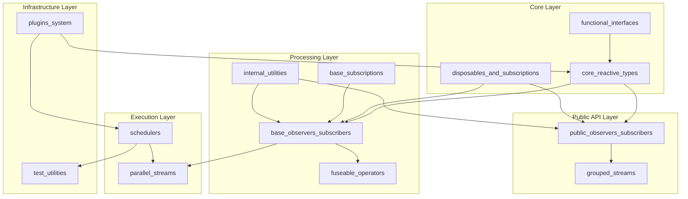
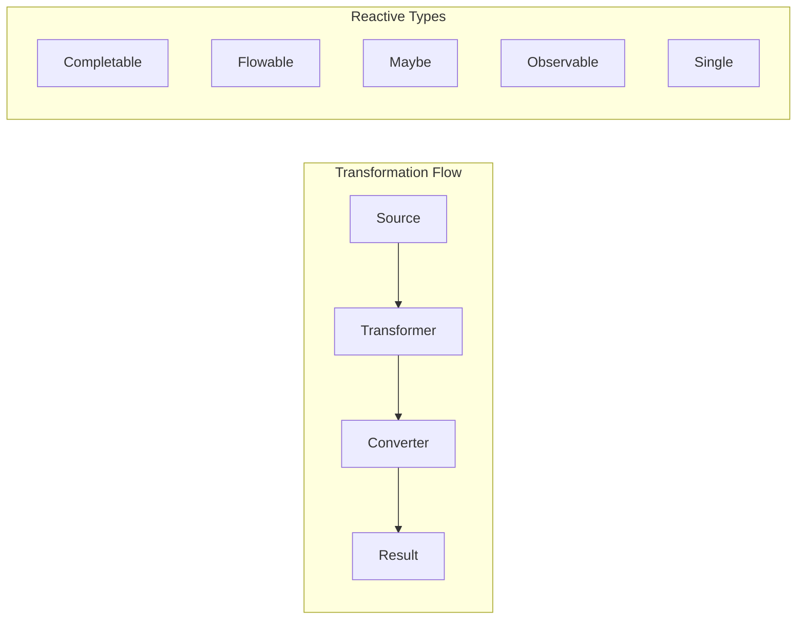
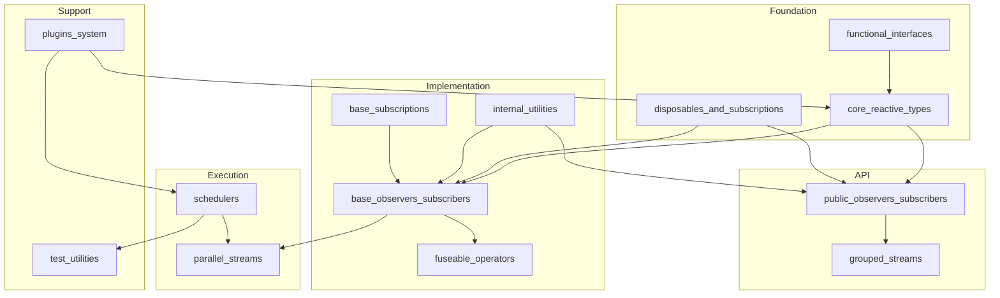

# ReactiveX--RxJava Repository Overview

## Purpose

The ReactiveX--RxJava repository is the official implementation of Reactive Extensions (ReactiveX) for Java, providing a comprehensive reactive programming library that enables asynchronous, event-driven programming through observable streams. RxJava3 implements the Reactive Streams specification and offers a rich set of operators for composing, transforming, and consuming asynchronous data streams.

## Architecture

The repository follows a modular architecture organized around core reactive concepts:

## Core Modules

### 1. Core Reactive Types (`core_reactive_types`)
**Purpose**: Defines fundamental reactive programming constructs and transformation interfaces

**Key Components**:
- **Reactive Types**: Observable, Flowable, Single, Maybe, Completable
- **Transformers**: Interfaces for converting between reactive types (e.g., `ObservableTransformer`, `FlowableTransformer`)
- **Converters**: Interfaces for extracting values from reactive streams (e.g., `ObservableConverter`, `FlowableConverter`)
- **Emitter**: Foundation for creating custom reactive sources

**Architecture**:

### 2. Disposables and Subscriptions (`disposables_and_subscriptions`)
**Purpose**: Provides resource management and lifecycle control mechanisms

**Key Components**:
- **ReferenceDisposable**: Template-based resource management with atomic operations
- **SerialDisposable**: Atomic replacement and management of disposable resources

### 3. Base Observers and Subscribers (`base_observers_subscribers`)
**Purpose**: Foundational infrastructure for reactive stream processing

**Key Components**:
- **BasicFuseableObserver/Subscriber**: Fusion-capable base classes for performance optimization
- **BlockingBaseObserver/Subscriber**: Synchronous blocking operations support
- **DeferredScalarObserver/Subscriber**: Optimized for single-value streams
- **QueueDrainObserver/Subscriber**: Queue-based processing with atomic coordination

### 4. Schedulers (`schedulers`)
**Purpose**: Thread management and execution context control

**Key Components**:
- **Schedulers**: Static factory for pre-configured schedulers (computation, IO, single, newThread, trampoline)
- **SchedulerPoolFactory**: Thread pool creation and management

### 5. Internal Utilities (`internal_utilities`)
**Purpose**: Low-level utilities for consistent RxJava operations

**Key Components**:
- **Functions**: Functional interface utilities and transformations
- **ObjectHelper**: Object validation and comparison utilities
- **BackpressureHelper**: Flow control and request management
- **HalfSerializer**: Concurrent event serialization
- **QueueDrainHelper**: Queue processing with backpressure support

### 6. Public Observers and Subscribers (`public_observers_subscribers`)
**Purpose**: Public API for reactive stream consumption

**Key Components**:
- **DefaultObserver/Subscriber**: Basic synchronous cancellation
- **DisposableObserver/Subscriber**: Asynchronous cancellation support
- **ResourceObserver/Subscriber**: Resource management capabilities

### 7. Parallel Streams (`parallel_streams`)
**Purpose**: Parallel processing capabilities for reactive streams

**Key Components**:
- **ParallelTransformer**: Transforms parallel streams while maintaining parallel context
- **ParallelFlowableConverter**: Converts parallel streams to other types

### 8. Plugins System (`plugins_system`)
**Purpose**: Global plugin mechanism for customizing RxJava behavior

**Key Components**:
- **RxJavaPlugins**: Central registry for hooks and customizations
- Error handling, scheduler hooks, assembly hooks, subscription hooks

### 9. Test Utilities (`test_utilities`)
**Purpose**: Testing infrastructure for reactive streams

**Key Components**:
- **BaseTestConsumer**: Event collection and assertion framework
- **TestScheduler**: Virtual time scheduling for deterministic testing

## Key Features

### Performance Optimization
- **Operator Fusion**: Merges multiple operators into single operations via `fuseable_operators`
- **Queue-based Processing**: Efficient data processing through queue drain patterns
- **Parallel Execution**: Multi-core processor utilization through `parallel_streams`

### Thread Safety
- **Atomic Operations**: Lock-free algorithms throughout the codebase
- **Thread-safe State Management**: Volatile fields and atomic references
- **Proper Resource Cleanup**: Systematic disposal patterns prevent leaks

### Extensibility
- **Plugin Architecture**: Global customization points via `plugins_system`
- **Transformer Pattern**: Functional composition of reactive operations
- **Custom Scheduler Support**: Integration with external executors

### Testing Support
- **Virtual Time**: Deterministic testing of time-based operations
- **Test Consumers**: Comprehensive assertion framework
- **Mock Infrastructure**: Test-friendly implementations

## Module Relationships

## References to Core Modules

For detailed documentation on specific modules, refer to:

- [core_reactive_types.md](core_reactive_types.md) - Fundamental reactive types and transformation interfaces
- [disposables_and_subscriptions.md](disposables_and_subscriptions.md) - Resource management and lifecycle control
- [base_observers_subscribers.md](base_observers_subscribers.md) - Base observer and subscriber implementations
- [base_subscriptions.md](base_subscriptions.md) - Subscription foundation classes
- [internal_utilities.md](internal_utilities.md) - Utility functions and helper classes
- [schedulers.md](schedulers.md) - Thread management and execution scheduling
- [parallel_streams.md](parallel_streams.md) - Parallel processing capabilities
- [public_observers_subscribers.md](public_observers_subscribers.md) - Public API for stream consumption
- [grouped_streams.md](grouped_streams.md) - Grouped stream processing
- [plugins_system.md](plugins_system.md) - Global plugin and customization system
- [test_utilities.md](test_utilities.md) - Testing infrastructure and utilities
- [fuseable_operators.md](fuseable_operators.md) - Performance optimization through operator fusion
- [functional_interfaces.md](functional_interfaces.md) - Functional programming abstractions

This repository represents a comprehensive, production-ready implementation of reactive programming for Java, offering both high-level abstractions for ease of use and low-level control for performance optimization.