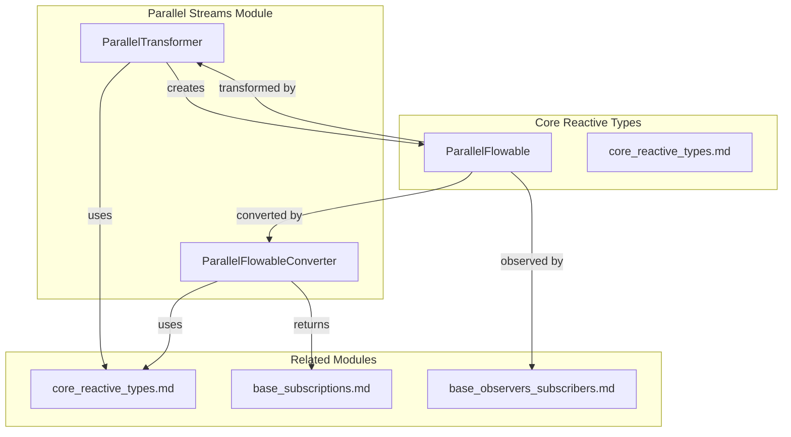
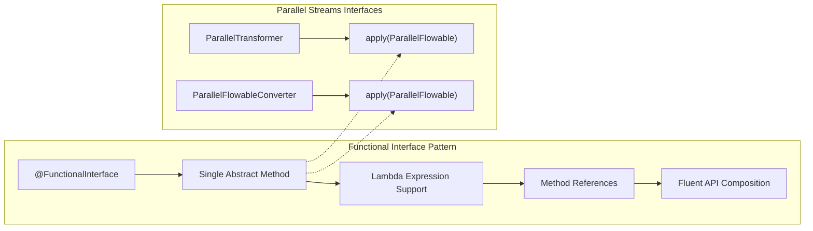
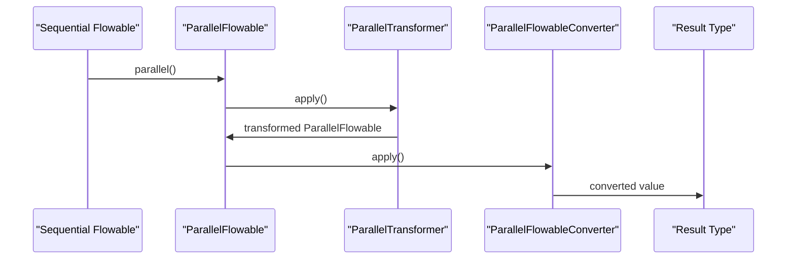

# Parallel Streams Module Documentation

## Overview

The `parallel_streams` module provides the foundation for parallel processing in RxJava3, enabling concurrent execution of reactive streams across multiple threads or processors. This module defines the core interfaces and contracts for transforming and converting parallel flowable streams, allowing developers to leverage parallel computation while maintaining the reactive programming paradigm.

## Purpose

The parallel_streams module serves as the bridge between sequential reactive streams and parallel execution, offering:

- **Parallel Transformation**: Interface for transforming parallel streams while maintaining parallel characteristics
- **Parallel Conversion**: Interface for converting parallel streams to other types or values
- **Type Safety**: Strong typing support for upstream and downstream data types
- **Functional Composition**: Support for functional programming patterns in parallel contexts

## Architecture



## Core Components

### ParallelTransformer<T, R>

The `ParallelTransformer` interface defines the contract for transforming parallel streams from one type to another while maintaining the parallel execution context. It serves as the parallel equivalent of the standard reactive transformers but specifically designed for parallel flowable streams.

**Key Characteristics:**
- Functional interface with a single `apply` method
- Maintains parallel execution characteristics during transformation
- Supports type conversion from upstream to downstream types
- Thread-safe by design for parallel execution environments
- Returns `ParallelFlowable<Downstream>` unlike standard transformers that return `Publisher` or `ObservableSource`

**Comparison with Standard Transformers:**
- **FlowableTransformer**: Transforms `Flowable<T>` to `Publisher<R>`
- **ObservableTransformer**: Transforms `Observable<T>` to `ObservableSource<R>`
- **ParallelTransformer**: Transforms `ParallelFlowable<T>` to `ParallelFlowable<R>` (maintains parallel context)

**Usage Pattern:**
```java
ParallelTransformer<Integer, String> transformer = 
    upstream -> upstream.map(Object::toString);
```

### ParallelFlowableConverter<T, R>

The `ParallelFlowableConverter` interface provides the mechanism for converting parallel flowable streams into other types or values. This interface is crucial for extracting results from parallel computations and integrating them back into the application.

**Key Characteristics:**
- Converts parallel streams to arbitrary output types
- Final step in parallel processing pipelines
- Enables fluent API integration with other RxJava operators
- Supports complex aggregation and reduction operations
- Similar to other converter interfaces but specifically for parallel streams

**Comparison with Other Converters:**
- **FlowableConverter**: Converts `Flowable<T>` to arbitrary type `R`
- **ObservableConverter**: Converts `Observable<T>` to arbitrary type `R`
- **SingleConverter**: Converts `Single<T>` to arbitrary type `R`
- **ParallelFlowableConverter**: Converts `ParallelFlowable<T>` to arbitrary type `R`

**Usage Pattern:**
```java
ParallelFlowableConverter<Integer, List<Integer>> converter = 
    upstream -> upstream.sequential().toList().blockingGet();
```

## Functional Interface Design

Both `ParallelTransformer` and `ParallelFlowableConverter` are designed as functional interfaces, aligning with RxJava's functional programming paradigm:



**Benefits of Functional Interface Design:**
- **Lambda Expression Support**: Enables concise inline transformations
- **Method References**: Allows reuse of existing methods as transformers/converters
- **Composition**: Facilitates building complex transformation pipelines
- **Testability**: Simple interfaces are easy to mock and test in isolation

**Example Lambda Usage:**
```java
// Lambda expression for transformation
ParallelTransformer<Integer, String> transformer = 
    parallel -> parallel.map(i -> "Value: " + i);

// Method reference for conversion
ParallelFlowableConverter<Integer, Integer> sumConverter = 
    ParallelStreamsExample::calculateSum;

private static Integer calculateSum(ParallelFlowable<Integer> parallel) {
    return parallel.reduce(0, Integer::sum).sequential().blockingFirst();
}
```

## Testing Strategies

Testing parallel streams requires special consideration due to their concurrent nature:

### Unit Testing ParallelTransformers

```java
@Test
public void testParallelTransformer() {
    ParallelTransformer<Integer, String> transformer = 
        upstream -> upstream.map(i -> "Value: " + i);
    
    List<String> result = Flowable.range(1, 100)
        .parallel(4)
        .compose(transformer)
        .sequential()
        .toList()
        .blockingGet();
    
    assertEquals(100, result.size());
    assertTrue(result.contains("Value: 50"));
}
```

### Unit Testing ParallelFlowableConverters

```java
@Test
public void testParallelFlowableConverter() {
    ParallelFlowableConverter<Integer, Integer> sumConverter = 
        upstream -> upstream.reduce(0, Integer::sum).sequential().blockingFirst();
    
    Integer result = Flowable.range(1, 10)
        .parallel(2)
        .to(sumConverter);
    
    assertEquals(Integer.valueOf(55), result); // 1+2+3+...+10 = 55
}
```

### Testing Thread Safety

```java
@Test
public void testThreadSafety() throws InterruptedException {
    AtomicInteger counter = new AtomicInteger(0);
    
    ParallelTransformer<Integer, Integer> transformer = 
        upstream -> upstream.map(i -> {
            counter.incrementAndGet();
            return i * 2;
        });
    
    Flowable.range(1, 1000)
        .parallel(10)
        .compose(transformer)
        .sequential()
        .blockingSubscribe();
    
    assertEquals(1000, counter.get());
}
```

## Common Use Cases

### Data Processing Pipeline

```java
public class DataProcessingPipeline {
    
    public static void processLargeDataset(Flowable<DataRecord> source) {
        ParallelTransformer<DataRecord, ProcessedRecord> processor = 
            upstream -> upstream
                .runOn(Schedulers.computation())
                .map(record -> validate(record))
                .filter(record -> record.isValid())
                .map(record -> enrich(record))
                .map(record -> transform(record));
        
        ParallelFlowableConverter<ProcessedRecord, SummaryReport> summarizer = 
            upstream -> upstream
                .collect(() -> new SummaryReport(), SummaryReport::add)
                .sequential()
                .blockingFirst();
        
        SummaryReport report = source
            .parallel(4)
            .compose(processor)
            .to(summarizer);
        
        report.generateOutput();
    }
    
    private static DataRecord validate(DataRecord record) {
        // Validation logic
        return record;
    }
    
    private static DataRecord enrich(DataRecord record) {
        // Enrichment logic
        return record;
    }
    
    private static ProcessedRecord transform(DataRecord record) {
        // Transformation logic
        return new ProcessedRecord(record);
    }
}
```

### Parallel Computation Aggregation

```java
public class ParallelComputation {
    
    public static double calculateParallelStatistics(Flowable<Double> data) {
        ParallelTransformer<Double, Double> normalizer = 
            upstream -> upstream.map(value -> (value - getMean()) / getStdDev());
        
        ParallelFlowableConverter<Double, Statistics> statsConverter = 
            upstream -> {
                double sum = upstream.reduce(0.0, Double::sum).sequential().blockingFirst();
                double sumSquares = upstream.map(x -> x * x).reduce(0.0, Double::sum).sequential().blockingFirst();
                long count = upstream.sequential().count().blockingGet();
                
                return new Statistics(sum, sumSquares, count);
            };
        
        return data
            .parallel(Runtime.getRuntime().availableProcessors())
            .compose(normalizer)
            .to(statsConverter)
            .getStandardDeviation();
    }
    
    private static double getMean() { return 0.0; }
    private static double getStdDev() { return 1.0; }
    
    static class Statistics {
        private final double sum;
        private final double sumSquares;
        private final long count;
        
        Statistics(double sum, double sumSquares, long count) {
            this.sum = sum;
            this.sumSquares = sumSquares;
            this.count = count;
        }
        
        double getStandardDeviation() {
            double mean = sum / count;
            double variance = (sumSquares / count) - (mean * mean);
            return Math.sqrt(variance);
        }
    }
}
```

## Performance Optimization

### Optimal Parallelism Level

Choosing the right level of parallelism is crucial for performance:

```java
public class ParallelOptimization {
    
    // CPU-bound operations: Use available processors
    public static <T, R> ParallelTransformer<T, R> cpuBoundTransformer() {
        int parallelism = Runtime.getRuntime().availableProcessors();
        return upstream -> upstream.runOn(Schedulers.computation());
    }
    
    // I/O-bound operations: Can use higher parallelism
    public static <T, R> ParallelTransformer<T, R> ioBoundTransformer() {
        int parallelism = Runtime.getRuntime().availableProcessors() * 2;
        return upstream -> upstream.runOn(Schedulers.io());
    }
    
    // Memory-bound operations: Use lower parallelism to avoid GC pressure
    public static <T, R> ParallelTransformer<T, R> memoryBoundTransformer() {
        int parallelism = Math.max(2, Runtime.getRuntime().availableProcessors() / 2);
        return upstream -> upstream.runOn(Schedulers.computation());
    }
}
```

### Memory Management

```java
public class MemoryEfficientProcessing {
    
    public static ParallelTransformer<LargeData, ProcessedData> efficientTransformer() {
        return upstream -> upstream
            .map(data -> {
                // Process and immediately release reference
                ProcessedData result = processData(data);
                data = null; // Help GC
                return result;
            })
            .filter(Objects::nonNull)
            .distinct(); // Remove duplicates to reduce memory
    }
    
    private static ProcessedData processData(LargeData data) {
        // Memory-efficient processing logic
        return new ProcessedData(data.getKeyData());
    }
}
```

## Troubleshooting Common Issues

### Issue: Poor Performance with Parallel Streams

**Symptoms**: Parallel processing is slower than sequential processing

**Possible Causes and Solutions**:
```java
// ❌ Wrong: Overhead exceeds benefit for small datasets
Flowable.range(1, 10)
    .parallel(4) // Too much overhead for small data
    .map(i -> i * 2)
    .sequential()
    .blockingSubscribe();

// ✅ Correct: Use parallel only for large datasets
Flowable.range(1, 1_000_000)
    .parallel(Runtime.getRuntime().availableProcessors())
    .map(i -> expensiveOperation(i))
    .sequential()
    .blockingSubscribe();
```

### Issue: Out of Memory Errors

**Symptoms**: `OutOfMemoryError` during parallel processing

**Solutions**:
```java
// ✅ Use bounded buffers and backpressure
public static ParallelTransformer<Data, Result> safeTransformer() {
    return upstream -> upstream
        .runOn(Schedulers.computation(), false, 128) // Bounded buffer
        .map(data -> processSafely(data))
        .filter(Objects::nonNull);
}

private static Result processSafely(Data data) {
    try {
        return processData(data);
    } catch (Exception e) {
        // Log and skip problematic data
        return null;
    }
}
```

### Issue: Race Conditions in Stateful Operations

**Symptoms**: Inconsistent results across multiple runs

**Solutions**:
```java
// ❌ Wrong: Shared mutable state
AtomicInteger sharedCounter = new AtomicInteger(0);

ParallelTransformer<Data, Result> problematicTransformer = 
    upstream -> upstream.map(data -> {
        int count = sharedCounter.incrementAndGet(); // Race condition
        return new Result(data, count);
    });

// ✅ Correct: Thread-local or stateless operations
ParallelTransformer<Data, Result> safeTransformer = 
    upstream -> upstream
        .map(data -> processData(data))
        .scan(new ResultAccumulator(), (acc, result) -> acc.add(result));
```

### Issue: Blocking Operations in Parallel Streams

**Symptoms**: Thread starvation or deadlocks

**Solutions**:
```java
// ❌ Wrong: Blocking I/O in computation scheduler
ParallelTransformer<Data, Result> blockingTransformer = 
    upstream -> upstream
        .runOn(Schedulers.computation()) // Wrong scheduler for I/O
        .map(data -> blockingIOOperation(data));

// ✅ Correct: Use appropriate scheduler
ParallelTransformer<Data, Result> nonBlockingTransformer = 
    upstream -> upstream
        .runOn(Schedulers.io()) // Correct scheduler for I/O
        .map(data -> blockingIOOperation(data));
```

## Monitoring and Debugging

### Performance Metrics

```java
public class ParallelStreamMetrics {
    
    public static <T, R> ParallelTransformer<T, R> withMetrics(String operationName) {
        return upstream -> {
            long startTime = System.nanoTime();
            AtomicLong processedCount = new AtomicLong(0);
            
            return upstream
                .doOnNext(item -> processedCount.incrementAndGet())
                .doOnComplete(() -> {
                    long duration = System.nanoTime() - startTime;
                    double throughput = processedCount.get() / (duration / 1_000_000_000.0);
                    
                    System.out.printf("Operation %s: Processed %d items in %.2f seconds (%.2f items/sec)%n",
                        operationName, processedCount.get(), duration / 1_000_000_000.0, throughput);
                })
                .map(item -> processItem(item));
        };
    }
    
    private static <T, R> R processItem(T item) {
        // Actual processing logic
        return (R) item;
    }
}
```

### Debugging Parallel Execution

```java
public class ParallelDebugger {
    
    public static <T> ParallelTransformer<T, T> withThreadTracking() {
        return upstream -> upstream
            .doOnNext(item -> 
                System.out.printf("Processing item %s on thread %s%n", 
                    item, Thread.currentThread().getName()))
            .doOnError(error -> 
                System.err.printf("Error on thread %s: %s%n", 
                    Thread.currentThread().getName(), error.getMessage()));
    }
    
    public static <T, R> ParallelFlowableConverter<T, R> withResultLogging() {
        return upstream -> {
            R result = upstream
                .sequential()
                .reduce(/* aggregation logic */)
                .blockingGet();
            
            System.out.printf("Final result: %s%n", result);
            return result;
        };
    }
}
```

## Integration with RxJava Ecosystem

### Relationship with Core Reactive Types
- Extends the reactive programming model to parallel execution
- Maintains compatibility with standard reactive operators
- Leverages existing scheduler infrastructure for thread management

### Connection to Schedulers
- Utilizes the [schedulers.md](schedulers.md) module for thread pool management
- Supports custom scheduler configuration for parallel execution
- Integrates with the SchedulerPoolFactory for resource management

### Observer Pattern Integration
- Works with [base_observers_subscribers.md](base_observers_subscribers.md) for parallel stream observation
- Supports both internal and public observer implementations
- Maintains backpressure handling through queue-based observers

## Data Flow Architecture



## Best Practices

### When to Use Parallel Streams
- CPU-intensive operations that can be parallelized
- Large datasets requiring concurrent processing
- Independent computations that don't require sequential ordering
- Scenarios where the overhead of parallelization is justified by performance gains

### Performance Considerations
- Parallel streams are most effective with computationally intensive operations
- I/O-bound operations may not benefit significantly from parallelization
- Consider the number of available CPU cores when configuring parallelism
- Monitor memory usage as parallel streams may increase memory footprint

### Error Handling
- Parallel streams propagate errors through the reactive error handling mechanism
- Use appropriate error handling operators in the parallel pipeline
- Consider the impact of errors on partial results in parallel computations

## Thread Safety

All components in the parallel_streams module are designed with thread safety in mind:

- **ParallelTransformer**: Thread-safe by contract, implementations must ensure safe concurrent execution
- **ParallelFlowableConverter**: Thread-safe for parallel stream access, implementations should handle concurrent data access appropriately
- **Integration Points**: All integration with other RxJava components maintains thread safety guarantees

## Summary

The `parallel_streams` module provides the essential building blocks for parallel reactive programming in RxJava3. Through its two core interfaces, `ParallelTransformer` and `ParallelFlowableConverter`, it enables:

- **Seamless Parallel Processing**: Transform and convert parallel streams while maintaining reactive principles
- **Type Safety**: Strong typing throughout the parallel processing pipeline
- **Functional Composition**: Lambda-friendly interfaces that support complex transformation logic
- **Performance Optimization**: Tools and strategies for maximizing parallel processing efficiency
- **Integration**: Smooth interoperability with the broader RxJava ecosystem

### Key Takeaways

1. **Use ParallelTransformer for stream transformations** that maintain parallel characteristics
2. **Use ParallelFlowableConverter for final conversions** from parallel streams to other types
3. **Choose appropriate parallelism levels** based on operation type (CPU-bound, I/O-bound, memory-bound)
4. **Test thoroughly** with consideration for concurrent execution and thread safety
5. **Monitor performance** to ensure parallelization provides actual benefits
6. **Handle errors appropriately** as they propagate through the parallel pipeline

### When to Use Parallel Streams

✅ **Appropriate Use Cases:**
- Large datasets requiring CPU-intensive processing
- Independent computations that can be parallelized
- Batch processing operations
- Mathematical computations on large datasets
- Data transformation pipelines

❌ **Avoid When:**
- Small datasets where overhead exceeds benefit
- Operations with shared mutable state
- Sequential ordering is critical
- Simple, fast operations
- Limited CPU resources available

### Next Steps

To effectively use the parallel_streams module:

1. **Start with profiling**: Measure sequential performance before parallelizing
2. **Begin with simple transformations**: Use basic `map` and `filter` operations first
3. **Gradually increase complexity**: Add more sophisticated transformation logic
4. **Monitor and tune**: Continuously measure performance and adjust parallelism
5. **Handle edge cases**: Implement proper error handling and recovery mechanisms

The parallel_streams module represents a powerful tool in the RxJava toolkit, enabling developers to leverage multi-core processors while maintaining the benefits of reactive programming. When used appropriately, it can significantly improve application performance and responsiveness for data-intensive operations.

## Related Documentation

- [Core Reactive Types](core_reactive_types.md) - Foundation reactive types and operators
- [Schedulers](schedulers.md) - Thread management and execution context
- [Base Observers and Subscribers](base_observers_subscribers.md) - Observer pattern implementations
- [Grouped Streams](grouped_streams.md) - Grouped stream processing patterns
- [Public Observers and Subscribers](public_observers_subscribers.md) - Public API for stream observation
- [Internal Utilities](internal_utilities.md) - Utility functions and helpers
- [Disposables and Subscriptions](disposables_and_subscriptions.md) - Resource management
- [Fuseable Operators](fuseable_operators.md) - Performance optimization through fusion
- [Test Utilities](test_utilities.md) - Testing support for reactive streams

## Migration Guide

When migrating from sequential to parallel streams:

1. **Identify Parallelizable Operations**: Look for map, filter, and other operations that can be executed independently
2. **Choose Appropriate Parallelism**: Select the right level of parallelism based on available resources
3. **Handle Ordering**: Consider if result ordering is important for your use case
4. **Test Thoroughly**: Parallel execution can introduce race conditions and timing issues
5. **Monitor Performance**: Measure the actual performance improvement to ensure parallelization is beneficial

## Future Enhancements

The parallel_streams module is designed to be extensible, with potential future enhancements including:

- Advanced partitioning strategies for better load balancing
- Integration with reactive stream specifications for interoperability
- Enhanced error recovery mechanisms for partial failures
- Support for distributed parallel processing across multiple JVMs