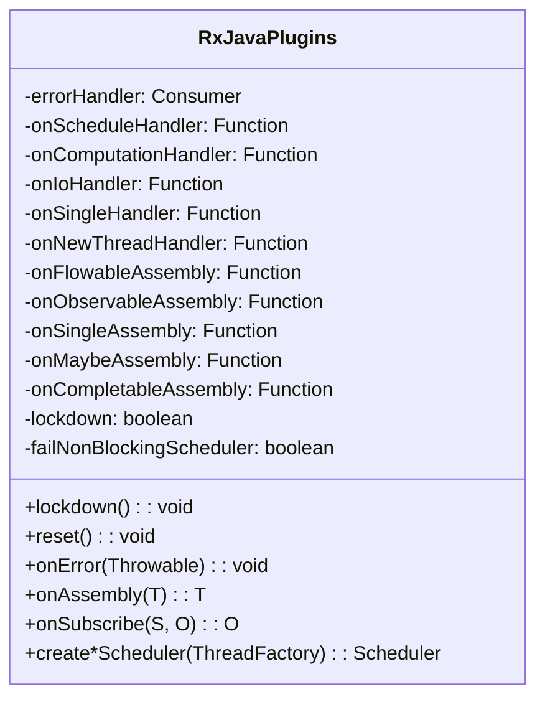
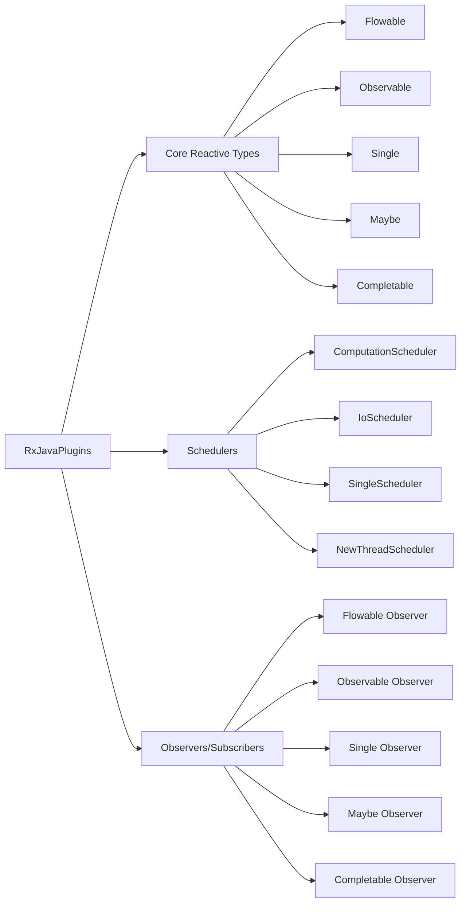
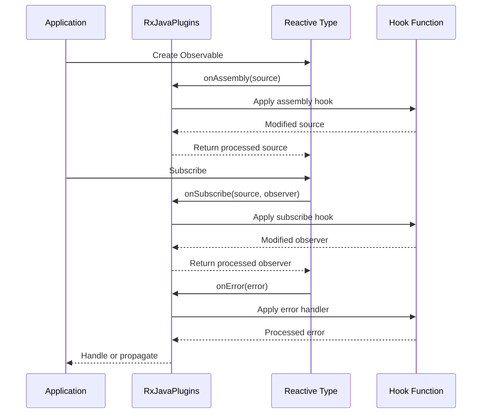
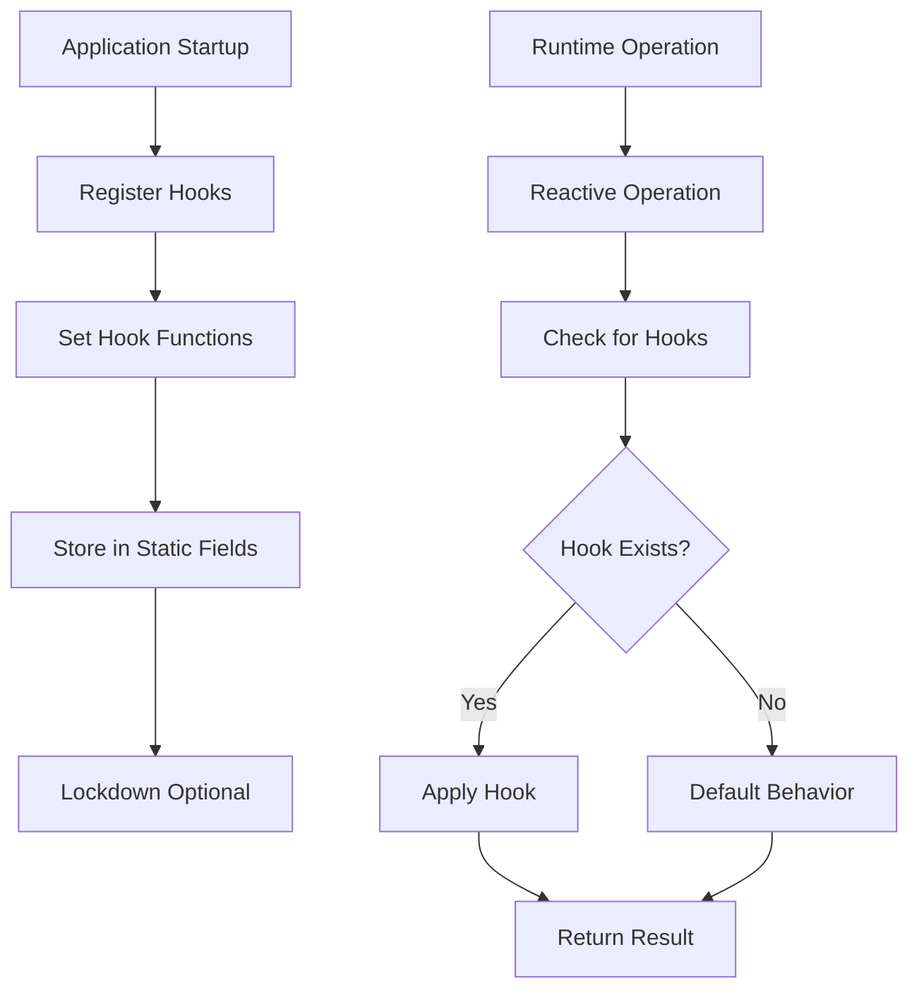
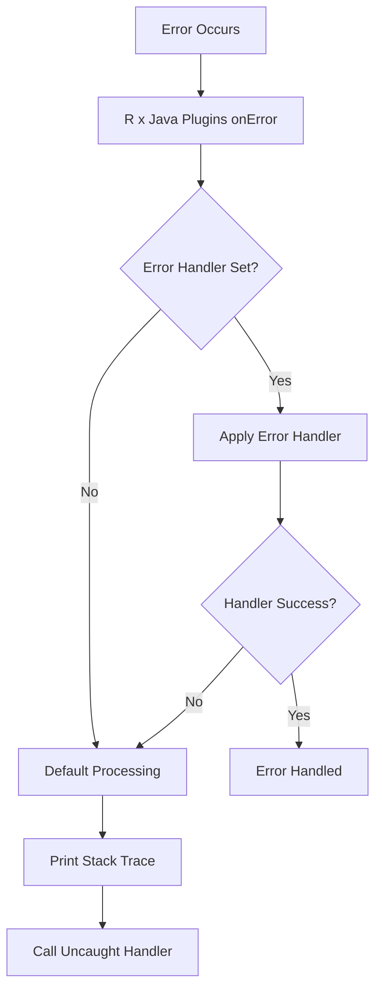

# Plugins System Module Documentation

## Introduction

The plugins_system module provides RxJava's global plugin mechanism, allowing developers to intercept, modify, and customize the behavior of reactive streams throughout the entire RxJava ecosystem. This module serves as the central configuration point for cross-cutting concerns such as error handling, scheduling, assembly hooks, and subscription management.

The RxJavaPlugins class acts as a global registry and invocation point for various hook functions that can transform or monitor reactive operations at key interception points.

## Architecture Overview

### Core Component Structure



### Plugin Hook Categories

```mermaid
graph TD
    A[RxJavaPlugins] --> B[Error Handling]
    A --> C[Scheduler Hooks]
    A --> D[Assembly Hooks]
    A --> E[Subscription Hooks]
    A --> F[Blocking Control]
    
    B --> B1[errorHandler]
    B --> B2[onError method]
    
    C --> C1[Computation Scheduler]
    C --> C2[IO Scheduler]
    C --> C3[Single Scheduler]
    C --> C4[NewThread Scheduler]
    C --> C5[Schedule Handler]
    
    D --> D1[Flowable Assembly]
    D --> D2[Observable Assembly]
    D --> D3[Single Assembly]
    D --> D4[Maybe Assembly]
    D --> D5[Completable Assembly]
    
    E --> E1[Flowable Subscribe]
    E --> E2[Observable Subscribe]
    E --> E3[Single Subscribe]
    E --> E4[Maybe Subscribe]
    E --> E5[Completable Subscribe]
```



## Component Relationships

### Integration with Core Reactive Types



### Hook Invocation Points



## Key Features and Capabilities

### 1. Error Handling

The plugins system provides global error handling for undeliverable exceptions that occur when observers are no longer able to receive error notifications due to disposal or completion.

**Key Components:**
- `errorHandler`: Global consumer for undeliverable errors
- `onError()`: Central error processing method
- Error classification system for bug detection

**Error Types Recognized:**
- `OnErrorNotImplementedException`: Missing error handlers
- `MissingBackpressureException`: Backpressure violations
- `QueueOverflowException`: Queue capacity exceeded
- `IllegalStateException`: Protocol violations
- `NullPointerException`: Null value violations
- `IllegalArgumentException`: Invalid arguments
- `CompositeException`: Nested exception handling

### 2. Scheduler Hooks

Provides interception points for scheduler creation and usage, enabling custom scheduling behavior and monitoring.

**Hook Types:**
- **Init Hooks**: Intercept scheduler creation (`onInit*Handler`)
- **Usage Hooks**: Intercept scheduler usage (`on*Handler`)
- **Schedule Hooks**: Intercept task scheduling (`onScheduleHandler`)

**Supported Schedulers:**
- Computation Scheduler
- IO Scheduler
- Single Scheduler
- NewThread Scheduler

### 3. Assembly Hooks

Allows transformation of reactive types during their creation, enabling cross-cutting concerns like logging, metrics, or custom operators.

**Assembly Points:**
- Flowable creation
- Observable creation
- Single creation
- Maybe creation
- Completable creation
- Connectable stream creation
- Parallel stream creation

### 4. Subscription Hooks

Enables transformation of observers/subscribers during subscription, allowing for custom observer wrapping and behavior modification.

### 5. Blocking Control

Provides mechanisms to prevent blocking operations on non-blocking schedulers, helping to avoid performance issues and deadlocks.

## Data Flow Architecture

### Hook Registration and Invocation



### Error Processing Flow



## Integration Points

### With Core Reactive Types

The plugins system integrates with all major reactive types through assembly and subscription hooks:

- **Flowable**: Backpressure-aware streams
- **Observable**: Standard reactive streams
- **Single**: Single-value streams
- **Maybe**: Optional single-value streams
- **Completable**: Completion-only streams
- **ParallelFlowable**: Parallel processing streams

### With Scheduler System

Integrates with the [schedulers](schedulers.md) module to provide custom scheduler behavior:

- Scheduler creation interception
- Scheduler usage transformation
- Task scheduling modification

### With Observer/Subscriber System

Works with [public_observers_subscribers](public_observers_subscribers.md) and [base_observers_subscribers](base_observers_subscribers.md) to enable observer transformation:

- Observer wrapping and decoration
- Subscriber transformation
- Cross-cutting observer behavior

## Configuration and Lifecycle

### Plugin Lockdown

The system supports a lockdown mechanism to prevent further plugin modifications, useful for container environments:

```java
// Lock down plugins
RxJavaPlugins.lockdown();

// Check lockdown status
boolean isLocked = RxJavaPlugins.isLockdown();
```

### Reset Functionality

Provides complete reset to default behavior:

```java
// Reset all plugins
RxJavaPlugins.reset();
```

### Thread Safety

All plugin operations are thread-safe through the use of volatile fields and atomic operations.

## Usage Patterns

### 1. Error Monitoring

```java
// Set global error handler
RxJavaPlugins.setErrorHandler(error -> {
    logger.error("Undeliverable error", error);
    // Send to monitoring system
});
```

### 2. Assembly Transformation

```java
// Add logging to all Flowable creations
RxJavaPlugins.setOnFlowableAssembly(flowable -> {
    logger.debug("Flowable created: {}", flowable);
    return flowable;
});
```

### 3. Scheduler Customization

```java
// Wrap computation scheduler for monitoring
RxJavaPlugins.setComputationSchedulerHandler(scheduler -> 
    new MonitoringScheduler(scheduler));
```

### 4. Subscription Interception

```java
// Transform all subscribers
RxJavaPlugins.setOnFlowableSubscribe((flowable, subscriber) -> 
    new LoggingSubscriber<>(subscriber));
```

## Testing and Debugging

### Test Scheduler Creation

The plugins system provides factory methods for creating test schedulers:

- `createComputationScheduler(ThreadFactory)`
- `createIoScheduler(ThreadFactory)`
- `createSingleScheduler(ThreadFactory)`
- `createNewThreadScheduler(ThreadFactory)`
- `createExecutorScheduler(Executor, boolean, boolean)`

### Debugging Hooks

Assembly hooks can be used to inject debugging behavior:

```java
// Add debugging to all stream assemblies
RxJavaPlugins.setOnObservableAssembly(observable -> 
    observable.doOnNext(item -> 
        System.out.println("Item: " + item)));
```

## Best Practices

### 1. Plugin Registration
- Register plugins early in application lifecycle
- Consider using lockdown in production environments
- Document all registered plugins

### 2. Error Handling
- Always set a global error handler in production
- Log undeliverable errors for debugging
- Consider error classification for monitoring

### 3. Performance Considerations
- Minimize overhead in hook functions
- Avoid blocking operations in hooks
- Use efficient data structures for monitoring

### 4. Testing
- Reset plugins between tests
- Use test schedulers for deterministic testing
- Verify hook behavior in unit tests

## Related Modules

- [core_reactive_types](core_reactive_types.md) - Core reactive types that integrate with plugins
- [schedulers](schedulers.md) - Scheduler system enhanced by plugin hooks
- [public_observers_subscribers](public_observers_subscribers.md) - Observer types transformed by subscription hooks
- [base_observers_subscribers](base_observers_subscribers.md) - Base observer implementations
- [test_utilities](test_utilities.md) - Testing utilities that work with plugin system

## Summary

The plugins_system module provides a powerful and flexible mechanism for customizing RxJava behavior across the entire reactive ecosystem. By providing well-defined interception points for errors, scheduling, assembly, and subscription, it enables sophisticated cross-cutting concerns like monitoring, debugging, testing, and custom behavior injection while maintaining the core RxJava API contract.