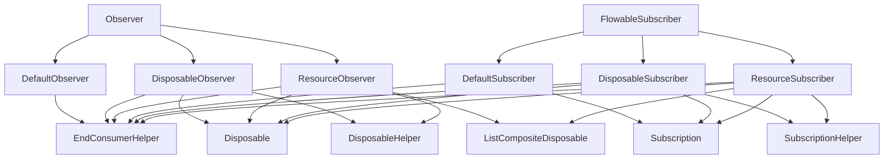
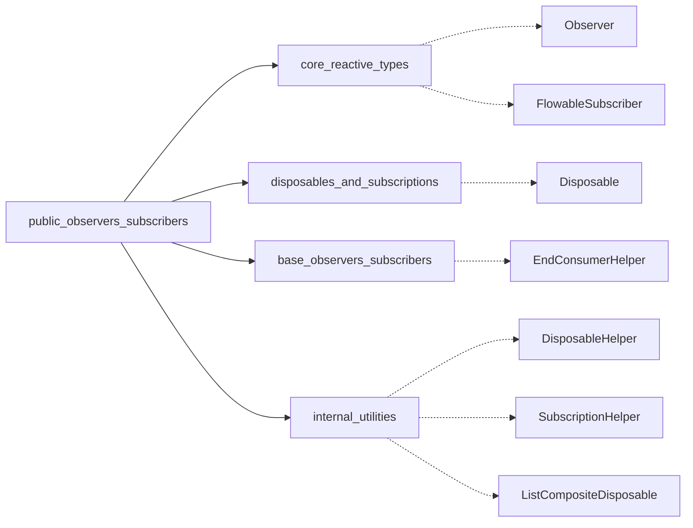
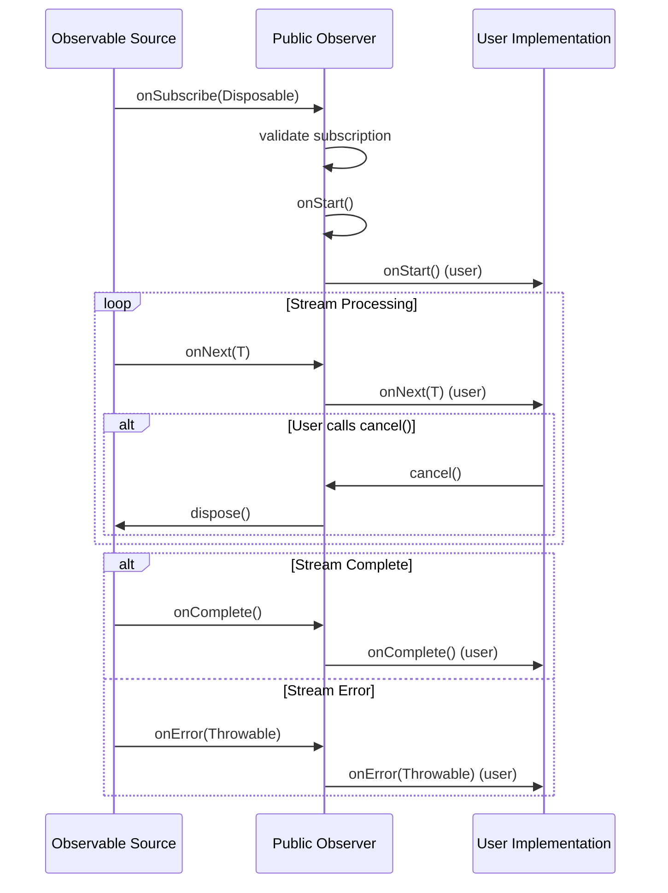
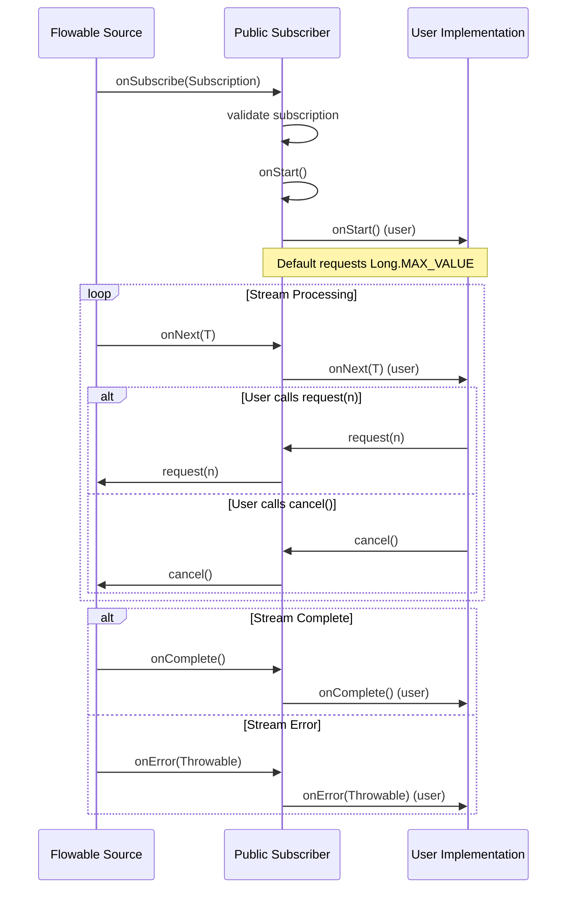
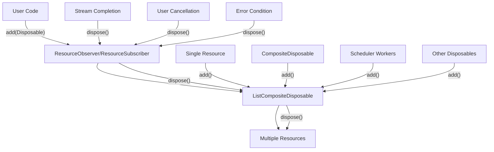
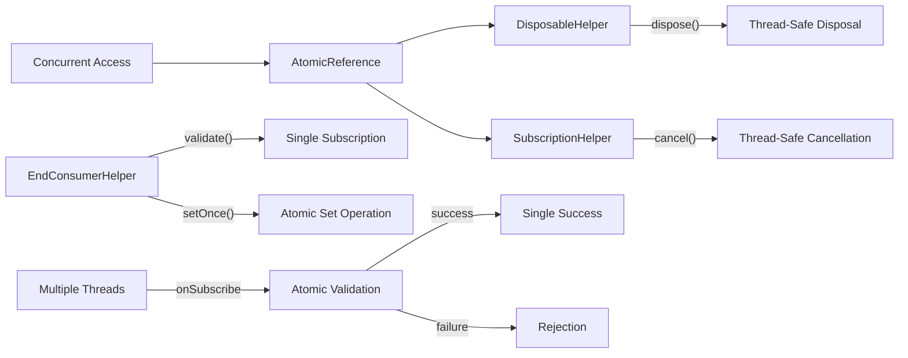

# Public Observers and Subscribers Module

## Introduction

The `public_observers_subscribers` module provides the public-facing API for reactive stream consumers in RxJava3. It offers a comprehensive set of abstract base classes that developers can extend to create custom observers and subscribers for handling asynchronous data streams. This module serves as the primary interface between reactive streams and application logic, providing both synchronous and asynchronous cancellation capabilities, resource management, and backpressure handling.

## Module Overview

The module is organized into two main categories:
- **Observers**: For handling Observable and Maybe streams
- **Subscribers**: For handling Flowable streams with backpressure support

Each category provides three levels of functionality:
1. **Default**: Basic subscription handling with synchronous cancellation
2. **Disposable**: Asynchronous cancellation support via Disposable interface
3. **Resource**: Resource management capabilities alongside subscription handling

## Architecture

### Component Hierarchy



### Module Dependencies



## Core Components

### Observer Components

#### DefaultObserver<T>
The foundational observer implementation providing synchronous cancellation capabilities.

**Key Features:**
- Implements `Observer<T>` interface
- Synchronous cancellation via `cancel()` method
- Lifecycle hook with `onStart()` method
- Thread-safe implementation
- Single subscription enforcement

**Use Cases:**
- Simple observable consumption
- Synchronous stream cancellation
- Basic error handling scenarios

#### DisposableObserver<T>
Extends DefaultObserver with asynchronous cancellation support through the Disposable interface.

**Key Features:**
- Implements both `Observer<T>` and `Disposable` interfaces
- Atomic reference management for thread-safe disposal
- External cancellation capability
- Disposal state checking via `isDisposed()`

**Use Cases:**
- Long-running observable streams
- External cancellation requirements
- Composite disposable management

#### ResourceObserver<T>
Advanced observer with resource management capabilities.

**Key Features:**
- Resource association via `add(Disposable)` method
- Automatic resource cleanup on disposal
- Composite resource management
- Lifecycle-aware resource handling

**Use Cases:**
- Resource-intensive operations
- Multiple disposable management
- Complex cleanup scenarios

### Subscriber Components

#### DefaultSubscriber<T>
Base subscriber implementation for Flowable streams with backpressure support.

**Key Features:**
- Implements `FlowableSubscriber<T>` interface
- Backpressure handling via `request(long)` method
- Synchronous cancellation via `cancel()` method
- Default unbounded request behavior
- Subscription lifecycle management

**Use Cases:**
- Flowable stream consumption
- Custom backpressure strategies
- Synchronous stream control

#### DisposableSubscriber<T>
Subscriber with asynchronous cancellation capabilities.

**Key Features:**
- Implements both `FlowableSubscriber<T>` and `Disposable` interfaces
- Atomic subscription management
- External disposal support
- Backpressure compatibility

**Use Cases:**
- Long-running flowable streams
- External cancellation needs
- Backpressure with disposal

#### ResourceSubscriber<T>
Advanced subscriber with resource management and backpressure support.

**Key Features:**
- Resource association and cleanup
- Deferred request handling
- Missed request accumulation
- Composite resource management

**Use Cases:**
- Resource-managed flowable consumption
- Complex backpressure scenarios
- Multi-resource stream processing

## Data Flow Architecture

### Observer Stream Processing



### Subscriber Stream Processing with Backpressure



## Component Interactions

### Resource Management Flow



### Thread Safety Architecture



## Usage Patterns

### Basic Observable Consumption

```java
Observable.range(1, 5)
    .subscribe(new DefaultObserver<Integer>() {
        @Override
        public void onStart() {
            System.out.println("Stream started");
        }
        
        @Override
        public void onNext(Integer value) {
            System.out.println("Value: " + value);
            if (value == 3) {
                cancel(); // Synchronous cancellation
            }
        }
        
        @Override
        public void onError(Throwable e) {
            e.printStackTrace();
        }
        
        @Override
        public void onComplete() {
            System.out.println("Stream completed");
        }
    });
```

### Flowable with Backpressure

```java
Flowable.range(1, 1000)
    .subscribe(new DefaultSubscriber<Integer>() {
        @Override
        public void onStart() {
            request(10); // Request first 10 items
        }
        
        @Override
        public void onNext(Integer value) {
            System.out.println("Processing: " + value);
            request(1); // Request next item
        }
        
        @Override
        public void onError(Throwable e) {
            e.printStackTrace();
        }
        
        @Override
        public void onComplete() {
            System.out.println("All items processed");
        }
    });
```

### Resource Management

```java
Disposable d = Observable.interval(1, TimeUnit.SECONDS)
    .subscribeWith(new ResourceObserver<Long>() {
        @Override
        public void onStart() {
            // Add resources that need cleanup
            add(Schedulers.single()
                .scheduleDirect(() -> System.out.println("Periodic task"), 
                    5, TimeUnit.SECONDS));
        }
        
        @Override
        public void onNext(Long value) {
            System.out.println("Tick: " + value);
        }
        
        @Override
        public void onError(Throwable e) {
            e.printStackTrace();
            dispose(); // Clean up resources
        }
        
        @Override
        public void onComplete() {
            System.out.println("Done");
            dispose(); // Clean up resources
        }
    });

// External cancellation with automatic resource cleanup
d.dispose();
```

## Integration with Other Modules

### Relationship to Core Reactive Types
The public observers and subscribers implement the core interfaces defined in [core_reactive_types](core_reactive_types.md), providing concrete implementations for `Observer<T>` and `FlowableSubscriber<T>`.

### Dependency on Base Components
The module leverages utility classes from [internal_utilities](internal_utilities.md) for:
- Thread-safe disposal operations via `DisposableHelper` and `SubscriptionHelper`
- Single subscription validation through `EndConsumerHelper`
- Resource management using `ListCompositeDisposable`

### Connection to Disposables
Integration with [disposables_and_subscriptions](disposables_and_subscriptions.md) provides:
- Standardized disposal mechanisms
- Resource cleanup patterns
- Composite disposable functionality

## Best Practices

### Observer Implementation Guidelines

1. **Error Handling**: Always implement `onError()` to handle stream failures gracefully
2. **Resource Cleanup**: Use ResourceObserver/ResourceSubscriber when external resources need management
3. **Thread Safety**: All provided methods are thread-safe; user implementations should avoid shared mutable state
4. **Single Subscription**: Each observer/subscriber instance can only be used once; create new instances for multiple subscriptions

### Backpressure Strategies

1. **Bounded Requests**: Use specific request amounts rather than `Long.MAX_VALUE` for better memory management
2. **Incremental Requests**: Request items incrementally in `onNext()` for fine-grained control
3. **Cancellation**: Implement proper cancellation logic to prevent resource leaks

### Resource Management

1. **Early Addition**: Add resources in `onStart()` to ensure they're available throughout the stream lifecycle
2. **Explicit Cleanup**: Call `dispose()` in both `onError()` and `onComplete()` when using ResourceObserver/ResourceSubscriber
3. **Composite Resources**: Use `CompositeDisposable` for complex resource management scenarios

## Performance Considerations

### Memory Management
- Observers hold minimal state (single Disposable reference)
- Resource variants include additional overhead for resource management
- Proper cancellation prevents memory leaks from unfinished streams

### Thread Safety
- All public methods use atomic operations for thread safety
- No additional synchronization required in user implementations
- AtomicReference usage ensures consistent state across threads

### Stream Efficiency
- Default subscribers request unbounded streams by default
- Custom request strategies can improve memory usage for large streams
- Cancellation stops upstream processing immediately

This module provides the essential building blocks for reactive stream consumption in RxJava3, offering flexibility, safety, and resource management capabilities for a wide range of use cases.