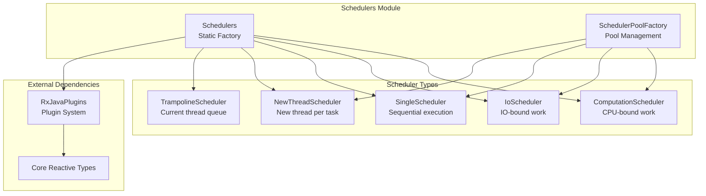
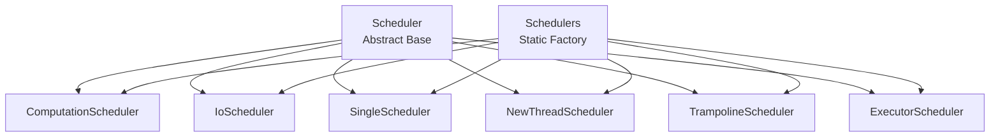
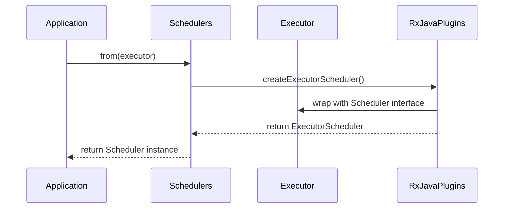
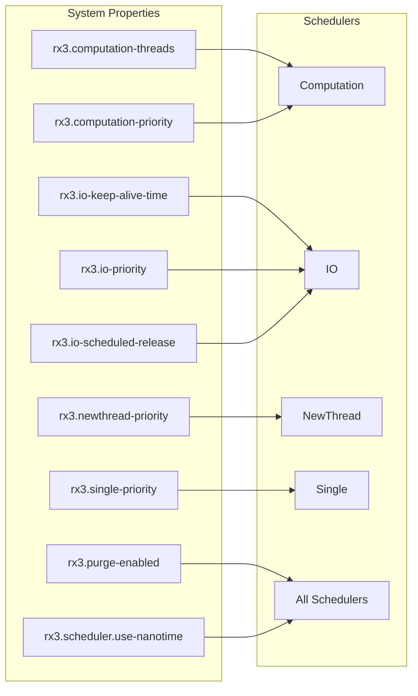
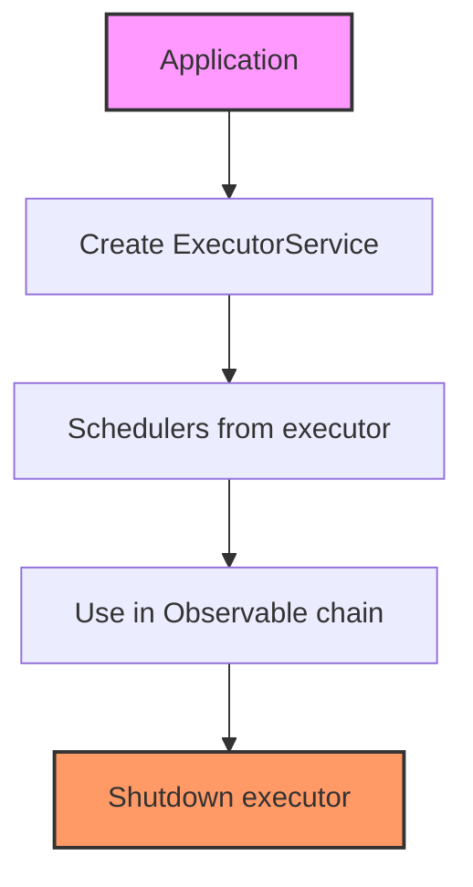
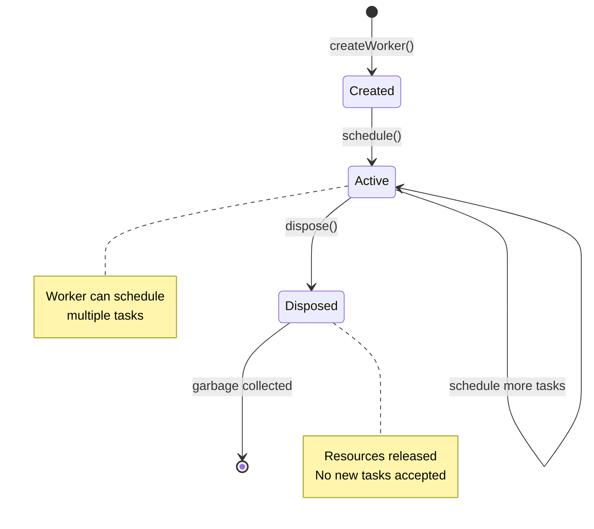
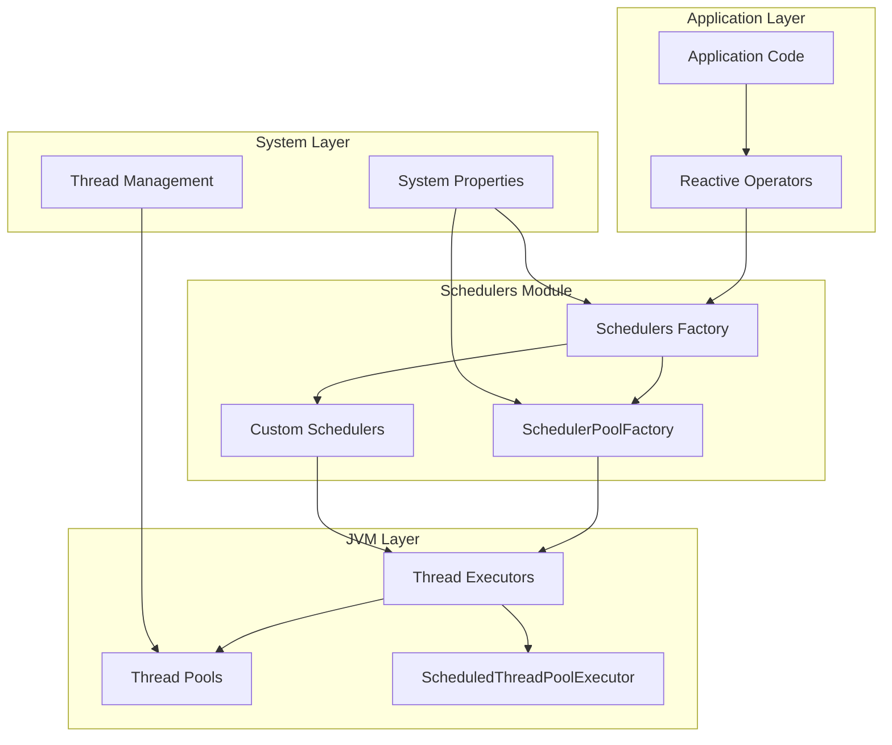

# Schedulers Module Documentation

## Introduction

The Schedulers module is a core component of RxJava that provides thread management and execution context control for reactive streams. It offers a collection of pre-configured schedulers optimized for different types of work, enabling developers to control where and how their reactive operations execute.

## Overview

Schedulers in RxJava are responsible for:
- Managing thread pools and execution contexts
- Providing different scheduling strategies for various workload types
- Enabling time-based operations like delays and timeouts
- Supporting custom executor integration
- Offering thread-safe task execution

## Architecture

### Core Components



### Scheduler Hierarchy



## Component Details

### Schedulers Class

The `Schedulers` class serves as the main entry point and static factory for obtaining standard scheduler instances. It provides five pre-configured schedulers, each optimized for specific use cases:

#### Available Schedulers

1. **Computation Scheduler** (`computation()`)
   - Optimized for CPU-intensive work
   - Thread pool size equals available processors
   - Suitable for event loops and processing callbacks
   - Less sensitive to worker leaks

2. **IO Scheduler** (`io()`)
   - Designed for IO-bound operations
   - Cached thread pool with unbounded growth
   - Supports worker reuse and release modes
   - Configurable keep-alive time and priority

3. **Single Scheduler** (`single()`)
   - Single-threaded sequential execution
   - Suitable for event loops and strongly-sequential work
   - Less sensitive to worker leaks
   - Background thread execution

4. **New Thread Scheduler** (`newThread()`)
   - Creates new thread for each task
   - Suitable for isolated long-running operations
   - Requires careful worker disposal
   - Can lead to resource exhaustion if misused

5. **Trampoline Scheduler** (`trampoline()`)
   - Executes on current thread with FIFO queueing
   - No thread switching
   - Suitable for testing and specific synchronization scenarios

#### Custom Scheduler Creation

The `Schedulers` class also provides factory methods for wrapping custom `Executor` instances:



### SchedulerPoolFactory

The `SchedulerPoolFactory` manages the creation of `ScheduledExecutorService` instances and configures purging behavior:

- **Thread Pool Creation**: Creates `ScheduledThreadPoolExecutor` instances with custom thread factories
- **Purge Management**: Configures automatic task removal on cancellation
- **System Property Support**: Handles `rx3.purge-enabled` property

## Configuration and Customization

### System Properties

The schedulers module supports extensive configuration through system properties:



### Plugin Integration

The schedulers module integrates with the [plugins system](plugins_system.md) for customization:

- **Initialization Hooks**: Override default scheduler instances at startup
- **Runtime Replacement**: Replace scheduler instances after initialization
- **Custom Factory Methods**: Create scheduler instances with custom thread factories

## Usage Patterns

### Basic Usage

```java
// CPU-intensive operations
Observable.range(1, 1000000)
    .map(expensiveComputation)
    .subscribeOn(Schedulers.computation())
    .subscribe();

// IO operations
Observable.fromCallable(this::fetchFromDatabase)
    .subscribeOn(Schedulers.io())
    .subscribe();

// Sequential processing
Observable.fromArray(items)
    .observeOn(Schedulers.single())
    .subscribe(this::processSequentially);
```

### Custom Executor Integration



## Thread Safety and Resource Management

### Worker Lifecycle



### Resource Leak Prevention

- **Worker Disposal**: Always dispose workers to prevent resource leaks
- **Scheduler Shutdown**: Call `Schedulers.shutdown()` for cleanup
- **Executor Management**: Manage external executor lifecycle when using `from()`

## Performance Considerations

### Scheduler Selection Guide

| Scheduler | Use Case | Thread Pool | Overhead | Leak Sensitivity |
|-----------|----------|-------------|----------|------------------|
| Computation | CPU work | Fixed (CPU count) | Low | Low |
| IO | Blocking IO | Cached/Unbounded | Medium | High |
| Single | Sequential | Single thread | Low | Low |
| NewThread | Isolated tasks | New per task | High | High |
| Trampoline | Current thread | None | Minimal | N/A |

### Best Practices

1. **Choose the right scheduler** for your workload type
2. **Dispose workers** when done to prevent leaks
3. **Avoid blocking operations** on computation scheduler
4. **Limit newThread() usage** to prevent thread exhaustion
5. **Configure system properties** before accessing Schedulers class

## Integration with Other Modules

### Core Reactive Types

The schedulers module integrates with [core reactive types](core_reactive_types.md) through:

- **Scheduler Support Annotations**: Mark operators that use specific schedulers
- **Transformer Integration**: Allow scheduler specification in custom transformers
- **Emitter Scheduling**: Support for scheduling emissions in custom operators

### Test Utilities

Integration with [test utilities](test_utilities.md) provides:

- **TestScheduler**: Virtual time scheduler for testing
- **Scheduler Overrides**: Replace schedulers in test environments
- **Deterministic Execution**: Control timing in unit tests

## Error Handling

### Uncaught Exception Handling

- **Thread-level handlers**: Each scheduler thread has an `UncaughtExceptionHandler`
- **Global error routing**: Unhandled errors go through `RxJavaPlugins.onError()`
- **Worker disposal**: Errors don't automatically dispose workers

### RejectedExecutionException

When using custom executors:
- **Proper executor lifecycle**: Avoid premature shutdown
- **Bounded queue management**: Use backpressure to limit work
- **Error routing**: Rejected tasks go to global error handler

## System Architecture Integration



This architecture provides a clean separation between reactive operations and thread management, allowing for flexible configuration and optimization based on workload characteristics.