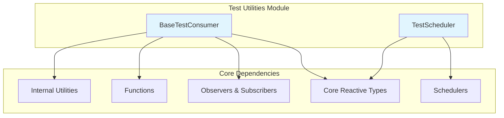
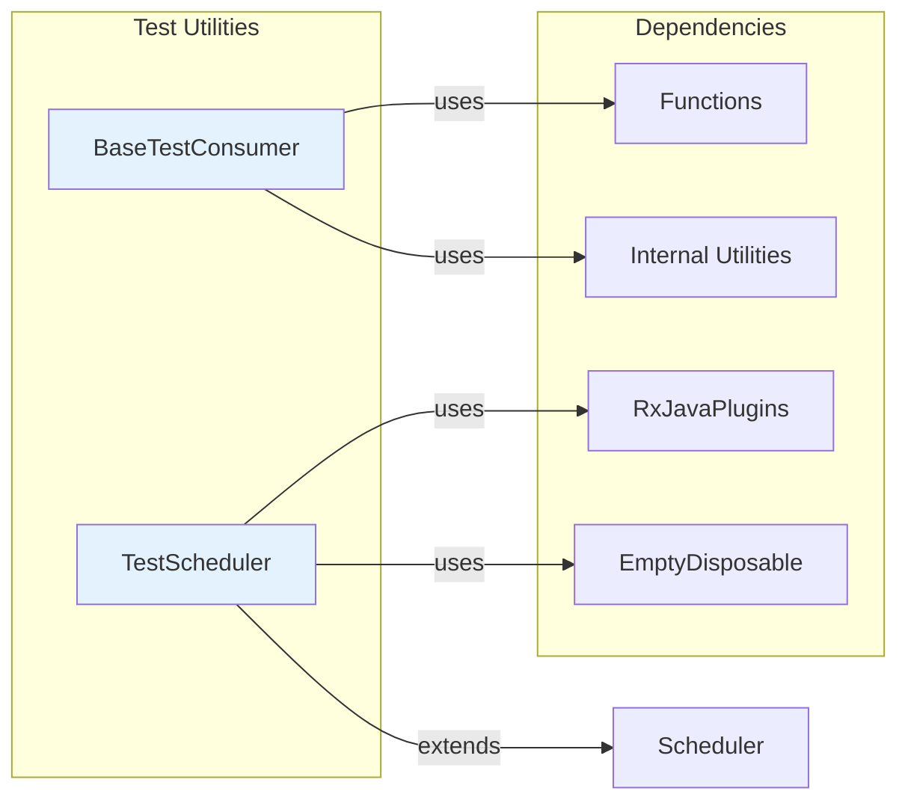
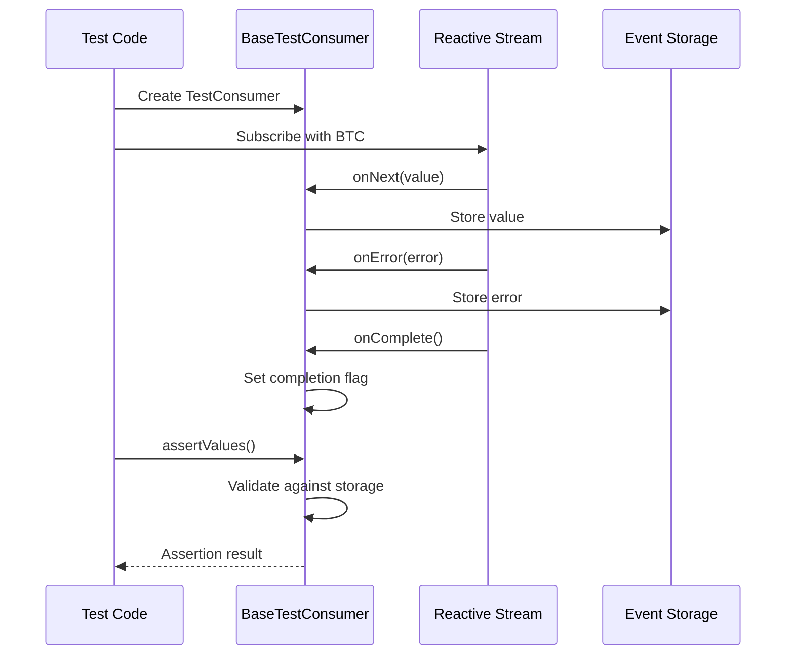
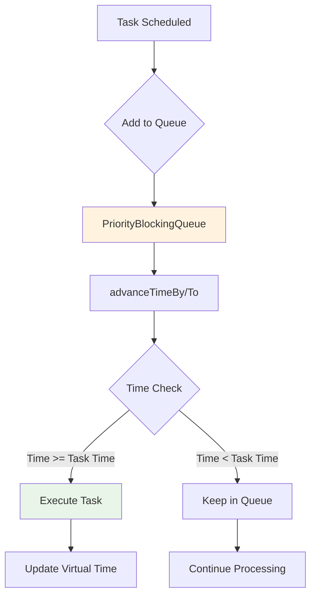

# Test Utilities Module Documentation

## Overview

The test_utilities module provides essential testing infrastructure for RxJava3 applications, offering deterministic testing capabilities for reactive streams and time-based operations. This module enables developers to write reliable unit tests for asynchronous and event-driven code without introducing real concurrency or timing dependencies.

## Purpose

The test_utilities module serves as the testing backbone of the RxJava3 ecosystem, providing:

- **Test Consumers**: Base classes for capturing and asserting stream events
- **Virtual Time Scheduling**: Deterministic time advancement for time-dependent operations
- **Assertion Framework**: Comprehensive validation methods for reactive stream behavior
- **Test Infrastructure**: Thread-safe collection and state management for test scenarios

## Architecture



## Core Components

### BaseTestConsumer
The `BaseTestConsumer` is an abstract base class that provides shared infrastructure for both `TestObserver` and `TestSubscriber`. It offers comprehensive assertion capabilities and event tracking for reactive streams.

**Key Features:**
- Thread-safe event collection using `VolatileSizeArrayList`
- Comprehensive assertion methods for values, errors, and completion events
- Support for both synchronous and asynchronous testing scenarios
- Detailed failure reporting with contextual information

**Core Capabilities:**
- Value assertion (single, multiple, sequence-based)
- Error handling and assertion
- Completion state verification
- Thread-safe event collection
- Timeout and disposal management

### TestScheduler
The `TestScheduler` provides a virtual time scheduler that allows deterministic testing of time-based operations without real concurrency. It enables precise control over time advancement in test scenarios.

**Key Features:**
- Virtual time advancement (by amount or to specific time)
- Priority-based task execution queue
- Manual trigger control for scheduled actions
- Optional integration with RxJavaPlugins scheduling hooks

**Core Capabilities:**
- `advanceTimeBy()`: Move time forward by specified amount
- `advanceTimeTo()`: Set time to specific moment
- `triggerActions()`: Execute pending tasks
- Worker-based task scheduling with disposal support

## Module Dependencies

The test_utilities module integrates with several core RxJava3 modules:

- **[core_reactive_types](core_reactive_types.md)**: Provides fundamental reactive types and transformers
- **[public_observers_subscribers](public_observers_subscribers.md)**: Public observer interfaces used by test consumers
- **[schedulers](schedulers.md)**: Scheduler infrastructure extended by TestScheduler
- **[internal_utilities](internal_utilities.md)**: Utility functions and helper classes

## Component Relationships



## Usage Patterns

### Testing Reactive Streams
```java
// Create test consumer
TestObserver<Integer> observer = new TestObserver<>();

// Subscribe to observable
observable.subscribe(observer);

// Assert results
observer.assertValues(1, 2, 3)
        .assertComplete()
        .assertNoErrors();
```

### Testing Time-Based Operations
```java
// Create test scheduler
TestScheduler scheduler = new TestScheduler();

// Create time-dependent observable
Observable<Long> timed = Observable.interval(1, TimeUnit.SECONDS, scheduler);

// Advance virtual time
scheduler.advanceTimeBy(5, TimeUnit.SECONDS);

// Assert expected behavior
```

## Thread Safety

Both `BaseTestConsumer` and `TestScheduler` are designed with thread safety in mind:

- **BaseTestConsumer**: Uses `VolatileSizeArrayList` for thread-safe event collection
- **TestScheduler**: Employs `PriorityBlockingQueue` for concurrent task management
- **Synchronization**: Proper synchronization for cross-thread event visibility

## Data Flow Architecture



## TestScheduler Task Flow



## API Reference

### BaseTestConsumer Methods

#### Event Collection
- `values()`: Returns list of received onNext values
- `errors()`: Returns list of received errors  
- `completions()`: Returns completion count
- `await()`: Waits for stream termination
- `awaitDone()`: Waits with timeout and disposal

#### Assertion Methods
- `assertValue()`: Assert single value equality
- `assertValues()`: Assert multiple values in order
- `assertValueCount()`: Assert specific value count
- `assertNoValues()`: Assert no values received
- `assertComplete()`: Assert exactly one completion
- `assertNotComplete()`: Assert no completion
- `assertNoErrors()`: Assert no errors received
- `assertError()`: Assert specific error (instance, class, or predicate)
- `assertResult()`: Assert values + completion
- `assertFailure()`: Assert values + error
- `assertEmpty()`: Assert subscription only

#### Utility Methods
- `withTag()`: Set assertion failure tag
- `awaitCount()`: Wait for minimum value count
- `valueAndClass()`: Format value with class info

### TestScheduler Methods

#### Time Control
- `advanceTimeBy()`: Move time forward by amount
- `advanceTimeTo()`: Set time to specific moment
- `triggerActions()`: Execute pending tasks
- `now()`: Get current virtual time

#### Task Management
- `createWorker()`: Create scheduler worker
- `schedule()`: Schedule immediate/delayed task

## Advanced Features

### Custom Predicates
BaseTestConsumer supports custom predicates for flexible assertions:

```java
// Assert value matches condition
observer.assertValue(value -> value > 10);

// Assert error matches condition  
observer.assertError(error -> error instanceof IOException);
```

### Timeout Handling
Both components provide timeout management:

```java
// Wait with timeout
boolean completed = observer.await(5, TimeUnit.SECONDS);

// Advance time with timeout handling
scheduler.advanceTimeBy(1, TimeUnit.SECONDS);
```

### Disposal Management
Proper resource cleanup is supported:

```java
// Check disposal state
if (!observer.isDisposed()) {
    observer.dispose();
}
```

## Testing Strategies

### Unit Testing
- Use `BaseTestConsumer` for direct stream testing
- Leverage comprehensive assertion API
- Test both success and failure scenarios

### Integration Testing
- Combine with `TestScheduler` for time-based testing
- Test complex operator chains
- Validate error propagation

### Performance Testing
- Use `awaitCount()` for backpressure testing
- Monitor memory usage with large streams
- Test timeout scenarios

## Common Patterns

### Basic Stream Testing
```java
TestObserver<Integer> observer = observable.test();
observer.assertValues(1, 2, 3)
        .assertComplete()
        .assertNoErrors();
```

### Error Testing
```java
TestObserver<Integer> observer = errorObservable.test();
observer.assertError(IOException.class)
        .assertNotComplete()
        .assertNoValues();
```

### Time-Based Testing
```java
TestScheduler scheduler = new TestScheduler();
TestObserver<Long> observer = Observable.interval(1, TimeUnit.SECONDS, scheduler)
                                       .test();

scheduler.advanceTimeBy(5, TimeUnit.SECONDS);
observer.assertValueCount(5);
```

## Troubleshooting

### Common Issues
1. **Race Conditions**: Use `await()` before assertions
2. **Timeout Errors**: Increase timeout or check stream termination
3. **Memory Leaks**: Ensure proper disposal of test consumers
4. **Assertion Failures**: Check value types and ordering

### Debug Information
- Use `withTag()` for assertion context
- Check `values()`, `errors()`, and `completions()` directly
- Monitor thread information with `lastThread`

## Related Documentation

- [Core Reactive Types](core_reactive_types.md) - Fundamental reactive stream types
- [Schedulers](schedulers.md) - Time and execution scheduling infrastructure  
- [Observers & Subscribers](public_observers_subscribers.md) - Observer pattern implementations
- [Internal Utilities](internal_utilities.md) - Helper functions and utilities
- [Plugins System](plugins_system.md) - RxJavaPlugins integration for enhanced testing