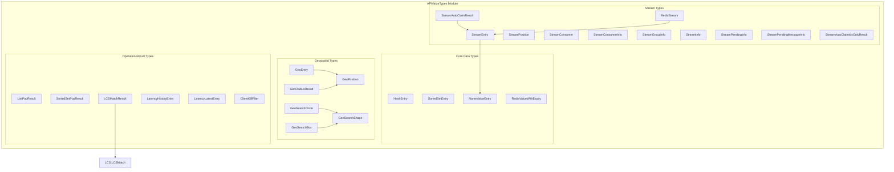

# APIValueTypes Module Documentation

## Overview

The APIValueTypes module in StackExchange.Redis provides a comprehensive set of data structures and types that represent various Redis data types and operation results. These types serve as the foundation for data exchange between the application and Redis server, ensuring type safety and providing rich metadata for complex Redis operations.

## Purpose

The APIValueTypes module is designed to:
- Provide strongly-typed representations of Redis data structures
- Encapsulate complex operation results with multiple properties
- Enable seamless conversion between .NET types and Redis data formats
- Support advanced Redis features like streams, geospatial data, and sorted sets

## Architecture



## Sub-modules

### 1. [Core Data Types](CoreDataTypes.md)
Provides fundamental data structures for basic Redis operations:
- **HashEntry**: Represents field-value pairs in Redis hashes
- **SortedSetEntry**: Encapsulates elements with scores for sorted sets
- **NameValueEntry**: Generic name-value pairs used in streams
- **RedisValueWithExpiry**: Combines values with expiration information

### 2. [Geospatial Types](GeospatialTypes.md)
Specialized types for Redis geospatial operations:
- **GeoEntry**: Geographic entries with coordinates and member names
- **GeoPosition**: Latitude/longitude coordinate pairs
- **GeoRadiusResult**: Results from georadius queries
- **GeoSearchShape**: Abstract base for geographic search shapes

### 3. [Stream Types](StreamTypes.md)
Comprehensive types for Redis Streams functionality:
- **StreamEntry**: Individual stream messages
- **StreamPosition**: Stream key and position pairs
- **StreamConsumer**: Consumer information
- **StreamInfo**: Stream metadata and statistics
- **StreamPendingInfo**: Pending message information

### 4. [Operation Result Types](OperationResultTypes.md)
Specialized result types for complex operations:
- **ListPopResult**: Results from list pop operations
- **SortedSetPopResult**: Results from sorted set pop operations
- **LCSMatchResult**: Longest Common Subsequence operation results
- **LatencyHistoryEntry/LatencyLatestEntry**: Latency monitoring data
- **ClientKillFilter**: Client connection filtering criteria

## Key Features

### Type Safety
All types provide strongly-typed access to Redis data, preventing runtime errors and enabling compile-time validation.

### Immutable Design
Most types are implemented as readonly structs, ensuring thread safety and preventing accidental modification.

### Rich Metadata
Complex operations return comprehensive result objects containing all relevant information (e.g., GeoRadiusResult includes distance, hash, and position data).

### Conversion Support
Types provide implicit conversions to common .NET types (e.g., KeyValuePair) for seamless integration.

### Null Safety
Many types provide static Null properties and IsNull methods for safe handling of empty results.

## Integration with Other Modules

The APIValueTypes module serves as the data foundation for all other modules in StackExchange.Redis:

- **DatabaseOperations**: Uses these types for command parameters and results
- **ResultProcessing**: Processes raw Redis responses into these typed structures
- **ConnectionManagement**: Transmits these types over network connections
- **ServerManagement**: Returns server information using these types

## Usage Examples

### Hash Operations
```csharp
HashEntry[] hashEntries = {
    new HashEntry("field1", "value1"),
    new HashEntry("field2", "value2")
};
```

### Geospatial Operations
```csharp
GeoEntry location = new GeoEntry(-122.4194, 37.7749, "San Francisco");
GeoRadiusResult[] nearby = db.GeoRadius("locations", -122.4194, 37.7749, 100, GeoUnit.Miles);
```

### Stream Operations
```csharp
StreamEntry entry = new StreamEntry("1234567890-0", new NameValueEntry[] {
    new NameValueEntry("field", "value")
});
```

## Performance Considerations

- **Struct-based Design**: Most types are structs to minimize heap allocations
- **ReadOnly Properties**: Immutable design prevents defensive copying
- **Efficient Conversions**: Implicit operators minimize conversion overhead
- **Array Pooling**: Some types support array pooling for large datasets

## Thread Safety

All types in the APIValueTypes module are thread-safe due to their immutable design. Once created, their values cannot be modified, making them safe for concurrent access across multiple threads.

## Related Documentation

- [ValueTypes](ValueTypes.md) - Core Redis value types (RedisValue, RedisKey)
- [DatabaseOperations](DatabaseOperations.md) - Operations that use these API types
- [ResultProcessing](ResultProcessing.md) - How raw Redis responses are converted to these types
- [MessageSystem](MessageSystem.md) - Message types that may contain API value types