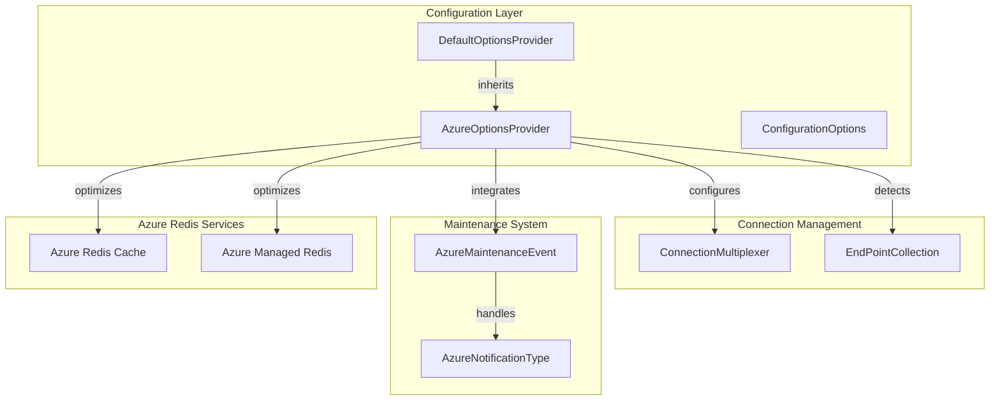
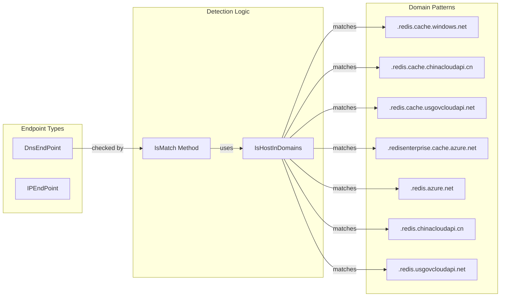
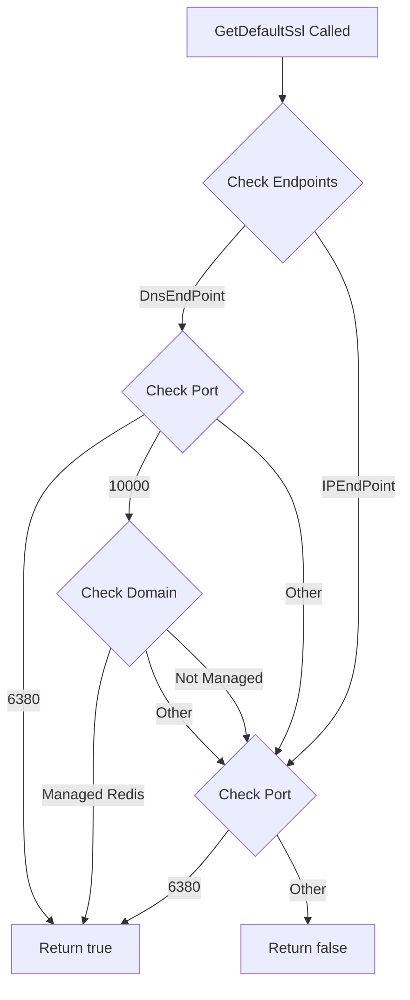
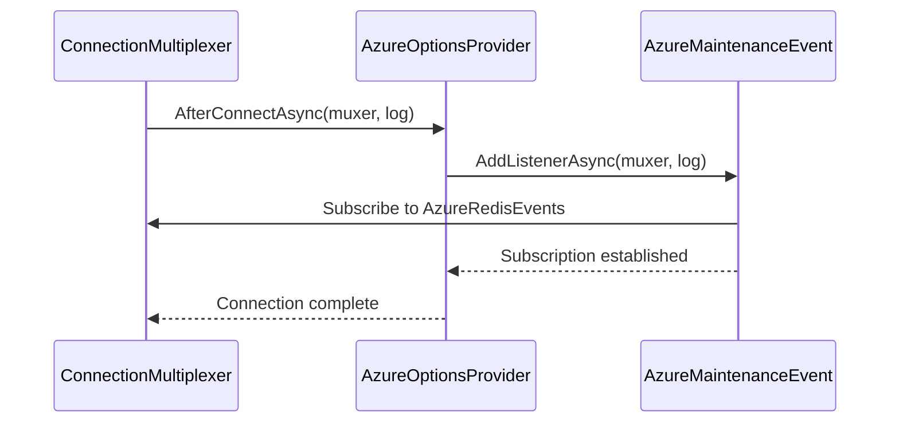
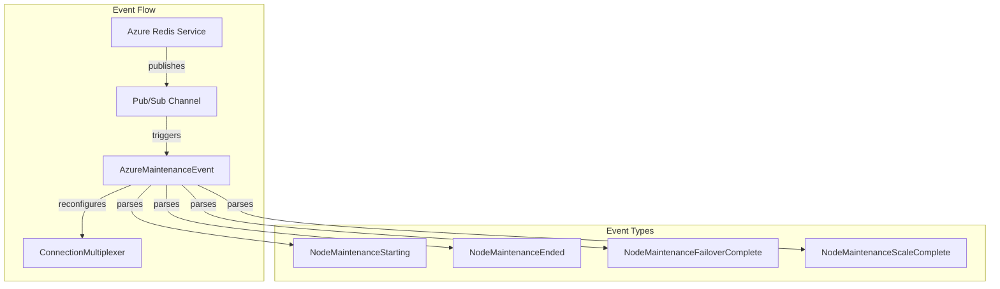
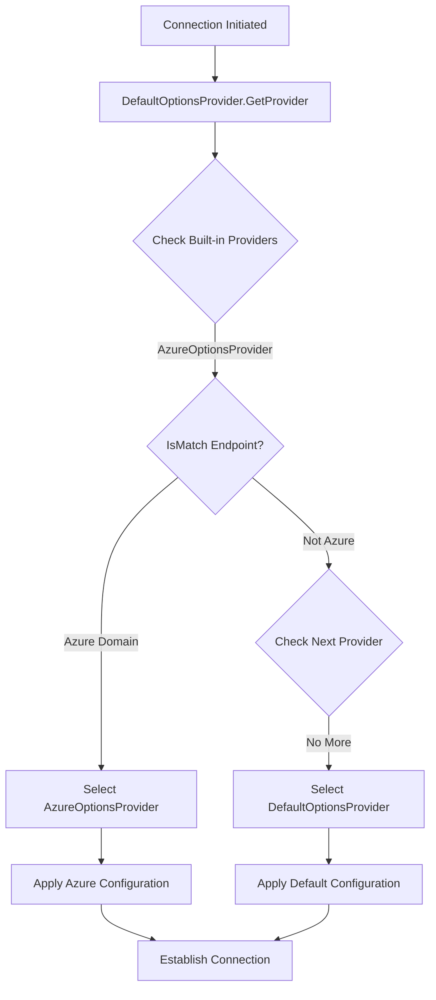

# AzureOptionsProvider Module Documentation

## Introduction

The AzureOptionsProvider module is a specialized configuration provider within the StackExchange.Redis library that delivers Azure-specific optimizations and intelligent defaults for Redis connections in Azure environments. This module automatically detects Azure Redis endpoints and applies appropriate configuration settings to ensure optimal performance, reliability, and maintenance event handling.

## Module Purpose

The AzureOptionsProvider serves as an intelligent configuration layer that:
- Automatically detects Azure Redis Cache endpoints based on domain patterns
- Applies Azure-optimized connection settings and defaults
- Enables SSL/TLS by default for secure connections
- Integrates with Azure maintenance event notifications
- Provides resilience against connection failures during Azure maintenance windows

## Architecture Overview

### Component Relationships



### Domain Detection Architecture



## Core Components

### AzureOptionsProvider Class

The `AzureOptionsProvider` class extends `DefaultOptionsProvider` to provide Azure-specific configuration defaults:

#### Key Properties

| Property | Value | Purpose |
|----------|-------|---------|
| `AbortOnConnectFail` | `false` | Allows connection retries during Azure maintenance |
| `DefaultVersion` | `RedisFeatures.v6_0_0` | Assumes Redis 6.0+ features available in Azure |

#### Domain Detection

The provider maintains two sets of domain patterns for Azure Redis detection:

**Azure Redis Cache Domains:**
- `.redis.cache.windows.net`
- `.redis.cache.chinacloudapi.cn`
- `.redis.cache.usgovcloudapi.net`
- `.redisenterprise.cache.azure.net`

**Azure Managed Redis Domains:**
- `.redis.azure.net`
- `.redis.chinacloudapi.cn`
- `.redis.usgovcloudapi.net`

#### SSL Configuration Logic



## Integration Points

### ConnectionMultiplexer Integration

The AzureOptionsProvider integrates with the [ConnectionMultiplexer](ConnectionManagement.md) through the `AfterConnectAsync` method:



### Maintenance Event Handling

The provider automatically subscribes to Azure maintenance events through the [AzureMaintenanceEvent](Maintenance.md) system:



## Configuration Flow

### Provider Selection Process



### SSL Auto-Configuration

The provider automatically enables SSL based on endpoint characteristics:

1. **Port 6380**: Standard Azure Redis SSL port - SSL enabled
2. **Port 10000**: Azure Managed Redis SSL port - SSL enabled if domain matches
3. **Other ports**: SSL disabled by default

## Azure-Specific Optimizations

### Connection Resilience

- **AbortOnConnectFail = false**: Allows connection attempts to continue during Azure maintenance windows
- **Default Redis 6.0**: Assumes modern Redis features available in Azure
- **Maintenance Event Handling**: Proactive reconfiguration during maintenance events

### Security Defaults

- **Automatic SSL Detection**: Enables SSL for known Azure SSL ports
- **Domain Validation**: Ensures proper endpoint identification before applying Azure-specific settings

## Usage Examples

### Automatic Detection

```csharp
// Azure Redis Cache endpoint - automatically detected
var options = ConfigurationOptions.Parse("mycache.redis.cache.windows.net:6380");
var provider = DefaultOptionsProvider.GetProvider(options.EndPoints);
// Returns AzureOptionsProvider instance
```

### Manual Registration

```csharp
// Add custom Azure provider with higher priority
DefaultOptionsProvider.AddProvider(new AzureOptionsProvider());
```

## Dependencies

The AzureOptionsProvider module depends on:

- **[DefaultOptionsProvider](Configuration.md)**: Base configuration provider
- **[ConnectionMultiplexer](ConnectionManagement.md)**: Core connection management
- **[AzureMaintenanceEvent](Maintenance.md)**: Maintenance event handling
- **[EndPointCollection](ConnectionManagement.md)**: Endpoint management

## Error Handling

The provider implements defensive programming practices:

- **Domain Matching**: Case-insensitive domain comparison
- **Null Safety**: Graceful handling of null endpoints
- **Exception Handling**: Silent failure in domain detection

## Performance Considerations

- **Memoization**: Domain patterns are cached as static arrays
- **Early Exit**: Domain matching stops at first match
- **Async Operations**: Maintenance event subscription is non-blocking

## Security Considerations

- **SSL by Default**: Automatically enables SSL for Azure endpoints
- **Domain Validation**: Only applies Azure settings to verified domains
- **Port-Based Security**: Uses standard Azure SSL ports

## Related Documentation

- [Configuration Module](Configuration.md) - General configuration options
- [ConnectionManagement Module](ConnectionManagement.md) - Connection multiplexer details
- [Maintenance Module](Maintenance.md) - Azure maintenance event handling
- [DefaultOptionsProvider](Configuration.md) - Base configuration provider