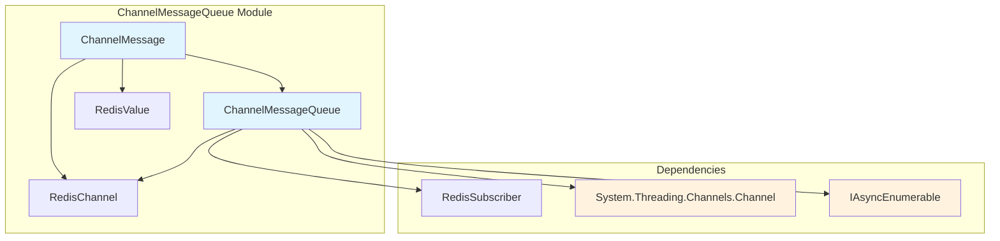
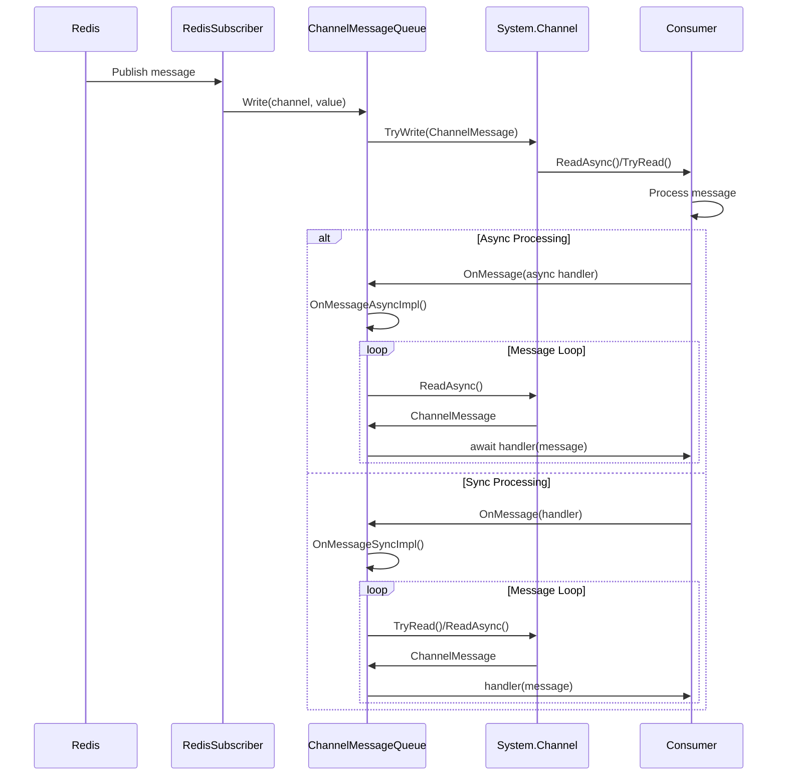
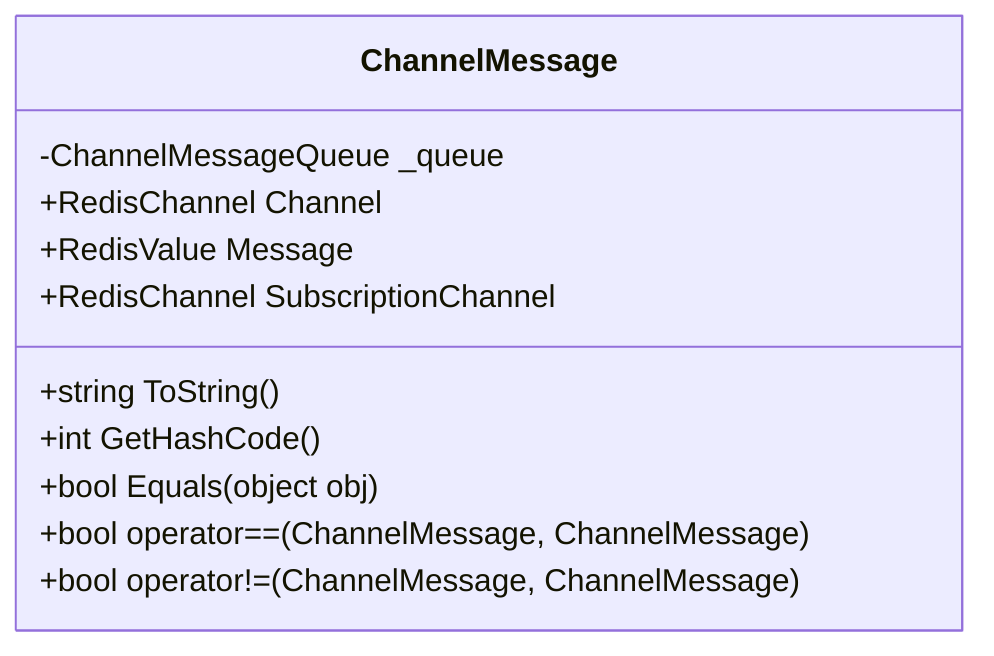
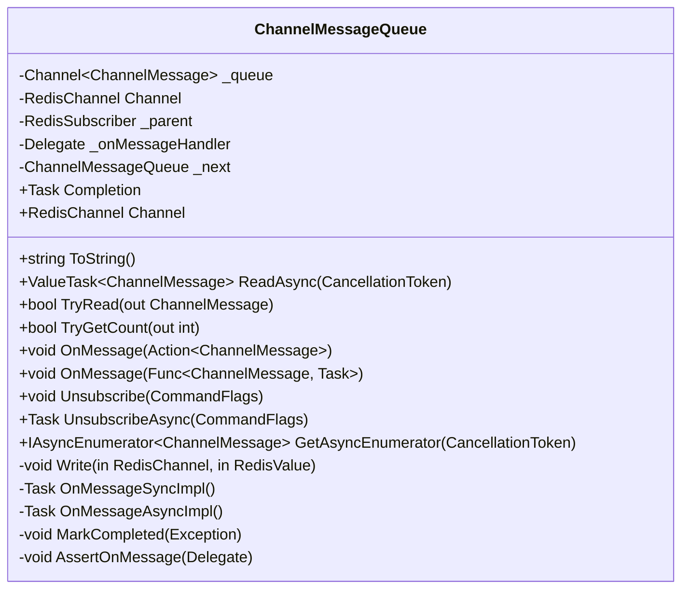
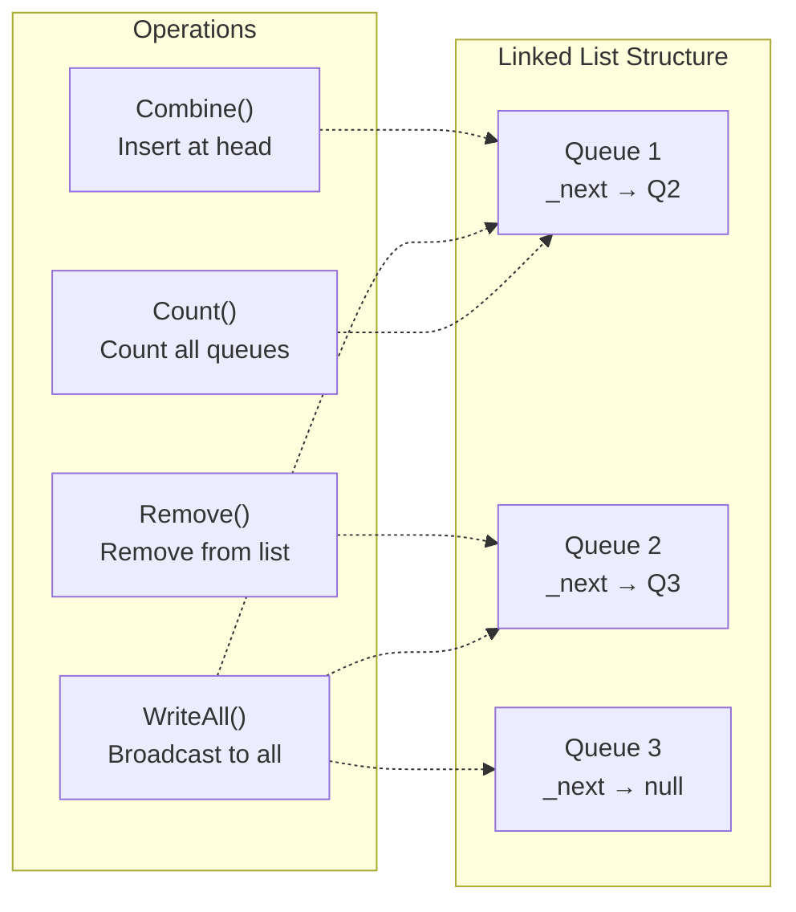
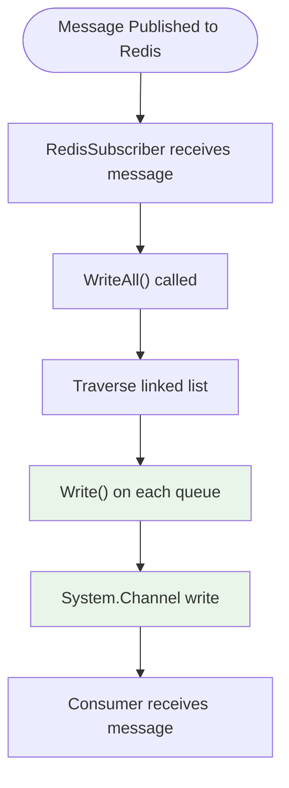
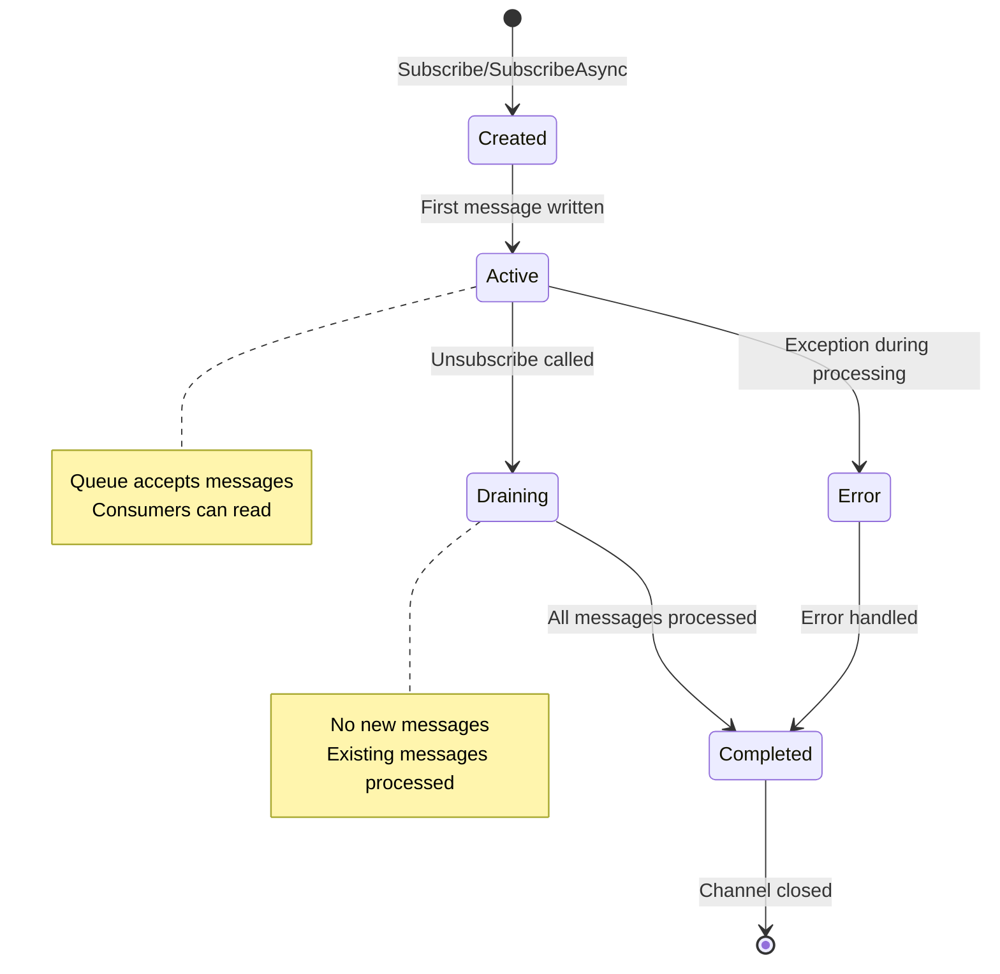

# ChannelMessageQueue Module Documentation

## Introduction

The ChannelMessageQueue module provides a high-performance, asynchronous message queuing system for Redis pub/sub operations in the StackExchange.Redis library. It implements a thread-safe, ordered message delivery mechanism that efficiently handles publish/subscribe notifications from Redis channels.

## Overview

The ChannelMessageQueue module consists of two primary components:
- **ChannelMessage**: A lightweight struct representing individual pub/sub messages
- **ChannelMessageQueue**: A sealed class that manages ordered message delivery and provides multiple consumption patterns

This module is part of the [PubSubSupport](PubSubSupport.md) system and integrates closely with [RedisSubscriber](RedisSubscriber.md) to provide reliable message delivery for Redis pub/sub operations.

## Architecture

### Component Structure



### Message Flow Architecture



## Core Components

### ChannelMessage Structure

The `ChannelMessage` struct represents a single pub/sub notification with the following properties:

- **Channel**: The Redis channel the message was broadcast to
- **SubscriptionChannel**: The channel the subscription was created from (via the queue)
- **Message**: The actual value that was broadcast
- **Queue Reference**: Internal reference to the parent ChannelMessageQueue



### ChannelMessageQueue Class

The `ChannelMessageQueue` class provides a comprehensive message queuing solution:



## Key Features

### 1. Multiple Consumption Patterns

The module supports three distinct message consumption patterns:

#### Synchronous Handler
```csharp
queue.OnMessage(message => {
    // Process message synchronously
    Console.WriteLine($"Received: {message.Channel}: {message.Message}");
});
```

#### Asynchronous Handler
```csharp
queue.OnMessage(async message => {
    // Process message asynchronously
    await ProcessMessageAsync(message);
});
```

#### Manual Consumption
```csharp
// Using IAsyncEnumerable
await foreach (var message in queue)
{
    // Process each message
}

// Or manual read
while (await queue.Reader.WaitToReadAsync())
{
    while (queue.Reader.TryRead(out var message))
    {
        // Process message
    }
}
```

### 2. Thread-Safe Operations

The implementation uses several concurrency mechanisms:

- **Single Writer Channel**: Configured with `SingleWriter = true` for optimal performance
- **Multiple Readers**: Supports `SingleReader = false` for concurrent consumption
- **Lock-Free Linked List**: Uses `Interlocked.CompareExchange` for queue management
- **Volatile Reads**: Ensures memory visibility across threads

### 3. Linked List Management

Multiple ChannelMessageQueue instances are managed as a linked list for efficient bulk operations:



## Data Flow

### Message Publishing Flow



### Queue Lifecycle



## Integration Points

### RedisSubscriber Integration

The ChannelMessageQueue works closely with [RedisSubscriber](RedisSubscriber.md):

- **Creation**: Queues are created via `ISubscriber.Subscribe()` methods
- **Message Routing**: RedisSubscriber routes incoming messages to appropriate queues
- **Unsubscription**: Handles cleanup when subscriptions are removed
- **Error Handling**: Reports internal errors back to the multiplexer

### Channel Configuration

Uses `System.Threading.Channels` with optimized settings:

```csharp
private static readonly UnboundedChannelOptions s_ChannelOptions = new UnboundedChannelOptions
{
    SingleWriter = true,        // Only one writer for performance
    SingleReader = false,       // Multiple readers supported
    AllowSynchronousContinuations = false, // Prevent thread hijacking
};
```

## Performance Characteristics

### Memory Efficiency

- **Struct-based Messages**: ChannelMessage is a struct to minimize allocations
- **Queue Reference**: Stores reference to parent queue instead of duplicating channel information
- **Unbounded Channel**: No artificial limits on queue size

### Concurrency Optimization

- **Lock-Free Operations**: Uses Interlocked operations for list management
- **Volatile Semantics**: Ensures proper memory visibility
- **Thread Pool Integration**: Uses ThreadPool for message processing loops

### Error Handling

- **Graceful Degradation**: Continues processing even if individual handlers fail
- **Exception Isolation**: Handler exceptions don't affect other consumers
- **Internal Error Reporting**: Reports critical errors to the connection multiplexer

## Usage Examples

### Basic Subscription and Consumption

```csharp
// Subscribe to a channel
var subscriber = connectionMultiplexer.GetSubscriber();
var queue = await subscriber.SubscribeAsync("my-channel");

// Process messages asynchronously
queue.OnMessage(message => 
{
    Console.WriteLine($"Channel: {message.Channel}");
    Console.WriteLine($"Message: {message.Message}");
});

// Unsubscribe when done
await queue.UnsubscribeAsync();
```

### Manual Message Consumption

```csharp
// Using IAsyncEnumerable
await foreach (var message in queue)
{
    ProcessMessage(message);
    if (shouldStop) break;
}

// Manual reading with cancellation
var cts = new CancellationTokenSource();
var task = Task.Run(async () =>
{
    while (!cts.Token.IsCancellationRequested)
    {
        try
        {
            var message = await queue.ReadAsync(cts.Token);
            ProcessMessage(message);
        }
        catch (OperationCanceledException)
        {
            break;
        }
    }
});
```

### Multiple Queue Management

```csharp
// The module supports linked list operations for managing multiple queues
// This is used internally by RedisSubscriber for efficient bulk operations

// Combine queues (internal operation)
ChannelMessageQueue.Combine(ref headQueue, newQueue);

// Write to all queues (internal operation)
ChannelMessageQueue.WriteAll(ref headQueue, channel, message);

// Count total queues (internal operation)
int totalQueues = ChannelMessageQueue.Count(ref headQueue);
```

## Thread Safety

All public operations are thread-safe:

- **Message Writing**: Single-writer channel ensures ordered delivery
- **Message Reading**: Multiple readers can consume concurrently
- **Queue Management**: Linked list operations use atomic operations
- **Unsubscription**: Safe to call from any thread

## Related Modules

- **[PubSubSupport](PubSubSupport.md)**: Parent module containing RedisSubscriber and subscription management
- **[RedisSubscriber](RedisSubscriber.md)**: Creates and manages ChannelMessageQueue instances
- **[ValueTypes](ValueTypes.md)**: Provides RedisChannel and RedisValue types used in messages
- **[CoreInterfaces](CoreInterfaces.md)**: Defines ISubscriber interface for pub/sub operations

## Best Practices

1. **Choose Appropriate Consumption Pattern**: Use `OnMessage` for simple processing, manual consumption for complex scenarios
2. **Handle Exceptions**: Always wrap handler logic in try-catch blocks
3. **Proper Cleanup**: Always unsubscribe when done to prevent resource leaks
4. **Monitor Queue Health**: Use `TryGetCount()` to monitor backlog if needed
5. **Cancellation Support**: Use cancellation tokens for graceful shutdown

## Version Compatibility

The module includes version-specific optimizations:

- **.NET Core 3.1+**: Uses reflection to access internal channel count for debugging
- **.NET Core 3.0+**: Native `IAsyncEnumerable<T>` support
- **Earlier Versions**: Polyfill implementation for async enumeration