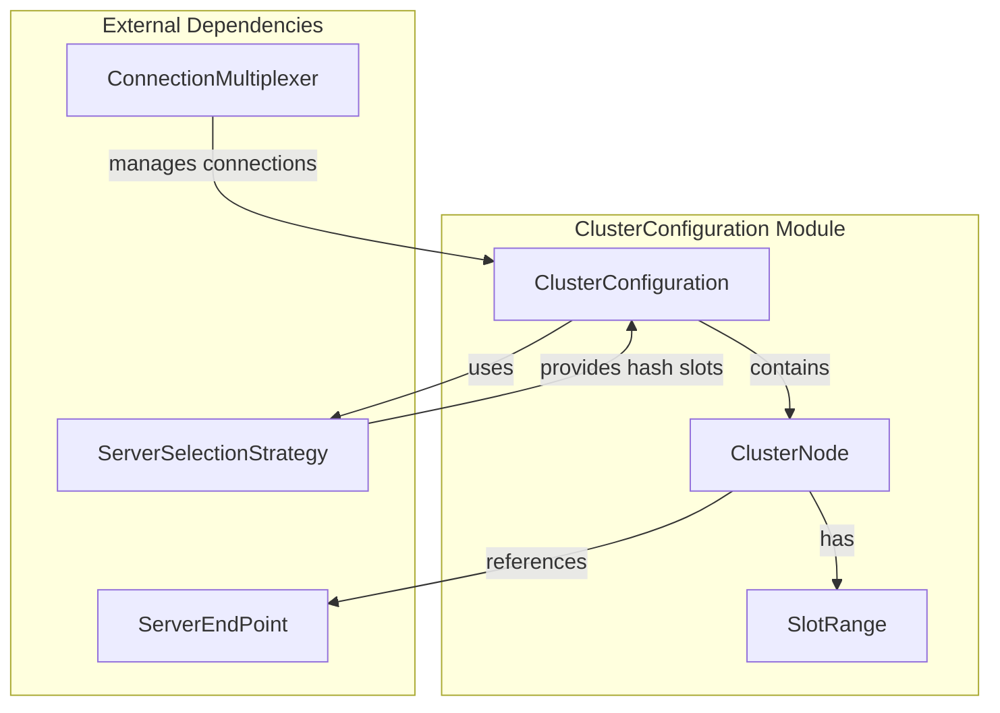
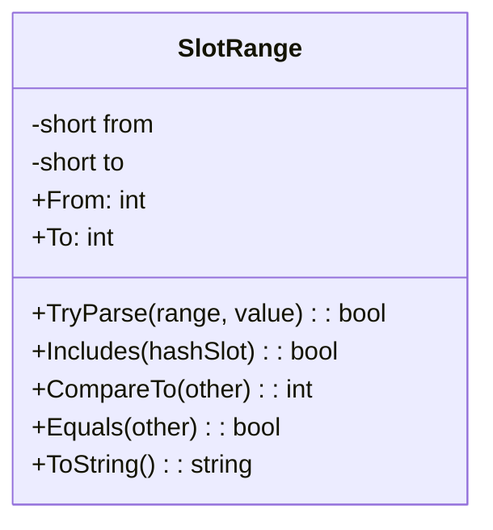
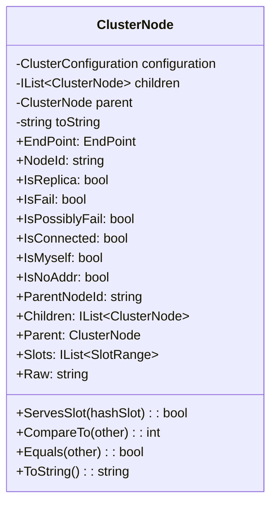
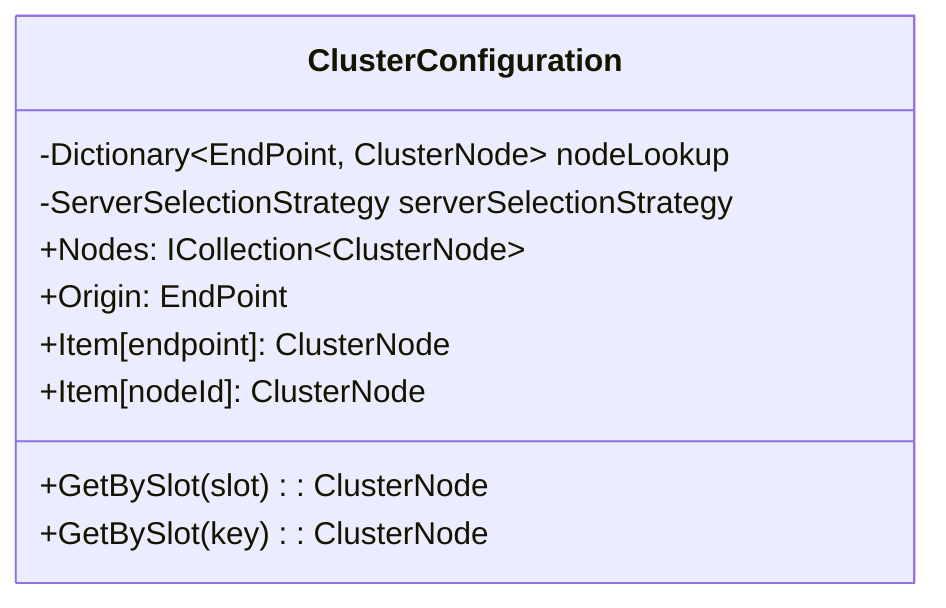
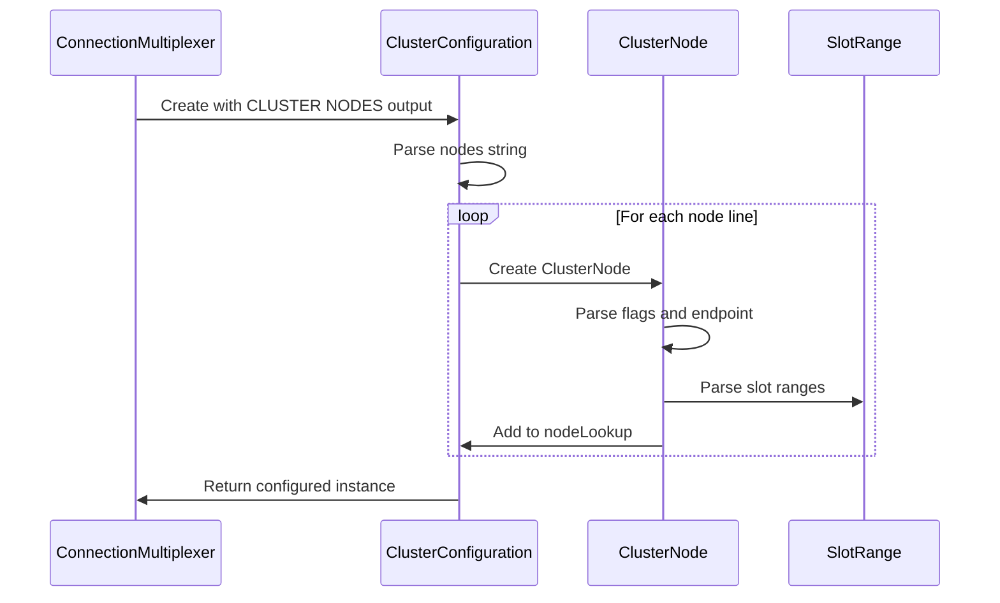
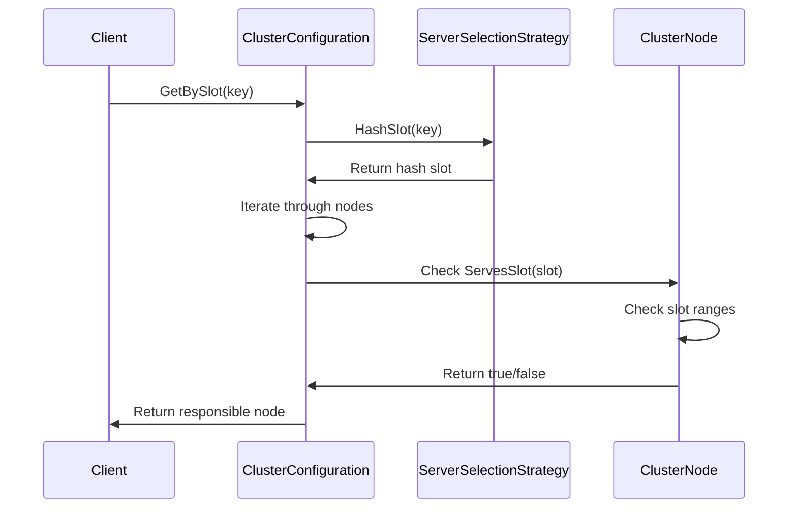
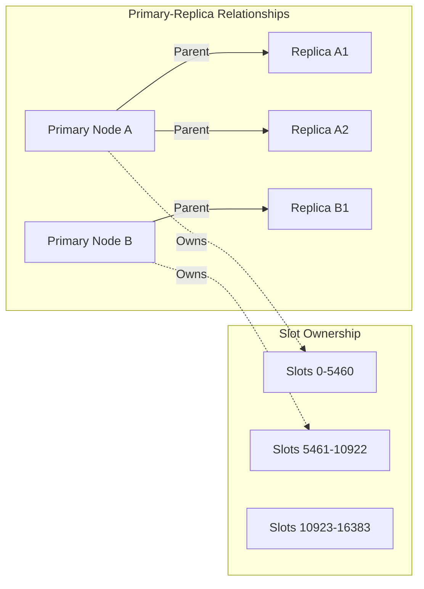

# ClusterConfiguration Module Documentation

## Introduction

The ClusterConfiguration module is a critical component of the StackExchange.Redis library that manages Redis Cluster topology information. It provides the infrastructure for understanding and navigating the distributed nature of Redis Cluster deployments, handling slot assignments, node relationships, and cluster state management. This module enables the client to make intelligent routing decisions and maintain high availability in clustered Redis environments.

## Architecture Overview

The ClusterConfiguration module consists of three primary components that work together to represent and manage Redis Cluster topology:

### Core Components

1. **ClusterConfiguration** - The main configuration container that holds the entire cluster state
2. **ClusterNode** - Represents individual nodes within the cluster with their properties and relationships
3. **SlotRange** - Defines hash slot ranges assigned to cluster nodes

### System Integration

The module integrates with several other system components:
- **ServerSelectionStrategy** - Uses hash slot calculation for key-to-node mapping
- **ConnectionMultiplexer** - Provides cluster-aware connection management
- **ServerEndPoint** - Represents server endpoints in the cluster



## Detailed Component Architecture

### SlotRange Component

The SlotRange struct represents a contiguous range of hash slots (0-16383) in Redis Cluster. It provides:

- **Range Management**: Defines start and end slots for node assignments
- **Parsing Logic**: Converts string representations (e.g., "1-12") to SlotRange objects
- **Slot Inclusion**: Determines if a specific hash slot falls within the range
- **Comparison Operations**: Supports sorting and equality comparisons



### ClusterNode Component

The ClusterNode class represents an individual Redis Cluster node with comprehensive state information:

- **Node Identity**: Unique node ID, endpoint, and role (primary/replica)
- **Cluster State**: Connection status, failure states, and flags
- **Slot Ownership**: Hash slot ranges served by this node
- **Replication Topology**: Parent-child relationships for replica management
- **Dynamic Updates**: Handles cluster topology changes and node state transitions



### ClusterConfiguration Component

The ClusterConfiguration class serves as the central repository for cluster topology information:

- **Node Registry**: Dictionary-based lookup of nodes by endpoint
- **Slot Resolution**: Maps hash slots to responsible nodes
- **Origin Tracking**: Maintains reference to the node that provided configuration
- **Conflict Resolution**: Handles duplicate node entries during topology changes
- **Dynamic Updates**: Processes CLUSTER NODES output to build cluster state



## Data Flow Architecture

### Configuration Initialization Flow



### Slot Resolution Flow



## Component Interactions

### Node Relationship Management

The ClusterConfiguration module maintains complex node relationships:



### Error Handling and Resilience

The module implements several resilience patterns:

1. **NoAddr Node Filtering**: Skips nodes that cannot be addressed
2. **Failed Node Handling**: Excludes nodes in failed states
3. **Duplicate Resolution**: Handles conflicting node entries gracefully
4. **Origin Fallback**: Uses provided origin when node self-identification fails

## Integration with System Architecture

### Connection Management Integration

The ClusterConfiguration module works closely with [ConnectionManagement](ConnectionManagement.md) components:

- **ServerEndPoint**: Provides endpoint information for connection establishment
- **ConnectionMultiplexer**: Uses cluster configuration for intelligent routing
- **ServerSelectionStrategy**: Calculates hash slots for key distribution

### Server Management Integration

Integration with [ServerManagement](ServerManagement.md) components:

- **RedisServer**: Uses cluster configuration for server operations
- **ServerCounters**: Tracks cluster-specific metrics

## Key Features and Capabilities

### Dynamic Cluster State Management

- **Real-time Updates**: Processes CLUSTER NODES output to reflect current topology
- **Node State Tracking**: Monitors connection status, failure states, and role changes
- **Slot Rebalancing**: Handles slot migrations and reassignments

### Intelligent Routing

- **Hash Slot Calculation**: Uses CRC16 algorithm for key-to-slot mapping
- **Primary Preference**: Routes operations to primary nodes when possible
- **Replica Awareness**: Supports read operations from replica nodes

### Fault Tolerance

- **Node Failure Detection**: Identifies and excludes failed nodes
- **Topology Resilience**: Handles network partitions and split-brain scenarios
- **Graceful Degradation**: Continues operation with available nodes

## Usage Patterns

### Basic Cluster Navigation

```csharp
// Get cluster configuration from connection
var config = connection.GetClusterConfiguration();

// Find node by endpoint
var node = config[someEndpoint];

// Find node responsible for key
var responsibleNode = config.GetBySlot("mykey");
```

### Slot Range Operations

```csharp
// Parse slot range
if (SlotRange.TryParse("0-5460", out var range))
{
    // Check if slot is in range
    bool contains = range.Includes(1000);
}
```

### Node Relationship Queries

```csharp
// Get primary node for a replica
var primary = replicaNode.Parent;

// Get all replicas for a primary
var replicas = primaryNode.Children;
```

## Performance Considerations

### Memory Efficiency

- **Struct-based SlotRange**: Minimizes memory allocation for slot ranges
- **Lazy Initialization**: Defers expensive operations like child node resolution
- **String Interning**: Caches string representations to reduce allocations

### Lookup Performance

- **Dictionary-based Node Lookup**: O(1) endpoint-to-node resolution
- **Slot-based Node Resolution**: Efficient iteration for slot ownership
- **Cached Relationships**: Maintains parent-child relationships for quick access

## Error Scenarios and Handling

### Cluster Partition Handling

When cluster partitions occur, the module:
1. Maintains multiple node views from different partition perspectives
2. Filters out unreachable nodes based on connection status
3. Provides best-effort routing with available information

### Configuration Conflicts

For conflicting node information:
1. Prefers connected nodes over disconnected ones
2. Maintains existing entries when new information is stale
3. Allows multiple disconnected nodes to coexist until resolution

## Future Considerations

### Scalability Enhancements

- **Parallel Processing**: Multi-threaded cluster state processing
- **Incremental Updates**: Differential updates instead of full rebuilds
- **Memory Optimization**: Further reduction in memory footprint

### Advanced Features

- **Cluster Health Monitoring**: Integrated health checking and reporting
- **Predictive Routing**: Machine learning-based routing optimization
- **Cross-Cluster Support**: Multi-cluster federation capabilities

## Related Documentation

- [ConnectionManagement](ConnectionManagement.md) - Connection establishment and management
- [ServerManagement](ServerManagement.md) - Server operation and monitoring
- [ServerSelectionStrategy](ServerSelectionStrategy.md) - Hash slot calculation and server selection
- [ConfigurationOptions](ConfigurationOptions.md) - Configuration and options management