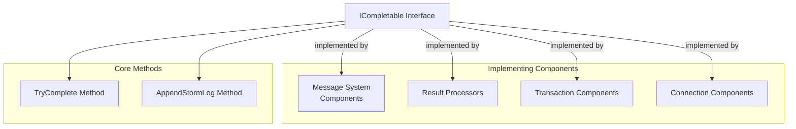
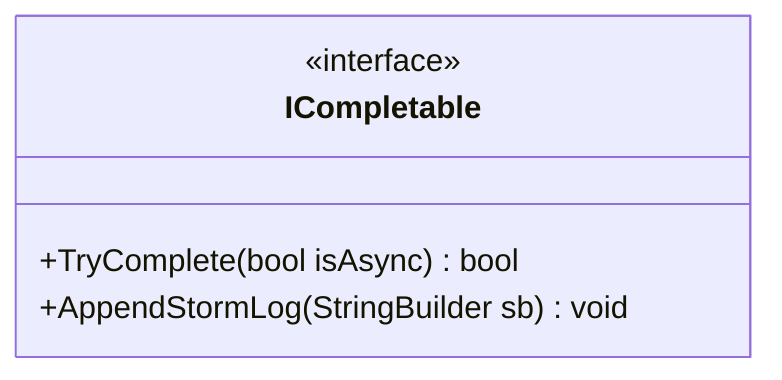
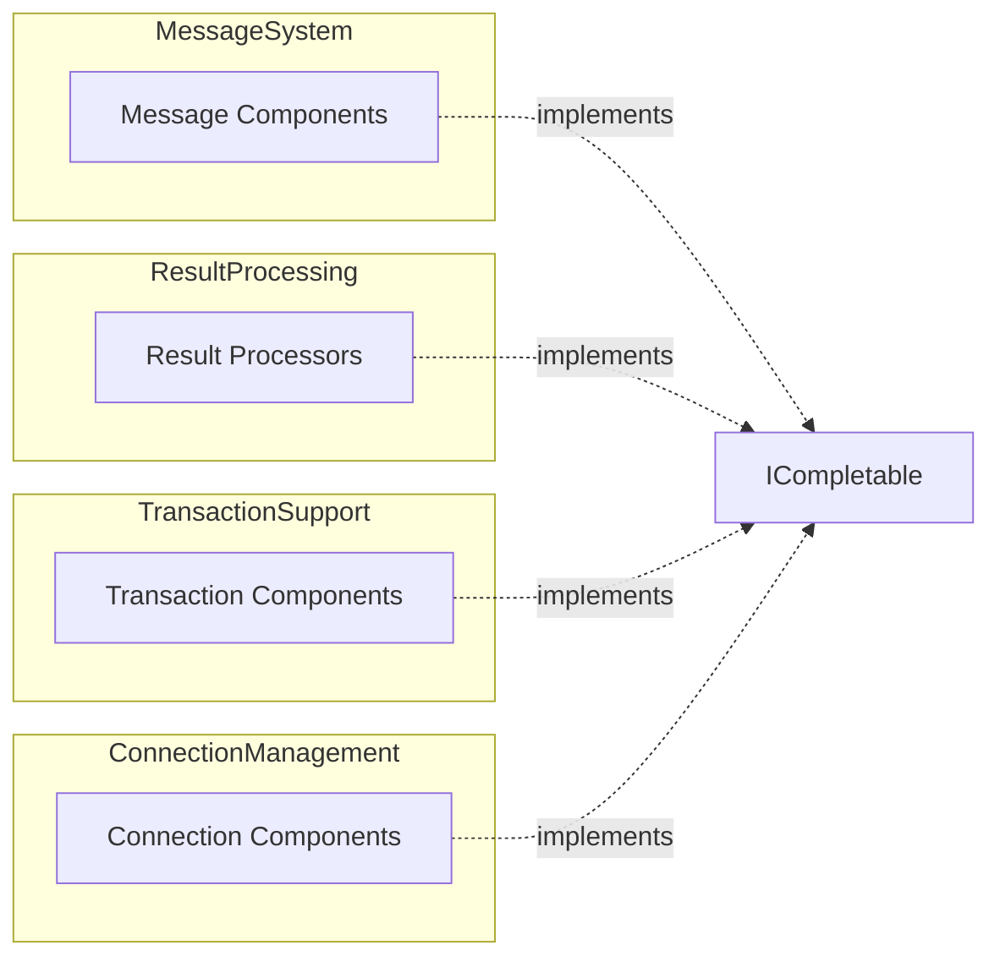
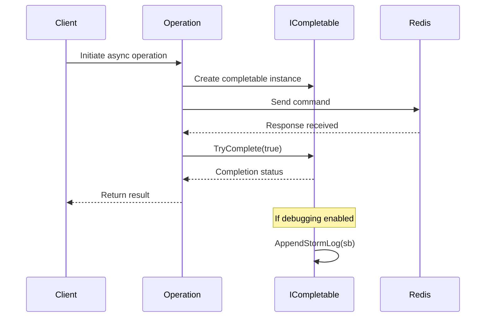

# CompletionManagement Module Documentation

## Introduction

The CompletionManagement module provides the foundational interface for handling asynchronous operation completion within the StackExchange.Redis client library. This module defines the `ICompletable` interface, which serves as a contract for components that need to track and manage the completion state of Redis operations, particularly in asynchronous contexts.

## Core Purpose

The primary purpose of this module is to establish a standardized mechanism for:
- Tracking the completion status of Redis operations
- Providing diagnostic information through storm logging
- Enabling proper asynchronous operation lifecycle management
- Supporting the internal operation tracking system

## Architecture

### Component Overview

### Interface Definition

## Core Interface: ICompletable

### Methods

#### TryComplete(bool isAsync)
- **Purpose**: Attempts to complete the operation
- **Parameters**: 
  - `isAsync`: Boolean indicating whether the completion is happening in an asynchronous context
- **Returns**: Boolean indicating whether the operation was successfully completed
- **Usage**: This method is called to finalize the operation and should handle any completion-related logic

#### AppendStormLog(StringBuilder sb)
- **Purpose**: Appends diagnostic information to a string builder for debugging and logging purposes
- **Parameters**: 
  - `sb`: StringBuilder instance to append log information to
- **Returns**: void
- **Usage**: Provides detailed state information for troubleshooting and monitoring

## Dependencies and Integration

### Relationship to Other Modules

### Integration Points

The `ICompletable` interface is implemented by various components across the Redis client library:

1. **Message System**: Message components implement this interface to track message completion
2. **Result Processing**: Result processors use this to manage the completion of result processing operations
3. **Transaction Support**: Transaction components implement this to handle transaction completion
4. **Connection Management**: Connection-related components use this for connection state management

## Usage Patterns

### Asynchronous Operation Flow

### Storm Logging Integration

The `AppendStormLog` method plays a crucial role in the diagnostic system by providing detailed state information that can be used for:
- Operation debugging
- Performance analysis
- Connection health monitoring
- Error investigation

## Implementation Guidelines

### Best Practices

1. **Thread Safety**: Implementations should be thread-safe as completion can happen from different threads
2. **State Management**: Properly manage internal state to avoid race conditions
3. **Error Handling**: Include error information in storm logs when operations fail
4. **Performance**: Keep `TryComplete` implementations lightweight for performance

### Error Scenarios

The interface handles various error scenarios:
- Network timeouts
- Connection failures
- Protocol errors
- Resource exhaustion

## Module Relationships

This module serves as a foundational interface that enables proper operation lifecycle management across the entire Redis client library. It provides the contract that allows different subsystems to participate in the completion tracking mechanism.

### Related Documentation

- [MessageSystem](MessageSystem.md) - For message-level completion handling
- [ResultProcessing](ResultProcessing.md) - For result processing completion patterns
- [TransactionSupport](TransactionSupport.md) - For transaction completion management
- [ConnectionManagement](ConnectionManagement.md) - For connection state completion

## Summary

The CompletionManagement module, while simple in its interface definition, provides a critical foundation for operation lifecycle management in the StackExchange.Redis client. The `ICompletable` interface enables consistent completion tracking and diagnostic capabilities across all major subsystems, ensuring reliable operation execution and comprehensive debugging support.