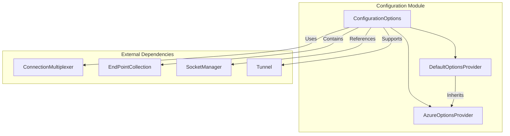
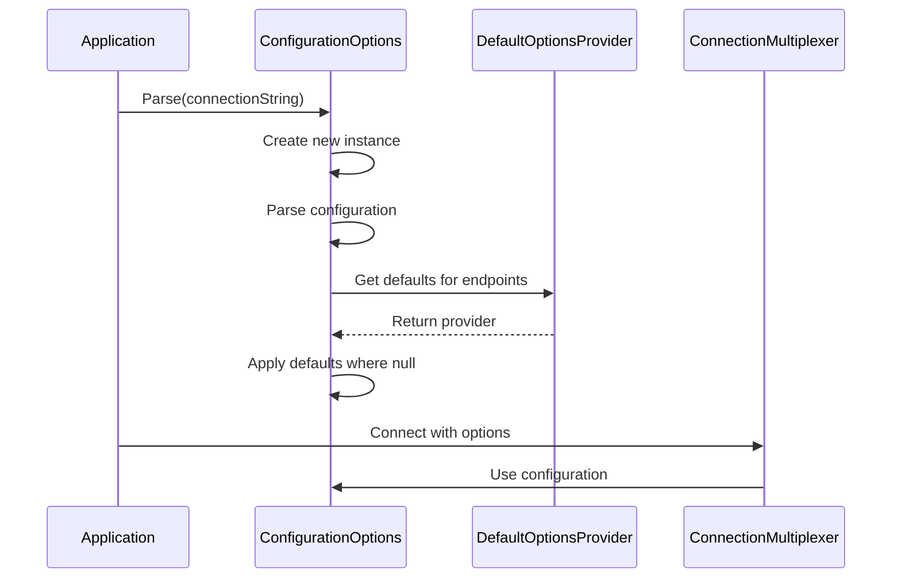

# Configuration Module Documentation

## Overview

The Configuration module is a fundamental component of the StackExchange.Redis library that manages connection settings, authentication, and behavior configuration for Redis connections. It provides a centralized way to configure how the library connects to Redis servers, handles timeouts, manages SSL/TLS encryption, and defines various operational parameters.

## Purpose

The Configuration module serves as the entry point for setting up Redis connections by:
- Defining connection endpoints and authentication credentials
- Configuring timeouts, retry policies, and connection behavior
- Managing SSL/TLS settings and certificate validation
- Providing environment-specific defaults through extensible providers
- Supporting both connection string parsing and programmatic configuration

## Architecture



## Core Components

### [ConfigurationOptions](ConfigurationOptions.md)
The main configuration class that holds all connection settings and provides parsing capabilities for connection strings. It implements `ICloneable` to support configuration copying and includes extensive validation for all configuration parameters.

### [DefaultOptionsProvider](DefaultOptionsProvider.md)
A base provider class that supplies default values for configuration options when not explicitly set. It includes built-in providers for different environments and supports custom provider registration.

### [AzureOptionsProvider](AzureOptionsProvider.md)
A specialized provider for Azure Redis environments that automatically configures optimal settings for Azure Redis Cache, including SSL defaults and maintenance event handling.

## Key Features

### Connection String Parsing
- Supports comma-delimited configuration strings
- Validates all configuration parameters
- Provides backward compatibility with deprecated options
- Allows unknown option handling for extensibility

### SSL/TLS Configuration
- Automatic SSL detection based on port numbers
- Certificate validation and selection callbacks
- Support for custom certificate authorities
- SSL protocol configuration

### Environment-Specific Defaults
- Extensible provider system for different environments
- Built-in Azure Redis optimization
- Automatic provider selection based on endpoints
- Custom provider registration support

### Authentication
- Username and password authentication
- Certificate-based authentication
- Support for Redis 6+ ACL (Access Control Lists)

## Configuration Flow



## Integration with Other Modules

The Configuration module is used by several other modules in the StackExchange.Redis library:

- **[ConnectionManagement](ConnectionManagement.md)**: Uses configuration for establishing and managing connections
- **[DatabaseOperations](DatabaseOperations.md)**: References configuration for timeout and retry settings
- **[ServerManagement](ServerManagement.md)**: Utilizes configuration for server-specific settings

## Usage Examples

### Basic Configuration
```csharp
var config = ConfigurationOptions.Parse("localhost:6379,allowAdmin=true");
```

### Programmatic Configuration
```csharp
var config = new ConfigurationOptions
{
    EndPoints = { "localhost:6379" },
    AllowAdmin = true,
    ConnectTimeout = 5000,
    Password = "mypassword"
};
```

### Azure Redis Configuration
```csharp
var config = ConfigurationOptions.Parse("myapp.redis.cache.windows.net:6380,password=...,ssl=true");
// AzureOptionsProvider automatically applies optimal settings
```

## Security Considerations

- Passwords are masked in `ToString()` output by default
- SSL/TLS encryption is automatically enabled for known secure ports
- Certificate validation can be customized for specific requirements
- High integrity mode provides additional protocol validation

## Performance Considerations

- Configuration options are memoized when ConnectionMultiplexer connects
- Some options cannot be changed after initial connection
- Default values are optimized for typical use cases
- Extensive validation may impact parsing performance for complex configurations