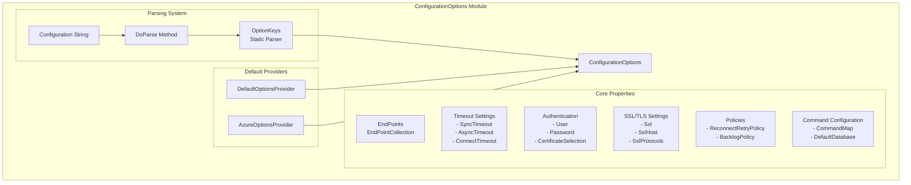
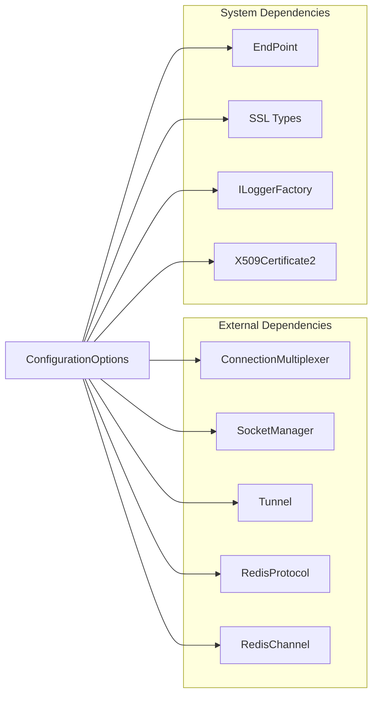
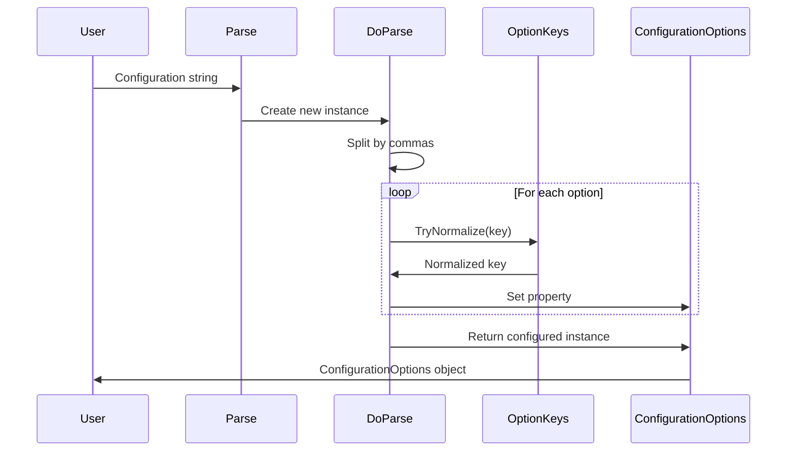
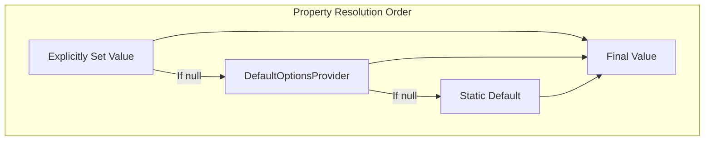
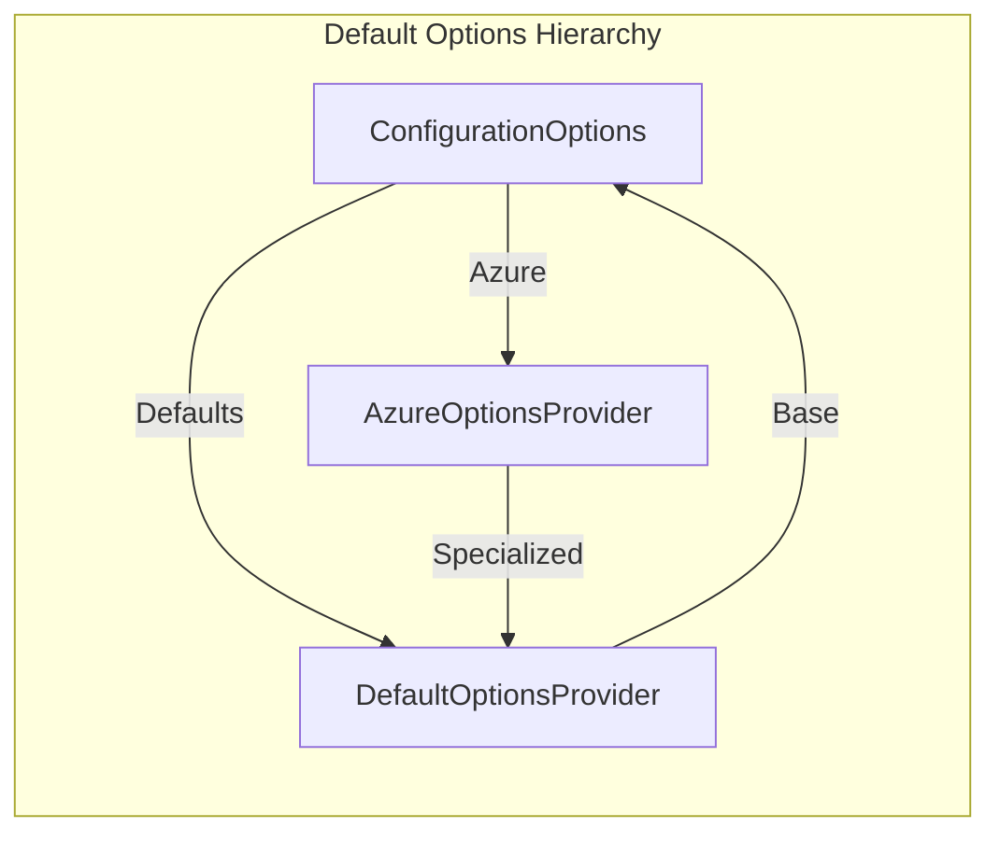
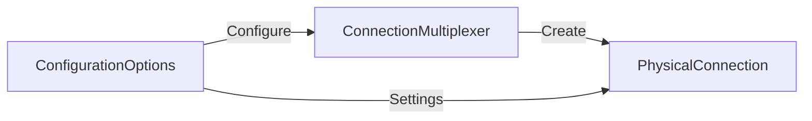
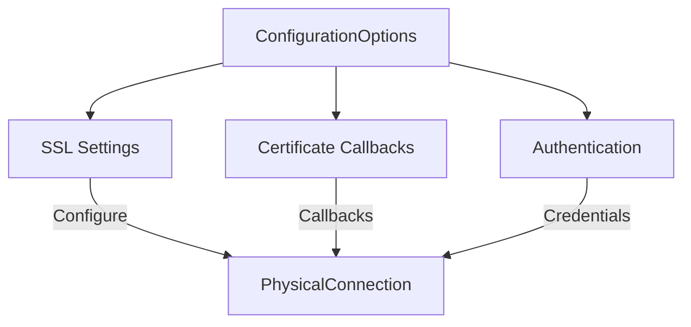
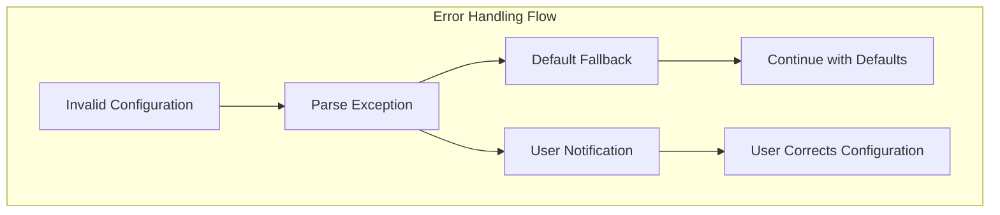

# ConfigurationOptions Module Documentation

## Overview

The ConfigurationOptions module is the central configuration system for StackExchange.Redis, providing a comprehensive and flexible way to configure Redis connections. It serves as the primary entry point for setting up connection parameters, security settings, timeouts, and behavior policies that govern how the Redis client operates.

## Purpose and Core Functionality

ConfigurationOptions acts as a configuration container and parser that:
- Defines connection parameters for Redis servers (endpoints, timeouts, authentication)
- Configures security settings (SSL/TLS, certificate validation, authentication)
- Sets behavior policies (retry logic, heartbeat intervals, command mapping)
- Provides both programmatic and string-based configuration capabilities
- Supports advanced features like proxy configuration, tunneling, and protocol selection

## Architecture

### Component Structure



### Key Dependencies



## Configuration Flow

### Configuration Parsing Process



### Property Resolution Hierarchy



## Core Components

### ConfigurationOptions Class

The main configuration class that encapsulates all Redis connection settings:

#### Connection Settings
- **EndPoints**: Collection of Redis server endpoints
- **DefaultDatabase**: Default database index (0-15)
- **ClientName**: Client identification name
- **ServiceName**: Sentinel service name for high availability

#### Timeout Configuration
- **SyncTimeout**: Timeout for synchronous operations (default: 5 seconds)
- **AsyncTimeout**: Timeout for asynchronous operations
- **ConnectTimeout**: Connection establishment timeout
- **KeepAlive**: Keep-alive ping interval

#### Security Settings
- **Ssl**: Enable SSL/TLS encryption
- **SslHost**: SSL certificate validation host
- **SslProtocols**: Allowed SSL/TLS protocols
- **User/Password**: Authentication credentials
- **CertificateSelection/Validation**: Certificate handling callbacks

#### Behavior Policies
- **ReconnectRetryPolicy**: Strategy for connection retries
- **BacklogPolicy**: Command queuing behavior during reconnection
- **CommandMap**: Redis command availability mapping
- **AbortOnConnectFail**: Fail-fast behavior on connection failure

### Configuration String Parsing

The module supports parsing configuration strings with the format:
```
server1:6379,server2:6379,password=pass,ssl=true,abortConnect=false
```

#### Supported Options
- Connection: `server`, `port`, `defaultDatabase`
- Authentication: `password`, `user`, `ssl`, `sslProtocols`
- Timeouts: `syncTimeout`, `asyncTimeout`, `connectTimeout`, `keepAlive`
- Behavior: `abortConnect`, `allowAdmin`, `resolveDns`, `proxy`
- Advanced: `tiebreaker`, `configChannel`, `channelPrefix`

### Default Options Provider System



## Integration with Other Modules

### ConnectionMultiplexer Integration

ConfigurationOptions is consumed by [ConnectionMultiplexer](ConnectionManagement.md) to establish and manage Redis connections:



### Security Module Integration

Security settings flow to connection establishment:



## Advanced Features

### Certificate Management

The module provides comprehensive certificate handling:

```csharp
// Trust specific issuer
config.TrustIssuer("path/to/ca.crt");

// Set client certificate (PFX)
config.SetUserPfxCertificate("client.pfx", "password");

// Set client certificate (PEM) - .NET 5+
config.SetUserPemCertificate("client.crt", "client.key");
```

### Protocol Selection

Supports both RESP2 and RESP3 protocols:

```csharp
// Explicit protocol selection
config.Protocol = RedisProtocol.Resp3;

// Automatic detection (currently RESP2 by default)
// RESP3 requires explicit opt-in due to API compatibility
```

### Tunnel Support

Supports HTTP proxy tunneling for restricted environments:

```csharp
// HTTP proxy configuration
config.Tunnel = Tunnel.HttpProxy(new DnsEndPoint("proxy.example.com", 8080));
```

## Configuration Best Practices

### Performance Tuning
```csharp
var config = new ConfigurationOptions
{
    // Connection pooling
    ConnectTimeout = 5000,
    SyncTimeout = 5000,
    AsyncTimeout = 5000,
    
    // Keep-alive for connection health
    KeepAlive = 60,
    
    // Retry policy for resilience
    ReconnectRetryPolicy = new LinearRetry(500),
    
    // Backlog for command queuing
    BacklogPolicy = BacklogPolicy.Default
};
```

### Security Configuration
```csharp
var config = new ConfigurationOptions
{
    // SSL/TLS encryption
    Ssl = true,
    SslProtocols = SslProtocols.Tls12 | SslProtocols.Tls13,
    
    // Certificate validation
    CertificateValidation += (sender, certificate, chain, sslPolicyErrors) =>
    {
        // Custom validation logic
        return true;
    }
};
```

### High Availability
```csharp
var config = new ConfigurationOptions
{
    // Sentinel configuration
    ServiceName = "mymaster",
    
    // Multiple endpoints
    EndPoints = { "sentinel1:26379", "sentinel2:26379", "sentinel3:26379" },
    
    // Tie-breaker for split-brain scenarios
    TieBreaker = "__Booksleeve_TieBreak"
};
```

## Error Handling and Validation

### Configuration Validation

The module performs extensive validation during parsing:
- **Type validation**: Ensures correct data types for each option
- **Range validation**: Validates numeric ranges (timeouts, retry counts)
- **Enum validation**: Ensures valid enumeration values
- **Format validation**: Validates endpoint formats and connection strings

### Error Recovery



## Thread Safety and Immutability

ConfigurationOptions is designed to be:
- **Thread-safe for reading**: Properties can be safely read after creation
- **Immutable after use**: Once used by ConnectionMultiplexer, changes have no effect
- **Cloneable**: Supports deep cloning for configuration variations

## Migration and Compatibility

### Version Compatibility
- Maintains backward compatibility with older Redis versions
- Supports protocol negotiation for mixed-version clusters
- Provides deprecation warnings for obsolete options

### Migration Patterns
```csharp
// From connection string
var config = ConfigurationOptions.Parse("localhost:6379,password=pass");

// To programmatic configuration
var config = new ConfigurationOptions
{
    EndPoints = { "localhost:6379" },
    Password = "pass"
};
```

## References

- [ConnectionManagement](ConnectionManagement.md) - Uses ConfigurationOptions for connection establishment
- [CoreInterfaces](CoreInterfaces.md) - IReconnectRetryPolicy interface for retry policies
- [ValueTypes](ValueTypes.md) - RedisChannel and related configuration types