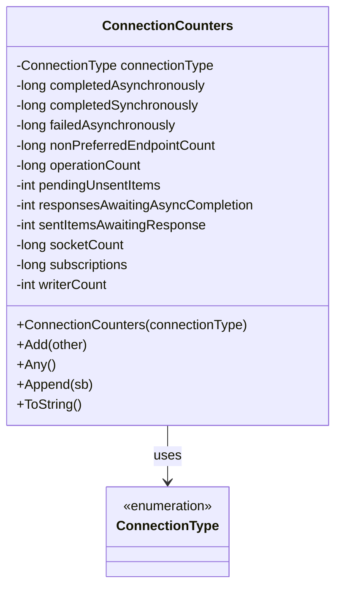
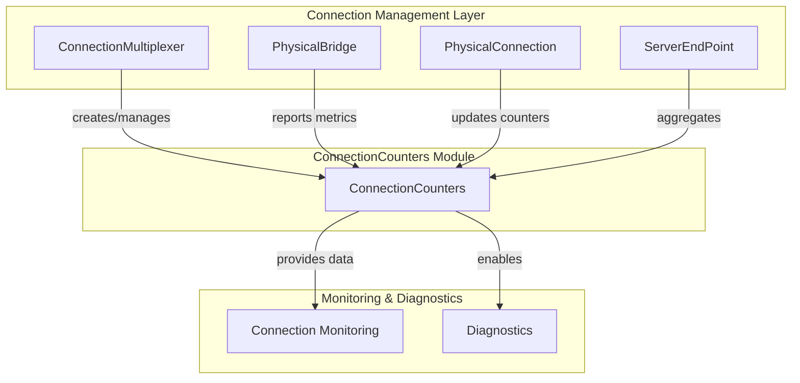
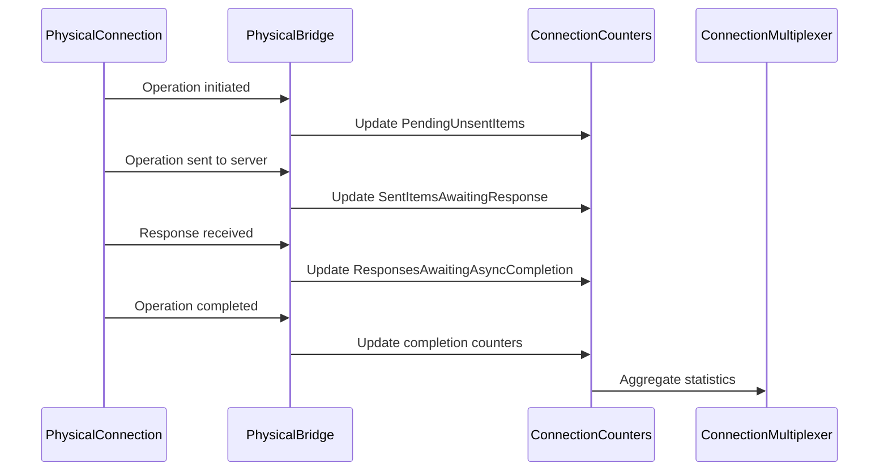
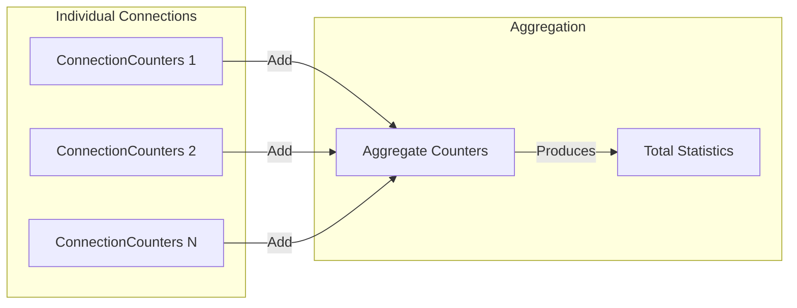

# ConnectionCounters Module Documentation

## Overview

The ConnectionCounters module provides comprehensive metrics and statistics tracking for individual Redis connections within the StackExchange.Redis client library. This module serves as the primary mechanism for monitoring connection health, performance characteristics, and operational statistics across the connection lifecycle.

## Purpose and Core Functionality

ConnectionCounters captures and maintains detailed operational metrics for each connection type, enabling developers and system administrators to:
- Monitor connection performance and health
- Track operation completion patterns (synchronous vs asynchronous)
- Identify bottlenecks and performance issues
- Analyze connection utilization patterns
- Debug connection-related problems

## Architecture

### Component Structure



### Integration with Connection Management



## Core Components

### ConnectionCounters Class

The `ConnectionCounters` class is the primary component that encapsulates all connection metrics and statistics. It provides a comprehensive view of connection performance and health through various counter properties.

#### Key Properties

**Operation Tracking:**
- `OperationCount`: Total operations performed on the connection
- `CompletedSynchronously`: Operations completed synchronously
- `CompletedAsynchronously`: Operations completed asynchronously
- `FailedAsynchronously`: Operations that failed during asynchronous execution

**Queue Management:**
- `PendingUnsentItems`: Operations queued but not yet sent to server
- `SentItemsAwaitingResponse`: Operations sent, awaiting server response
- `ResponsesAwaitingAsyncCompletion`: Responses processed, awaiting async completion
- `TotalOutstanding`: Sum of all outstanding items

**Connection Health:**
- `IsEmpty`: Indicates no pending items or failures
- `SocketCount`: Total sockets used (including reconnects)
- `Subscriptions`: Active subscription count
- `NonPreferredEndpointCount`: Operations sent to non-preferred endpoints

#### Key Methods

**Aggregation:**
- `Add(ConnectionCounters other)`: Merges counters from another instance
- `Any()`: Checks if any counters have non-zero values

**Formatting:**
- `Append(StringBuilder sb)`: Appends formatted counter data to StringBuilder
- `ToString()`: Returns formatted string representation

## Data Flow

### Counter Update Flow



### Metrics Aggregation



## Usage Patterns

### Monitoring Connection Health

```csharp
// Check if connection has pending work
if (!connectionCounters.IsEmpty)
{
    var outstanding = connectionCounters.TotalOutstanding;
    // Take action based on outstanding operations
}

// Monitor operation completion patterns
var asyncRatio = (double)connectionCounters.CompletedAsynchronously / 
                 connectionCounters.OperationCount;
```

### Performance Analysis

```csharp
// Analyze queue depths
var pending = connectionCounters.PendingUnsentItems;
var awaitingResponse = connectionCounters.SentItemsAwaitingResponse;
var asyncCompletion = connectionCounters.ResponsesAwaitingAsyncCompletion;

// Calculate throughput metrics
var totalCompleted = connectionCounters.CompletedSynchronously + 
                    connectionCounters.CompletedAsynchronously;
```

## Integration Points

### ConnectionMultiplexer Integration

ConnectionCounters instances are created and managed by the [ConnectionMultiplexer](ConnectionMultiplexer.md) for each connection type. The multiplexer aggregates counters across all connections to provide overall system statistics.

### PhysicalBridge Integration

[PhysicalBridge](PhysicalBridge.md) components update ConnectionCounters as operations progress through various stages, from queuing to completion.

### ServerEndPoint Integration

[ServerEndPoint](ServerEndPoint.md) instances maintain ConnectionCounters for each server connection, enabling per-server performance analysis.

## Thread Safety

The ConnectionCounters class is designed for concurrent access with internal properties using thread-safe updates. The `Add` method provides atomic aggregation of counter values.

## Performance Considerations

- Counter updates are lightweight operations with minimal overhead
- String formatting is deferred until explicitly requested via `ToString()` or `Append()`
- Aggregation operations are optimized for bulk updates
- Memory footprint is minimal with value-type properties

## Diagnostic Capabilities

ConnectionCounters provides rich diagnostic information through:
- Operation completion patterns (sync vs async)
- Queue depth analysis
- Error rate tracking
- Connection utilization metrics
- Subscription monitoring

This information is essential for:
- Identifying performance bottlenecks
- Troubleshooting connection issues
- Capacity planning
- Monitoring system health

## Related Modules

- [ConnectionMultiplexer](ConnectionMultiplexer.md) - Manages ConnectionCounters instances
- [PhysicalBridge](PhysicalBridge.md) - Updates counters during operation processing
- [ServerEndPoint](ServerEndPoint.md) - Maintains per-server counter instances
- [ServerManagement](ServerManagement.md) - Aggregates server-level statistics