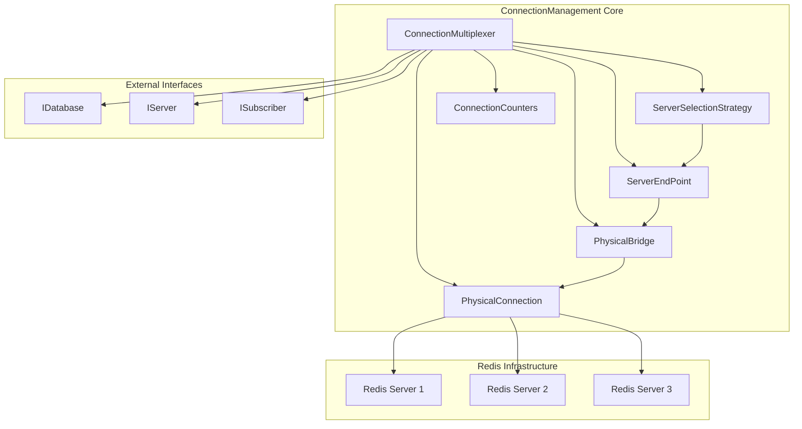

# ConnectionManagement Module Overview

## Purpose

The ConnectionManagement module is the foundational layer of the StackExchange.Redis library, responsible for establishing, maintaining, and orchestrating all network connections to Redis servers. It provides a robust, high-performance abstraction over raw TCP/IP communication while implementing sophisticated features like connection pooling, automatic failover, cluster topology management, and comprehensive health monitoring.

## Architecture

## Core Components

### ConnectionMultiplexer
The central orchestrator that manages a pool of connections to Redis servers. It implements both `IConnectionMultiplexer` and `IInternalConnectionMultiplexer` interfaces, providing connection lifecycle management, server discovery, message routing, and comprehensive error handling. This is the primary entry point for all Redis operations and is designed to be held as a long-lived singleton throughout the application lifetime.

### ServerSelectionStrategy
Implements intelligent server selection logic that determines which Redis server should handle specific commands. It supports Redis Cluster's hash slot algorithm, primary/replica selection based on command requirements, and automatic failover to healthy servers. The strategy considers factors like server roles, availability, command flags, and cluster topology for optimal routing decisions.

### ServerEndPoint
Represents individual Redis server instances within the connection multiplexer. It manages both interactive and subscription connections, maintains server state and configuration, handles auto-configuration of server capabilities, and provides server-specific functionality while coordinating with the overall connection management system.

### PhysicalBridge
Acts as a sophisticated traffic controller between logical operations and physical connections. It implements a single-writer pattern to prevent message reordering, manages message queuing and backlog processing, provides connection health monitoring, and handles automatic reconnection with exponential backoff.

### PhysicalConnection
Manages low-level TCP/IP communication with Redis servers, implementing the Redis Serialization Protocol (RESP2/RESP3). It handles socket connections, protocol parsing, message serialization, TLS/SSL encryption, and maintains detailed connection state and performance metrics.

### ConnectionCounters
Provides comprehensive metrics and statistics tracking for individual connections. It monitors operation completion patterns, queue depths, connection health, and performance characteristics, enabling detailed diagnostics and performance analysis.

## Key Features

- **Connection Pooling**: Maintains persistent connections to avoid connection overhead
- **Automatic Failover**: Detects connection failures and automatically reconnects
- **Cluster Support**: Full Redis Cluster compatibility with hash slot routing
- **Health Monitoring**: Comprehensive heartbeat and connection state tracking
- **Load Balancing**: Intelligent distribution of operations across available servers
- **Error Recovery**: Sophisticated error handling with retry policies
- **Performance Optimization**: Zero-copy operations, buffer pooling, and efficient memory management
- **Security**: TLS/SSL support with certificate validation and Redis authentication

## References to Core Components

For detailed documentation of individual components, refer to:

- **[ConnectionMultiplexer](ConnectionMultiplexer.md)**: Central orchestrator and primary API entry point
- **[PhysicalBridge](PhysicalBridge.md)**: Connection bridge management and message coordination
- **[PhysicalConnection](PhysicalConnection.md)**: Low-level network communication and protocol handling
- **[ServerEndPoint](ServerEndPoint.md)**: Individual server representation and management
- **[ServerSelectionStrategy](ServerSelectionStrategy.md)**: Intelligent server selection and routing logic
- **[ConnectionCounters](ConnectionCounters.md)**: Performance metrics and statistics tracking

The ConnectionManagement module serves as the reliable foundation that enables high-performance, scalable Redis operations while abstracting away the complexity of connection management, server discovery, and error recovery.