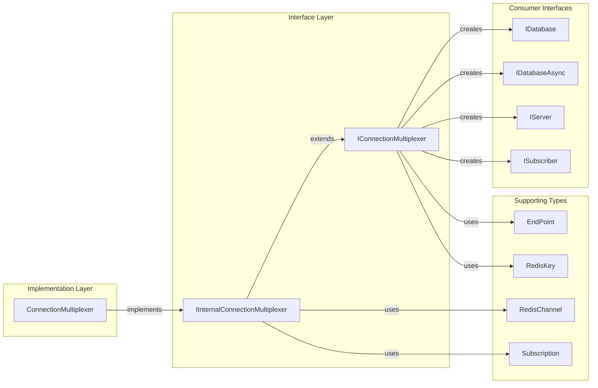

# ConnectionManagementInterfaces Module Documentation

## Introduction

The ConnectionManagementInterfaces module defines the core abstractions for managing Redis connections in the StackExchange.Redis library. It provides the fundamental interfaces that enable connection multiplexing, server management, and connection state monitoring across multiple Redis servers.

This module serves as the foundation for the [ConnectionManagement](ConnectionManagement.md) module, establishing contracts for connection lifecycle management, server selection strategies, and connection state monitoring that are essential for high-performance Redis operations.

## Architecture Overview

The ConnectionManagementInterfaces module is built around two primary interfaces that define the contract for Redis connection management:

### Core Interfaces

1. **IConnectionMultiplexer** - The public interface that provides the primary API for connection management
2. **IInternalConnectionMultiplexer** - The internal interface that extends the public API with additional functionality for internal use

These interfaces work in conjunction with other system components to provide a comprehensive connection management solution.


## Interface Specifications

### IConnectionMultiplexer Interface

The `IConnectionMultiplexer` interface is the primary abstraction for Redis connection management. It provides a unified API for:

- **Connection Lifecycle Management**: Connection establishment, monitoring, and teardown
- **Resource Access**: Database, server, and pub/sub connections
- **Event Handling**: Connection state changes, errors, and configuration updates
- **Performance Monitoring**: Operation counting and performance metrics

#### Key Properties

| Property | Type | Description |
|----------|------|-------------|
| `ClientName` | `string` | Client name used on all new connections |
| `Configuration` | `string` | Connection configuration string |
| `TimeoutMilliseconds` | `int` | Connection timeout in milliseconds |
| `OperationCount` | `long` | Total operations performed across all connections |
| `IsConnected` | `bool` | Indicates if any servers are connected |
| `IsConnecting` | `bool` | Indicates if any servers are connecting |

#### Key Methods

| Method | Return Type | Description |
|--------|-------------|-------------|
| `GetDatabase(int, object?)` | `IDatabase` | Gets an interactive database connection |
| `GetSubscriber(object?)` | `ISubscriber` | Gets a pub/sub subscriber connection |
| `GetServer(string, int, object?)` | `IServer` | Gets server configuration API |
| `GetEndPoints(bool)` | `EndPoint[]` | Gets all defined endpoints |
| `ConfigureAsync(TextWriter?)` | `Task<bool>` | Reconfigures connections based on existing configuration |
| `Close(bool)` | `void` | Closes all connections and releases resources |

#### Events

| Event | Type | Description |
|-------|------|-------------|
| `ErrorMessage` | `EventHandler<RedisErrorEventArgs>` | Raised when server replies with error |
| `ConnectionFailed` | `EventHandler<ConnectionFailedEventArgs>` | Raised when physical connection fails |
| `ConnectionRestored` | `EventHandler<ConnectionFailedEventArgs>` | Raised when physical connection is established |
| `ConfigurationChanged` | `EventHandler<EndPointEventArgs>` | Raised when configuration changes are detected |
| `HashSlotMoved` | `EventHandler<HashSlotMovedEventArgs>` | Raised when hash-slot is relocated |

### IInternalConnectionMultiplexer Interface

The `IInternalConnectionMultiplexer` interface extends `IConnectionMultiplexer` with additional functionality for internal library use:

#### Additional Properties

| Property | Type | Description |
|----------|------|-------------|
| `AllowConnect` | `bool` | Controls whether connections are allowed |
| `IgnoreConnect` | `bool` | Controls whether connection attempts should be ignored |
| `RawConfig` | `ConfigurationOptions` | Raw configuration options |
| `ServerSelectionStrategy` | `ServerSelectionStrategy` | Server selection strategy instance |
| `UnderlyingMultiplexer` | `ConnectionMultiplexer` | Reference to underlying multiplexer |

#### Additional Methods

| Method | Return Type | Description |
|--------|-------------|-------------|
| `GetServerSnapshot()` | `ReadOnlySpan<ServerEndPoint>` | Gets snapshot of all server endpoints |
| `GetServerEndPoint(EndPoint)` | `ServerEndPoint` | Gets specific server endpoint |
| `GetConnectionId(EndPoint, ConnectionType)` | `long?` | Gets connection ID for endpoint |
| `GetSubscriptionsCount()` | `int` | Gets number of subscriptions |
| `GetSubscriptions()` | `ConcurrentDictionary<RedisChannel, Subscription>` | Gets all subscriptions |

## Component Relationships



## Data Flow Architecture


## Connection State Management

The interfaces provide comprehensive connection state management through properties and events:


## Integration with Other Modules

The ConnectionManagementInterfaces module serves as the foundation for several other system modules:

### Database Operations
- Provides `IDatabase` and `IDatabaseAsync` instances through [DatabaseOperationsInterfaces](DatabaseOperationsInterfaces.md)
- Enables connection routing for database operations in [DatabaseOperations](DatabaseOperations.md)

### Server Management
- Provides `IServer` instances through [ServerManagementInterfaces](ServerManagementInterfaces.md)
- Supports server-specific operations in [ServerManagement](ServerManagement.md)

### Pub/Sub Operations
- Provides `ISubscriber` instances through [PubSubInterfaces](PubSubInterfaces.md)
- Enables pub/sub functionality in [PubSubSupport](PubSubSupport.md)

### Configuration
- Works with [Configuration](Configuration.md) module for connection options
- Integrates with configuration providers for dynamic updates

## Usage Patterns

### Basic Connection Management

```csharp
// Connection multiplexer provides access to all Redis functionality
IConnectionMultiplexer multiplexer = /* connection multiplexer instance */;

// Get database connection
IDatabase db = multiplexer.GetDatabase();

// Get pub/sub subscriber
ISubscriber subscriber = multiplexer.GetSubscriber();

// Get server configuration API
IServer server = multiplexer.GetServer("localhost", 6379);
```

### Connection Monitoring

```csharp
// Monitor connection events
multiplexer.ConnectionFailed += (sender, args) => 
{
    Console.WriteLine($"Connection failed: {args.Exception.Message}");
};

multiplexer.ConnectionRestored += (sender, args) => 
{
    Console.WriteLine("Connection restored");
};

// Check connection status
if (multiplexer.IsConnected)
{
    // Connection is active
}
```

### Server Selection

```csharp
// Get server for specific key (important for cluster environments)
RedisKey key = "mykey";
IServer keyServer = multiplexer.GetServer(key);

// Get all servers
IServer[] allServers = multiplexer.GetServers();

// Get specific endpoint
EndPoint[] endpoints = multiplexer.GetEndPoints();
```

## Performance Considerations

### Connection Pooling
- The multiplexer maintains a pool of physical connections
- Connection reuse minimizes connection establishment overhead
- Bridge pattern enables efficient connection sharing

### Server Selection
- `ServerSelectionStrategy` provides intelligent server routing
- Hash-slot calculation for cluster environments
- Automatic failover and load balancing

### Event Handling
- Event-driven architecture for connection state changes
- Asynchronous event processing to avoid blocking
- Configurable logging and monitoring

## Thread Safety

All interfaces in the ConnectionManagementInterfaces module are designed to be thread-safe:

- **IConnectionMultiplexer**: Thread-safe for all operations
- **IInternalConnectionMultiplexer**: Thread-safe for internal operations
- **Event Handlers**: Invoked on separate threads to avoid blocking
- **Connection State**: Atomic updates with proper synchronization

## Error Handling

The interfaces provide comprehensive error handling through:

- **ConnectionFailed Events**: Notifies when connections fail
- **ErrorMessage Events**: Handles server error responses
- **InternalError Events**: Captures internal library errors
- **Timeout Handling**: Configurable timeouts for all operations
- **Exception Details**: Optional detailed exception information

## Extensibility

The interface design supports extensibility through:

- **Interface Segregation**: Focused interfaces for specific functionality
- **Dependency Injection**: Interface-based design enables mocking and testing
- **Event-Driven Architecture**: Extensible through event handlers
- **Configuration Options**: Flexible configuration through `ConfigurationOptions`

## Related Documentation

- [ConnectionManagement](ConnectionManagement.md) - Implementation details for connection management
- [DatabaseOperationsInterfaces](DatabaseOperationsInterfaces.md) - Database operation interfaces
- [ServerManagementInterfaces](ServerManagementInterfaces.md) - Server management interfaces
- [PubSubInterfaces](PubSubInterfaces.md) - Pub/sub interfaces
- [Configuration](Configuration.md) - Configuration options and providers