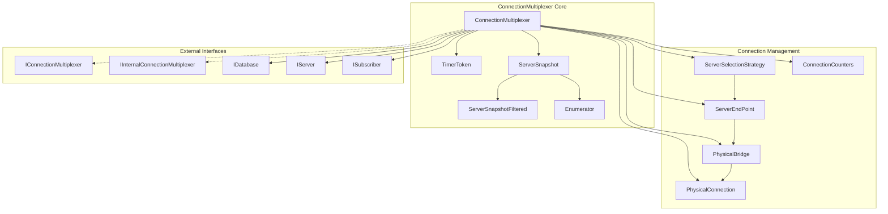
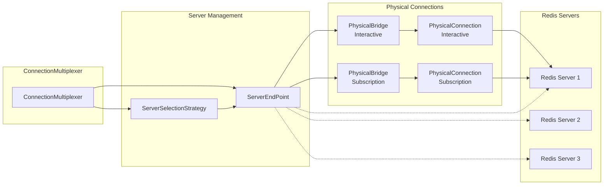
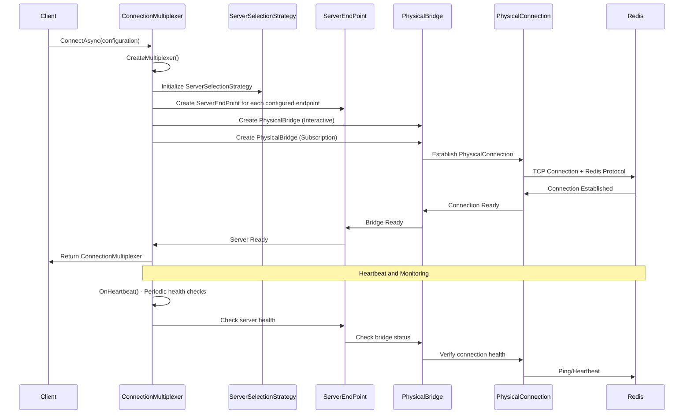
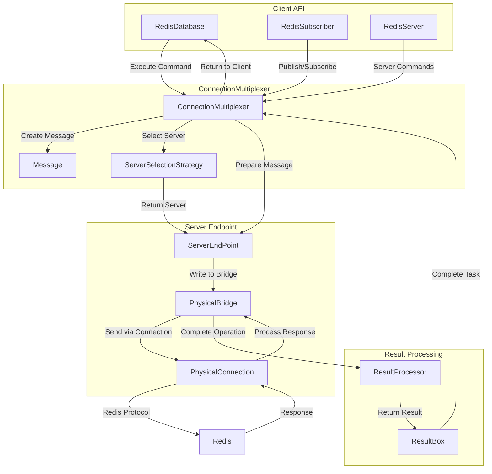
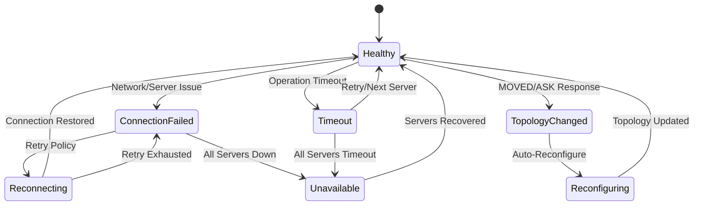

# ConnectionMultiplexer Module

## Introduction

The ConnectionMultiplexer is the central orchestrator of the StackExchange.Redis library, serving as the primary entry point for all Redis operations. It manages a pool of connections to Redis servers, handles connection lifecycle, implements intelligent server selection strategies, and provides the foundation for database operations, pub/sub messaging, and server management APIs.

This module represents a group of inter-related connections to Redis servers and is designed to be held as a long-lived reference throughout the application lifetime. It implements sophisticated connection pooling, automatic failover, cluster topology management, and comprehensive error handling to ensure reliable Redis operations in production environments.

## Architecture Overview

## Core Components

### ConnectionMultiplexer

The main class that orchestrates all Redis operations. It implements both `IConnectionMultiplexer` and `IInternalConnectionMultiplexer` interfaces, providing a unified API for external consumers while exposing internal functionality to other components within the library.

**Key Responsibilities:**
- Connection lifecycle management
- Server discovery and topology management
- Message routing and load balancing
- Error handling and recovery
- Performance monitoring and statistics
- Configuration management

**Core Properties:**
- `RawConfig`: Configuration options for the multiplexer
- `ServerSelectionStrategy`: Strategy for selecting appropriate servers
- `CommandMap`: Available Redis commands based on server capabilities
- `EndPoints`: Collection of configured endpoints
- `Logger`: Logging provider for diagnostics

### TimerToken

A sophisticated timer management system that implements a rooting model to prevent premature garbage collection of the multiplexer when there are in-flight operations. It provides heartbeat functionality while ensuring proper cleanup when the multiplexer is no longer referenced.

**Key Features:**
- Weak reference-based rooting to prevent memory leaks
- Automatic timer disposal when multiplexer is collected
- Heartbeat intervals based on configuration
- Thread-safe reference counting

### ServerSnapshot

An immutable snapshot of the current server topology that provides thread-safe enumeration and filtering capabilities. It uses a copy-on-write pattern to minimize lock contention while ensuring consistent views of the server landscape.

**Capabilities:**
- Thread-safe server enumeration
- Filtering by server type (master/replica)
- Efficient memory usage through array reuse
- Support for predicate-based filtering

### ServerSnapshotFiltered

A filtered view of the server snapshot that applies command-specific filtering logic based on flags like `DemandMaster` or `DemandReplica`. This ensures commands are routed to appropriate server types based on their requirements.

### Enumerator

A custom enumerator implementation that provides efficient iteration over server collections with optional predicate filtering, designed to minimize allocations and maximize performance.

## Connection Management Architecture

## Connection Lifecycle

## Message Flow Architecture

## Server Selection Strategy

The ConnectionMultiplexer implements sophisticated server selection logic that considers multiple factors when routing commands:

### Selection Criteria
- **Command Type**: Read vs Write operations
- **Server Role**: Master vs Replica availability
- **Command Flags**: `DemandMaster`, `DemandReplica`, `PreferMaster`, `PreferReplica`
- **Hash Slot**: For cluster deployments, commands are routed to servers responsible for specific key ranges
- **Connection Health**: Only healthy, connected servers are considered
- **Server Type**: Standalone, Cluster, Sentinel, or Proxy deployments

### Load Balancing
- Round-robin selection within server groups
- Preference-based routing for read operations
- Automatic failover to healthy servers
- Topology-aware routing for cluster deployments

## Error Handling and Recovery

## Configuration and Initialization

### Connection Options
- **SyncTimeout**: Timeout for synchronous operations
- **AsyncTimeout**: Timeout for asynchronous operations
- **ConnectTimeout**: Timeout for initial connection establishment
- **ConnectRetry**: Number of retry attempts for failed connections
- **HeartbeatInterval**: Interval for health monitoring
- **BacklogPolicy**: Behavior when disconnected

### Server Discovery
- **DNS Resolution**: Automatic endpoint resolution
- **Cluster Discovery**: Automatic node discovery for Redis Cluster
- **Sentinel Support**: Integration with Redis Sentinel for high availability
- **Proxy Support**: Compatibility with Twemproxy and Envoy proxy

## Performance Monitoring

The ConnectionMultiplexer provides comprehensive performance monitoring through:

### Operation Counters
- **syncOps**: Synchronous operation count
- **asyncOps**: Asynchronous operation count
- **syncTimeouts**: Synchronous operation timeouts
- **asyncTimeouts**: Asynchronous operation timeouts
- **fireAndForgets**: Fire-and-forget operation count

### Server Statistics
- **OperationCount**: Per-server operation counts
- **ConnectionState**: Current connection health
- **BridgeStatus**: Physical connection status
- **Performance Counters**: Detailed performance metrics

### Health Monitoring
- **Heartbeat Tracking**: Last successful heartbeat timestamps
- **Connection Health**: Real-time connection status
- **Error Rates**: Failure tracking and reporting
- **Storm Detection**: Detection of connection storms

## Integration with Other Modules

### [DatabaseOperations](DatabaseOperations.md)
The ConnectionMultiplexer creates and manages `RedisDatabase` instances that provide the primary API for Redis data operations. Each database instance maintains a reference to the multiplexer for server selection and message routing.

### [PubSubSupport](PubSubSupport.md)
Pub/sub functionality is provided through `RedisSubscriber` instances created by the multiplexer. The multiplexer manages separate subscription connections and handles message routing for channel-based communications.

### [ServerManagement](ServerManagement.md)
Server management operations are exposed through `RedisServer` instances that provide administrative functionality. The multiplexer coordinates server-level operations and configuration management.

### [Configuration](Configuration.md)
The multiplexer integrates with the configuration system through `ConfigurationOptions` which provides comprehensive settings for connection behavior, timeouts, retry policies, and feature flags.

### [MessageSystem](MessageSystem.md)
All Redis operations are encapsulated as `Message` objects that flow through the multiplexer. The multiplexer handles message creation, routing, and result processing through the integrated message system.

## Thread Safety and Concurrency

The ConnectionMultiplexer is designed for high-concurrency scenarios:

- **Immutable Snapshots**: Server topology uses copy-on-write patterns
- **Lock-Free Operations**: Minimal lock contention for read operations
- **Thread-Safe Collections**: Concurrent data structures for server management
- **Async-First Design**: Non-blocking async operations throughout
- **Resource Pooling**: Efficient reuse of connection resources

## Memory Management

- **Weak References**: Prevents memory leaks through proper rooting
- **Object Pooling**: Reuses result boxes and message objects
- **Array Pooling**: Efficient memory management for bulk operations
- **GC Optimization**: Minimal allocations in hot paths
- **Resource Cleanup**: Proper disposal of connections and timers

## Best Practices

### Connection Management
- **Singleton Pattern**: Maintain a single ConnectionMultiplexer instance per application
- **Long-Lived**: Keep multiplexer alive for the application lifetime
- **Proper Disposal**: Always dispose multiplexer on application shutdown
- **Connection Pooling**: Leverage built-in connection pooling capabilities

### Error Handling
- **Timeout Configuration**: Set appropriate timeouts for your use case
- **Retry Policies**: Configure retry behavior for transient failures
- **Health Monitoring**: Monitor connection health and performance metrics
- **Graceful Degradation**: Handle connection failures gracefully

### Performance Optimization
- **Server Selection**: Use appropriate command flags for optimal routing
- **Batch Operations**: Leverage batch operations for bulk work
- **Fire-and-Forget**: Use fire-and-forget for non-critical operations
- **Connection Tuning**: Configure connection limits and timeouts appropriately

This comprehensive architecture ensures the ConnectionMultiplexer provides reliable, high-performance Redis connectivity while handling the complexities of connection management, server discovery, error recovery, and performance optimization automatically.