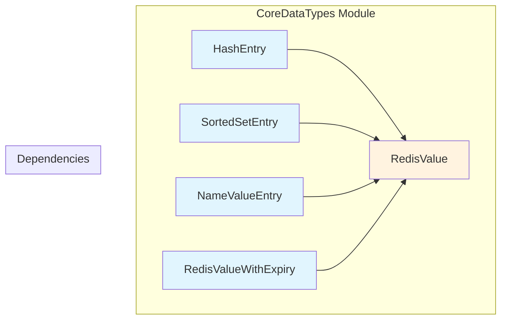
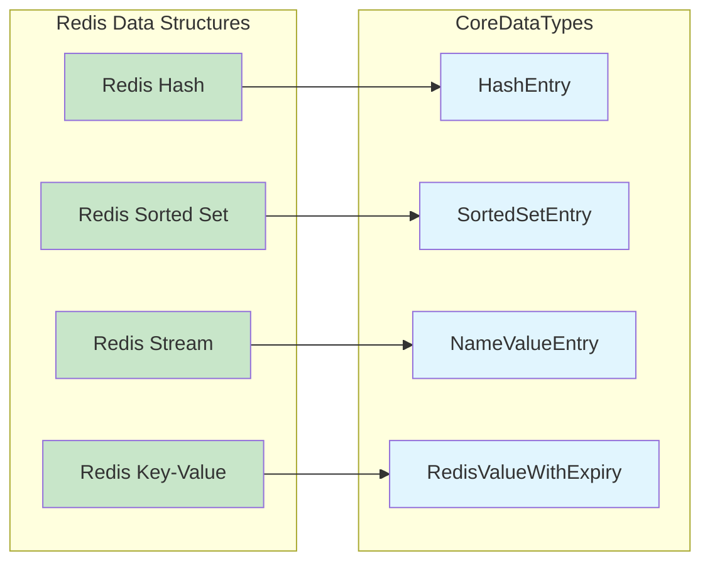
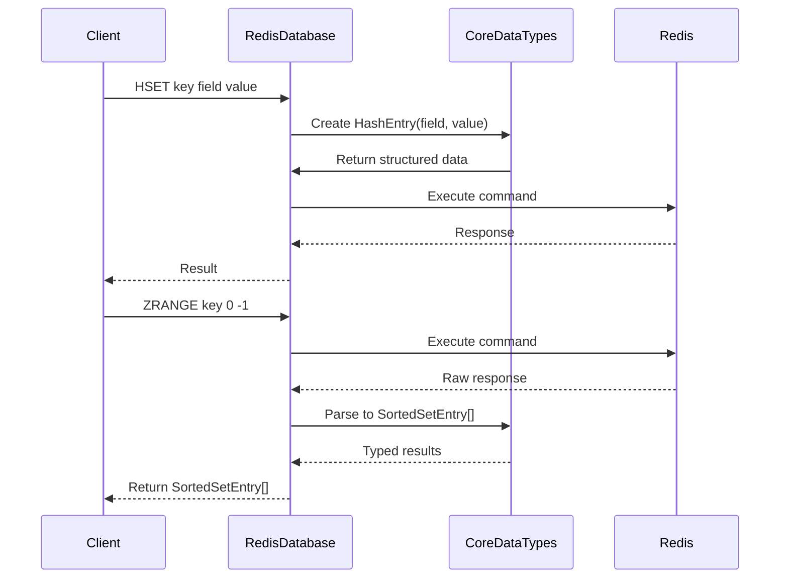
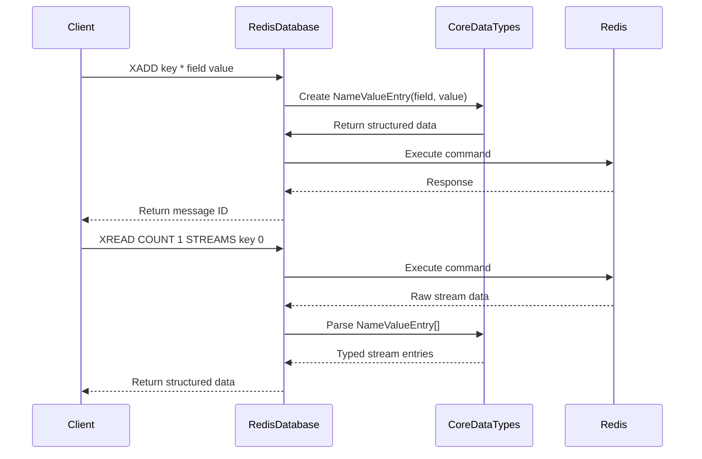

# CoreDataTypes Module Documentation

## Introduction

The CoreDataTypes module provides fundamental data structures that form the building blocks for Redis operations in StackExchange.Redis. These types represent core Redis data structures and are used throughout the library to handle hash entries, sorted set entries, name-value pairs, and values with expiration times.

## Module Overview

The CoreDataTypes module contains four essential data structures:

- **HashEntry**: Represents a field-value pair in Redis hashes
- **SortedSetEntry**: Represents an element-score pair in Redis sorted sets
- **NameValueEntry**: Represents name-value pairs used in Redis streams
- **RedisValueWithExpiry**: Represents a Redis value with an optional expiration time

These types are immutable value types (structs) that provide type-safe representations of Redis data structures while maintaining efficient memory usage and performance characteristics.

## Architecture

### Component Structure



### Data Type Relationships



## Core Components

### HashEntry

**Purpose**: Represents a field-value pair in Redis hash operations.

**Key Features**:
- Immutable struct design for performance
- Implicit conversion to/from `KeyValuePair<RedisValue, RedisValue>`
- Equatable implementation for proper comparison semantics
- Obsolete members for backward compatibility

**Usage Context**:
- Used in hash operations like `HSET`, `HGET`, `HGETALL`
- Returned by hash scan operations
- Part of hash entry arrays in bulk operations

**Code Structure**:
```csharp
public readonly struct HashEntry : IEquatable<HashEntry>
{
    public RedisValue Name { get; }
    public RedisValue Value { get; }
    
    // Implicit conversions
    public static implicit operator KeyValuePair<RedisValue, RedisValue>(HashEntry value);
    public static implicit operator HashEntry(KeyValuePair<RedisValue, RedisValue> value);
}
```

### SortedSetEntry

**Purpose**: Represents an element-score pair in Redis sorted set operations.

**Key Features**:
- Implements `IComparable<SortedSetEntry>` for sorting by score
- Immutable struct design
- Implicit conversion to/from `KeyValuePair<RedisValue, double>`
- Score-based comparison and equality

**Usage Context**:
- Used in sorted set operations like `ZADD`, `ZRANGE`, `ZSCORE`
- Returned by sorted set scan operations
- Part of sorted set entry arrays in bulk operations

**Code Structure**:
```csharp
public readonly struct SortedSetEntry : IEquatable<SortedSetEntry>, IComparable, IComparable<SortedSetEntry>
{
    public RedisValue Element { get; }
    public double Score { get; }
    
    // Sorting support
    public int CompareTo(SortedSetEntry other);
    public int CompareTo(object obj);
}
```

### NameValueEntry

**Purpose**: Represents name-value pairs used in Redis stream operations.

**Key Features**:
- Immutable struct design
- Implicit conversion to/from `KeyValuePair<RedisValue, RedisValue>`
- Equatable implementation
- Specifically designed for stream data structures

**Usage Context**:
- Used in stream operations like `XADD`, `XREAD`
- Represents field-value pairs within stream entries
- Part of stream entry processing

**Code Structure**:
```csharp
public readonly struct NameValueEntry : IEquatable<NameValueEntry>
{
    public RedisValue Name { get; }
    public RedisValue Value { get; }
}
```

### RedisValueWithExpiry

**Purpose**: Represents a Redis value with an optional expiration time.

**Key Features**:
- Immutable struct design
- Combines value and expiration in a single type
- Nullable TimeSpan for optional expiration
- Simple data container without complex logic

**Usage Context**:
- Used in operations that return values with expiration information
- Part of key-value operations with TTL support
- Returned by commands like `GETEX` with expiration

**Code Structure**:
```csharp
public readonly struct RedisValueWithExpiry
{
    public RedisValue Value { get; }
    public TimeSpan? Expiry { get; }
}
```

## Data Flow Integration

### Integration with Database Operations



### Integration with Stream Operations



## Dependencies

### Internal Dependencies

The CoreDataTypes module has a single core dependency:

- **RedisValue**: All CoreDataTypes components depend on the [RedisValue](ValueTypes.md) type for storing actual Redis data values

### External Dependencies

- **System**: Standard .NET types for basic functionality
- **System.Collections.Generic**: For KeyValuePair conversions
- **System.ComponentModel**: For editorBrowsable attributes

## Usage Patterns

### Hash Operations
```csharp
// Creating hash entries
var entries = new[]
{
    new HashEntry("field1", "value1"),
    new HashEntry("field2", "value2")
};

// Using in operations
db.HashSet("myhash", entries);

// Converting from KeyValuePair
KeyValuePair<RedisValue, RedisValue> pair = new("field", "value");
HashEntry entry = pair; // Implicit conversion
```

### Sorted Set Operations
```csharp
// Creating sorted set entries
var entries = new[]
{
    new SortedSetEntry("member1", 1.0),
    new SortedSetEntry("member2", 2.0)
};

// Using in operations
db.SortedSetAdd("myzset", entries);

// Sorting support
var sortedEntries = entries.OrderBy(e => e).ToArray();
```

### Stream Operations
```csharp
// Creating stream entries
var entries = new[]
{
    new NameValueEntry("field1", "value1"),
    new NameValueEntry("field2", "value2")
};

// Using in operations
db.StreamAdd("mystream", entries);
```

### Value with Expiry Operations
```csharp
// Getting value with expiry
var result = db.StringGetWithExpiry("mykey");
if (result.Expiry.HasValue)
{
    Console.WriteLine($"Value expires in: {result.Expiry.Value}");
}
```

## Performance Considerations

### Memory Efficiency
- All types are structs, avoiding heap allocation
- Immutable design prevents defensive copying
- Efficient GetHashCode implementations

### Conversion Efficiency
- Implicit conversions avoid explicit casting
- No allocation during conversions
- Direct field access patterns

### Comparison Performance
- Value-based equality comparisons
- Efficient CompareTo implementations for sorting
- Hash code caching considerations

## Thread Safety

All CoreDataTypes are immutable value types, making them inherently thread-safe:
- No mutable state
- Safe for concurrent access
- No synchronization required
- Can be safely shared across threads

## Extensibility

The module is designed for extensibility:
- Clear separation of concerns
- Consistent API patterns
- Easy to add new data types following the same patterns
- Implicit conversion support for interoperability

## Related Modules

- [ValueTypes](ValueTypes.md): Provides the RedisValue type that all CoreDataTypes depend on
- [DatabaseOperations](DatabaseOperations.md): Uses CoreDataTypes for hash, sorted set, and stream operations
- [ResultProcessing](ResultProcessing.md): Processes CoreDataTypes from Redis responses
- [APIValueTypes](APIValueTypes.md): Extended data types that build upon CoreDataTypes

## Best Practices

1. **Use implicit conversions**: Leverage built-in conversions for cleaner code
2. **Prefer structs**: Use the struct types directly rather than creating wrapper classes
3. **Consider immutability**: Take advantage of the immutable design for thread safety
4. **Use appropriate types**: Choose the right data type for the Redis operation being performed
5. **Handle obsolete members**: Migrate away from obsolete members to maintain compatibility