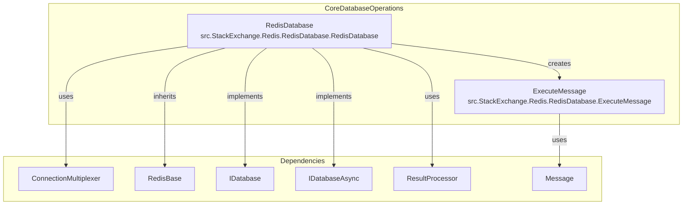
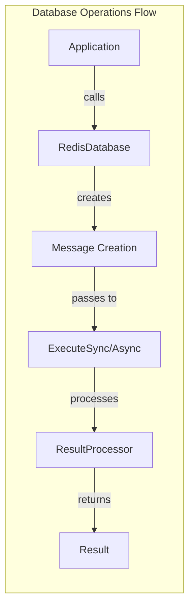
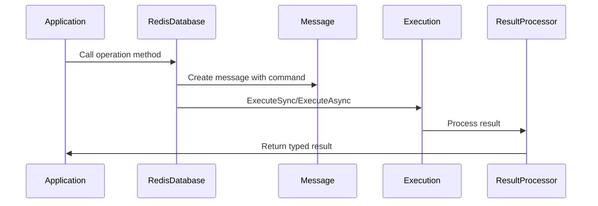
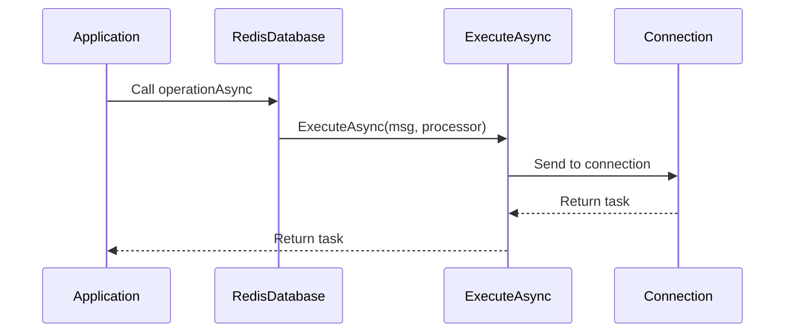

# CoreDatabaseOperations Module Documentation

## Introduction

The CoreDatabaseOperations module is the central component of the StackExchange.Redis library's database operations layer. It provides the primary implementation of the `IDatabase` interface, offering comprehensive Redis command support for all major data types and operations. This module serves as the main entry point for executing Redis commands and managing data operations across all Redis data structures.

## Module Overview

The CoreDatabaseOperations module implements the `RedisDatabase` class, which is the concrete implementation of the `IDatabase` interface. It provides synchronous and asynchronous methods for interacting with Redis across all supported data types including strings, hashes, lists, sets, sorted sets, streams, and more. The module handles command execution, result processing, and connection management while providing a unified API for Redis operations.

## Architecture

### Core Components



### Component Relationships



## Key Components

### RedisDatabase Class
The `RedisDatabase` class is the primary implementation of the `IDatabase` interface. It provides:

- **Database Context**: Maintains database number and connection multiplexer reference
- **Command Execution**: Handles both synchronous and asynchronous command execution
- **Result Processing**: Integrates with result processors for type-safe return values
- **Message Creation**: Constructs appropriate Redis protocol messages for each command

### ExecuteMessage Class
The `ExecuteMessage` class provides support for executing arbitrary Redis commands:

- **Dynamic Command Execution**: Allows execution of custom or unsupported Redis commands
- **Command Mapping**: Integrates with the command map for command validation
- **Argument Processing**: Handles various argument types and converts them to Redis protocol format

## Data Flow

### Command Execution Flow


### Async Operation Flow


## Supported Operations

### String Operations
- Basic get/set operations with expiry support
- Increment/decrement operations
- Bit manipulation operations
- Range operations and substring handling
- Advanced operations like GETDEL, GETEX

### Hash Operations
- Field-level operations (HGET, HSET, HDEL)
- Bulk operations (HMGET, HMSET)
- Hash scanning and iteration
- Field expiration support (newer Redis versions)

### List Operations
- Push/pop operations from both ends
- Range operations and indexing
- List manipulation (LINSERT, LREM, LSET)
- Multi-key operations (LMPOP)

### Set Operations
- Member management (SADD, SREM, SISMEMBER)
- Set operations (SUNION, SINTER, SDIFF)
- Set scanning and random member selection
- Multi-key operations

### Sorted Set Operations
- Member scoring and ranking
- Range queries by rank and score
- Set operations with weights and aggregation
- Lexicographical range operations

### Stream Operations
- Stream entry management
- Consumer group operations
- Stream reading and acknowledgment
- Stream trimming and cleanup

### Advanced Operations
- Geospatial operations
- HyperLogLog operations
- Pub/Sub messaging
- Transaction support
- Script execution

## Integration Points

### Connection Management
The module integrates with [ConnectionManagement](ConnectionManagement.md) for:
- Server selection and load balancing
- Connection state monitoring
- Command routing to appropriate servers

### Result Processing
Integration with [ResultProcessing](ResultProcessing.md) provides:
- Type-safe result conversion
- Error handling and validation
- Performance optimization for common operations

### Message System
Works with [MessageSystem](MessageSystem.md) for:
- Protocol message construction
- Command serialization
- Server-specific message handling

## Performance Considerations

### Optimization Strategies
1. **Connection Pooling**: Reuses connections across operations
2. **Pipeline Support**: Batches multiple commands for network efficiency
3. **Result Caching**: Caches script hashes and other reusable data
4. **Server Selection**: Intelligently routes commands to appropriate servers

### Memory Management
- Uses array pooling for temporary allocations
- Implements proper disposal patterns for resources
- Minimizes allocations in hot paths

## Error Handling

### Exception Types
- `RedisServerException`: Redis server errors
- `RedisConnectionException`: Connection-related errors
- `TimeoutException`: Operation timeout errors
- `ArgumentException`: Invalid parameter errors

### Retry Logic
- Automatic retry for transient failures
- Configurable retry policies
- Circuit breaker pattern for persistent failures

## Usage Examples

### Basic Operations
```csharp
// String operations
var db = multiplexer.GetDatabase();
await db.StringSetAsync("key", "value");
var value = await db.StringGetAsync("key");

// Hash operations
await db.HashSetAsync("hash", "field", "value");
var hashValue = await db.HashGetAsync("hash", "field");

// List operations
await db.ListRightPushAsync("list", "item");
var item = await db.ListLeftPopAsync("list");
```

### Advanced Operations
```csharp
// Sorted set with complex operations
await db.SortedSetAddAsync("zset", "member", 1.0);
var range = await db.SortedSetRangeByScoreAsync("zset", 0, 10);

// Stream operations
var messageId = await db.StreamAddAsync("stream", "field", "value");
var messages = await db.StreamReadAsync("stream", "0-0");

// Script execution
var result = await db.ScriptEvaluateAsync("return redis.call('GET', KEYS[1])", 
    new RedisKey[] { "key" });
```

## Configuration

### Database Selection
- Supports multiple database numbers (0-15 by default)
- Database context is maintained per `RedisDatabase` instance
- Cross-database operations are supported where Redis allows

### Command Flags
- **None**: Default behavior
- **FireAndForget**: Don't wait for response
- **PreferMaster**: Route to master if possible
- **PreferReplica**: Route to replica if possible
- **DemandMaster**: Must route to master
- **DemandReplica**: Must route to replica

## Thread Safety

The `RedisDatabase` class is thread-safe for all operations. Multiple threads can safely call methods on the same instance simultaneously. The underlying connection multiplexer handles connection pooling and thread safety at the network level.

## Extensibility

### Custom Commands
The `ExecuteMessage` class allows execution of custom Redis commands that may not have dedicated methods in the `IDatabase` interface. This provides flexibility for:
- New Redis commands not yet implemented
- Custom Redis modules
- Proprietary commands

### Result Processors
Custom result processors can be implemented to handle specialized result types or processing logic. This integrates with the [ResultProcessing](ResultProcessing.md) module for consistent result handling.

## Related Modules

- [ConnectionManagement](ConnectionManagement.md) - Connection and server management
- [ResultProcessing](ResultProcessing.md) - Result processing and conversion
- [MessageSystem](MessageSystem.md) - Redis protocol message handling
- [ValueTypes](ValueTypes.md) - Redis data type representations
- [TransactionSupport](TransactionSupport.md) - Transaction and batch operations
- [ScanOperations](ScanOperations.md) - Scanning operations for large datasets
- [StreamOperations](StreamOperations.md) - Redis stream-specific operations
- [ScriptOperations](ScriptOperations.md) - Lua script execution operations
- [SpecializedOperations](SpecializedOperations.md) - Specialized data operations

## Conclusion

The CoreDatabaseOperations module serves as the foundation for all Redis database operations in the StackExchange.Redis library. Its comprehensive implementation of the `IDatabase` interface provides developers with a complete, type-safe, and performant API for interacting with Redis across all supported data types and operations.