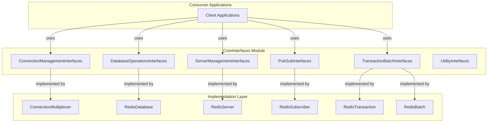
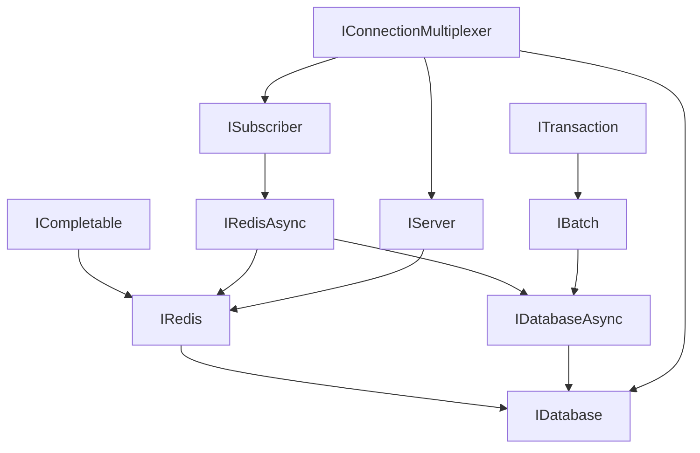
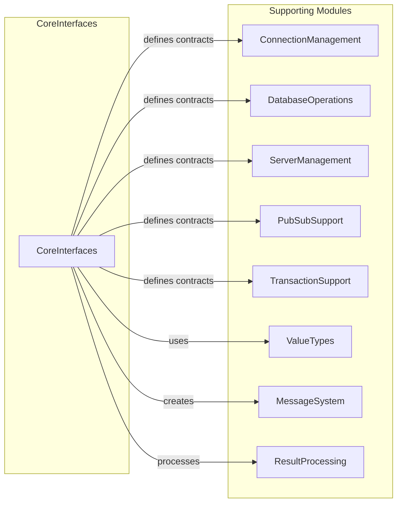

# CoreInterfaces Module Overview

## Purpose

The `CoreInterfaces` module serves as the foundational abstraction layer for the StackExchange.Redis library, defining the essential contracts that enable consistent and extensible Redis operations across the entire system. This module provides the primary interfaces that applications interact with when working with Redis, including connection management, database operations, server administration, pub/sub messaging, transactions, and utility operations.

## Architecture

The CoreInterfaces module is organized into several logical groups that work together to provide a comprehensive Redis client API:



### Interface Hierarchy



## Core Components

### ConnectionManagementInterfaces
- **IConnectionMultiplexer**: Primary interface for connection management and resource access
- **IInternalConnectionMultiplexer**: Extended interface for internal library operations
- Provides connection lifecycle management, server selection, and event handling

### DatabaseOperationsInterfaces
- **IDatabase**: Synchronous interface for all Redis data operations
- **IDatabaseAsync**: Asynchronous interface for non-blocking operations
- Covers strings, hashes, lists, sets, sorted sets, streams, geospatial data, and more

### ServerManagementInterfaces
- **IServer**: Comprehensive interface for server-level operations
- Manages configuration, monitoring, cluster operations, sentinel integration, and maintenance tasks

### PubSubInterfaces
- **ISubscriber**: Interface for Redis publish/subscribe operations
- Supports both callback-based and queue-based message handling
- Enables pattern-based subscriptions and connection monitoring

### TransactionBatchInterfaces
- **ITransaction**: Interface for atomic transaction execution
- **IBatch**: Interface for efficient command batching
- Provides both atomic and non-atomic command grouping capabilities

### UtilityInterfaces
- **IRedis/IRedisAsync**: Common Redis operations shared across interfaces
- **ICompletable**: Completion handling for internal operations
- **IScanningCursor**: Resumable cursor-based operations
- **IReconnectRetryPolicy**: Configurable retry logic for connections

## Key Features

### Unified API Design
- Consistent interface patterns across all operation types
- Both synchronous and asynchronous operation support
- Type-safe method signatures with comprehensive parameter coverage

### Connection Management
- Automatic connection pooling and multiplexing
- Server selection strategies for optimal performance
- Built-in failover and load balancing capabilities
- Comprehensive connection state monitoring and events

### Extensibility
- Interface-based design enables easy mocking and testing
- Pluggable retry policies for custom reconnection logic
- Event-driven architecture for monitoring and logging

### Performance Optimization
- Efficient batching capabilities for high-throughput scenarios
- Connection sharing across multiple database instances
- Optimized server selection for cluster environments

## Integration Points

The CoreInterfaces module integrates with all major system components:



## Usage Patterns

### Basic Connection and Operations
```csharp
// Establish connection
IConnectionMultiplexer multiplexer = ConnectionMultiplexer.Connect("localhost");

// Get database interface
IDatabase database = multiplexer.GetDatabase();

// Get server interface
IServer server = multiplexer.GetServer("localhost", 6379);

// Get pub/sub interface
ISubscriber subscriber = multiplexer.GetSubscriber();
```

### Transaction Usage
```csharp
// Create transaction
ITransaction transaction = database.CreateTransaction();
transaction.AddCondition(Condition.KeyExists("key"));
transaction.StringSetAsync("key", "value");
bool committed = await transaction.ExecuteAsync();
```

### Batch Operations
```csharp
// Create batch
IBatch batch = database.CreateBatch();
batch.StringSetAsync("key1", "value1");
batch.StringSetAsync("key2", "value2");
batch.Execute();
```

## References to Core Components

- **ConnectionManagementInterfaces**: [ConnectionManagementInterfaces Documentation](src.StackExchange.Redis.Interfaces.IConnectionMultiplexer.IConnectionMultiplexer)
- **DatabaseOperationsInterfaces**: [DatabaseOperationsInterfaces Documentation](src.StackExchange.Redis.Interfaces.IDatabase.IDatabase)
- **ServerManagementInterfaces**: [ServerManagementInterfaces Documentation](src.StackExchange.Redis.Interfaces.IServer.IServer)
- **PubSubInterfaces**: [PubSubInterfaces Documentation](src.StackExchange.Redis.Interfaces.ISubscriber.ISubscriber)
- **TransactionBatchInterfaces**: [TransactionBatchInterfaces Documentation](src.StackExchange.Redis.Interfaces.ITransaction.ITransaction)
- **UtilityInterfaces**: [UtilityInterfaces Documentation](src.StackExchange.Redis.Interfaces.IRedis.IRedis)

## Summary

The CoreInterfaces module provides the essential abstractions that make StackExchange.Redis a powerful and flexible Redis client library. By defining clear contracts for all major Redis operations, it enables developers to write clean, testable code while leveraging the full power of Redis. The module's design emphasizes consistency, performance, and extensibility, making it suitable for both simple applications and complex distributed systems requiring advanced Redis features.