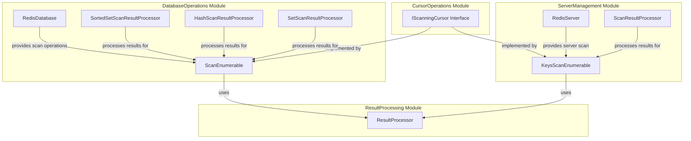
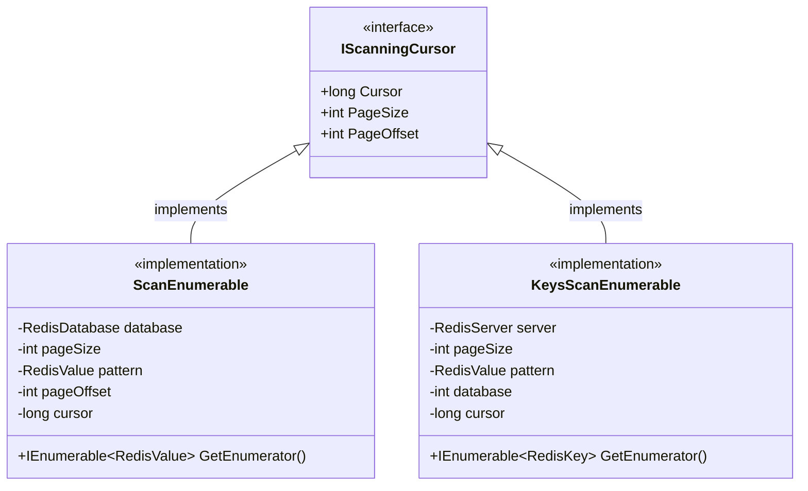
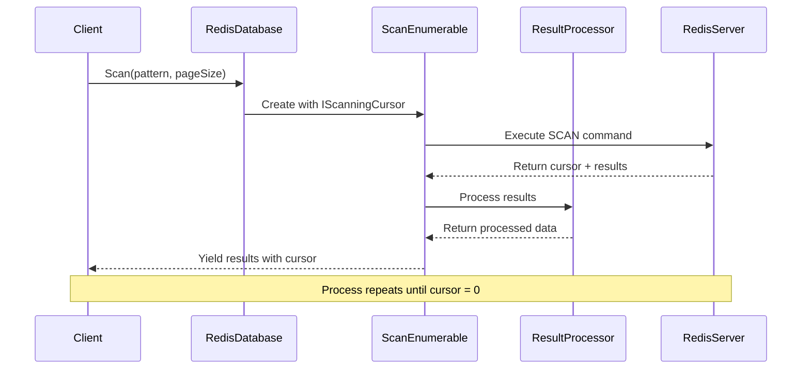
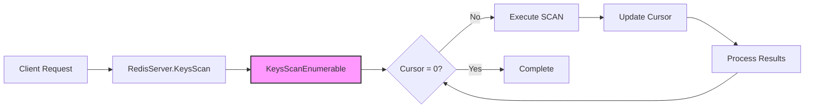

# CursorOperations Module Documentation

## Introduction

The CursorOperations module provides the foundation for cursor-based scanning operations in StackExchange.Redis. It defines the `IScanningCursor` interface, which enables resumable, paginated iteration over large datasets in Redis without blocking the server. This module is essential for implementing efficient scan operations like SCAN, HSCAN, ZSCAN, and SSCAN commands that can handle large key spaces and collections without memory spikes or server blocking.

## Architecture Overview

The CursorOperations module is a lightweight but critical component that sits at the intersection of database operations and result processing. It provides the abstraction layer that enables consistent cursor-based iteration across different Redis data structures.

## Core Components

### IScanningCursor Interface

The `IScanningCursor` interface is the cornerstone of cursor-based operations in StackExchange.Redis. It provides a standardized way to track and resume scan operations across different Redis data structures.

#### Properties

- **Cursor** (`long`): Represents the active page of results in the scan operation. This cursor value is used by Redis to maintain state between scan iterations.
- **PageSize** (`int`): Defines the number of items to retrieve in each page/iteration of the scan operation.
- **PageOffset** (`int`): Indicates the current position within the active page, allowing for fine-grained control over iteration progress.

## Integration with Other Modules

### DatabaseOperations Integration

The CursorOperations module integrates closely with the DatabaseOperations module through the `ScanEnumerable` implementations:

### ServerManagement Integration

Server-level scanning operations utilize the cursor interface through the `KeysScanEnumerable`:

## Usage Patterns

### Basic Scan Pattern

The cursor interface enables a consistent pattern for scanning operations:

1. **Initialization**: Create a scan operation with initial cursor (typically 0)
2. **Iteration**: Execute scan command with current cursor
3. **Processing**: Handle returned results
4. **Continuation**: Update cursor and repeat until cursor returns to 0
5. **Completion**: Cursor value of 0 indicates scan completion

### Memory Efficiency

The cursor-based approach provides several advantages:
- **Constant Memory**: Each iteration processes only a page of results
- **Non-blocking**: Server can handle other operations during scan
- **Resumable**: Cursor state allows operation resumption
- **Scalable**: Performance remains consistent regardless of dataset size

## Implementation Details

### Cursor State Management

The cursor value is maintained by Redis and represents the internal state of the scan operation. The client-side `IScanningCursor` interface tracks:
- Current cursor position for next iteration
- Page size configuration
- Offset within current page

### Thread Safety

Scan operations using the cursor interface are designed to be thread-safe for read operations, but cursor state should not be modified concurrently across multiple threads.

## Related Documentation

For comprehensive understanding of cursor operations within the broader context, refer to:

- [DatabaseOperations.md](DatabaseOperations.md) - For database-level scan implementations
- [ServerManagement.md](ServerManagement.md) - For server-level key scanning
- [ResultProcessing.md](ResultProcessing.md) - For result processing during scan operations
- [ValueTypes.md](ValueTypes.md) - For data types returned by scan operations

## Best Practices

1. **Page Size Selection**: Choose appropriate page sizes based on network latency and memory constraints
2. **Error Handling**: Implement proper error handling for network interruptions during long-running scans
3. **Cursor Persistence**: Consider persisting cursor state for very large datasets that may span multiple sessions
4. **Pattern Usage**: Use Redis patterns efficiently to filter results at the server level
5. **Resource Cleanup**: Ensure proper disposal of enumerable resources after scan completion

## Performance Considerations

- **Network Round Trips**: Each cursor iteration requires a network round trip
- **Server Load**: Scans can impact server performance; consider using appropriate page sizes
- **Client Memory**: While server memory usage is constant, client-side buffering should be considered
- **Concurrent Operations**: Scans can run concurrently with other Redis operations without significant impact