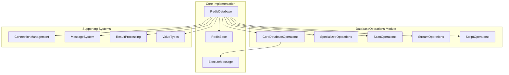
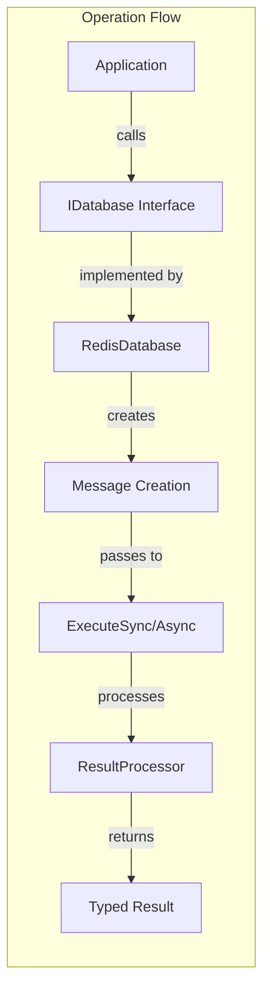

# DatabaseOperations Module Overview

## Purpose

The DatabaseOperations module is the core implementation layer of the StackExchange.Redis library that provides comprehensive Redis command support across all data types. It serves as the primary interface for executing Redis commands through the `RedisDatabase` class, which implements the `IDatabase` and `IDatabaseAsync` interfaces. The module handles command execution, result processing, and connection management while providing a unified, type-safe API for all Redis operations.

## Architecture

The DatabaseOperations module is organized into several specialized sub-modules that handle different categories of Redis operations:



### Component Relationships



## Core Components

### RedisDatabase Class
The primary implementation of the `IDatabase` interface, providing:
- **Database Context**: Maintains database number and connection multiplexer reference
- **Command Execution**: Handles both synchronous and asynchronous command execution
- **Result Processing**: Integrates with result processors for type-safe return values
- **Message Creation**: Constructs appropriate Redis protocol messages for each command

### ExecuteMessage Class
Provides support for executing arbitrary Redis commands:
- **Dynamic Command Execution**: Allows execution of custom or unsupported Redis commands
- **Command Mapping**: Integrates with the command map for command validation
- **Argument Processing**: Handles various argument types and converts them to Redis protocol format

## Sub-Modules

### 1. CoreDatabaseOperations
Implements fundamental Redis operations for all data types including strings, hashes, lists, sets, sorted sets, and basic key operations. Provides the foundation for all database interactions.

### 2. SpecializedOperations
Handles advanced operations that require specialized message processing:
- String operations with expiry retrieval
- Key migration between Redis instances
- Complex sorted set operations (combine-and-store)
- Multi-message operations for atomic execution

### 3. ScanOperations
Provides efficient, non-blocking iteration capabilities using Redis SCAN commands:
- Memory-efficient scanning of large datasets
- Support for all SCAN variants (SCAN, SSCAN, HSCAN, ZSCAN)
- Pattern matching and cursor-based navigation
- Automatic fallback strategies for older Redis versions

### 4. StreamOperations
Implements comprehensive Redis Streams functionality:
- Event sourcing and message queuing
- Consumer group management
- Stream reading and acknowledgment
- Multi-stream operations and cross-stream processing

### 5. ScriptOperations
Provides Lua scripting capabilities:
- Automatic EVAL/EVALSHA command selection
- Script loading and caching management
- Read-only script execution support
- Automatic fallback mechanisms for uncached scripts

## Integration Points

The DatabaseOperations module integrates with several core systems:

- **[ConnectionManagement](ConnectionManagement.md)**: Provides server selection, connection pooling, and command routing
- **[MessageSystem](MessageSystem.md)**: Handles Redis protocol message construction and serialization
- **[ResultProcessing](ResultProcessing.md)**: Processes and converts Redis responses to type-safe .NET objects
- **[ValueTypes](ValueTypes.md)**: Provides Redis data type representations and conversions

## Key Features

### Comprehensive Command Support
- All major Redis data types (strings, hashes, lists, sets, sorted sets, streams)
- Advanced operations (transactions, scripting, pub/sub, geospatial)
- Cluster-aware operations with proper slot calculation
- Pipeline and batch operation support

### Performance Optimizations
- Connection pooling and reuse
- Command pipelining for bulk operations
- Efficient memory management with array pooling
- Intelligent server selection and load balancing

### Reliability and Error Handling
- Automatic retry for transient failures
- Comprehensive exception handling
- Server capability detection and graceful degradation
- Timeout management and circuit breaker patterns

### Thread Safety
- All operations are thread-safe
- Concurrent access to the same database instance
- Safe for use in multi-threaded applications

## Usage

The DatabaseOperations module is accessed through the `IDatabase` interface obtained from a `ConnectionMultiplexer`:

```csharp
var multiplexer = ConnectionMultiplexer.Connect("localhost");
var db = multiplexer.GetDatabase();

// Basic operations
await db.StringSetAsync("key", "value");
var value = await db.StringGetAsync("key");

// Advanced operations
var entries = db.HashScan("myhash", "user:*");
var streamEntries = await db.StreamReadGroupAsync("mystream", "mygroup", "consumer1");
```

## References to Core Components

- **CoreDatabaseOperations**: [Documentation](CoreDatabaseOperations.md)
- **SpecializedOperations**: [Documentation](SpecializedOperations.md)
- **ScanOperations**: [Documentation](ScanOperations.md)
- **StreamOperations**: [Documentation](StreamOperations.md)
- **ScriptOperations**: [Documentation](ScriptOperations.md)