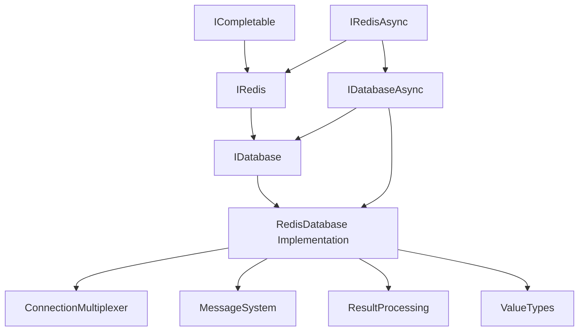
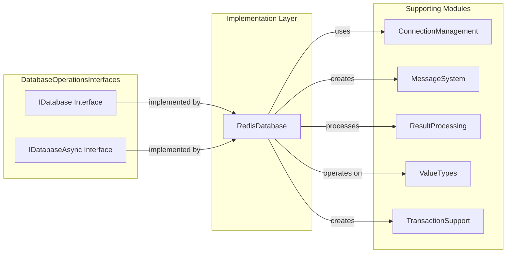

# DatabaseOperationsInterfaces Module Overview

## Purpose

The `DatabaseOperationsInterfaces` module defines the core contracts for Redis database operations in the StackExchange.Redis library. It provides both synchronous (`IDatabase`) and asynchronous (`IDatabaseAsync`) interfaces that serve as the primary entry points for all Redis data operations, including strings, hashes, lists, sets, sorted sets, streams, geospatial data, and advanced features like transactions and scripting.

## Architecture

### Interface Hierarchy



### Component Integration



## Core Components

### IDatabase Interface
- **Location**: `src/StackExchange.Redis/Interfaces/IDatabase.cs`
- **Purpose**: Provides synchronous access to all Redis operations
- **Key Features**: String operations, hash operations, list operations, set operations, sorted set operations, stream operations, geospatial operations, key management, transactions, scripting

### IDatabaseAsync Interface
- **Location**: `src/StackExchange.Redis/Interfaces/IDatabaseAsync.cs`
- **Purpose**: Provides asynchronous access to all Redis operations
- **Key Features**: All IDatabase operations with async/await support, non-blocking I/O, Task-based return types

## Key Capabilities

### Data Structure Operations
- **Strings**: Get/set, atomic operations, bit manipulation
- **Hashes**: Field-level operations, bulk operations, scanning
- **Lists**: Push/pop, range queries, blocking operations
- **Sets**: Membership, set algebra, random selection
- **Sorted Sets**: Score-based operations, range queries, set operations
- **Streams**: Message publishing, consumer groups, message acknowledgment
- **Geospatial**: Location storage, distance calculations, radius searches

### Advanced Features
- **Transactions**: Atomic multi-operation execution via ITransaction
- **Batching**: Non-atomic batch operations via IBatch
- **Scripting**: Lua script execution with EVAL/EVALSHA
- **Key Management**: Expiration, persistence, migration, metadata
- **Scanning**: Incremental iteration over large datasets
- **Pub/Sub**: Message publishing to channels

## Integration Points

### ConnectionManagement Module
- Uses `IConnectionMultiplexer` to obtain connections
- Leverages `ServerSelectionStrategy` for optimal server selection
- Integrates with `PhysicalBridge` for network communication

### ValueTypes Module
- Operates on `RedisKey` and `RedisValue` types
- Returns specialized result types for complex operations
- Uses `RedisChannel` for pub/sub operations

### MessageSystem Module
- Creates appropriate command messages
- Handles protocol-level message formatting
- Manages message routing and delivery

### ResultProcessing Module
- Utilizes specialized result processors
- Handles type-safe result conversion
- Supports complex result transformations

## Usage Patterns

### Basic Operations
```csharp
// Synchronous
IDatabase db = multiplexer.GetDatabase();
string value = db.StringGet("key");

// Asynchronous
IDatabaseAsync dbAsync = multiplexer.GetDatabase();
string value = await dbAsync.StringGetAsync("key");
```

### Transaction Support
```csharp
// Create transaction from database interface
ITransaction transaction = db.CreateTransaction();
// Queue operations...
bool committed = transaction.Execute();
```

### Batch Operations
```csharp
// Create batch from database interface
IBatch batch = db.CreateBatch();
// Queue operations...
batch.Execute();
```

## References to Core Components

- **IDatabase Documentation**: [IDatabase Module Documentation](src.StackExchange.Redis.Interfaces.IDatabase.IDatabase)
- **IDatabaseAsync Documentation**: [IDatabaseAsync Module Documentation](src.StackExchange.Redis.Interfaces.IDatabaseAsync.IDatabaseAsync)
- **Implementation**: See [DatabaseOperations](DatabaseOperations.md) module for implementation details
- **Transaction Support**: See [TransactionSupport](TransactionSupport.md) module for transaction implementations
- **Value Types**: See [ValueTypes](ValueTypes.md) module for data type definitions
- **Result Processing**: See [ResultProcessing](ResultProcessing.md) module for result handling