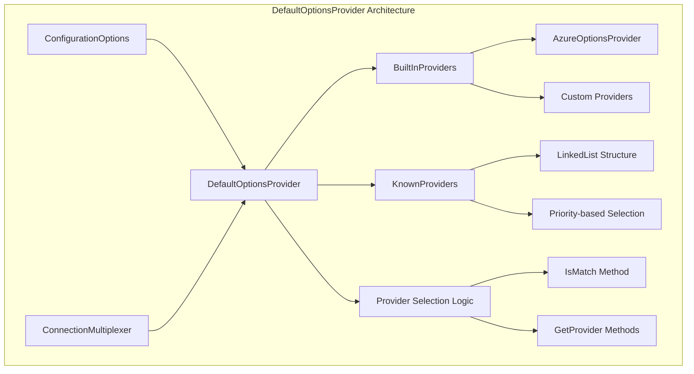
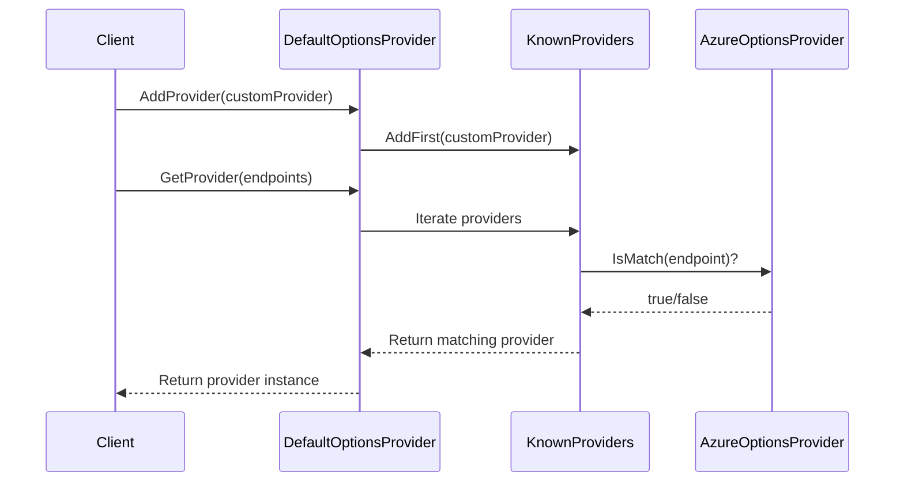
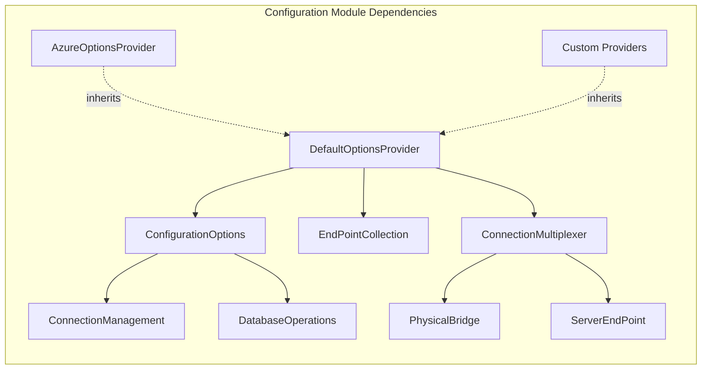
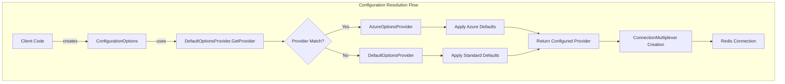
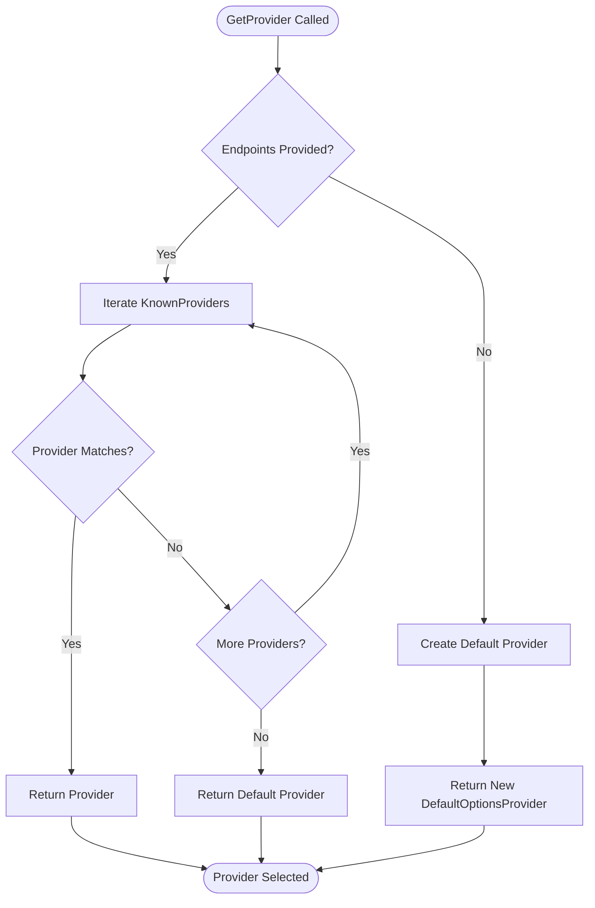
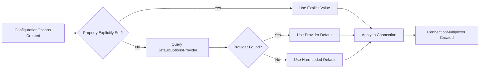

# DefaultOptionsProvider Module Documentation

## Introduction

The `DefaultOptionsProvider` module is a critical configuration component in the StackExchange.Redis library that provides a flexible, extensible system for managing default connection options. It serves as the foundation for environment-specific configuration defaults, allowing different deployment scenarios (such as Azure, on-premises, or custom environments) to provide optimized default settings without modifying the core library.

This module implements a provider pattern where different configuration providers can be registered and automatically selected based on the endpoints being connected to, enabling intelligent defaults that adapt to the target environment.

## Architecture Overview



## Core Components

### DefaultOptionsProvider Class

The `DefaultOptionsProvider` class is the central component that defines default values for all Redis connection configuration options. It uses a virtual property pattern that allows subclasses to override specific defaults while inheriting others.

#### Key Properties

The provider defines over 30 configuration properties, including:

- **Connection Settings**: `ConnectTimeout`, `ConnectRetry`, `SyncTimeout`
- **Security Settings**: `AllowAdmin`, `CheckCertificateRevocation`, `Password`
- **Performance Settings**: `HeartbeatInterval`, `KeepAliveInterval`, `BacklogPolicy`
- **Feature Flags**: `HighIntegrity`, `ResolveDns`, `SetClientLibrary`
- **Azure Integration**: `TryGetAzureRoleInstanceIdNoThrow()`

#### Provider Registration System



## Component Relationships



## Data Flow Architecture



## Key Features

### 1. Extensible Provider System

The module implements a linked list-based provider registry that allows:
- Dynamic provider registration at runtime
- Priority-based provider selection (last added = highest priority)
- Automatic provider matching based on endpoint characteristics

### 2. Environment-Specific Defaults

Different environments can provide optimized defaults:
- **Azure**: Automatic role instance detection, optimized timeouts
- **On-premises**: Standard defaults for local deployments
- **Custom**: Organization-specific optimizations

### 3. Safe Default Resolution

The module prevents circular dependencies and stack overflow issues through:
- Virtual property pattern instead of null coalescing
- Explicit default values for all properties
- Safe fallback to base `DefaultOptionsProvider`

## Process Flows

### Provider Selection Process



### Configuration Resolution Process



## Integration Points

### ConnectionManagement Module
The DefaultOptionsProvider integrates with the [ConnectionManagement](ConnectionManagement.md) module by:
- Providing default timeout values for connection attempts
- Configuring heartbeat intervals for connection health monitoring
- Setting SSL and security defaults for secure connections

### ConfigurationOptions Module
Works closely with [ConfigurationOptions](ConfigurationOptions.md) to:
- Provide fallback values for unset properties
- Enable environment-specific configuration overrides
- Support dynamic provider selection based on endpoints

## Usage Patterns

### Basic Usage
```csharp
// Automatic provider selection based on endpoints
var config = ConfigurationOptions.Parse("localhost:6379");
var provider = DefaultOptionsProvider.GetProvider(config.EndPoints);
```

### Custom Provider Implementation
```csharp
public class CustomOptionsProvider : DefaultOptionsProvider
{
    public override bool IsMatch(EndPoint endpoint) => true; // Match all
    public override TimeSpan SyncTimeout => TimeSpan.FromSeconds(10);
    public override int ConnectRetry => 5;
}

// Register custom provider
DefaultOptionsProvider.AddProvider(new CustomOptionsProvider());
```

## Security Considerations

The module handles several security-related configurations:
- **Certificate Validation**: `CheckCertificateRevocation` defaults
- **Admin Operations**: `AllowAdmin` flag for privileged commands
- **SSL Configuration**: `GetDefaultSsl()` and `GetSslHostFromEndpoints()`
- **Authentication**: Default `User` and `Password` properties

## Performance Implications

Default settings impact performance in several ways:
- **Heartbeat Frequency**: Affects CPU usage and network traffic
- **Timeout Values**: Impact connection resilience vs. responsiveness
- **Retry Policies**: Affect connection establishment time
- **Buffer Sizes**: Impact memory usage and throughput

## Error Handling

The module implements defensive programming practices:
- Safe Azure role instance detection with exception handling
- Graceful fallback when providers don't match
- Immutable provider lists to prevent race conditions
- Thread-safe provider registration using linked list replacement

## Best Practices

1. **Provider Registration**: Register custom providers early in application lifecycle
2. **Provider Matching**: Implement specific `IsMatch()` logic to avoid conflicts
3. **Property Overrides**: Only override properties that need environment-specific values
4. **Testing**: Test provider selection logic with various endpoint configurations

## Related Documentation

- [ConfigurationOptions](ConfigurationOptions.md) - Configuration options structure
- [ConnectionManagement](ConnectionManagement.md) - Connection lifecycle management
- [AzureOptionsProvider](AzureOptionsProvider.md) - Azure-specific provider implementation