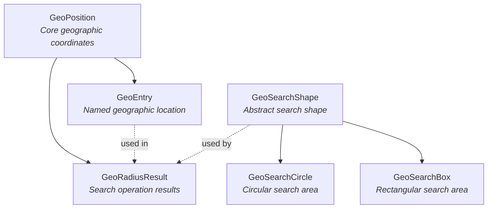
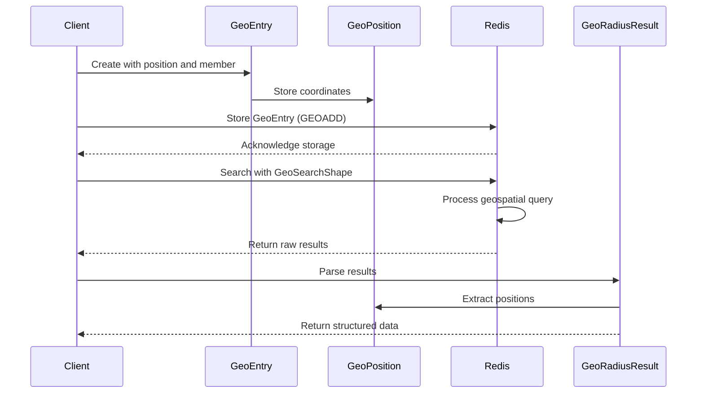
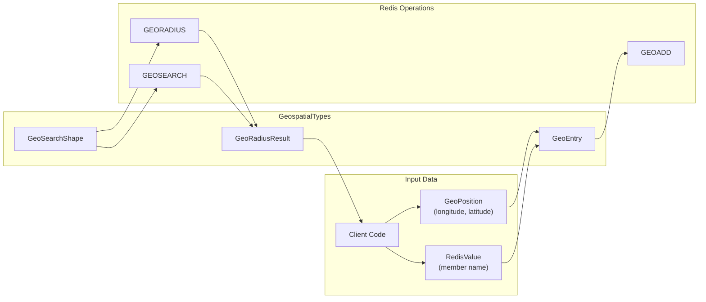
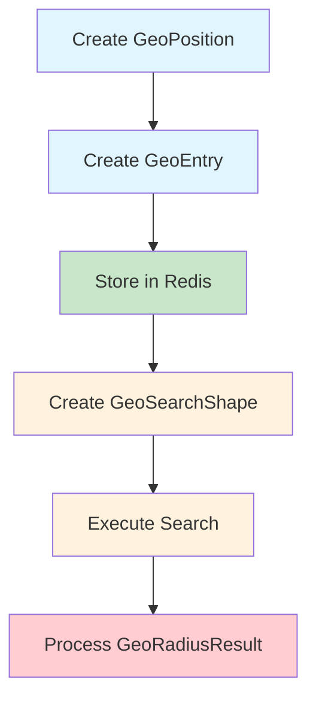

# GeospatialTypes Module Documentation

## Introduction

The GeospatialTypes module provides the fundamental data structures and types for working with Redis geospatial operations in StackExchange.Redis. This module defines the core types that represent geographic positions, entries, search results, and search shapes used in Redis GEO commands.

The module is designed to provide a type-safe, efficient way to handle geographic data in Redis, supporting operations like storing locations, calculating distances, and performing radius-based searches.

## Architecture Overview

The GeospatialTypes module consists of four primary components that work together to provide comprehensive geospatial functionality:

## Core Components

### GeoPosition

The `GeoPosition` struct represents a geographic coordinate with latitude and longitude values. It serves as the foundation for all geospatial operations.

**Key Features:**
- Immutable struct design for thread safety
- Built-in equality comparison
- Support for different geographic units (meters, kilometers, miles, feet)
- Redis unit conversion utilities

**Dependencies:**
- Uses `GeoUnit` enum for unit specifications
- Integrates with Redis literal formatting

### GeoEntry

The `GeoEntry` struct combines a `GeoPosition` with a member name, representing a named geographic location that can be stored in Redis.

**Key Features:**
- Combines position data with a RedisValue member name
- Immutable struct design
- Direct integration with Redis sorted sets (GeoEntries are stored as SortedSetEntries)
- Convenience properties for longitude and latitude access

**Dependencies:**
- Contains a `GeoPosition` for coordinate data
- Uses `RedisValue` for member identification

### GeoRadiusResult

The `GeoRadiusResult` struct represents the outcome of a geospatial radius search operation, containing information about matched locations.

**Key Features:**
- Contains member information, distance, hash value, and position
- All properties are nullable to handle optional result data
- Designed for use with Redis GEO radius commands

**Dependencies:**
- Uses `RedisValue` for member identification
- Contains optional `GeoPosition` for coordinate data

### GeoSearchShape Hierarchy

The abstract `GeoSearchShape` class provides the foundation for defining search areas in geospatial queries.

#### GeoSearchCircle
- Defines circular search areas with radius and unit
- Used for radius-based geospatial searches
- Supports all geographic units

#### GeoSearchBox
- Defines rectangular search areas with height, width, and unit
- Used for bounding box geospatial searches
- Supports all geographic units

**Dependencies:**
- Uses `GeoUnit` for distance specifications
- Integrates with Redis command argument generation

## Data Flow Architecture

## Component Interactions

## Integration with Redis Operations

The GeospatialTypes module integrates seamlessly with Redis geospatial commands:

1. **Storage**: `GeoEntry` instances are converted to Redis sorted set entries for storage via `GEOADD`
2. **Search**: `GeoSearchShape` instances generate appropriate Redis command arguments
3. **Results**: Redis responses are parsed into `GeoRadiusResult` structures

## Usage Patterns

### Basic Geospatial Operations

### Advanced Search Patterns
- **Radius Search**: Use `GeoSearchCircle` to find locations within a specified distance
- **Bounding Box Search**: Use `GeoSearchBox` to find locations within rectangular boundaries
- **Multi-criteria Search**: Combine search shapes with additional Redis filters

## Type Safety and Performance

The module emphasizes type safety and performance:

- **Immutable Structs**: `GeoPosition` and `GeoEntry` are immutable value types
- **Nullable References**: `GeoRadiusResult` uses nullable types for optional data
- **Efficient Conversions**: Built-in conversion utilities for Redis integration
- **Memory Efficiency**: Struct-based design minimizes heap allocations

## Relationship to Other Modules

The GeospatialTypes module integrates with several other StackExchange.Redis modules:

- **[ValueTypes](ValueTypes.md)**: Uses `RedisValue` for member identification
- **[ResultProcessing](ResultProcessing.md)**: `RedisValueGeoPositionProcessor` and `RedisValueGeoPositionArrayProcessor` handle geospatial result parsing
- **[DatabaseOperations](DatabaseOperations.md)**: Geospatial operations are executed through `RedisDatabase`
- **[APIValueTypes](APIValueTypes.md)**: Part of the broader API types ecosystem

## Error Handling and Validation

The module includes built-in validation and error handling:

- **Coordinate Validation**: Ensures valid latitude/longitude ranges
- **Unit Validation**: Validates geographic units through the `GetRedisUnit` method
- **Argument Validation**: Shape classes validate their parameters

## Thread Safety

All types in the GeospatialTypes module are thread-safe:

- **Immutable Design**: Structs are immutable after creation
- **No Shared State**: No static mutable state
- **Safe Concurrency**: Multiple threads can safely use the same instances

## Future Considerations

The modular design allows for future enhancements:

- **Additional Search Shapes**: New search area types can be added by extending `GeoSearchShape`
- **Enhanced Result Types**: New result structures can be added for specialized operations
- **Performance Optimizations**: Internal implementations can be optimized without breaking changes