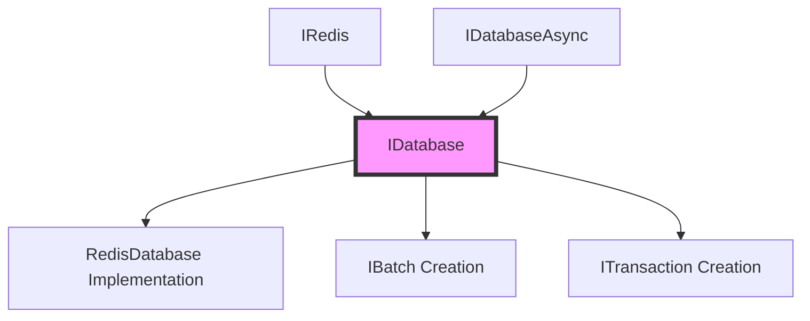
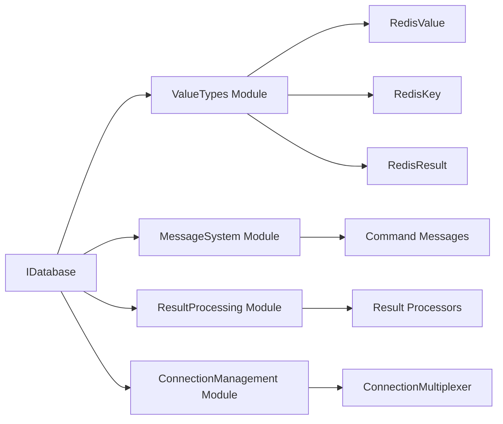
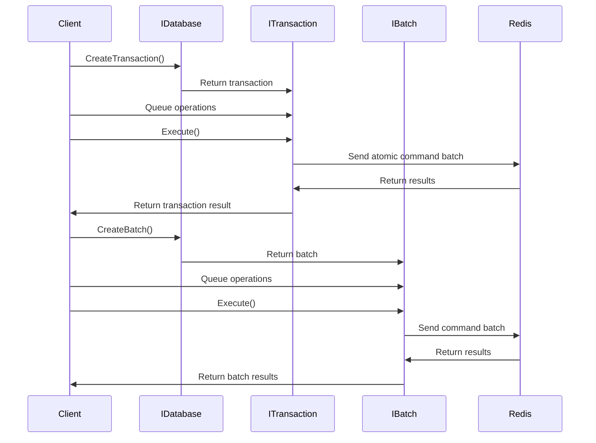
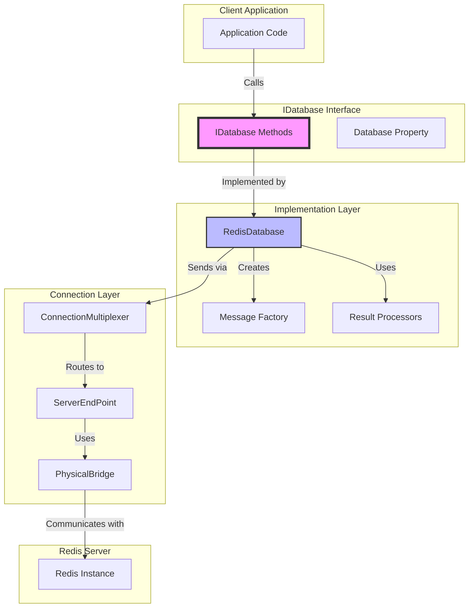

# IDatabase Module Documentation

## Overview

The `IDatabase` interface is the core abstraction for Redis database operations in the StackExchange.Redis library. It provides a comprehensive set of methods for interacting with Redis data structures, supporting both standalone Redis servers and Redis clusters. This interface serves as the primary entry point for executing Redis commands and managing data operations.

## Purpose and Scope

The `IDatabase` interface defines the contract for synchronous Redis operations across all major data types and functionalities:

- **Data Structure Operations**: Strings, Hashes, Lists, Sets, Sorted Sets
- **Advanced Features**: Geospatial operations, HyperLogLog, Streams, Pub/Sub
- **Key Management**: Expiration, persistence, migration, and metadata operations
- **Transaction Support**: Batch operations and atomic transactions
- **Scripting**: Lua script execution capabilities
- **Utility Operations**: Sorting, scanning, and custom command execution

## Architecture and Design

### Interface Hierarchy



### Core Components Integration



## Key Features and Capabilities

### 1. Database Identity and Context

The interface provides essential database context through:

- **Database Property**: Numeric identifier for the Redis database instance
- **Endpoint Identification**: `IdentifyEndpoint()` method for cluster-aware operations
- **Connection Management**: Integration with [ConnectionManagement](ConnectionManagement.md) module

### 2. Data Structure Operations

#### String Operations
- Basic get/set operations with optional expiration
- Atomic operations (increment, decrement, append)
- Bit manipulation and substring operations
- Advanced features like longest common subsequence

#### Hash Operations
- Field-level operations (get, set, delete, increment)
- Bulk operations for multiple fields
- Hash scanning with pattern matching
- Field-level expiration support (Redis 7.0+)

#### List Operations
- Stack/queue operations (push/pop from either end)
- Range queries and trimming
- Element insertion and removal
- Multi-key operations (LMPOP)

#### Set Operations
- Membership testing and manipulation
- Set algebra (union, intersection, difference)
- Random member selection
- Incremental scanning

#### Sorted Set Operations
- Score-based operations and ranking
- Range queries by rank, score, or lexicographical order
- Set operations with weights and aggregation
- Random member selection with scores

### 3. Advanced Data Structures

#### Geospatial Operations
- Location storage and retrieval
- Distance calculations
- Radius and shape-based searches
- Geohash computations

#### HyperLogLog
- Cardinality estimation
- Merge operations
- Memory-efficient counting

#### Streams
- Message publishing and consumption
- Consumer group management
- Message acknowledgment and claiming
- Stream trimming and range queries

### 4. Key Management

#### Lifecycle Operations
- Creation, deletion, and renaming
- Expiration management with various conditions
- Persistence and time-to-live queries
- Key migration between servers

#### Metadata Operations
- Type inspection
- Size and encoding information
- Reference counting and frequency analysis
- Idle time tracking

### 5. Transaction and Batch Support



### 6. Scripting Support

- Lua script execution with EVAL/EVALSHA
- Script loading and caching
- Read-only script variants
- Parameterized script execution

### 7. Utility Operations

#### Scanning Operations
- Incremental iteration over keys, sets, sorted sets, and hashes
- Pattern-based filtering
- Cursor-based pagination

#### Sorting Operations
- Multi-type sorting (lists, sets, sorted sets)
- External key lookups
- Result storage and pagination

#### Custom Command Execution
- Arbitrary command execution
- Module command support
- Dynamic result handling

## Data Flow Architecture



## Integration with Other Modules

### ConnectionManagement Module
The `IDatabase` interface relies on the [ConnectionManagement](ConnectionManagement.md) module for:
- Connection multiplexing and pooling
- Server endpoint management
- Command routing and load balancing
- Connection state monitoring

### ValueTypes Module
Integration with [ValueTypes](ValueTypes.md) provides:
- `RedisValue` for flexible data representation
- `RedisKey` for key abstraction
- `RedisResult` for dynamic result handling
- Specialized types for geospatial and stream data

### MessageSystem Module
The [MessageSystem](MessageSystem.md) module supports:
- Command message creation and serialization
- Protocol-level message handling
- Command batching and pipelining

### ResultProcessing Module
[ResultProcessing](ResultProcessing.md) provides:
- Type-safe result conversion
- Specialized processors for complex data types
- Error handling and result validation

## Usage Patterns and Best Practices

### 1. Basic Operations
```csharp
// Get database instance
IDatabase db = connectionMultiplexer.GetDatabase();

// String operations
string value = db.StringGet("key");
bool success = db.StringSet("key", "value", TimeSpan.FromMinutes(5));

// Hash operations
HashEntry[] entries = db.HashGetAll("hashkey");
db.HashSet("hashkey", new HashEntry[] { new HashEntry("field", "value") });
```

### 2. Transaction Usage
```csharp
// Create transaction
ITransaction transaction = db.CreateTransaction();

// Queue operations
transaction.StringSetAsync("key1", "value1");
transaction.HashSetAsync("hashkey", "field", "value");

// Execute atomically
bool committed = transaction.Execute();
```

### 3. Batch Operations
```csharp
// Create batch
IBatch batch = db.CreateBatch();

// Queue operations
Task<string> getTask = batch.StringGetAsync("key1");
Task<bool> setTask = batch.StringSetAsync("key2", "value2");

// Execute batch
batch.Execute();

// Await results
string value = await getTask;
bool success = await setTask;
```

### 4. Stream Operations
```csharp
// Add to stream
RedisValue messageId = db.StreamAdd("stream", "field", "value");

// Read from stream
StreamEntry[] entries = db.StreamRead("stream", StreamPosition.Beginning);

// Consumer group operations
db.StreamCreateConsumerGroup("stream", "group", StreamPosition.NewMessages);
StreamEntry[] groupEntries = db.StreamReadGroup("stream", "group", "consumer", StreamPosition.NewMessages);
```

## Performance Considerations

### 1. Command Pipelining
The interface supports automatic pipelining when operations are executed in batches or transactions, reducing network round-trips.

### 2. Connection Multiplexing
Integration with the connection management system ensures efficient connection reuse and load balancing across Redis servers.

### 3. Result Processing
Specialized result processors optimize data conversion and minimize memory allocations for common operations.

### 4. Scanning Operations
Incremental scanning methods provide memory-efficient iteration over large datasets without blocking the server.

## Error Handling and Resilience

### 1. Exception Types
The interface methods throw appropriate exceptions for:
- Connection failures
- Timeout conditions
- Redis server errors
- Type mismatches

### 2. Retry Policies
Integration with connection management provides automatic retry capabilities for transient failures.

### 3. Command Flags
The `CommandFlags` parameter allows fine-grained control over command execution:
- Fire-and-forget operations
- High-priority commands
- No-reply optimizations
- Demand-master routing

## Extensibility Points

### 1. Custom Commands
The `Execute` method enables execution of custom commands and Redis modules:
```csharp
RedisResult result = db.Execute("CUSTOM.COMMAND", "arg1", "arg2");
```

### 2. Script Execution
Lua script support provides extensibility for complex operations:
```csharp
RedisResult scriptResult = db.ScriptEvaluate("return redis.call('GET', KEYS[1])", new RedisKey[] { "key" });
```

### 3. Result Processing
Custom result processors can be integrated through the result processing system for specialized data handling.

## Related Documentation

- [ConnectionManagement](ConnectionManagement.md) - Connection multiplexing and server management
- [ValueTypes](ValueTypes.md) - Core data type abstractions
- [MessageSystem](MessageSystem.md) - Command message handling
- [ResultProcessing](ResultProcessing.md) - Result conversion and processing
- [DatabaseOperations](DatabaseOperations.md) - Implementation details for database operations
- [TransactionSupport](TransactionSupport.md) - Transaction and batch operation implementations
- [APIValueTypes](APIValueTypes.md) - Specialized API types for complex operations

## Version Compatibility

The `IDatabase` interface is designed to be compatible with:
- Redis 2.6+ (basic operations)
- Redis 3.0+ (cluster support)
- Redis 5.0+ (stream operations)
- Redis 7.0+ (advanced features like field expiration)

Interface methods include appropriate documentation indicating minimum Redis version requirements where applicable.