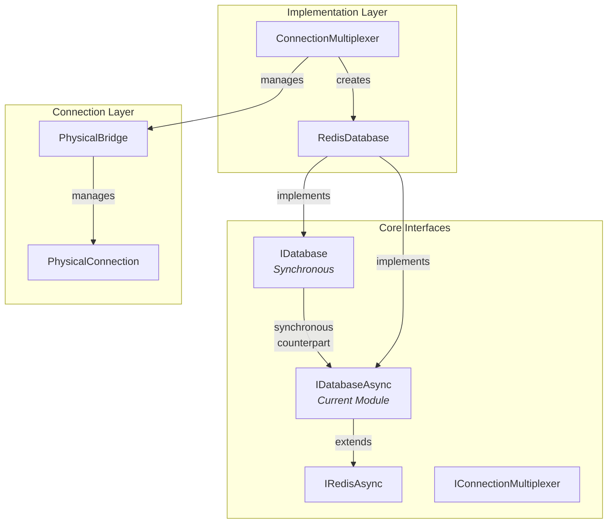
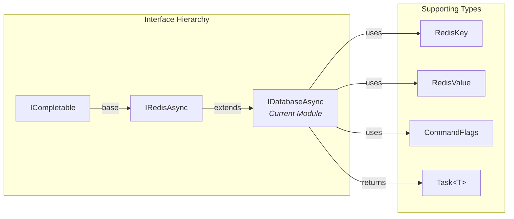
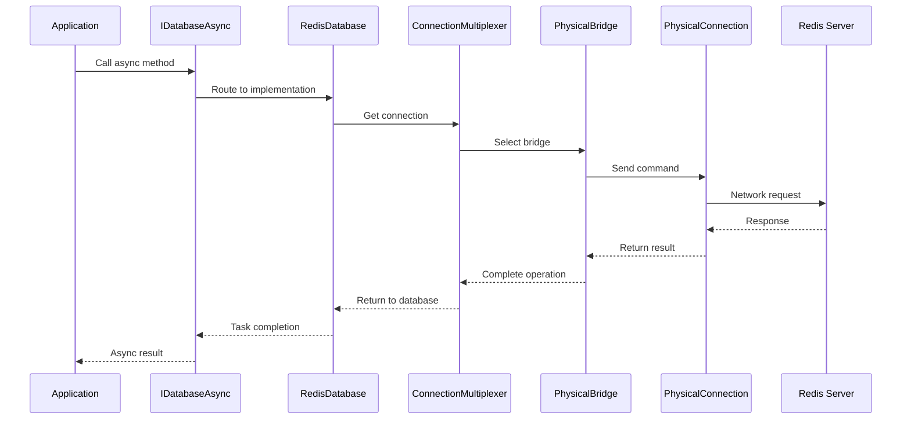
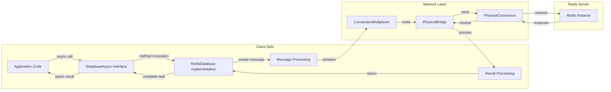

# IDatabaseAsync Module Documentation

## Introduction

The `IDatabaseAsync` module is a core interface in the StackExchange.Redis library that provides asynchronous access to Redis database operations. It serves as the primary contract for performing non-blocking Redis operations across all major data types and functionality areas, including strings, hashes, lists, sets, sorted sets, streams, geospatial data, and more.

This interface is fundamental to the library's async programming model, enabling developers to perform Redis operations without blocking threads, which is crucial for building scalable, high-performance applications.

## Architecture Overview

### Module Position in System Architecture

The `IDatabaseAsync` interface sits at the heart of the StackExchange.Redis architecture, providing the async contract that all database operations must implement. It extends [`IRedisAsync`](IRedisAsync.md) and works in conjunction with the synchronous [`IDatabase`](IDatabase.md) interface to provide a complete Redis API.



### Interface Hierarchy and Dependencies



## Core Functionality

### Data Type Operations

The `IDatabaseAsync` interface provides comprehensive async operations for all Redis data types:

#### String Operations
- Basic get/set operations with expiration support
- Atomic increment/decrement operations
- Bit manipulation operations
- Advanced string operations (append, range, length)

#### Hash Operations
- Field-level operations (get, set, delete, exists)
- Bulk operations on multiple fields
- Hash scanning for large datasets
- Atomic field operations with expiration

#### List Operations
- Push/pop operations from both ends
- List manipulation (insert, remove, trim)
- Range queries and indexing
- Blocking operations with async support

#### Set Operations
- Member management (add, remove, check existence)
- Set operations (union, intersection, difference)
- Random member selection
- Set scanning and iteration

#### Sorted Set Operations
- Score-based operations
- Range queries by rank and score
- Set operations with aggregation
- Member ranking and scoring

#### Stream Operations
- Stream message management
- Consumer group operations
- Message acknowledgment and claiming
- Stream trimming and cleanup

#### Geospatial Operations
- Location storage and retrieval
- Distance calculations
- Radius and shape-based searches
- Geohash operations

### Advanced Features

#### Connection Management
```csharp
// Check connection status for specific keys
bool IsConnected(RedisKey key, CommandFlags flags = CommandFlags.None);

// Identify endpoint responsible for a key
Task<EndPoint?> IdentifyEndpointAsync(RedisKey key = default, CommandFlags flags = CommandFlags.None);
```

#### Scripting Support
```csharp
// Execute Lua scripts
Task<RedisResult> ScriptEvaluateAsync(string script, RedisKey[]? keys = null, RedisValue[]? values = null, CommandFlags flags = CommandFlags.None);

// Use pre-compiled scripts
Task<RedisResult> ScriptEvaluateAsync(LoadedLuaScript script, object? parameters = null, CommandFlags flags = CommandFlags.None);
```

#### Transaction Support
The interface supports Redis transactions through the [`ITransaction`](ITransaction.md) interface, allowing multiple operations to be executed atomically.

#### Pub/Sub Integration
```csharp
// Publish messages to channels
Task<long> PublishAsync(RedisChannel channel, RedisValue message, CommandFlags flags = CommandFlags.None);
```

## Data Flow Architecture

### Async Operation Flow



### Message Processing Pipeline



## Component Interactions

### Integration with Core Modules

The `IDatabaseAsync` interface integrates with several key modules in the StackExchange.Redis ecosystem:

#### ConnectionManagement Integration
- Uses [`IConnectionMultiplexer`](IConnectionMultiplexer.md) to obtain connections
- Leverages [`ServerSelectionStrategy`](ServerSelectionStrategy.md) for optimal server selection
- Integrates with [`PhysicalBridge`](PhysicalBridge.md) for network communication

#### ValueTypes Integration
- Operates on [`RedisKey`](RedisValue.md) and [`RedisValue`](RedisValue.md) types
- Returns specialized result types from [`APIValueTypes`](APIValueTypes.md)
- Uses [`RedisChannel`](RedisChannel.md) for pub/sub operations

#### ResultProcessing Integration
- Utilizes result processors from [`ResultProcessing`](ResultProcessing.md) module
- Handles different Redis response types through specialized processors
- Supports complex result transformations

#### MessageSystem Integration
- Creates appropriate message types from [`MessageSystem`](MessageSystem.md)
- Handles command serialization and protocol formatting
- Manages message routing and delivery

## Usage Patterns

### Basic Async Operations

```csharp
// Get database instance
IDatabaseAsync db = connectionMultiplexer.GetDatabase();

// Async string operations
string value = await db.StringGetAsync("key");
await db.StringSetAsync("key", "value", TimeSpan.FromMinutes(5));

// Async hash operations
HashEntry[] entries = await db.HashGetAllAsync("hash:key");
await db.HashSetAsync("hash:key", new[] { 
    new HashEntry("field1", "value1"),
    new HashEntry("field2", "value2")
});
```

### Advanced Async Patterns

```csharp
// Async streaming operations
await foreach (var entry in db.HashScanAsync("large:hash"))
{
    // Process each entry asynchronously
    await ProcessEntryAsync(entry);
}

// Async transaction
ITransaction transaction = db.CreateTransaction();
task1 = transaction.StringSetAsync("key1", "value1");
task2 = transaction.HashSetAsync("hash:key", "field", "value");
bool committed = await transaction.ExecuteAsync();
```

### Error Handling and Timeouts

```csharp
try
{
    // Operation with specific timeout and flags
    var result = await db.StringGetAsync("key", CommandFlags.DemandMaster);
}
catch (RedisTimeoutException ex)
{
    // Handle timeout
}
catch (RedisConnectionException ex)
{
    // Handle connection issues
}
```

## Performance Considerations

### Async Benefits
- **Non-blocking I/O**: Operations don't block thread pool threads
- **Scalability**: Enables handling thousands of concurrent operations
- **Resource Efficiency**: Better CPU utilization under load
- **Responsiveness**: Applications remain responsive during Redis operations

### Best Practices
1. **Use async all the way**: Avoid blocking on async operations with `.Result` or `.Wait()`
2. **Configure awaits**: Use `ConfigureAwait(false)` in library code
3. **Batch operations**: Use multi-key operations when possible
4. **Connection sharing**: Reuse `ConnectionMultiplexer` instances
5. **Proper disposal**: Dispose of connections properly

### Command Flags
The interface supports various [`CommandFlags`](CommandFlags.md) for fine-tuning operation behavior:
- **DemandMaster**: Force operation to master node
- **DemandSlave**: Force operation to slave node
- **PreferMaster**: Prefer master but allow slave
- **PreferSlave**: Prefer slave but allow master
- **NoRedirect**: Don't follow MOVED/ASK redirects

## Relationship to Other Modules

### Direct Dependencies
- [`IRedisAsync`](IRedisAsync.md): Base interface providing core Redis functionality
- [`IDatabase`](IDatabase.md): Synchronous counterpart interface
- [`RedisDatabase`](RedisDatabase.md): Primary implementation class

### Supporting Modules
- [`ConnectionManagement`](ConnectionManagement.md): Provides connection infrastructure
- [`ValueTypes`](ValueTypes.md): Defines core data types
- [`MessageSystem`](MessageSystem.md): Handles protocol messages
- [`ResultProcessing`](ResultProcessing.md): Processes Redis responses
- [`APIValueTypes`](APIValueTypes.md): Provides specialized result types

### Related Interfaces
- [`ITransaction`](ITransaction.md): For transaction support
- [`IBatch`](IBatch.md): For batching operations
- [`ISubscriber`](ISubscriber.md): For pub/sub operations
- [`IServer`](IServer.md): For server management operations

## Thread Safety and Concurrency

The `IDatabaseAsync` interface implementations are thread-safe and designed for concurrent use:
- Multiple threads can safely call methods on the same instance
- Operations are atomic at the Redis level
- Connection state is managed independently of operation calls
- Async operations don't interfere with each other

## Migration and Compatibility

### From Synchronous to Async
When migrating from [`IDatabase`](IDatabase.md) to `IDatabaseAsync`:
1. Add `Async` suffix to method names
2. Change return types to `Task<T>`
3. Add `await` keywords
4. Update method signatures to use async/await pattern

### Version Compatibility
The interface maintains backward compatibility while adding new Redis features:
- New methods are added for new Redis commands
- Existing method signatures remain stable
- Deprecated operations are marked with `[Obsolete]`

## Conclusion

The `IDatabaseAsync` interface is a cornerstone of the StackExchange.Redis library, providing a comprehensive, type-safe, and performant way to interact with Redis asynchronously. Its design enables developers to build scalable applications that can efficiently handle high-concurrency scenarios while maintaining clean, maintainable code through the async/await pattern.

The interface's extensive coverage of Redis functionality, from basic string operations to advanced stream processing, makes it suitable for a wide range of use cases, from simple caching scenarios to complex distributed systems requiring sophisticated data structures and real-time processing capabilities.