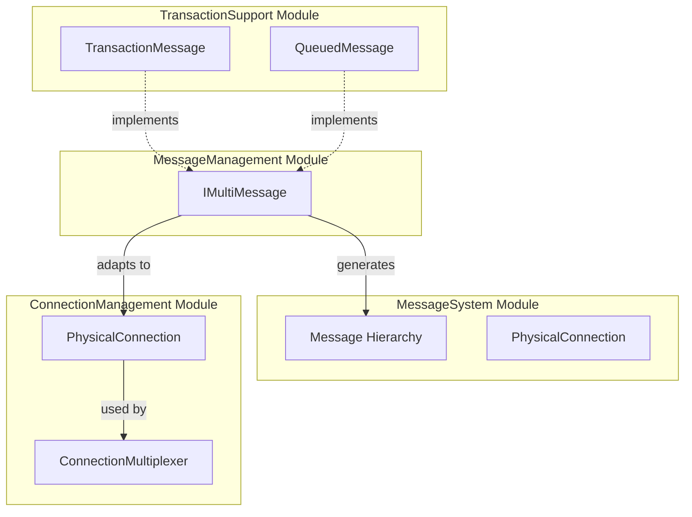
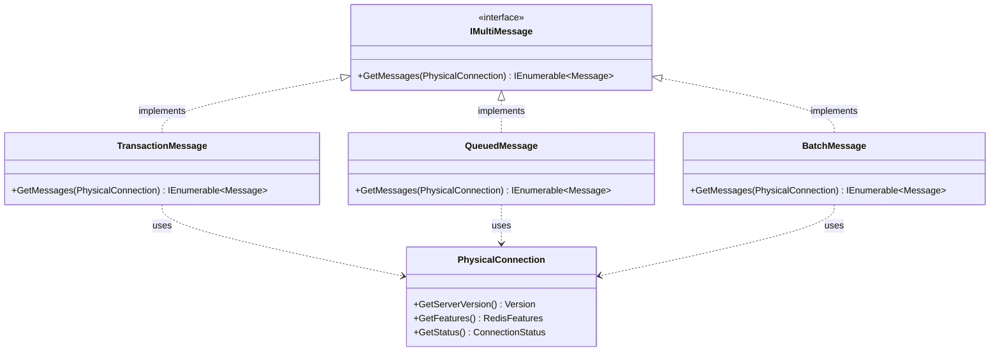
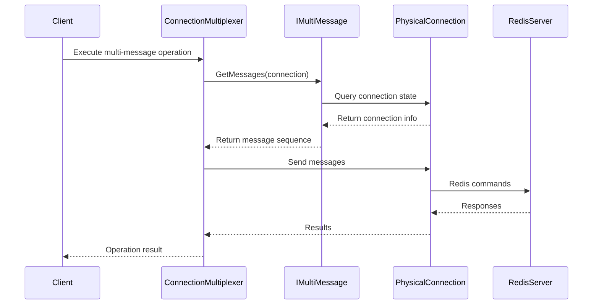
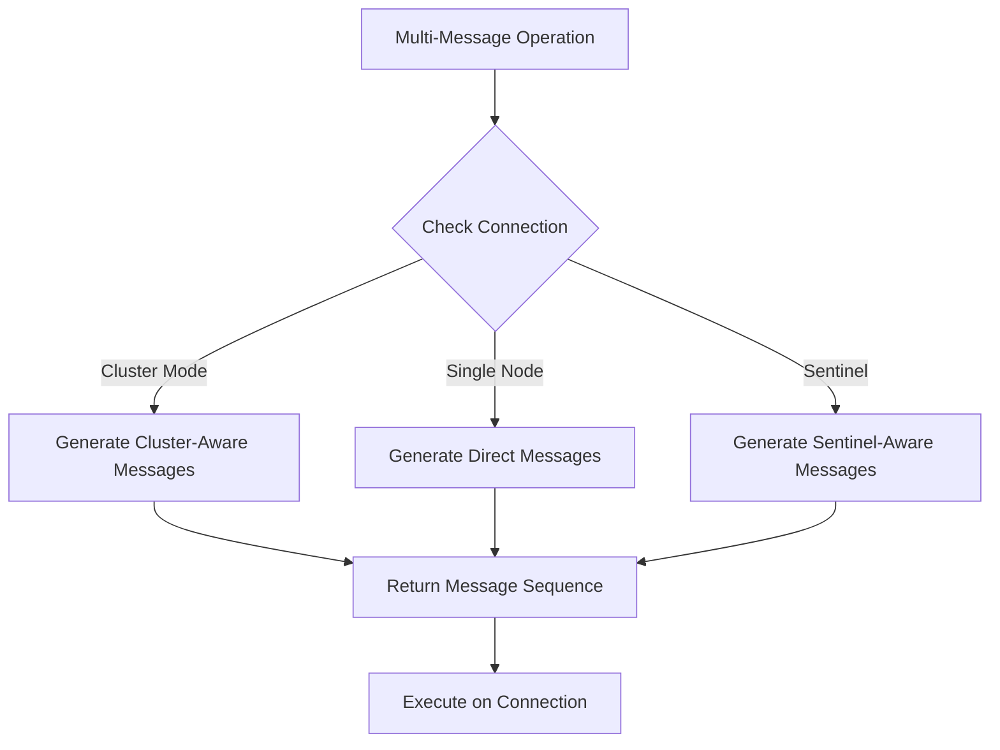
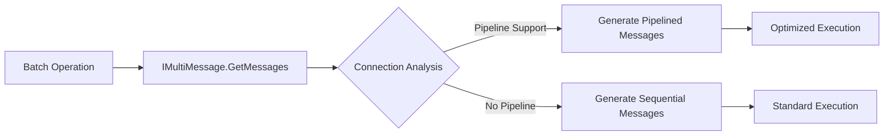

# MessageManagement Module Documentation

## Introduction

The MessageManagement module provides the core infrastructure for handling multiple Redis messages within the StackExchange.Redis client library. This module defines the `IMultiMessage` interface, which enables the creation and management of batched or grouped Redis operations that can be executed as a single unit across physical connections.

## Overview

The MessageManagement module is a lightweight but critical component that sits at the intersection of the [MessageSystem](MessageSystem.md) and [ConnectionManagement](ConnectionManagement.md) modules. It provides the abstraction necessary for handling complex multi-message operations while maintaining the flexibility to adapt to different connection scenarios.

## Core Components

### IMultiMessage Interface

The `IMultiMessage` interface is the sole component of this module, defined as:

```csharp
internal interface IMultiMessage
{
    IEnumerable<Message> GetMessages(PhysicalConnection connection);
}
```

This interface serves as a contract for components that need to generate multiple Redis messages dynamically based on the current connection context. The `GetMessages` method takes a `PhysicalConnection` parameter, allowing implementers to tailor the message generation based on connection-specific factors such as server capabilities, protocol version, or connection state.

## Architecture

### Component Relationships



### Interface Implementation Pattern



## Data Flow

### Message Generation Flow



## Integration with Other Modules

### TransactionSupport Module
The [TransactionSupport](TransactionSupport.md) module heavily utilizes the MessageManagement infrastructure. Both `TransactionMessage` and `QueuedMessage` classes implement `IMultiMessage` to provide transaction-specific message generation logic that adapts to the current connection context.

### MessageSystem Module
The [MessageSystem](MessageSystem.md) module provides the base `Message` class hierarchy that `IMultiMessage` implementations generate. The relationship is compositional - `IMultiMessage` creates sequences of `Message` objects based on connection-specific requirements.

### ConnectionManagement Module
The [ConnectionManagement](ConnectionManagement.md) module provides the `PhysicalConnection` instances that `IMultiMessage` implementations use to tailor message generation. This allows messages to be adapted based on server capabilities, connection state, or protocol requirements.

## Usage Patterns

### Connection-Adaptive Message Generation



### Batch Operation Optimization



## Key Benefits

1. **Connection Adaptability**: Messages can be generated based on the specific capabilities and state of the target connection
2. **Batch Operation Support**: Enables efficient batching of multiple Redis operations
3. **Transaction Integration**: Provides the foundation for transaction message handling
4. **Protocol Flexibility**: Allows message generation to adapt to different Redis protocol versions
5. **Server Capability Awareness**: Messages can be tailored based on server features and configuration

## Implementation Considerations

### Thread Safety
Implementations of `IMultiMessage` should be thread-safe, as the same instance may be used across multiple connections or threads simultaneously.

### Performance
The `GetMessages` method may be called frequently, so implementations should be optimized for performance and avoid expensive operations.

### Connection State Dependency
Implementations should handle cases where the connection state changes between message generation and execution, potentially caching connection properties at generation time.

## Related Documentation

- [MessageSystem](MessageSystem.md) - Core message types and hierarchy
- [ConnectionManagement](ConnectionManagement.md) - Physical connection handling
- [TransactionSupport](TransactionSupport.md) - Transaction message implementations
- [CoreInterfaces](CoreInterfaces.md) - Interface definitions and contracts

## Summary

The MessageManagement module, though minimal in component count, provides essential infrastructure for advanced Redis operations in StackExchange.Redis. By enabling connection-aware message generation, it facilitates efficient batching, transaction support, and protocol adaptation while maintaining clean separation of concerns across the library's architecture.