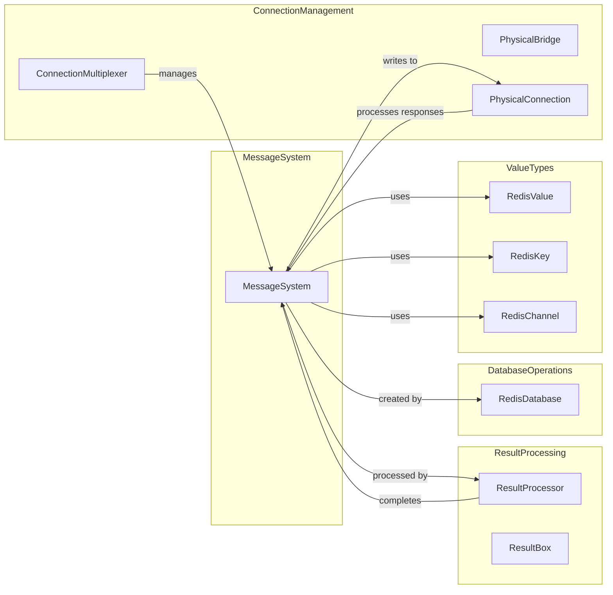
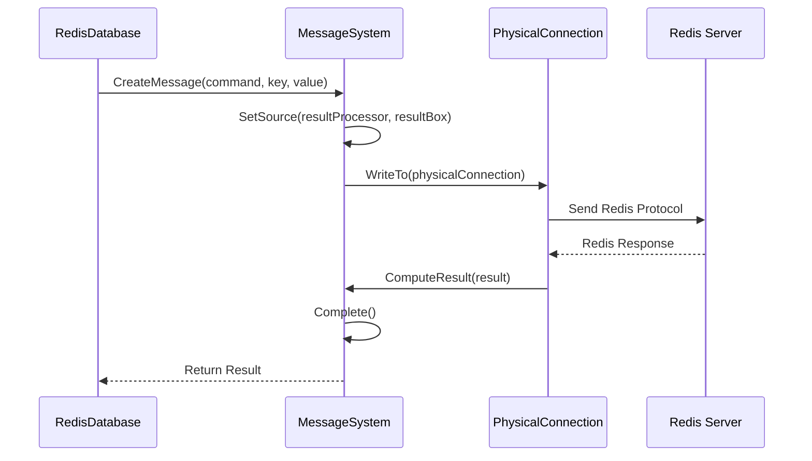
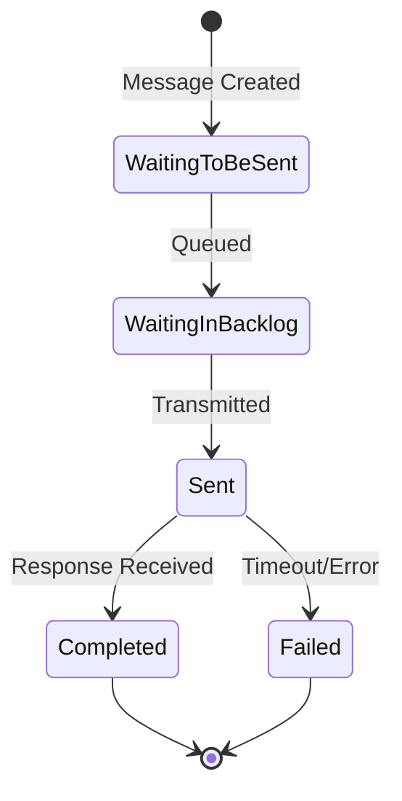
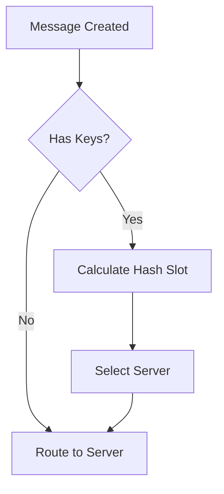
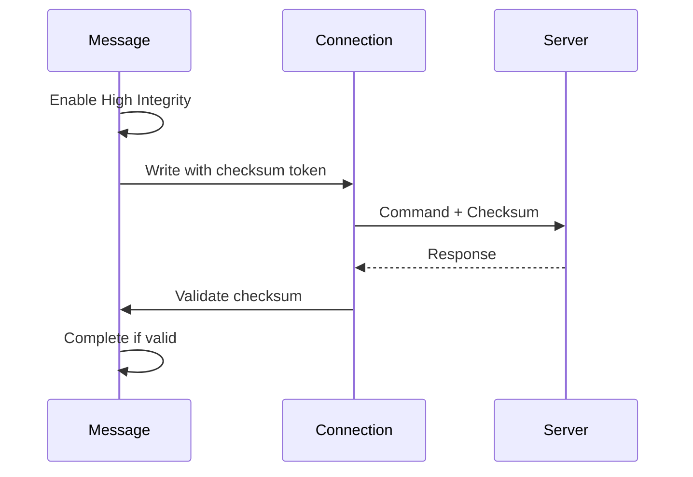
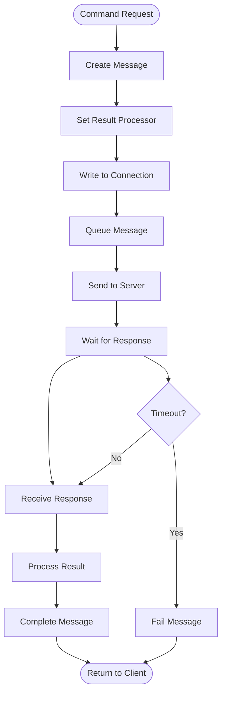
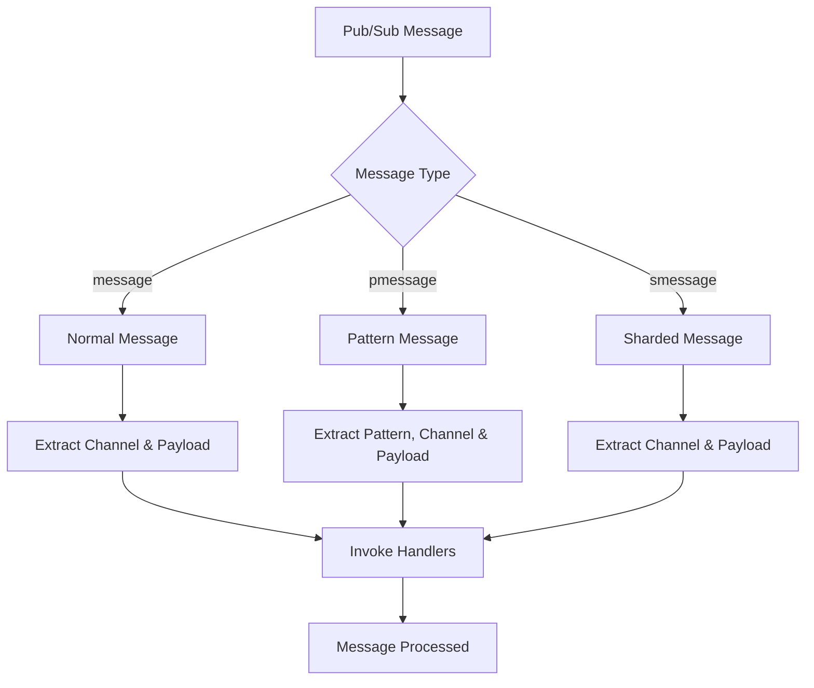

# MessageSystem Module Documentation

## Overview

The MessageSystem module is the core communication layer of the StackExchange.Redis client library, responsible for creating, managing, and processing Redis protocol messages. It serves as the fundamental bridge between high-level Redis operations and the low-level Redis protocol, handling message serialization, command routing, and response processing.

## Purpose and Core Functionality

The MessageSystem module provides:

- **Message Creation and Serialization**: Converts high-level Redis commands into Redis protocol messages
- **Command Routing**: Determines appropriate server endpoints for commands based on key hashing and cluster topology
- **Response Processing**: Handles incoming Redis responses and correlates them with pending requests
- **Protocol Compliance**: Supports both RESP2 and RESP3 Redis protocol versions
- **Connection Management**: Integrates with connection layer for reliable message delivery
- **Performance Monitoring**: Tracks message lifecycle and performance metrics

## Architecture

### Core Components

```mermaid
graph TB
    subgraph "MessageSystem Module"
        Message[Message Base Class]
        LoggingMessage[LoggingMessage]
        HelloMessage[HelloMessage]
        
        subgraph "Command Message Types"
            CommandMessage[CommandMessage]
            CommandKeyMessage[CommandKeyMessage]
            CommandKeyValueMessage[CommandKeyValueMessage]
            CommandChannelMessage[CommandChannelMessage]
            CommandValueMessage[CommandValueMessage]
            CommandKeyKeyMessage[CommandKeyKeyMessage]
            CommandKeyValuesMessage[CommandKeyValuesMessage]
            CommandValuesMessage[CommandValuesMessage]
            SelectMessage[SelectMessage]
            UnknownMessage[UnknownMessage]
        end
        
        subgraph "Base Classes"
            CommandKeyBase[CommandKeyBase]
            CommandChannelBase[CommandChannelBase]
        end
    end
    
    Message --> CommandMessage
    Message --> CommandKeyBase
    Message --> CommandChannelBase
    Message --> LoggingMessage
    Message --> HelloMessage
    Message --> SelectMessage
    Message --> UnknownMessage
    
    CommandKeyBase --> CommandKeyMessage
    CommandKeyBase --> CommandKeyValueMessage
    CommandKeyBase --> CommandKeyKeyMessage
    CommandKeyBase --> CommandKeyValuesMessage
    
    CommandChannelBase --> CommandChannelMessage
    CommandChannelBase --> CommandValueChannelMessage
```



### Message Hierarchy

The MessageSystem uses a hierarchical design where all message types inherit from the abstract `Message` base class:

- **Message**: Abstract base providing core functionality like flags management, result processing, and lifecycle tracking
- **CommandKeyBase**: Base for messages involving Redis keys, providing hash slot calculation
- **CommandChannelBase**: Base for pub/sub messages involving Redis channels
- **Specialized Messages**: Concrete implementations for specific command patterns

## Component Relationships

### Integration with Other Modules



## Data Flow

### Message Creation and Processing Flow



### Message Lifecycle



## Key Features

### 1. Message Factory Pattern

The MessageSystem provides extensive factory methods for creating different message types:

```csharp
// Simple command
Message.Create(db, flags, RedisCommand.PING)

// Key-based command
Message.Create(db, flags, RedisCommand.GET, key)

// Key-value command
Message.Create(db, flags, RedisCommand.SET, key, value)

// Channel-based command
Message.Create(db, flags, RedisCommand.PUBLISH, channel, message)

// Multi-key commands
Message.Create(db, flags, RedisCommand.MGET, keys)
```

### 2. Hash Slot Calculation

For Redis Cluster support, messages calculate hash slots for key-based operations:



### 3. Command Flags Management

The system supports various command flags that control behavior:

- **DemandMaster/DemandReplica**: Server selection preferences
- **FireAndForget**: Don't wait for response
- **NoRedirect**: Prevent cluster redirections
- **HighPriority**: Priority queue placement
- **InternalCall**: System-internal commands

### 4. High-Integrity Mode

For critical operations, the system supports high-integrity mode with checksum validation:



## Process Flows

### Command Execution Process



### Pub/Sub Message Handling



## Error Handling

The MessageSystem implements comprehensive error handling:

### Connection Failures
- **SocketFailure**: Network connectivity issues
- **AuthenticationFailure**: Authentication errors
- **SocketClosed**: Premature connection closure
- **ProtocolFailure**: Redis protocol violations

### Message Failures
- **TimeoutException**: Response timeout
- **RedisCommandException**: Command execution errors
- **InvalidOperationException**: Protocol violations

### Error Recovery
- Automatic retry for transient failures
- Cluster redirection handling (MOVED/ASK)
- Connection failover to replica servers
- Message requeuing during reconfiguration

## Performance Considerations

### Memory Management
- Object pooling for frequently used message types
- Arena allocation for response parsing
- Minimal allocations in hot paths

### Throughput Optimization
- Pipeline-friendly message design
- Async/await pattern throughout
- Lock-free algorithms where possible
- Efficient protocol serialization

### Monitoring and Diagnostics
- Message lifecycle tracking
- Performance counter integration
- Detailed logging support
- Storm log generation for debugging

## Integration Points

### ConnectionManagement Module
- [ConnectionMultiplexer](ConnectionManagement.md): Manages message routing and server selection
- [PhysicalBridge](ConnectionManagement.md): Handles message queuing and connection state
- [PhysicalConnection](ConnectionManagement.md): Provides low-level protocol communication

### ResultProcessing Module
- [ResultProcessor](ResultProcessing.md): Processes Redis responses and completes messages
- [ResultBox](ResultProcessing.md): Manages asynchronous result delivery

### DatabaseOperations Module
- [RedisDatabase](DatabaseOperations.md): Creates messages for database operations

## Best Practices

### Message Creation
1. Use appropriate factory methods for message types
2. Set correct command flags for intended behavior
3. Ensure proper key/value validation
4. Consider cluster implications for multi-key operations

### Error Handling
1. Always handle timeout scenarios
2. Implement proper cancellation support
3. Monitor connection health indicators
4. Use high-integrity mode for critical operations

### Performance
1. Minimize message allocations in hot paths
2. Use fire-and-forget for non-critical operations
3. Leverage connection pooling effectively
4. Monitor message queue depths

## Conclusion

The MessageSystem module forms the backbone of the StackExchange.Redis client, providing a robust, efficient, and feature-rich foundation for Redis communication. Its design enables high-performance scenarios while maintaining reliability and protocol compliance across different Redis deployments (standalone, cluster, sentinel).

The modular architecture allows for easy extension and maintenance while providing excellent performance characteristics through careful optimization of critical paths and comprehensive error handling for production scenarios.