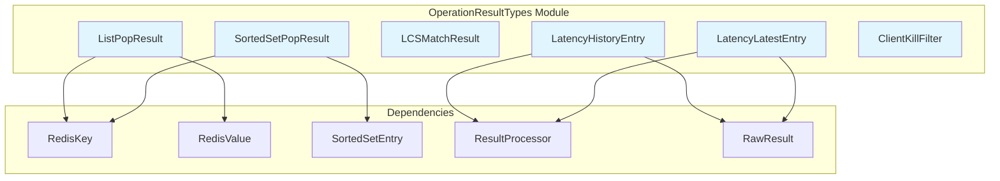
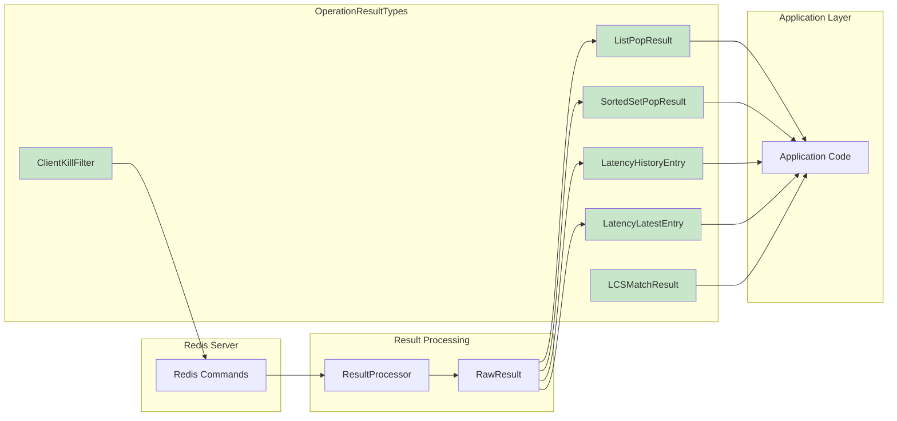
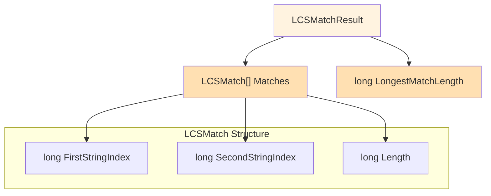
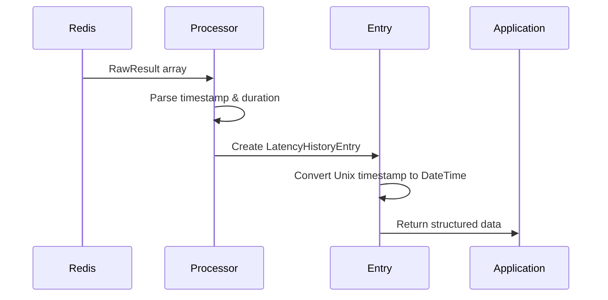
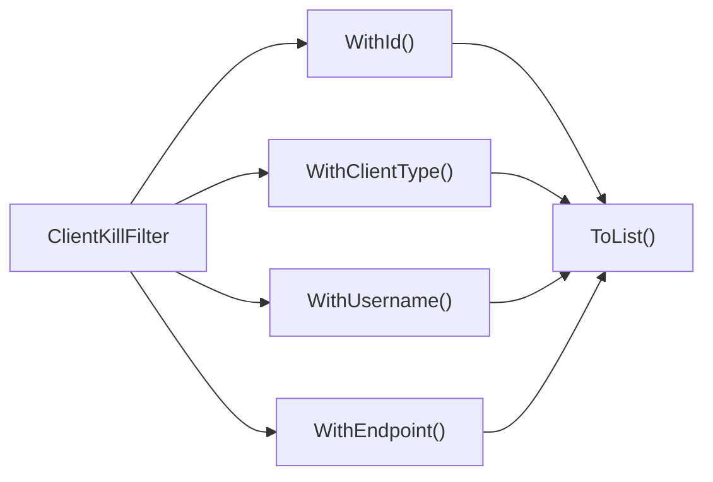
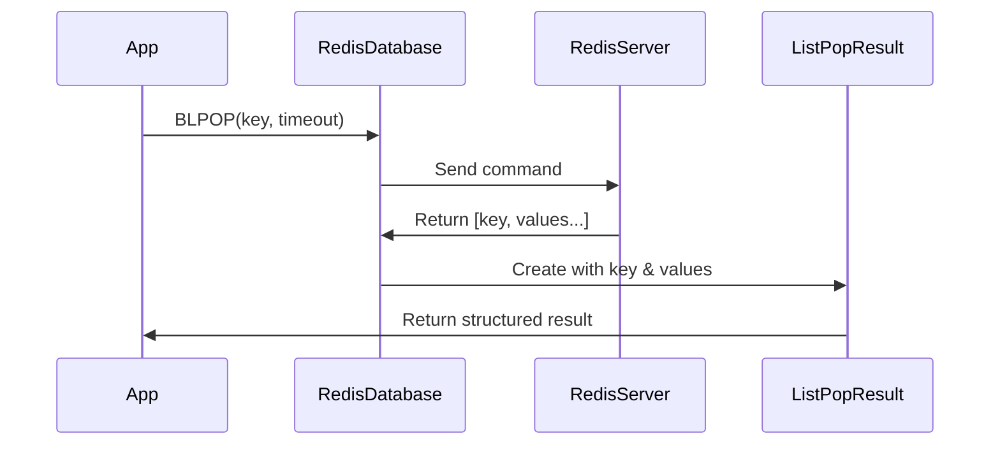
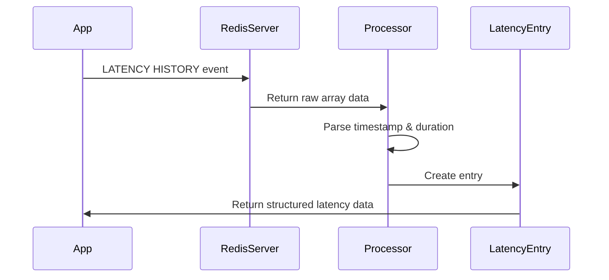
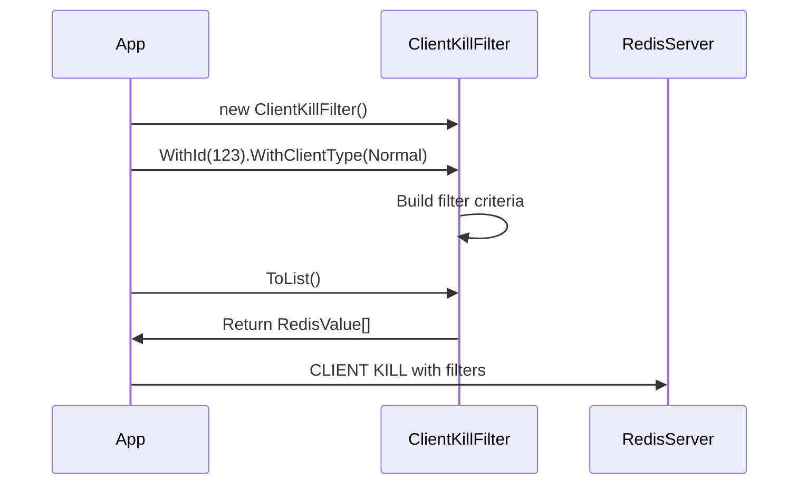

# OperationResultTypes Module Documentation

## Introduction

The OperationResultTypes module provides specialized data structures for representing the results of complex Redis operations. These types encapsulate the return values from various Redis commands that return structured data beyond simple key-value pairs, including list operations, sorted set operations, string analysis, latency monitoring, and client management operations.

## Module Overview

The OperationResultTypes module contains six core components that handle different categories of Redis operation results:

- **ListPopResult**: Represents results from list pop operations (BLPOP, BRPOP)
- **SortedSetPopResult**: Represents results from sorted set pop operations (ZPOPMIN, ZPOPMAX)
- **LCSMatchResult**: Represents results from Longest Common Subsequence operations (LCS command)
- **LatencyHistoryEntry**: Represents individual latency history records
- **LatencyLatestEntry**: Represents latest latency statistics for events
- **ClientKillFilter**: Provides filtering capabilities for client termination operations

## Architecture

### Component Relationships

### Data Flow Architecture

## Core Components

### ListPopResult

**Purpose**: Represents the result of list pop operations that can return multiple values from a Redis list.

**Key Features**:
- Immutable struct design for performance
- Null pattern implementation with static `Null` property
- Contains the source key and popped values array
- Built-in null checking via `IsNull` property

**Usage Context**:
- BLPOP/BRPOP operations
- List operations that pop multiple elements
- Operations requiring key tracking alongside values

**Dependencies**:
- [RedisKey](ValueTypes.md): For key identification
- [RedisValue](ValueTypes.md): For storing popped values

### SortedSetPopResult

**Purpose**: Represents the result of sorted set pop operations that return scored members.

**Key Features**:
- Immutable struct design
- Null pattern implementation
- Contains source key and sorted set entries with scores
- Built-in null checking

**Usage Context**:
- ZPOPMIN/ZPOPMAX operations
- Sorted set operations returning scored members
- Operations requiring preservation of score information

**Dependencies**:
- [RedisKey](ValueTypes.md): For key identification
- [SortedSetEntry](APIValueTypes.md): For scored member storage

### LCSMatchResult

**Purpose**: Represents the result of Longest Common Subsequence operations with position tracking.

**Key Features**:
- Complex nested structure with LCSMatch sub-struct
- Position tracking for substring matches
- Match length calculation
- Empty result handling

**Usage Context**:
- LCS command with IDX option
- String similarity analysis
- Text comparison operations

**Architecture**:

### LatencyHistoryEntry

**Purpose**: Represents individual latency measurements from Redis latency monitoring.

**Key Features**:
- Timestamp and duration storage
- Built-in ResultProcessor for parsing
- Unix epoch conversion
- Type-safe duration handling

**Usage Context**:
- LATENCY HISTORY command results
- Performance monitoring
- Historical latency analysis

**Processing Flow**:

### LatencyLatestEntry

**Purpose**: Represents the latest latency statistics for monitored events.

**Key Features**:
- Event name identification
- Current and maximum duration tracking
- Timestamp recording
- Extended ResultProcessor for complex parsing

**Usage Context**:
- LATENCY LATEST command results
- Real-time latency monitoring
- Event-specific performance tracking

### ClientKillFilter

**Purpose**: Provides a fluent interface for building CLIENT KILL command filters.

**Key Features**:
- Fluent API design
- Multiple filter criteria support
- Type-safe parameter setting
- Internal command generation

**Filter Options**:
- Client ID filtering
- Client type filtering (Normal, Replica, PubSub)
- Username-based filtering
- Endpoint filtering (client and server side)
- Connection age filtering
- Self-connection skip option

**Usage Pattern**:

## Integration with Other Modules

### ResultProcessing Module Integration

The latency entry types integrate closely with the [ResultProcessing](ResultProcessing.md) module:

- **LatencyHistoryEntry**: Uses custom `ArrayResultProcessor<LatencyHistoryEntry>`
- **LatencyLatestEntry**: Uses custom `ArrayResultProcessor<LatencyLatestEntry>`
- Both processors handle RawResult parsing and type conversion

### ValueTypes Module Dependencies

Operation result types depend on core value types:

- **RedisKey**: Used across multiple result types for key identification
- **RedisValue**: Used for storing arbitrary data in results
- **SortedSetEntry**: Used specifically in SortedSetPopResult

### DatabaseOperations Module Usage

These result types are primarily used by the [DatabaseOperations](DatabaseOperations.md) module:

- List operations return `ListPopResult`
- Sorted set operations return `SortedSetPopResult`
- String operations return `LCSMatchResult`
- Server monitoring operations return latency entry types

## Process Flows

### List Pop Operation Flow

### Latency Monitoring Flow

### Client Kill Filter Flow

## Design Patterns

### 1. Null Object Pattern

Both `ListPopResult` and `SortedSetPopResult` implement the Null Object pattern:
- Static `Null` property provides a default empty instance
- `IsNull` property allows easy null checking
- Prevents null reference exceptions in consuming code

### 2. Immutable Struct Pattern

All result types (except ClientKillFilter) are immutable structs:
- Thread-safe by design
- Value semantics prevent accidental modification
- Performance benefits for stack allocation

### 3. Builder Pattern

`ClientKillFilter` implements the Builder pattern:
- Fluent API for configuration
- Method chaining for readability
- Deferred execution until `ToList()` call

### 4. Processor Pattern

Latency entry types use the Processor pattern:
- Custom ResultProcessor implementations
- Encapsulated parsing logic
- Reusable processing components

## Performance Considerations

### Memory Efficiency
- Struct-based design minimizes heap allocations
- Array pooling can be used for large result sets
- Null objects prevent unnecessary allocations

### Processing Efficiency
- Custom processors optimize parsing performance
- Direct field access avoids property overhead
- Internal constructors prevent validation overhead

### Thread Safety
- Immutable designs eliminate synchronization needs
- Static null instances are thread-safe
- No shared mutable state

## Error Handling

### Null Result Handling
- Explicit null results for empty operations
- `IsNull`/`IsEmpty` properties for quick checks
- No exceptions for typical empty result scenarios

### Parsing Error Handling
- Custom processors return false for parse failures
- Default values used for invalid data
- Type-safe conversions with overflow checking

## Best Practices

### Usage Guidelines
1. Always check `IsNull`/`IsEmpty` before processing results
2. Use the static `Null` properties for comparisons
3. Leverage the fluent API for ClientKillFilter construction
4. Consider the immutable nature when storing results

### Integration Guidelines
1. Use appropriate result types for specific operations
2. Understand the processing pipeline for latency entries
3. Consider memory implications for large result sets
4. Use the built-in processors for consistent parsing

## Related Documentation

- [ValueTypes](ValueTypes.md) - Core value type dependencies
- [ResultProcessing](ResultProcessing.md) - Result processing integration
- [DatabaseOperations](DatabaseOperations.md) - Primary usage context
- [APIValueTypes](APIValueTypes.md) - Related API type structures