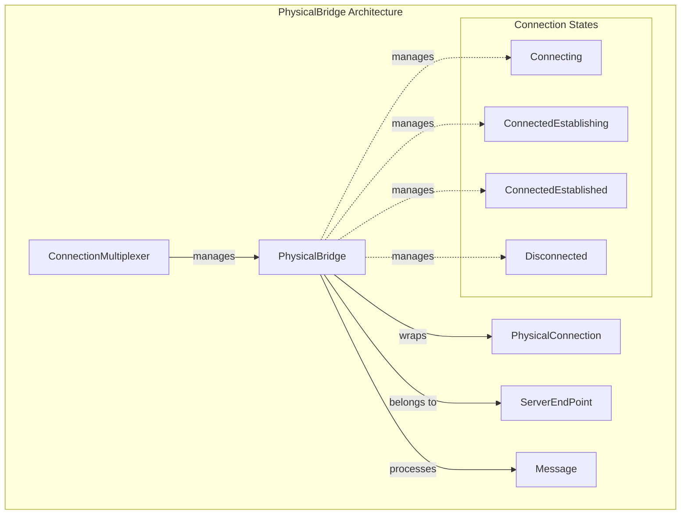
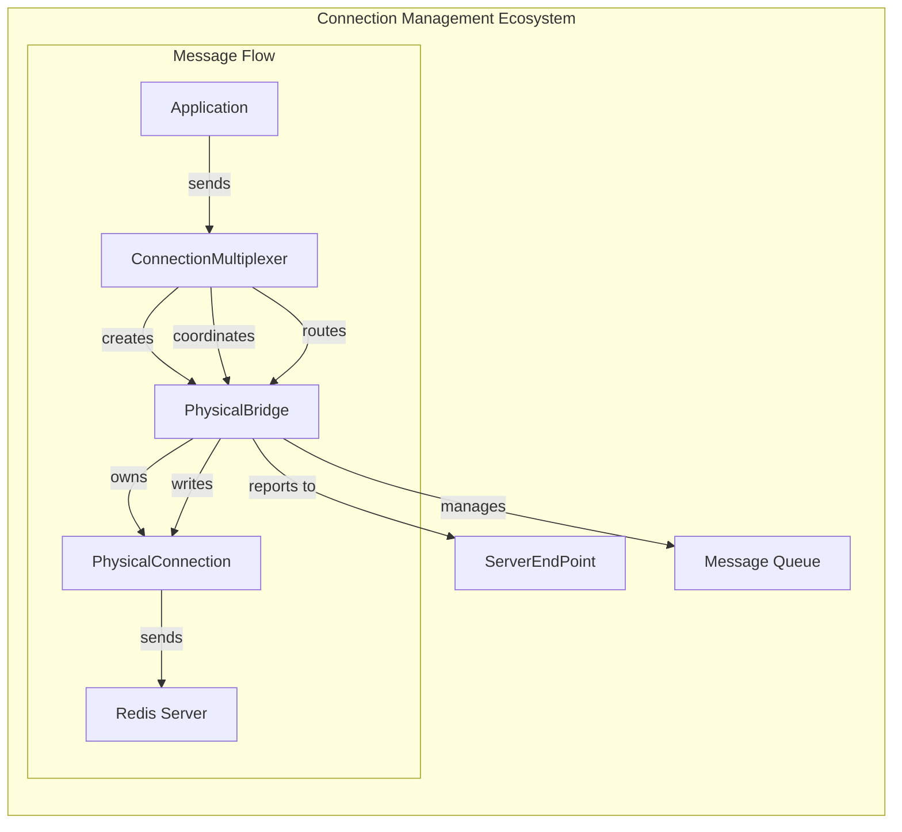
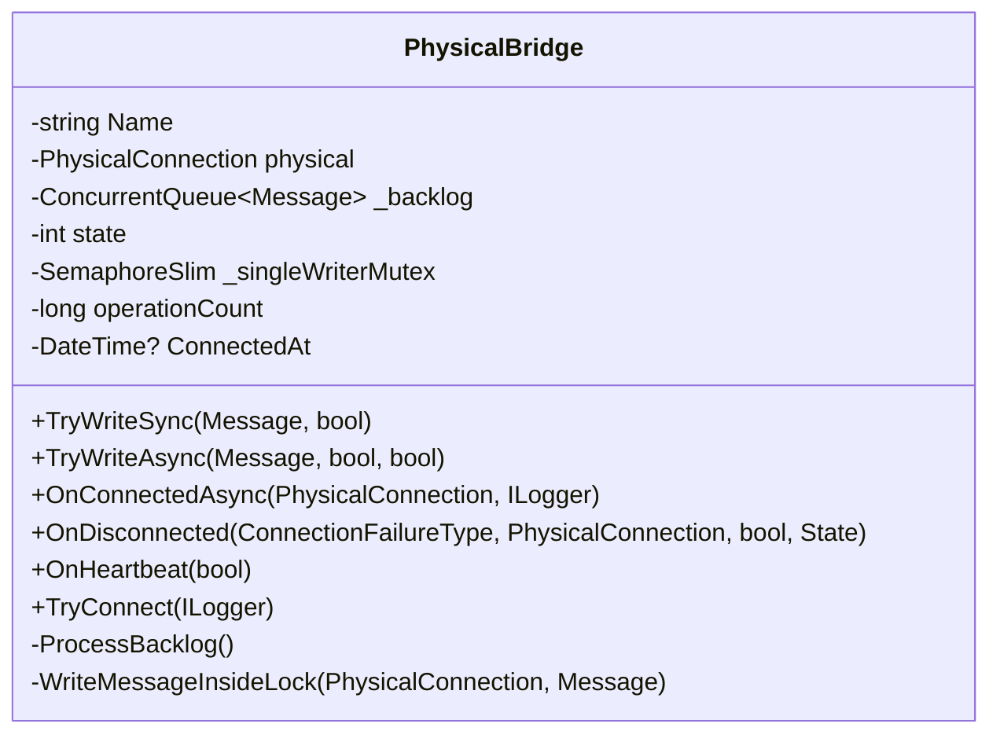
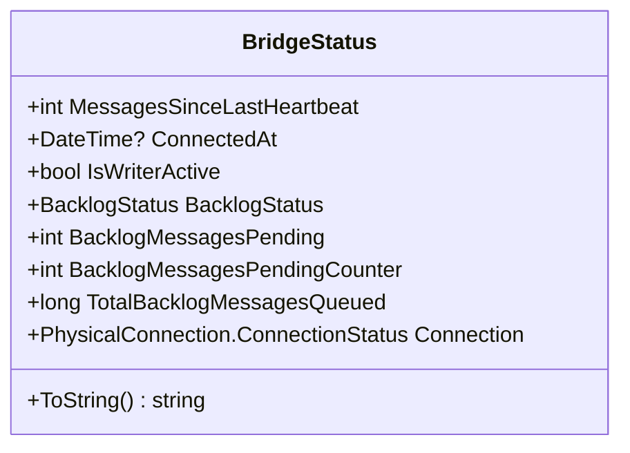
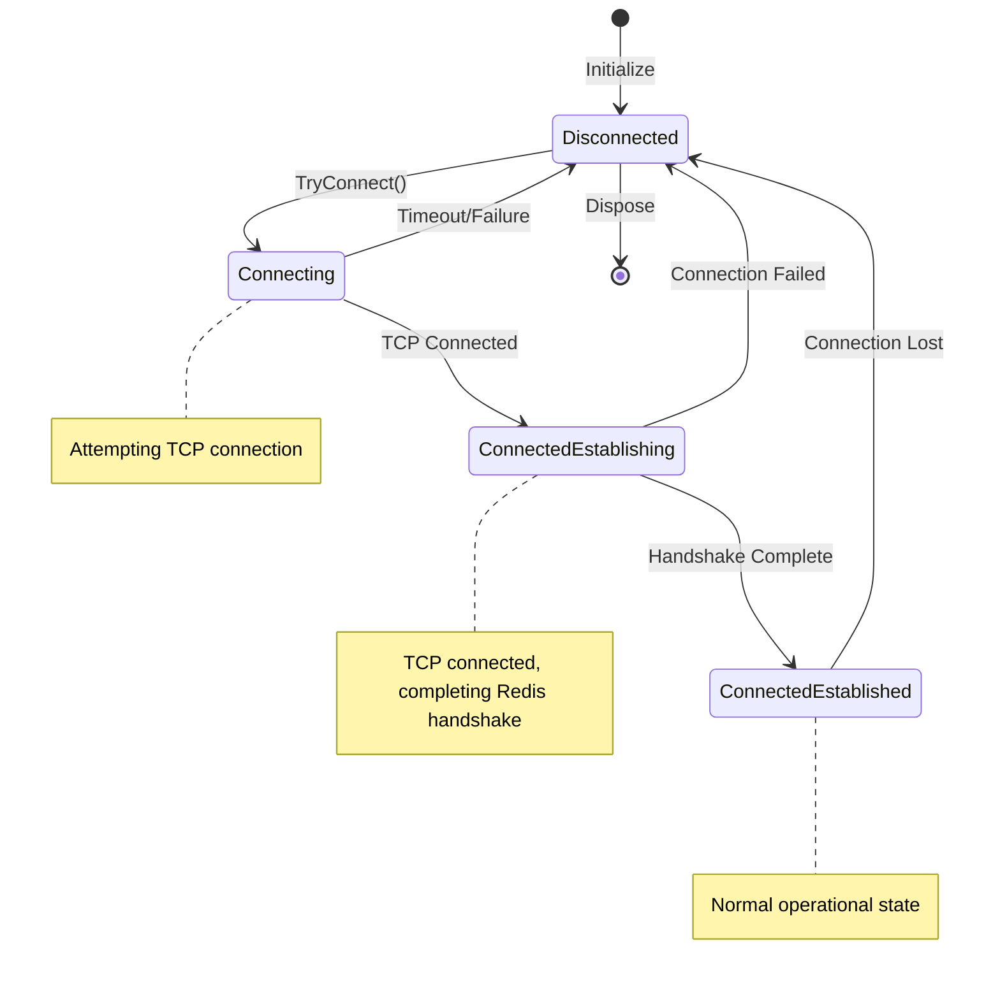
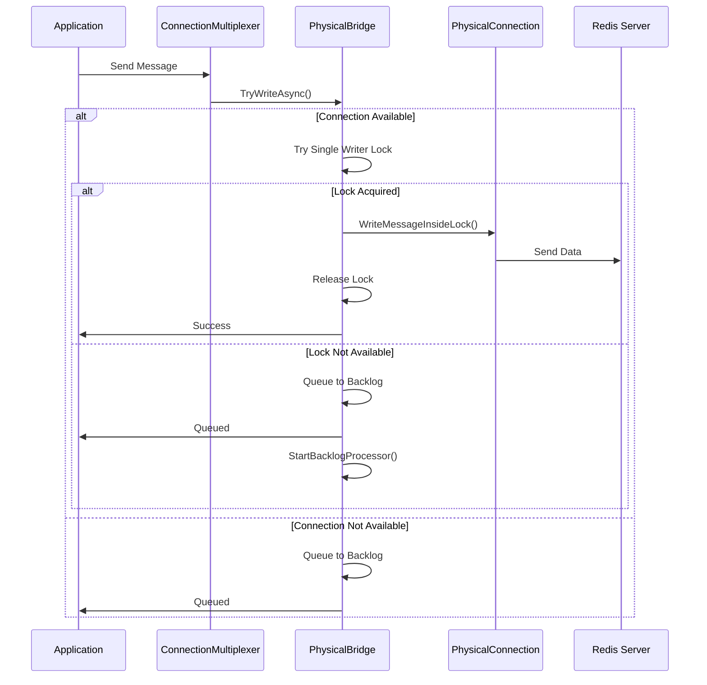
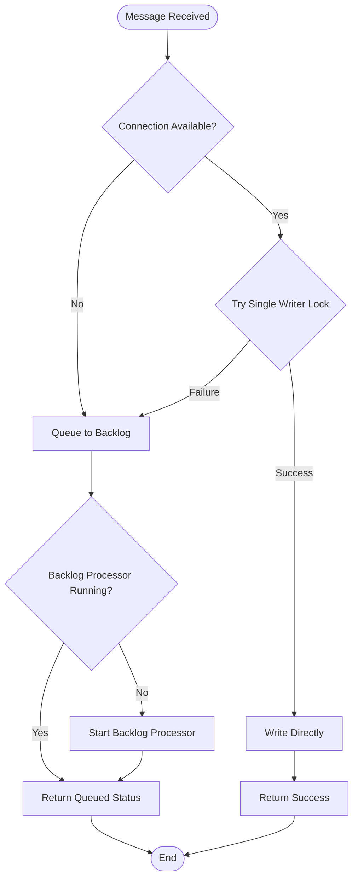
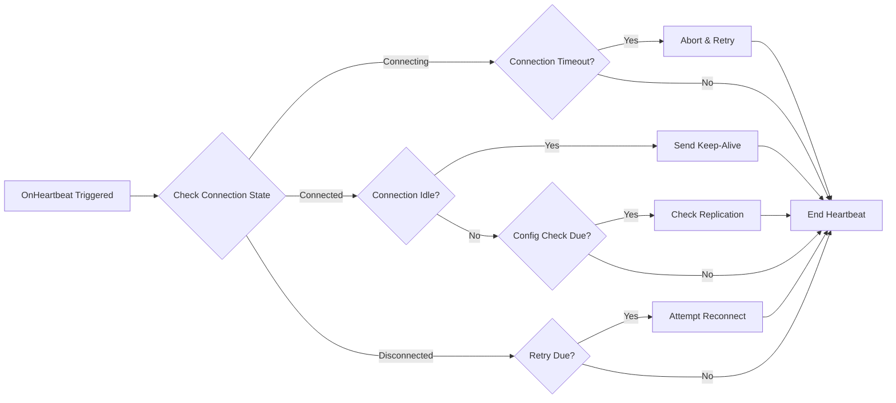
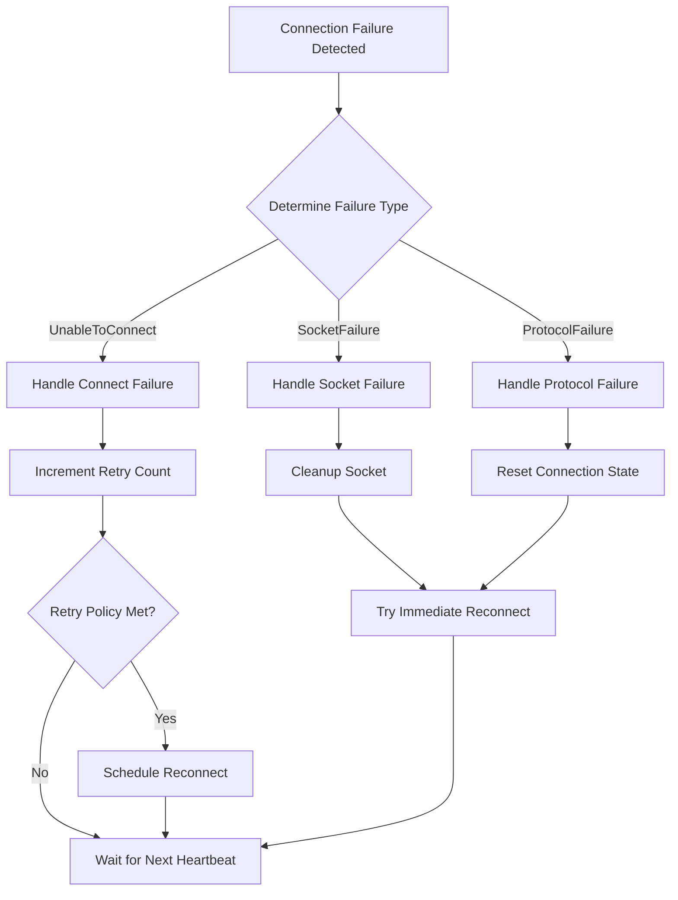
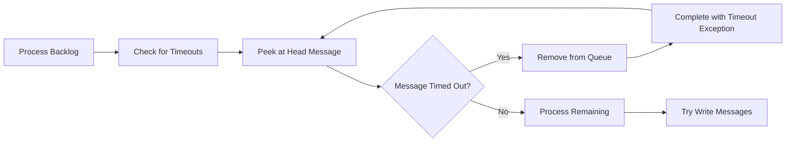

# PhysicalBridge Module Documentation

## Introduction

The PhysicalBridge module serves as a critical intermediary layer in the StackExchange.Redis connection management system, managing the communication bridge between the logical connection layer and the actual physical TCP connections to Redis servers. It handles connection state management, message queuing, write coordination, and connection health monitoring.

## Core Purpose

PhysicalBridge acts as a sophisticated traffic controller that:
- Manages the lifecycle of physical TCP connections to Redis servers
- Coordinates message writing through a single-writer mutex to prevent message reordering
- Implements intelligent message queuing and backlog processing
- Provides connection health monitoring and automatic reconnection capabilities
- Handles different connection types (Interactive and Subscription) with specialized behaviors

## Architecture Overview

## Component Relationships

## Core Components

### PhysicalBridge Class

The main bridge implementation that coordinates all connection activities:

### BridgeStatus Structure

Provides comprehensive status information about the bridge state:

## Connection State Management

The PhysicalBridge implements a sophisticated state machine with the following states:

## Message Flow Architecture

### Write Coordination

The PhysicalBridge implements a sophisticated single-writer pattern to prevent message reordering:

### Backlog Processing

The backlog system ensures message delivery during connection issues:

## Connection Health Monitoring

### Heartbeat System

The PhysicalBridge implements comprehensive health monitoring:

### Keep-Alive Mechanisms

Different connection types use different keep-alive strategies:

- **Interactive Connections**: Use tracer messages (ECHO with unique ID)
- **Subscription Connections**: Use PING commands or UNSUBSCRIBE on unique channels

## Error Handling and Recovery

### Connection Failure Handling

### Backlog Timeout Management

Messages in the backlog are automatically timed out based on configured timeouts:

## Integration with Other Modules

### ConnectionMultiplexer Integration

The PhysicalBridge works closely with the [ConnectionMultiplexer](ConnectionMultiplexer.md) for:
- Connection lifecycle management
- Message routing and load balancing
- Error reporting and event handling
- Configuration management

### ServerEndPoint Integration

Each PhysicalBridge is associated with a [ServerEndPoint](ServerEndPoint.md) that provides:
- Server-specific configuration
- Feature detection and capability management
- Replication and topology information
- Health status and statistics

### PhysicalConnection Integration

The bridge manages the underlying [PhysicalConnection](PhysicalConnection.md) which handles:
- Raw TCP socket communication
- Protocol encoding and decoding
- SSL/TLS encryption
- Low-level connection health monitoring

## Performance Characteristics

### Single-Writer Coordination

The PhysicalBridge uses a single-writer mutex to prevent message reordering while maintaining high throughput:

- **Instantaneous Lock Acquisition**: Messages write directly when possible
- **Backlog Queuing**: Messages queue when lock is contested
- **Dedicated Backlog Processor**: Background thread processes queued messages
- **Timeout Management**: Automatic timeout of stale messages

### Memory Management

- **ConcurrentQueue**: Lock-free message queuing
- **Interlocked Operations**: Thread-safe counters without locks
- **Message Reuse**: Efficient message lifecycle management
- **Backlog Limiter**: Prevents unbounded memory growth

## Configuration Options

The PhysicalBridge behavior is controlled through several configuration options:

- **TimeoutMilliseconds**: Write operation timeout
- **BacklogPolicy**: Message queuing behavior when disconnected
- **HeartbeatConsistencyChecks**: Enable aggressive keep-alive checks
- **HighIntegrity**: Enable message integrity tracking

## Thread Safety

The PhysicalBridge is designed for high-concurrency scenarios:

- **Single Writer Guarantee**: Prevents message reordering
- **Lock-Free Operations**: Uses interlocked operations where possible
- **Thread-Safe State Changes**: Atomic state transitions
- **Concurrent Backlog Processing**: Safe message queuing and processing

## Monitoring and Diagnostics

### Status Reporting

The BridgeStatus structure provides comprehensive diagnostics:

- Connection state and timing information
- Backlog queue statistics
- Writer activity status
- Underlying connection health

### Performance Counters

The PhysicalBridge tracks various performance metrics:

- Operation count and rate
- Socket connection count
- Active writer count
- Non-preferred endpoint usage

### Storm Logging

Comprehensive logging for connection issues including:
- Connection failure details
- Message backlog status
- Performance snapshots
- Error context information

## Best Practices

### Connection Management

1. **Allow Automatic Reconnection**: Let the bridge handle connection failures
2. **Configure Appropriate Timeouts**: Balance between responsiveness and reliability
3. **Monitor Backlog Status**: Watch for queue growth indicating connection issues
4. **Use Connection Types Appropriately**: Interactive vs Subscription connections

### Error Handling

1. **Handle WriteResult Values**: Check return values from write operations
2. **Monitor Connection Events**: Subscribe to connection failure events
3. **Configure Retry Policies**: Set appropriate reconnection retry behavior
4. **Use Backlog Policies**: Configure message queuing behavior during disconnections

### Performance Optimization

1. **Batch Operations**: Use batching to reduce lock contention
2. **Monitor Queue Depths**: Watch backlog queue sizes
3. **Tune Timeouts**: Set appropriate timeouts for your network conditions
4. **Use Fire-and-Forget Judiciously**: Balance performance vs reliability needs