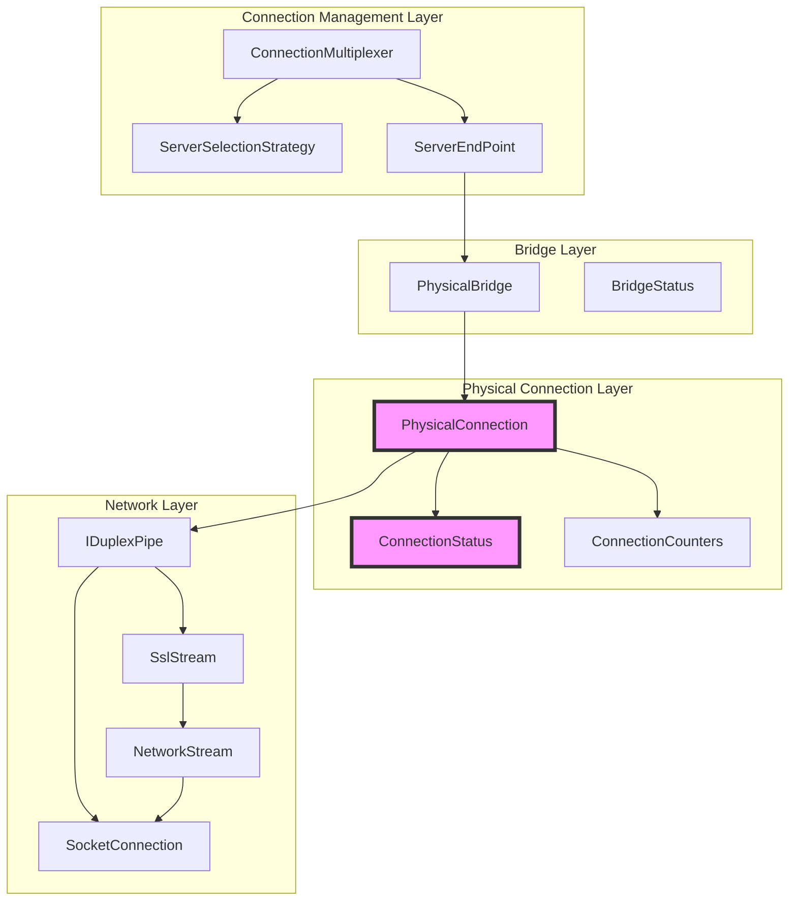
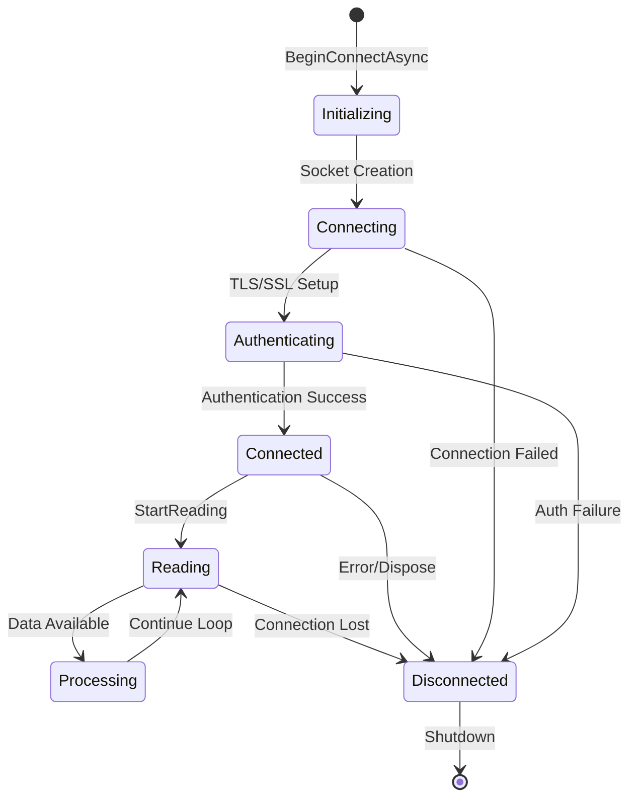
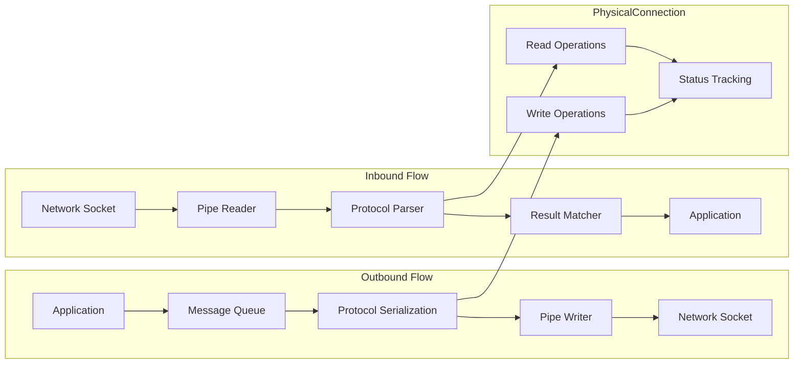
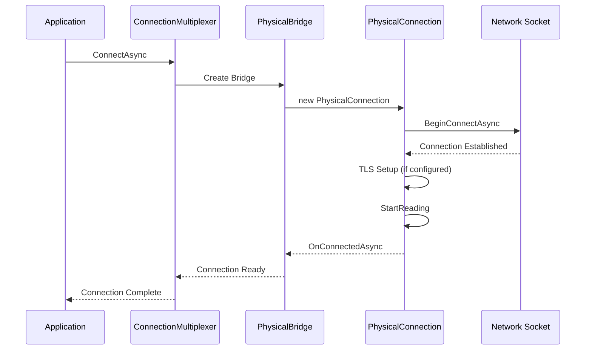
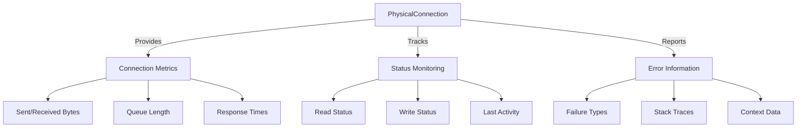

# PhysicalConnection Module Documentation

## Introduction

The PhysicalConnection module is a critical component of the StackExchange.Redis library that manages the low-level network communication between the client and Redis servers. It serves as the foundation for all Redis operations by handling socket connections, protocol parsing, message serialization, and maintaining connection state. This module operates at the transport layer, providing a reliable abstraction over raw TCP/IP communication while implementing the Redis protocol (RESP2/RESP3).

## Architecture Overview

The PhysicalConnection module sits at the heart of the connection management hierarchy, bridging the gap between high-level Redis operations and low-level network I/O. It works in conjunction with the PhysicalBridge to provide a complete connection abstraction that handles both interactive commands and pub/sub messaging.

## Core Components

### PhysicalConnection Class

The `PhysicalConnection` class is the primary component responsible for managing individual socket connections to Redis servers. It handles connection lifecycle, protocol communication, and message queuing.

#### Key Responsibilities:
- **Connection Management**: Establishing and maintaining TCP/IP connections with optional TLS encryption
- **Protocol Handling**: Implementing Redis Serialization Protocol (RESP2/RESP3) for message serialization
- **Message Queuing**: Managing outbound messages awaiting responses
- **Error Handling**: Detecting and reporting connection failures with detailed diagnostics
- **State Tracking**: Monitoring connection health, read/write status, and performance metrics

#### Connection Lifecycle:

### ConnectionStatus Structure

The `ConnectionStatus` structure provides real-time metrics about the connection state, essential for monitoring and debugging connection issues.

#### Metrics Tracked:
- **Messages Sent Awaiting Response**: Count of outbound messages without responses
- **Bytes Available on Socket**: Unread data waiting on the network socket
- **Bytes in Read/Write Pipes**: Data buffered in the pipeline
- **Read/Write Status**: Current state of I/O operations
- **Last Result Size**: Size of the most recently processed response

## Data Flow Architecture

### Message Processing Pipeline

### Protocol Implementation

The module implements both RESP2 and RESP3 protocols with support for:

- **Simple Strings**: `+OK\r\n`
- **Errors**: `-ERR message\r\n`
- **Integers**: `:123\r\n`
- **Bulk Strings**: `$6\r\nfoobar\r\n`
- **Arrays**: `*2\r\n$3\r\nfoo\r\n$3\r\nbar\r\n`
- **RESP3 Extensions**: Nulls, doubles, booleans, maps, sets, pushes

## Connection Management

### Connection Types

PhysicalConnection supports two primary connection types:

1. **Interactive Connections**: For standard Redis commands (GET, SET, etc.)
2. **Subscription Connections**: Dedicated to pub/sub messaging

### Connection Establishment Process

### Error Handling and Recovery

The module implements comprehensive error detection and reporting:

- **Socket Failures**: Network connectivity issues
- **Authentication Failures**: TLS/SSL or Redis authentication errors
- **Protocol Failures**: Malformed Redis protocol data
- **Timeout Handling**: Command and connection timeouts
- **Resource Cleanup**: Proper disposal of sockets and pipes

## Integration with Other Modules

### PhysicalBridge Integration

PhysicalConnection works closely with [PhysicalBridge](PhysicalBridge.md) to provide:
- Connection multiplexing and pooling
- Health monitoring and heartbeat management
- Automatic reconnection logic
- Load balancing across multiple connections

### ServerEndPoint Integration

Connections are established to specific [ServerEndPoint](ServerEndPoint.md) instances, which provide:
- Server-specific configuration
- Database selection logic
- Read/write mode management
- Server capability detection

### ConnectionMultiplexer Integration

The [ConnectionMultiplexer](ConnectionMultiplexer.md) orchestrates multiple PhysicalConnection instances:
- Connection lifecycle management
- Configuration propagation
- Event handling and logging
- Global connection state coordination

## Performance Considerations

### Memory Management

- **Buffer Pooling**: Uses System.Buffers for efficient memory allocation
- **Arena Allocation**: Custom arena for parsing results to reduce GC pressure
- **Pipe Optimization**: Leverages System.IO.Pipelines for high-performance I/O

### Connection Pooling

- **Connection Reuse**: Maintains persistent connections to avoid connection overhead
- **Multiplexing**: Shares connections across multiple concurrent operations
- **Load Distribution**: Balances load across available connections

### Protocol Optimization

- **Zero-Copy Operations**: Minimizes data copying where possible
- **Bulk Operations**: Optimizes array and bulk string handling
- **Inline Protocol**: Support for legacy inline Redis protocol

## Monitoring and Diagnostics

### Connection Metrics

PhysicalConnection provides detailed metrics for monitoring:

### Health Monitoring

- **Heartbeat Tracking**: Monitors connection health via periodic heartbeats
- **Timeout Detection**: Identifies slow or unresponsive connections
- **Resource Usage**: Tracks memory and socket resource consumption
- **Error Rate Monitoring**: Detects connection stability issues

## Security Features

### TLS/SSL Support

- **Certificate Validation**: Configurable certificate validation callbacks
- **Client Certificates**: Support for mutual TLS authentication
- **Protocol Selection**: Configurable SSL/TLS protocol versions
- **Ambient Configuration**: Environment variable-based certificate configuration

### Authentication

- **Redis AUTH**: Support for Redis password authentication
- **ACL Support**: Redis 6.0+ Access Control List compatibility
- **Credential Management**: Secure handling of authentication credentials

## Configuration Options

### Connection Configuration

PhysicalConnection behavior is controlled through [ConfigurationOptions](Configuration.md):

- **Connect Timeout**: Maximum time to establish connection
- **SSL Configuration**: TLS/SSL settings and certificates
- **Tunnel Support**: Custom connection tunneling
- **Socket Options**: Low-level socket configuration

### Protocol Configuration

- **RESP Version**: Automatic protocol version negotiation
- **Command Mapping**: Custom command byte mappings
- **Database Selection**: Automatic database switching
- **Read Mode**: Read-only vs read-write mode management

## Best Practices

### Connection Management

1. **Reuse Connections**: Use ConnectionMultiplexer for connection pooling
2. **Monitor Health**: Regularly check connection status and metrics
3. **Handle Timeouts**: Implement proper timeout handling for operations
4. **Graceful Shutdown**: Properly dispose connections to avoid resource leaks

### Error Handling

1. **Connection Failures**: Implement retry logic for transient failures
2. **Timeout Handling**: Set appropriate timeouts for operations
3. **Resource Cleanup**: Always dispose connections properly
4. **Logging**: Enable detailed logging for troubleshooting

### Performance Optimization

1. **Pipeline Operations**: Use pipelining for bulk operations
2. **Connection Pooling**: Leverage ConnectionMultiplexer pooling
3. **Buffer Tuning**: Configure appropriate buffer sizes
4. **Protocol Selection**: Use appropriate RESP version for compatibility

## Troubleshooting

### Common Issues

1. **Connection Timeouts**: Check network connectivity and server availability
2. **Authentication Failures**: Verify credentials and certificate configuration
3. **Protocol Errors**: Ensure Redis server version compatibility
4. **Resource Exhaustion**: Monitor connection pool usage and limits

### Diagnostic Information

PhysicalConnection provides extensive diagnostic data including:
- Connection state and history
- Last read/write timestamps
- Outstanding message queue status
- Socket-level error information
- Protocol parsing state

For detailed troubleshooting, refer to the [ConnectionMultiplexer](ConnectionMultiplexer.md) documentation for connection management issues and [PhysicalBridge](PhysicalBridge.md) for bridge-level problems.