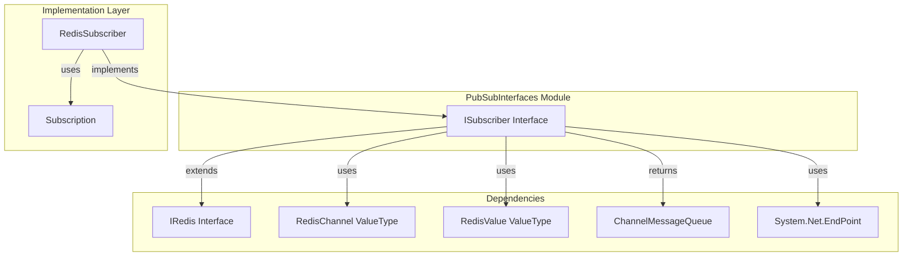
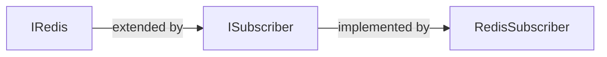
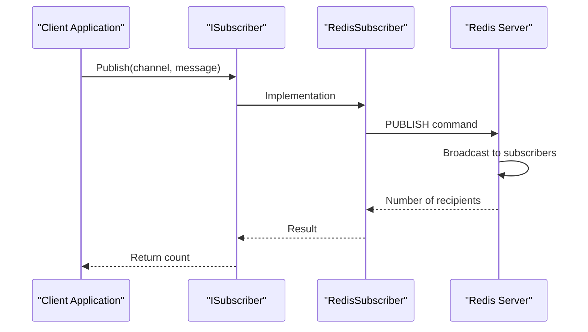
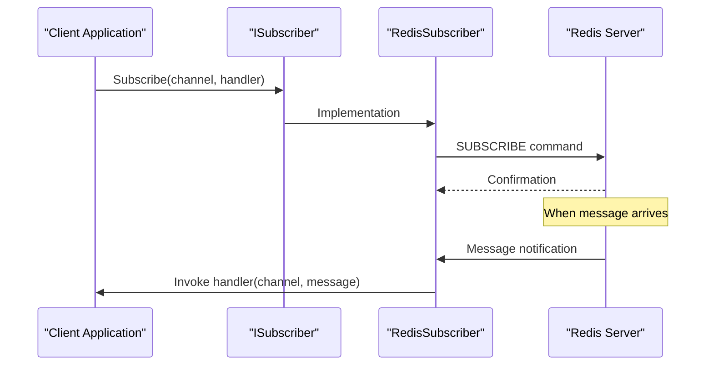
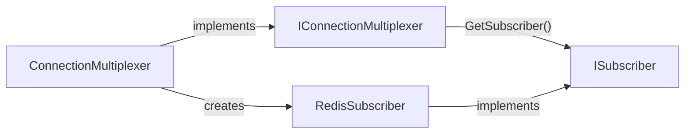

# PubSubInterfaces Module Documentation

## Overview

The PubSubInterfaces module defines the contract for Redis publish/subscribe functionality in the StackExchange.Redis library. It provides the `ISubscriber` interface, which serves as the primary abstraction for Redis pub/sub operations, enabling applications to publish messages to channels and subscribe to receive messages from channels.

## Purpose and Core Functionality

The PubSubInterfaces module serves as the foundational contract for Redis pub/sub operations, offering:

- **Message Publishing**: Send messages to specific Redis channels
- **Channel Subscription**: Subscribe to channels to receive messages
- **Connection Management**: Monitor connection status and identify endpoints
- **Flexible Subscription Models**: Support for both callback-based and queue-based message handling
- **Pattern-based Subscriptions**: Support for Redis pattern-based channel subscriptions

## Architecture

### Component Structure



### Interface Hierarchy



## Core Components

### ISubscriber Interface

The `ISubscriber` interface is the primary contract for Redis pub/sub operations. It extends the `IRedis` interface and provides methods for:

#### Message Publishing
- `Publish()` / `PublishAsync()`: Send messages to channels
- Returns the number of clients that received the message on the destination server

#### Subscription Management
- `Subscribe()`: Subscribe with callback handlers
- `Subscribe()`: Subscribe with guaranteed ordered handling via `ChannelMessageQueue`
- `Unsubscribe()`: Remove specific subscriptions
- `UnsubscribeAll()`: Remove all subscriptions

#### Connection Monitoring
- `IsConnected()`: Check connection status for specific channels
- `IdentifyEndpoint()`: Determine which Redis server handles a channel
- `SubscribedEndpoint()`: Identify the server endpoint for active subscriptions

## Data Flow

### Message Publishing Flow



### Subscription Flow



## Key Features

### 1. Dual Subscription Models

The interface supports two subscription approaches:

**Callback-based Subscription**
```csharp
void Subscribe(RedisChannel channel, Action<RedisChannel, RedisValue> handler)
```
- Immediate message handling
- No ordering guarantees
- Lower latency

**Queue-based Subscription**
```csharp
ChannelMessageQueue Subscribe(RedisChannel channel)
```
- Guaranteed ordered message processing
- Asynchronous consumption
- Suitable for high-throughput scenarios

### 2. Connection Awareness

The interface provides methods to monitor and identify connection endpoints:
- `IsConnected()`: Check if connected to the server responsible for a channel
- `IdentifyEndpoint()`: Determine which server handles a specific channel
- `SubscribedEndpoint()`: Find the server endpoint for active subscriptions

### 3. Pattern-based Subscriptions

Supports Redis pattern-based subscriptions (PSUBSCRIBE) through the `RedisChannel` type, allowing wildcard subscriptions like `news.*` or `user.*.updates`.

## Integration with Other Modules

### Connection Management Integration



The `ISubscriber` interface is obtained through the `IConnectionMultiplexer.GetSubscriber()` method, ensuring proper connection management and resource sharing.

### Value Types Integration

The interface relies on several value types from the [ValueTypes](ValueTypes.md) module:
- `RedisChannel`: Represents channel names with pattern support
- `RedisValue`: Handles message payloads of various types

### Implementation Integration

The primary implementation is provided by the [PubSubSupport](PubSubSupport.md) module through the `RedisSubscriber` class, which handles:
- Subscription state management
- Message routing and delivery
- Connection handling for pub/sub operations

## Usage Patterns

### Basic Publishing
```csharp
ISubscriber subscriber = connectionMultiplexer.GetSubscriber();
subscriber.Publish("notifications", "Hello, World!");
```

### Subscription with Callback
```csharp
ISubscriber subscriber = connectionMultiplexer.GetSubscriber();
subscriber.Subscribe("notifications", (channel, message) => {
    Console.WriteLine($"Received: {message} on {channel}");
});
```

### Queue-based Subscription
```csharp
ISubscriber subscriber = connectionMultiplexer.GetSubscriber();
var queue = subscriber.Subscribe("notifications");

// Process messages asynchronously
while (await queue.WaitToReadAsync())
{
    while (queue.TryRead(out var message))
    {
        Console.WriteLine($"Received: {message.Message}");
    }
}
```

## Thread Safety and Concurrency

The `ISubscriber` interface implementations are designed to be thread-safe, allowing:
- Multiple concurrent subscriptions
- Simultaneous publishing and subscribing
- Safe access from multiple threads

## Error Handling

The interface methods include appropriate error handling for:
- Connection failures
- Invalid channel names
- Redis server errors
- Network timeouts

## Performance Considerations

- **Callback-based subscriptions**: Lower latency, suitable for real-time processing
- **Queue-based subscriptions**: Better for high-throughput scenarios with ordering requirements
- **Connection pooling**: Leverages the underlying connection multiplexer for efficient resource usage
- **Pattern subscriptions**: May have performance implications on large key spaces

## Related Documentation

- [CoreInterfaces](CoreInterfaces.md) - Base interface definitions
- [ValueTypes](ValueTypes.md) - RedisChannel and RedisValue types
- [PubSubSupport](PubSubSupport.md) - Implementation details
- [ConnectionManagement](ConnectionManagement.md) - Connection multiplexer integration