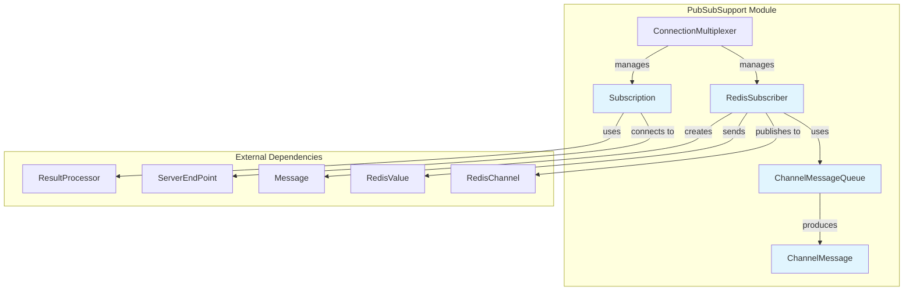
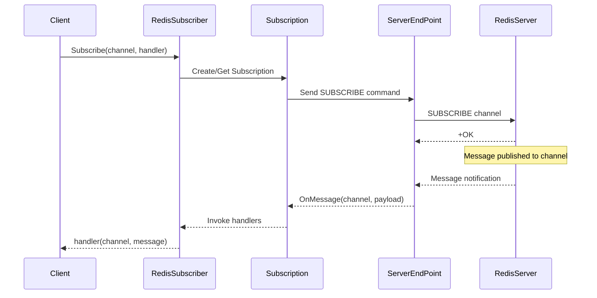

# PubSubSupport Module Documentation

## Overview

The PubSubSupport module provides comprehensive publish/subscribe (pub/sub) functionality for the StackExchange.Redis client library. This module enables real-time message broadcasting and subscription management across Redis channels, supporting both simple channels and pattern-based subscriptions.

## Purpose

The PubSubSupport module serves as the primary interface for Redis pub/sub operations, offering:
- **Message Broadcasting**: Publish messages to specific channels
- **Subscription Management**: Subscribe to channels with handlers or message queues
- **Pattern Matching**: Support for pattern-based channel subscriptions
- **Sharded Pub/Sub**: Support for Redis Cluster sharded pub/sub operations
- **Asynchronous Processing**: Full async/await support for all operations
- **Connection Management**: Automatic reconnection and subscription restoration

## Architecture



## Core Components

### [RedisSubscriber](RedisSubscriber.md)
The main entry point for pub/sub operations, implementing the `ISubscriber` interface. Provides methods for:
- Publishing messages to channels
- Subscribing to channels with handlers or queues
- Managing subscription lifecycle
- Pattern-based subscriptions

### [Subscription](Subscription.md)
Internal class that manages the state of a single channel subscription, including:
- Handler registration and invocation
- Message queue management
- Server connection tracking
- Subscription command generation

### [ChannelMessageQueue](ChannelMessageQueue.md)
Provides an asynchronous message queue for consuming pub/sub messages, featuring:
- Thread-safe message consumption
- Async enumerable support
- Backpressure handling
- Completion notification

### ChannelMessage
Represents a single pub/sub message with metadata about the subscription channel and actual message content.

## Data Flow



## Integration with Other Modules

The PubSubSupport module integrates with several other modules in the StackExchange.Redis library:

- **[ConnectionManagement](ConnectionManagement.md)**: Uses `ConnectionMultiplexer` for server selection and connection management
- **[MessageSystem](MessageSystem.md)**: Creates and processes subscription-related messages
- **[ResultProcessing](ResultProcessing.md)**: Uses specialized result processors for subscription tracking
- **[ValueTypes](ValueTypes.md)**: Works with `RedisChannel` and `RedisValue` types
- **[CoreInterfaces](CoreInterfaces.md)**: Implements `ISubscriber` interface

## Key Features

### Subscription Types
- **Simple Subscriptions**: Direct channel subscriptions using `SUBSCRIBE`
- **Pattern Subscriptions**: Wildcard pattern matching using `PSUBSCRIBE`
- **Sharded Subscriptions**: Redis Cluster sharded pub/sub using `SSUBSCRIBE`

### Message Consumption Patterns
- **Handler-based**: Register action delegates for immediate message processing
- **Queue-based**: Use `ChannelMessageQueue` for buffered message consumption
- **Async Enumerable**: Modern async enumerable pattern for message streams

### Connection Resilience
- Automatic reconnection on connection loss
- Subscription state restoration after reconnection
- Server selection for optimal connection routing

## Usage Examples

### Basic Subscription with Handler
```csharp
ISubscriber subscriber = connectionMultiplexer.GetSubscriber();
subscriber.Subscribe("notifications", (channel, message) => {
    Console.WriteLine($"Received: {message} on {channel}");
});
```

### Using Message Queue
```csharp
var queue = subscriber.Subscribe("notifications");
await foreach (var message in queue)
{
    Console.WriteLine($"Received: {message.Message} on {message.Channel}");
}
```

### Pattern Subscription
```csharp
subscriber.Subscribe("user:*", (channel, message) => {
    Console.WriteLine($"User event on {channel}: {message}");
});
```

## Performance Considerations

- **Message Throughput**: High-throughput scenarios should use message queues with async processing
- **Handler Registration**: Multiple handlers per channel are supported but add overhead
- **Connection Pooling**: Leverages connection multiplexer for efficient connection usage
- **Memory Management**: Uses object pooling and efficient memory management for high-volume scenarios

## Error Handling

The module provides comprehensive error handling for:
- Connection failures and automatic reconnection
- Invalid channel names and subscription parameters
- Message processing errors with isolation between handlers
- Server unavailability with graceful degradation

## Thread Safety

All public APIs are thread-safe:
- Concurrent subscription management
- Thread-safe message delivery
- Safe handler registration/unregistration
- Atomic subscription state changes